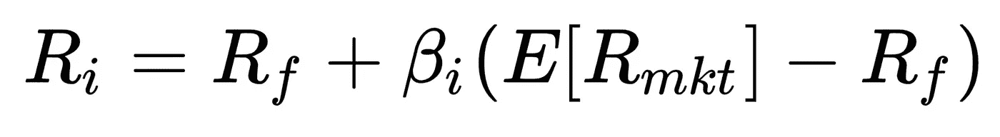
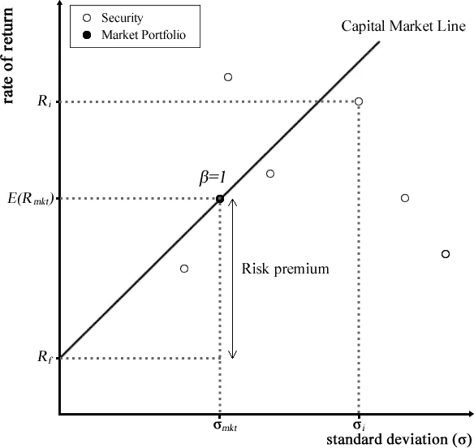
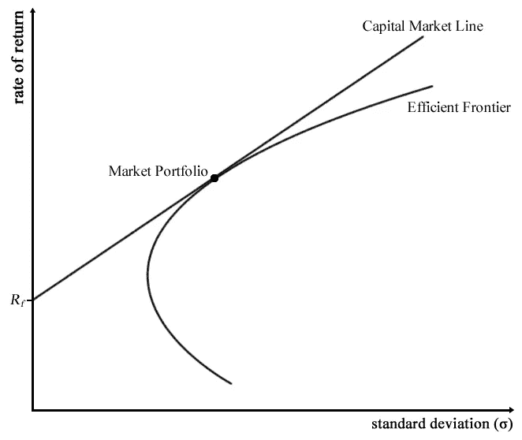
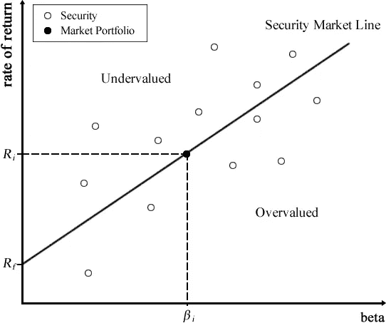
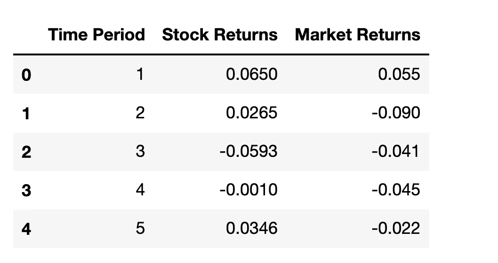
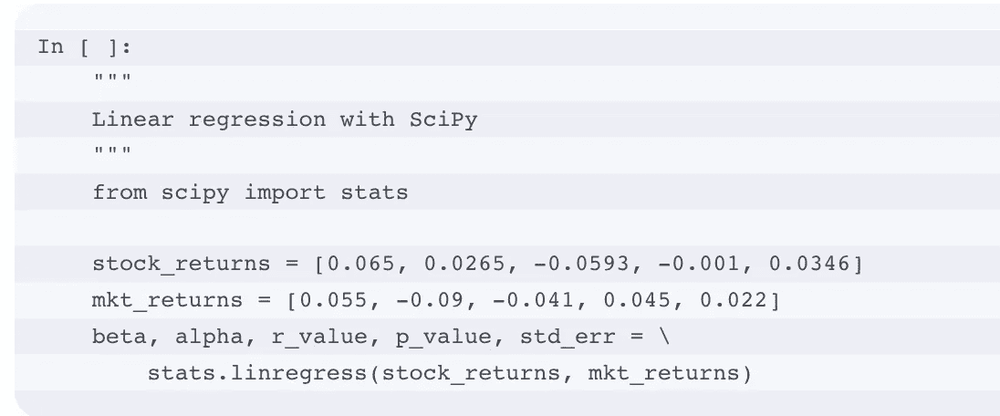
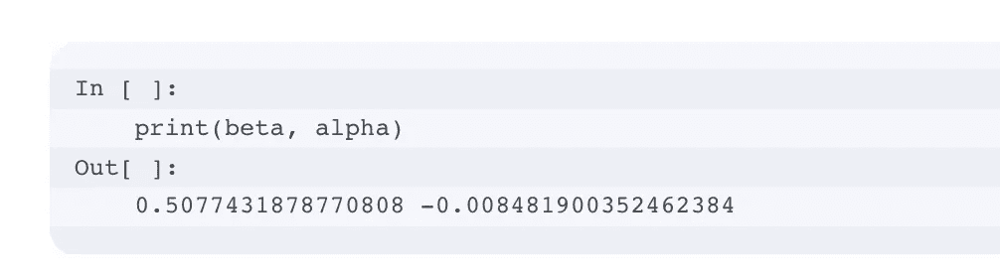
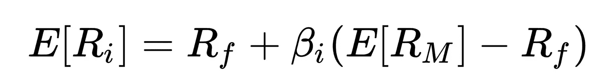

# 资本资产定价模型与证券市场线

> 原文：<https://medium.com/analytics-vidhya/capital-asset-pricing-model-and-security-market-line-9adc8cc39bfb?source=collection_archive---------1----------------------->

许多金融文献专门讨论**资本资产定价模型** ( **CAPM** )。在这一节中，我们将探讨强调线性在金融中的重要性的关键概念。

在著名的 CAPM 中，证券的风险和收益率之间的关系描述如下:

对于一只证券， *i* ，其收益被定义为 *Ri* ，其β被定义为 *βi* 。CAPM 将证券的回报定义为无风险利率 *Rf* 与风险溢价的乘积之和。风险溢价可以被认为是市场投资组合的超额收益，不包括无风险利率。以下是 CAPM 的直观表示:

贝塔系数是对股票系统风险的一种度量，这种风险是无法分散的。本质上，它描述了股票收益对市场变动的敏感性。例如，不管市场走向如何，贝塔系数为零的股票都不会产生超额收益。只能以无风险率增长。贝塔系数为 1 的股票表明该股票完全跟随市场波动。

贝塔系数是通过用股票和市场收益的协方差除以市场收益的方差得出的。

CAPM 模型衡量投资组合中每只股票的风险和股票收益之间的关系。通过概述这种关系的总和，我们获得了风险证券的组合或权重，这些组合或权重对于每个投资组合回报水平都产生最低的投资组合风险。

贝塔系数是对股票系统风险的一种度量，这种风险是无法分散的。本质上，它描述了股票收益对市场变动的敏感性。例如，不管市场走向如何，贝塔系数为零的股票都不会产生超额收益。只能以无风险率增长。贝塔系数为 1 的股票表明该股票完全跟随市场波动。

贝塔系数是通过用股票和市场收益的协方差除以市场收益的方差得出的。

希望获得特定回报的投资者将拥有一个这样的最佳投资组合，提供尽可能最小的风险。最优投资组合的组合位于一条叫做**有效边界**的线上。

沿着有效边界，存在一个切点，表示可用的最佳投资组合，以最低的风险换取最高的回报率。这个在切点的最优投资组合被称为**市场投资组合**。

从市场投资组合到无风险利率有一条直线。这条线叫做**资本市场线** ( **CML** )。CML 可以被认为是最佳投资组合的所有其他夏普比率中最高的夏普比率。**夏普比率**是一个风险调整后的绩效指标，定义为投资组合的超额收益超过其标准偏差中每单位风险的无风险利率。投资者对持有 CML 系列资产组合特别感兴趣。下图说明了有效边界、市场组合和 CML:

资本资产定价模型研究的另一个兴趣点是证券市场线。SML 将资产的预期收益与其 beta 值进行对比。对于 beta 值为 1 的证券，其回报与市场回报完全匹配。任何定价高于 SML 的证券都被认为是被低估的，因为在同等风险下，投资者期望更高的回报。相反，任何定价低于 SML 的证券都被认为估值过高，如下所示:

假设我们对寻找一种证券的贝塔系数*βI*感兴趣。我们可以用 *Ri=α+βRM* 等式的形式，将公司的股票收益 *Ri* 与市场收益 *RM* 以及截距 *α* 进行回归。

考虑以下五个时间段的股票回报和市场回报数据:

**scipty . stats . Lin regressive**函数返回五个值:回归线的斜率、回归线的截距、相关系数、零斜率零假设的假设检验的 p 值以及估计值的标准误差。我们感兴趣的是通过分别打印**β**和**α**的值来找到直线的斜率和截距:

股票的贝塔系数是 0.5077，阿尔法系数几乎为零。

描述 SML 的方程式可以写成如下形式

术语*E[RM]—Rf*是市场风险溢价， *E[RM]* 是市场投资组合的预期收益。 *Rf* 为无风险利率收益率，*E【Ri】*为资产预期收益率， *i* ， *βi* 为资产的 beta。

假设无风险利率为 5%，市场风险溢价为 8.5%。股票的预期回报率是多少？根据资本资产定价模型，贝塔系数为 0.5077 的股票的风险溢价为 0.5077×8.5%，即 4.3%。无风险利率为 5%，因此预期净资产收益率为 9.3%。

如果在同一时期观察到该证券具有比预期股票回报更高的回报(例如 10.5%)，则可以说该证券被低估，因为投资者可以预期相同风险下的更大回报。

相反，如果观察到证券的回报比 SML 所暗示的预期回报低(例如 7%)，则可以说该证券被高估了。投资者在承担相同风险的情况下获得的回报减少了。

CAPM 有几个局限性，比如均值-方差框架的使用，以及回报率是由一个风险因素——市场风险因素——来衡量的事实。在一个充分分散的投资组合中，各种股票的非系统风险相互抵消，基本上被消除了。

资源:

Udemy:金融 Python:投资基础和数据分析

Yves Hilpisch 金融 Python:分析大金融数据