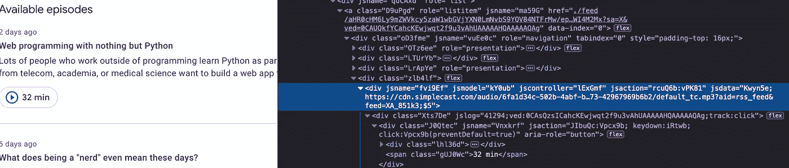
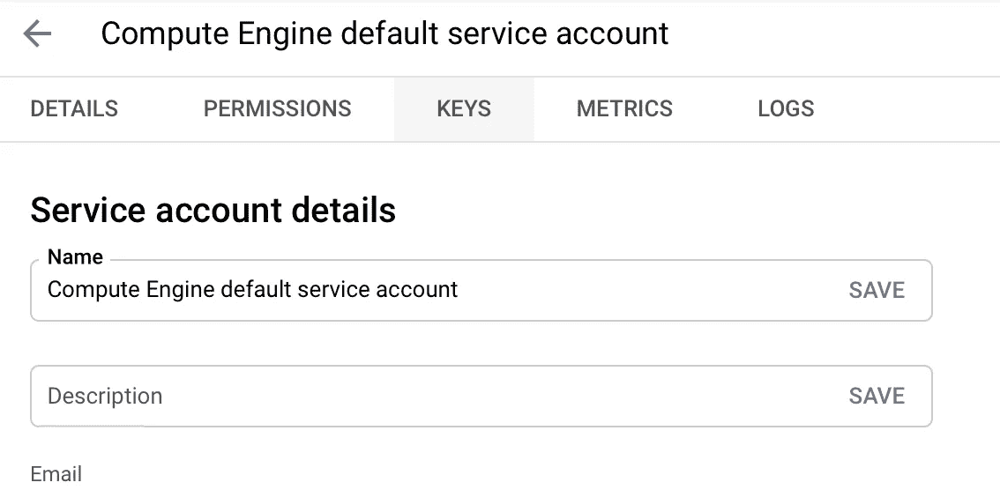

# 捕捉难以捉摸的声音世界:用 Python 获取和转录谷歌播客

> 原文：<https://medium.com/analytics-vidhya/capturing-the-elusive-world-of-sound-fetch-and-transcribe-google-podcasts-with-python-76dcf87b6eff?source=collection_archive---------3----------------------->

为了继续寻找更多的数据，我开始研究声音的短暂世界。我曾经对电视上的自动字幕感到惊讶。它们是如此准确，几乎没有任何延迟，这让我怀疑它是自动化的，但我们不能让某人为每个程序键入所有这些单词，对吗？显然，我们早就有这项技术了。如果我们能记下人们说的每一句话，那将意味着有更多的数据可以利用！


电视节目似乎有点难以企及，所以对于初学者来说，播客看起来就像一束束很好的音频数据，我们可以转录它，以便固定每个单词进行进一步的文本分析。(显然，现在你留下的任何数字痕迹都可能被用来对付你😨连随便说的话都不安全…)

我的目标是批量获取和转录文件，所以我希望简化这个过程。这包括两个部分。首先是数据收集。我从谷歌播客开始收集音频剪辑，因为它有一个可访问的文件下载结构。MP3 文件链接被很好地包装在页面源代码中—



第二部分是转录。我选择使用 [Google Cloud 语音转文本](https://cloud.google.com/speech-to-text/docs/basics) API 和 SpeechRecognition 库(各种 API 的包装器)来访问它。

# 1.抓取播客

这是我们在这部分需要的:

```
import requests
from bs4 import BeautifulSoup
import wget # to download files
import pandas as pd
```

对于我们希望下载播客的节目，我们可以简单地将它们的主页 URL 放入一个列表中，然后逐个进行请求。为了一次有效地获取所有播客，我们需要收藏页面，而不是特定剧集的页面。这种 URL 的一个例子是[堆栈溢出播客](https://podcasts.google.com/feed/aHR0cHM6Ly9mZWVkcy5zaW1wbGVjYXN0LmNvbS9YQV84NTFrMw?sa=X&ved=0CAkQlvsGahcKEwjwqt2f9u3vAhUAAAAAHQAAAAAQAQ)。

```
URLs = [<a list of homepage links>]info_df_list = []for url in URLs:
    soup = BeautifulSoup(requests.get(url).text, 'lxml')
    title = soup.find('div', {'class':'ZfMIwb'}).text # This is the name of the show
    os.mkdir(title) # make a new folder to contain podcasts from the same show
    df = download_podcasts(soup, title) # function details below
    info_df_list.append(df)info_all_podcasts = pd.concat(info_df_list)
```

然后，对于每个节目，将有三个功能代表三个步骤——下载、转换/组织和转录。

第一个函数不仅下载文件，还将所有相应的元数据收集到一个数据帧中——

作为中间步骤，我们需要将文件格式从 MP3 转换成 WAV。我遇到了错误，[这个提示](https://towardsdatascience.com/how-to-use-google-speech-to-text-api-to-transcribe-long-audio-files-1c886f4eb3e9)救了我。所以转换函数来自 Sundar Krishnan，在这里被复制了——

```
# still, title is the name of the show/channel and we've made it into a folderfrom pydub import AudioSegmentdef mp3_to_wav(audio_file_name, title):
    if audio_file_name.split('.')[1] == 'mp3':    
        sound = AudioSegment.from_mp3(title+'/'+audio_file_name)
        audio_file_name = audio_file_name.split('.')[0] + '.wav'
        sound.export(title+'/'+audio_file_name, format="wav")
```

然而，我没有使用标准的 SpeechClient 类，因为不知何故它花费了太长的时间来完成，而且你将不得不(付费)使用云存储桶来进行长时间的音频转录。除此之外，我还没有找到一种方法来标记完整的文本，尽管他们的[单词出现时间标记](https://cloud.google.com/speech-to-text/docs/async-time-offsets)似乎工作得很好。所以，要想直接使用谷歌语音转文本 API，请参考 [Sundar 的文章](https://towardsdatascience.com/how-to-use-google-speech-to-text-api-to-transcribe-long-audio-files-1c886f4eb3e9)。

# 2.抄本

使用 Google Cloud Speech，我记录了一个 110 分钟长的播客的转录过程，耗时 23 分钟！为了更有效地转录长音频文件，我发现了一个聪明的变通办法[这里](https://techtldr.com/transcribing-audio-file-to-text-with-google-cloud-speech-api-and-python/#4-break-up-audio-file-into-smaller-parts)。我们将一段很长的音频分成 30 秒的片段，使用多线程并行处理这些声音片段，最后将它们重新组合成一个文本文件。

我将使用 ffmpeg 来分割音频，但首先，让我们为以后将包含所有块的每集创建文件夹:

然后，在终端中运行以下命令，遍历<title>文件夹中的每个 WAV 文件，将每一集分成音频块，并将它们分类到相应的文件夹中(这就是为什么将剧集文件名作为文件夹名称很重要)。</title>

```
for file in <title>/*.wav; do ffmpeg -i "$file" -f segment -segment_time 30 -c copy "${file%.wav}"/out%09d.wav; done
```

现在是实际转录的时候了。虽然我们使用的是 SpeechRecognition wrapper，但我们仍然需要在 Google 云平台上注册，启动一个项目，并获得凭据。这一过程在本文中有更详细的说明。

我花了很长时间才弄明白如何设置环境变量。有各种各样的方法。我所做的是，首先，点击进入[凭证页面](https://console.cloud.google.com/apis/credentials)上的服务帐户。其次，点击钥匙标签—



最后，下载密钥文件—


你可以在终端中使用导出来创建一个临时的环境变量，或者在你的 Jupyter 笔记本中使用这种显式的方式——

```
os.environ["GOOGLE_APPLICATION_CREDENTIALS"]="<path to the credential file>/key.json"
```

这样，我们就可以实例化识别器，并选择使用 recognize_google_cloud 作为转录模型:

使用这种方法，每个 2 小时的播客大约需要 3-5 分钟才能完成，这与谷歌云语音的 23 分钟相比是一个巨大的进步。我比较了产品，差异可以忽略不计。

现在，我们有越来越丰富的语料库来进行自然语言处理实验，检测口语语言模式，或者许多更实际的目的。例如，我可能只想靠近人们在技术相关的播客中谈论 Python 或计算机视觉的地方。或者，我可以跟踪某个品牌的提及率，并评估其情绪。我也在考虑为我自己的语言学习转录一些德语播客。或者你想在比较分析中识别和调查某些关键词——例如，某个政治节目在播客中提到“欺诈”的频率。

我们可以使用正则表达式来匹配单词，然后在它周围搜索以包含一点上下文，在这种情况下，可以是包含关键字的组块前后 30 秒。

我们将它们放入一个数据框中，每一次提及占一行。另一种方法是将每个播客作为一个独特的行，并将提及的内容连接在一起——无论哪个对项目目标更有意义。

在我的例子中，我想要具有重复元数据的唯一提及，因此是正确的连接—

```
result_df = meta_df.merge(finding_df, on='ID', how='right') # meta_df would be a subset of info_all_podcasts limited to one show/channel
```

你可以收集一些例子，比如—

```
00:46:30 darebee contention would not produce a win their they're asking for georgia recount is coming out to happy counties account already is coming out the exact same way the only thing that could really do substantial damage is to find some problem with the minion is got to be legitimate problem obviously sidney powell is on the record pushing this she sings this is where it's all about and she has a few different issues here she is cut 14% of all i never say anything i can't prove 
00:47:00 bentley the evidence is coming in so fast i can't even process it all millions of americans have written i would say by now i definitely hundreds of thousands of step forward with their different experiences of voter **fraud** but this is a massive election **fraud** and i'm very concerned it involves not only dominion and it's smartmatic software but that the software essentially was used by other election machine 
00:47:30 and it's mostly in in 27 states rejected by texas and we see that there was and i see that for democratic senators actually in the spring of 2019 came out and said why we using some of these systems that are cruelly flawed it would make our system boulder bowl one was peters in michigan and what was amy klobuchar of minnesota so this has been pointed out as an issue before but the question is what is the problem and how can you prove it
```

有了时间戳，您就可以返回到音频文件，并实际聆听出现关键字的片段。

当然，在语音识别领域还有更多值得探索的地方。但是就我的目的而言，我对我收集的数据很满意，然后可以继续进行文本分析！