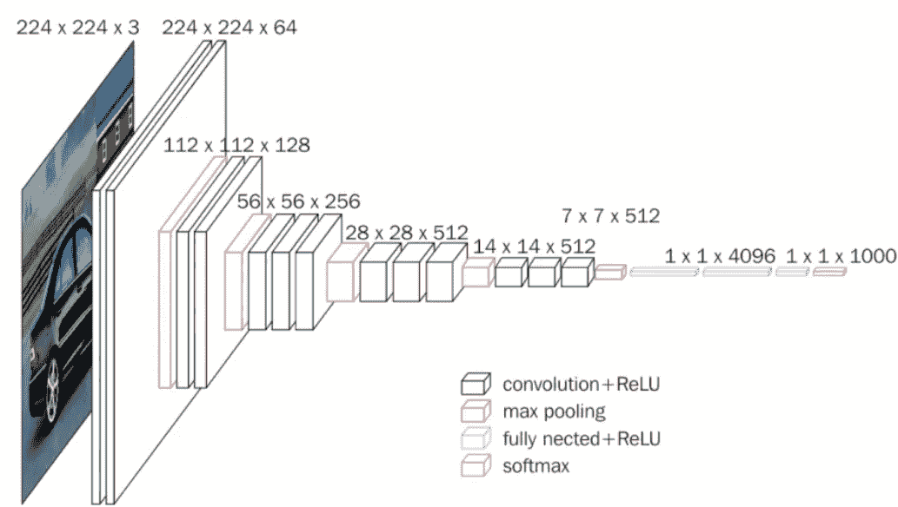
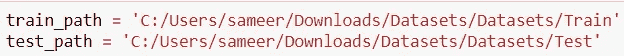
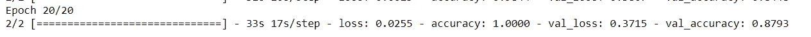

# 基于 vgg 16-迁移学习的汽车品牌分类

> 原文：<https://medium.com/analytics-vidhya/car-brand-classification-using-vgg16-transfer-learning-f219a0f09765?source=collection_archive---------0----------------------->

# 介绍

在本文中，我们将使用 VGG16 迁移学习模型完成一个汽车品牌分类的小型项目。我们将尝试创建一个模型，可以识别汽车的类别，即奥迪，奔驰和兰博基尼的图像为基础。

首先，我将简要介绍 VGG16 架构，然后我们将深入了解使用 Keras 的 VGG16 预训练模型的每一行。

# VGG16

VGG16 是一个 16 层的迁移学习架构，与早期的架构非常相似，因为它的基础仅基于 CNN，但排列有点不同。

研究人员为该架构拍摄的标准输入图像大小为 224*224*3，其中 3 代表 RGB 通道。这些图像通过两个主要层，即卷积层和池。

在卷积层中，滤波器大小为 3*3，步长值为 1，填充相同。Padding='same '意味着对于卷积层，输入图像的大小不应改变。

在池层中，过滤器大小为 2*2，跨距值为 2。每次我们将图像传递到池层，图像的大小将减少一半，内核/过滤器的数量将继续增加。

# VGG 网优于亚历克斯网

1.  与 Alex Net(7 层)相比，VGG Net 使用深度神经网络(16 层)，因此 VGG 可以从网络中提取更多信息，因为它处理多个参数。既然我们用的是 RELU 激活函数，就不会有消失梯度的问题。
2.  在 Alex net 中，经过大量实验后，他们选择了一个滤波器大小，并且没有层和内核的顺序，但在 VGG，我们有一个通用架构，其中卷积层和池以系统的方式发生。

# VGG 作为预训练模型(迁移学习)

VGG16、VGG19、Resnet50、Inception-Net 等是最先进的算法或预训练模型，我们可以使用这些算法的权重来创建自己的模型。

这种将预训练模型的权重重新用于我们自己的模型的做法被称为迁移学习。

所有这些先进的算法会给你 1000 个类别的输出，因为它们是在图像网络数据集上训练的，但在我们的例子中，我们只需要 3 个类别。因此，我们削减了第一层和最后一层，并用 3 个节点(类)层替换该层。我们也将在代码中看到这一点。

上图展示了 ImageNet 的强大功能，ImageNet 是一个数据库，包含大约 1400 万张计算机视觉研究人员使用的图像。

# 使用 VGG16 进行汽车品牌分类的步骤

现在让我们来看一下使用 Keras 实现 VGG16 的过程。我们会逐一理解每一行代码。

## A]导入库

## B]根据 VGG16 的标准定义我们想要的图像尺寸

输入图像的高度和宽度是 224*224，RGB 通道的高度和宽度是 3，我们将在后面添加。

## C]提供训练和测试数据集目录

训练文件夹包含 3 辆汽车的 64 幅图像，测试文件夹包含 3 辆汽车的 58 幅图像。为了获得更好的性能，我们可以随时增加文件夹中的图像数量。

## D]加载预训练模型并定义图像大小和参数

我们已经加载了模型并使用了 3 个重要参数。input _ shape =图像大小+[3]。那个[3]代表 RGB 通道。

weights='imagenet '很重要，因为这意味着我们使用模型的预训练权重，该模型最初是使用 imagenet 图像训练的。

include_top= False 意味着我们将切断 VGG16 预训练模型的最后一个密集层，因为它是为 imagenet 的 1000 个输出类别训练的，而我们只有 3 个类别。我们还切断了第一层，因为输入图像和大小可以由我选择。

## E]不要训练现有的重量

vgg.layers 显示了已经形成的 16 个层对象。

layer.trainable = False 意味着我们说不要为这些层训练现有权重。我们想按原样使用它们。我们可以控制重量，因为这是一个预先训练好的模型。我们可以控制哪一层应该预先训练权重，哪一层应该使用可训练权重。

## F]使用 glob 获取数据集中的类的数量

我之前提到过，我们切断了预训练模型的最后一层，因为我们想要用 3 个类别来替换 1000 个类别密集层。我们使用 glob 从文件夹中获取这 3 个类别。

vgg.output 显示合并后最后一层的图像矩阵。现在我们把那层弄平，然后把它输入网络。

## G]展平

## H]现在将这个展平的阵列放到密集网络中

我们使用 Softmax 激活函数，因为有 3 个节点。

## I]定义以输入和输出为参数的模型

## J]使用的成本和优化器

## K]现在，我们使用图像数据生成器从数据集导入图像，并对训练数据执行数据扩充。

收到的验证准确率为 88%

## L]演示

# 结论

这是通过汽车品牌分类的迷你深度学习项目对 VGG16 架构的简短概述。希望你们喜欢这个解释:)

有关机器学习和深度学习的其他令人兴奋的文章，请关注我的 Medium！！

 [## 我关于数据科学的文章

### 以下是我写的关于机器学习、深度学习、数据分析等各种主题的文章

medium.com](/@sameerkumar21635/my-articles-on-data-science-1635f1df2c5c)