# 汽车价格预测:端到端机器学习网络应用

> 原文：<https://medium.com/analytics-vidhya/car-price-prediction-end-to-end-machine-learning-web-application-8e9e1fcbd8b3?source=collection_archive---------1----------------------->


# **简介**

**在这里，我们从汽车网站 CarDekho.com 获得数据，充满了各种各样的汽车信息，包括它们的售价和现价。我们意识到，我们可以使用这些数据来确保我们在新车上获得优惠。特别是，我们可以精确地计算出一辆特定类型的汽车应该付多少钱。**

**动机**

当你在网上看到清单时，很难决定一辆二手车是否值标价。几个因素，包括里程，品牌，型号，年份等。会影响汽车的实际价值。从一个卖家的角度来说，给二手车适当定价也是一个两难的问题。基于现有数据，目的是使用机器学习算法开发预测二手车价格的模型。

**关于数据集**

该数据集包含关于在[www.cardekho.com](http://www.cardekho.com)上市的二手车的信息。该数据可用于许多目的，例如价格预测，以举例说明线性回归在机器学习中的使用。给定数据集中的列如下:

*   汽车名称
*   年
*   销售价格
*   当前价格
*   Kms_Driven
*   燃料类型
*   卖家 _ 类型
*   传动装置ˌ[机]变速器
*   物主

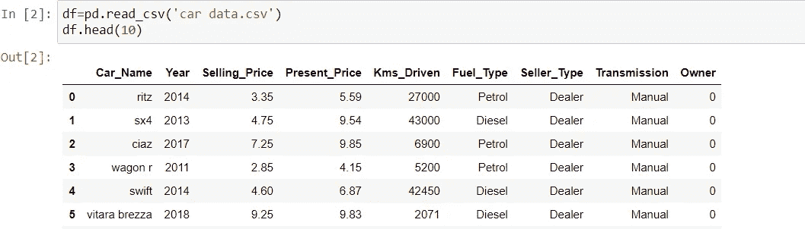

研究人员更经常使用一些以前的数据来预测产品的价格，Pudaruth 的也是如此，他预测了毛里求斯的汽车价格，这些汽车不是新车而是二手货。他使用多元线性回归、k 近邻、朴素贝叶斯和决策树算法来预测价格。比较这些技术的预测结果表明，这些方法的价格非常接近。但是，人们发现决策树算法和朴素贝叶斯方法无法对数值进行分类和预测。 *Pudaruth 的*研究还得出结论，数据集中有限数量的实例不能提供高预测精度。

**方法论**

这项研究旨在开发一个良好的回归模型，以提供准确的汽车价格预测。为了做到这一点，我们需要一些以前的二手车数据，我们使用价格和其他一些标准属性。汽车价格被认为是因变量，而其他属性作为自变量。

随机森林是基于集成学习的回归模型。它使用一种称为决策树的模型，顾名思义，就是多个决策树来生成集合模型，集合模型共同产生一个预测。该模型的优点是树是并行产生的，并且相对不相关，因此产生良好的结果，因为每个树不容易出现其他树的个别错误。这种不相关的行为通过使用自举聚合或 bagging 来部分确保，提供了产生健壮和不相关的树所需的随机性。因此，选择此模型来说明数据集中的大量要素，并将 bagging 技术与以下梯度增强方法进行比较。

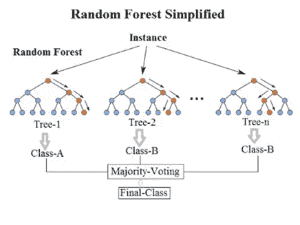

随机森林回归量

**数据可视化**

数据可视化是信息和数据的图形化表示。通过使用[图表、图形和地图](https://www.tableau.com/learn/articles/data-visualization/glossary)等可视化元素，数据可视化工具提供了一种可访问的方式来查看和理解数据中的趋势、异常值和模式。

数据集中每个要素的相关性:

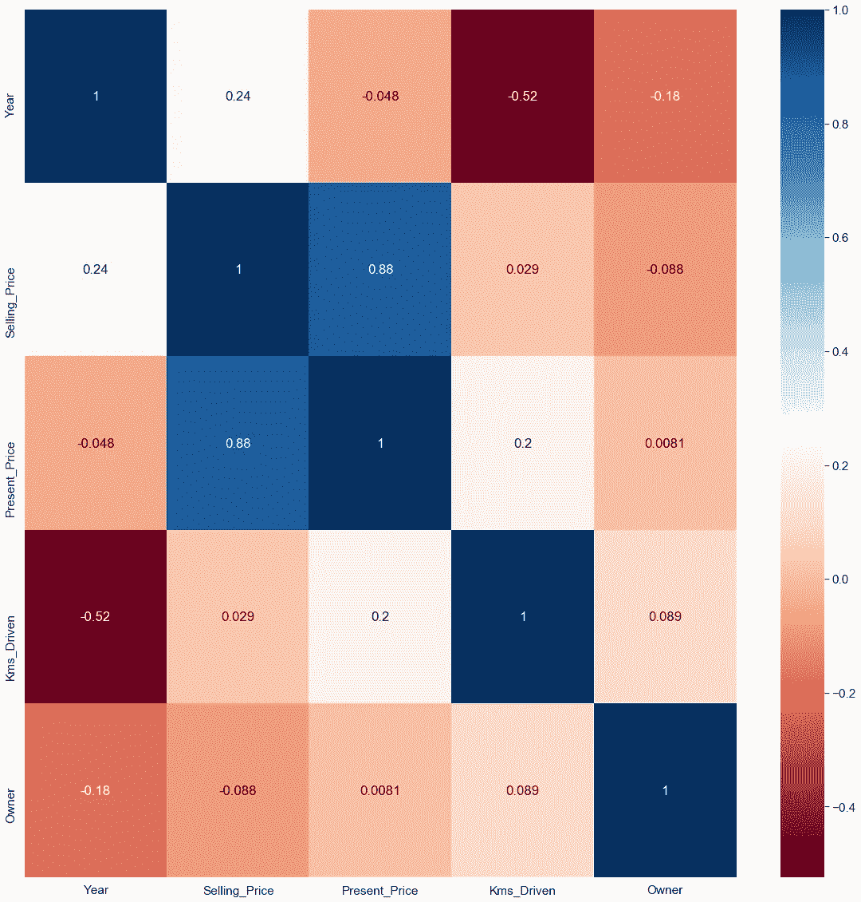

分类变量代表可以分组的数据类型。分类变量的例子有种族、性别、年龄组和教育水平。

这里我们有 4 个分类数据特征，

变速器-[手动、自动]

卖方 _ 类型-[经销商，个人]

燃料类型-[汽油、柴油、压缩天然气]

所有者- [0，1，3]

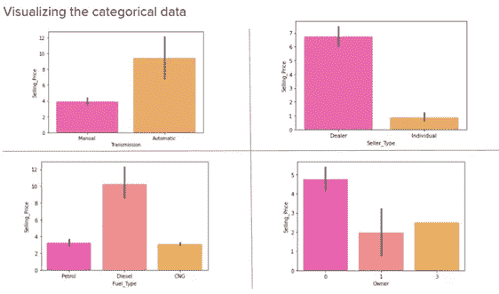

为了计算车龄，我们添加了一个新列，当前年份和车辆年份的差值将是车龄。

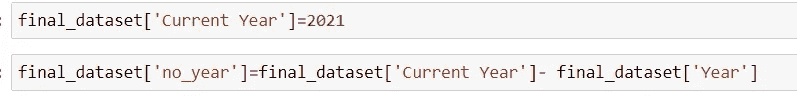

我们可以看到，这 4 个特征(变速器、销售者类型、燃料类型和所有者)是分类数据，影响汽车的销售价格。

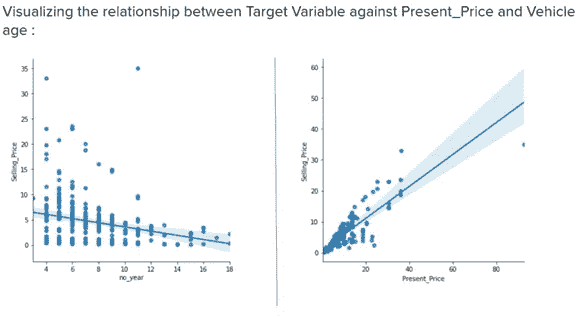

汽车的现价直接影响销售价格预测。两者高度相关，在这里彼此成正比。

随着旧车售价的下降，车龄正在产生负面影响。

**数据预处理**

在任何机器学习过程中，数据预处理都是对数据进行转换或*编码*的步骤，以使数据达到机器可以轻松解析的状态。换句话说，数据的*特征*现在可以很容易地被算法解释。

特征是被观察现象的一个单独的可测量的属性或特征。

一种热编码是应用于分类数据的数据处理过程，将其转换成用于机器学习算法的二进制向量表示**。**

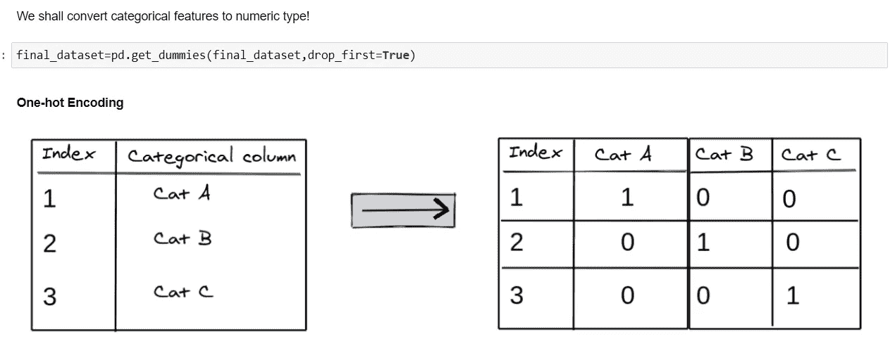

为了从数据帧中产生一个实际的伪编码，我们需要传递`drop_first=True.`

**特征重要性**

这里，我们使用 ExtraTreeRegressor 来获取数据集中要素的重要性。

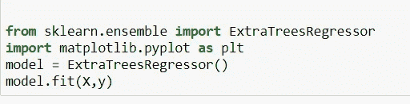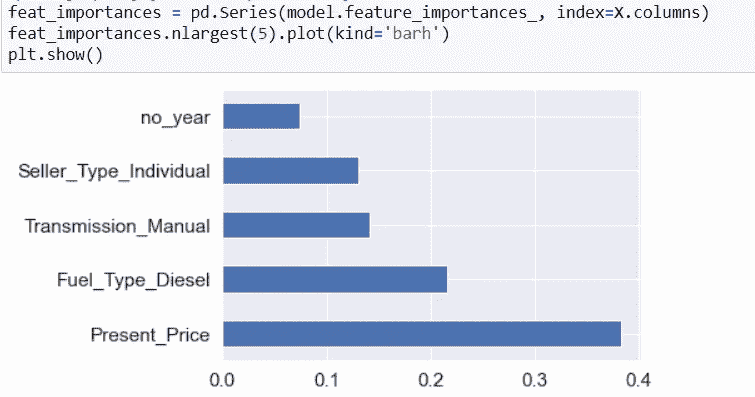

特征重要性的可视化表示

这里我们可以看到现在的价格比其他功能更重要。

现在将数据分为训练和测试，以构建模型。

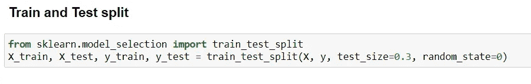

**建模**

这里我使用随机森林回归算法来预测汽车价格。它基于决策树。

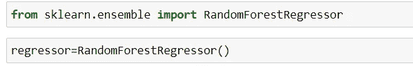

然后，我使用超参数调整来改善模型和算法的性能。我已经使用 RandomizerSearchCV 进行超参数调整。

在机器学习中，超参数优化或调整是为学习算法选择一组最佳超参数的问题。超参数是一个参数，其值用于控制学习过程。相比之下，其他参数(通常是节点权重)的值是学习来的。

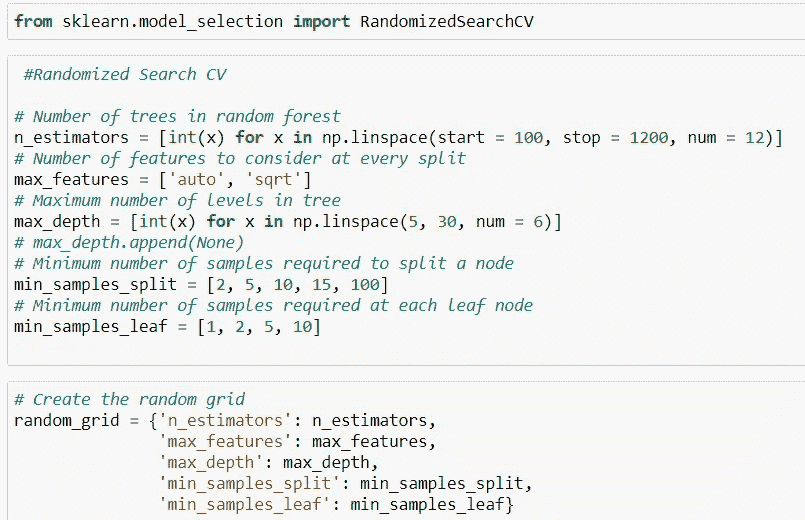

```
*rf_random = RandomizedSearchCV(estimator = rf, param_distributions = random_grid,scoring=’neg_mean_squared_error’, n_iter = 10, cv = 5, verbose=2, random_state=42, n_jobs = 1)*
```

现在将数据拟合到模型中，这将需要时间来训练模型。

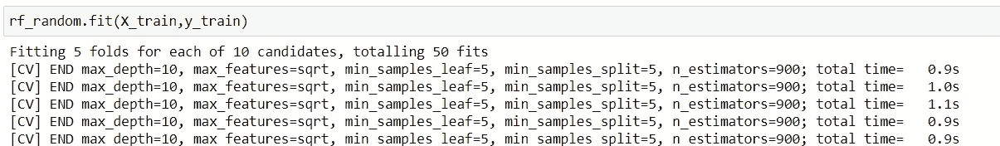

**车型评测**

这是通过观察其性能来选择型号的最佳方法。这是模型开发中非常重要和不可或缺的一部分。

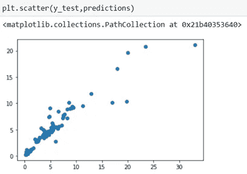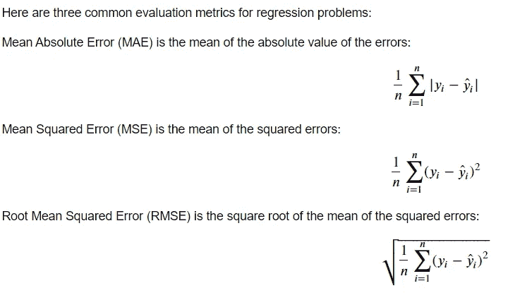

```
Mean Absolute Error (MAE): 0.9047490109890105Mean Squared Error (MSE): 4.098584280417587Root Mean Squared Error (RMSE): 2.024496055915542
```

**用烧瓶 API 建模**

为了构建模型，首先要处理您在 Jupyter 中创建的模型。

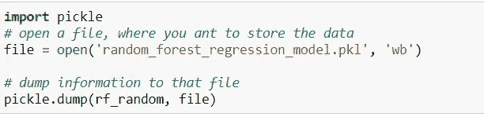

创建新的 app.py 文件。现在，导入每个重要的模块和库来部署模型。还要在 app.py 文件中加载模型。

对于 web 应用程序，您需要为网站的结构创建一个 html 文件，您可以添加 CSS 和 JS 进行样式和其他事情。

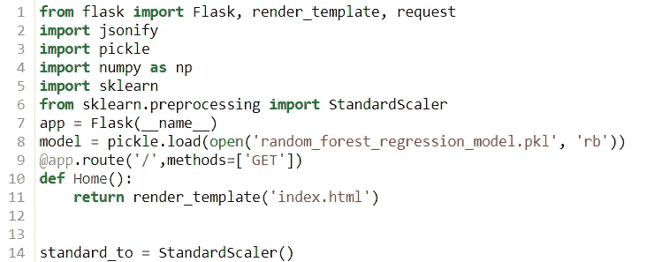

> ***所有文件和代码请访问这个 GitHub 链接:***[***gaur av 21s/CarPricePrediction***](https://github.com/gaurav21s/CarPricePrediction)

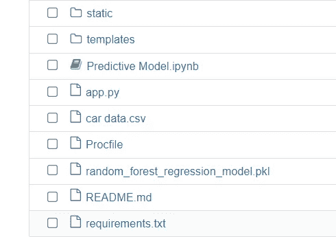

**在 Heroku 的部署**

要在 Heroku 上部署模型，将您的项目放在 GitHub 上，并在 Heroku 上创建一个帐户。请在设置帐户时使用 python 作为编程语言。

然后创建一个新的应用程序，将你的 github 库连接到 Heroku。

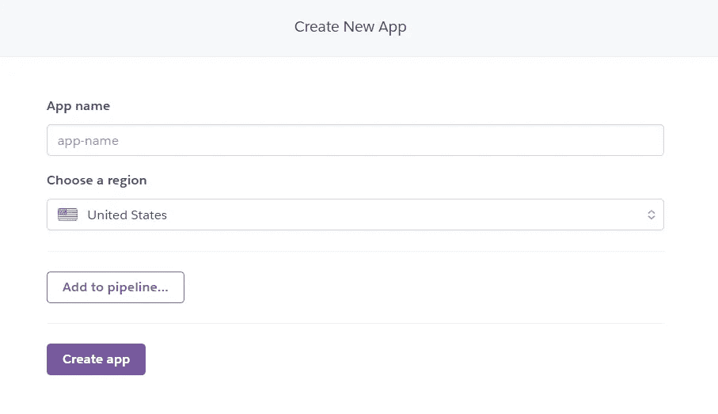

现在转到部署部分，连接 github 帐户，向下滚动到手动部署，然后单击部署。

对于部署任何模型，非常重要的文件是 requirements.txt。这里提到了所有的库和依赖项。创建此文件时要小心。最后使用下面的行来冻结(创建)你的需求文件。

```
pip freeze > requirements.txt
```

请为此项目使用新的环境。

万岁！！现在您已经在 Heroku 上部署了 WebApp。

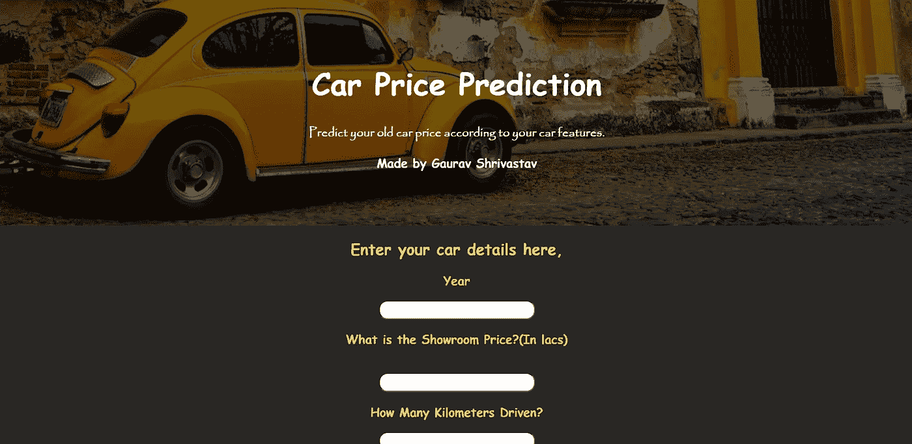

恭喜你。你已经完成了这个项目。

谢谢你。

> **请访问我的 LinkedIn 个人资料:Gaurav Shrivastav | LinkedIn**