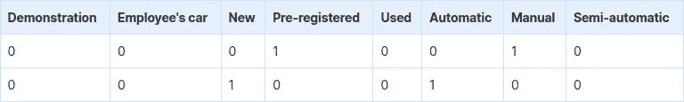
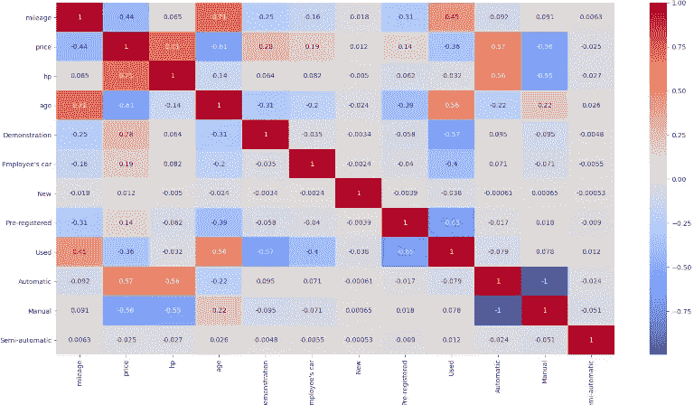
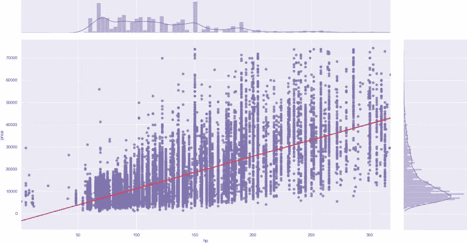
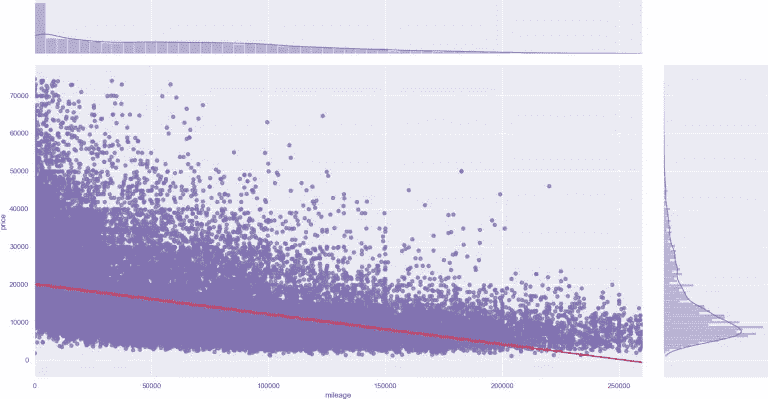
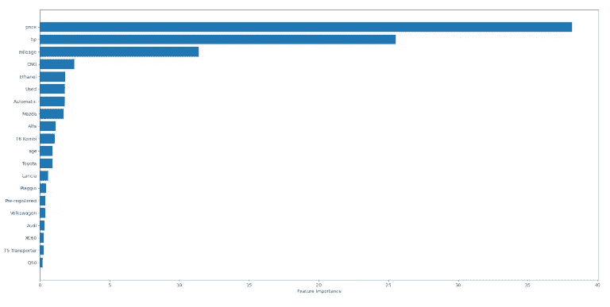

# Python 中的汽车价格预测

> 原文：<https://medium.com/analytics-vidhya/car-price-prediction-in-python-b8451bcb4ba3?source=collection_archive---------8----------------------->

上周，我们对一个汽车数据集做了一些[探索性数据分析。在使用数据集并收集了许多见解后，我们今天将重点关注价格预测。](/@AnderRV/exploratory-data-analysis-in-python-ab5ef8d6460)

[该数据集包括在德国销售的汽车](https://www.zenrows.com/datasets/germany-cars?utm_source=medium&utm_medium=blog&utm_campaign=car_price_prediction)，注册年份为 2011 年至 2021 年。所以我们可以假设它是当今市场价格的准确代表。

# 先决条件

为了让代码工作，你需要安装 [python3 和](https://www.python.org/downloads/)。有些系统已经预装了它。之后，通过运行`pip install`安装所有必要的库。

```
*# last weeks* 
pip install pandas matplotlib squarify seaborn 
*# new libs* 
pip install scipy sklearn catboost statsmodels
```

# 数据清理

假设我们想根据属性预测汽车价格。为此，我们将训练一个模型。让我们从用年龄代替注册年份开始，去掉品牌和型号—我们不会用它们来进行预测。

```
cars['age'] = datetime.now().year - cars['year'] 
cars = cars.drop('year', 1) 
cars = cars.drop('make', 1) 
cars = cars.drop('model', 1)
```

我们上周讨论了离群值，现在是时候移除它们了。我们将删除价格、马力或里程的 [z 得分](https://en.wikipedia.org/wiki/Standard_score)高于 3 的项目。简而言之，这意味着去掉偏离平均值超过三个标准差的值。

在此之前，`dropna`将删除所有具有空值或 null 值的行。

```
from scipy import stats 

cars = cars.dropna() 
cars = cars[stats.zscore(cars.price) < 3] 
cars = cars[stats.zscore(cars.hp) < 3] 
cars = cars[stats.zscore(cars.mileage) < 3]
```

接下来，我们将使用布尔标记替换类别值(优惠类型和齿轮)。实际上，这意味着为每个类别类型创建新列(即，对于*齿轮*，它将是自动、手动和半自动的)。

熊猫有一个功能可以做到这一点:`get_dummies`。

```
offerTypeDummies = pd.get_dummies(cars.offerType) 
cars = cars.join(offerTypeDummies) 
cars = cars.drop('offerType', 1) 

gearDummies = pd.get_dummies(cars.gear) 
cars = cars.join(gearDummies) 
cars = cars.drop('gear', 1)
```



# 目视检查相关性

我们将使用`seaborn heatmap`绘制变量相关性。它会用图表告诉我们哪些变量是正相关或负相关的。

最高的相关性显示年龄与里程数——听起来不错——以及价格与马力——也不是什么大新闻。看看负相关，价格与年龄——这也很自然。

我们可以忽略手动和自动之间的关系，因为很明显你只会有一个或另一个——几乎没有半自动。

```
import seaborn as sns 

sns.heatmap(cars.corr(), annot=True, cmap='coolwarm') 
plt.show()
```



为了仔细检查，我们将绘制马力和里程变量与价格的关系。我们将与`seaborn jointplot`合作。

它将绘制所有条目和一条回归线。为了简洁起见，只有一个代码片段。第二个将是相同的，用*里程*代替 *hp* 。

```
sns.set_theme(style="darkgrid") 
sns.jointplot(x="hp", y="price", data=cars, 
	kind="reg", color="m", line_kws={'color': 'red'}) 
plt.show()
```



# 价格预测

我们就要到达关键部分了。我们将尝试**三种不同的预测模型**，看看哪一种表现更好。

我们需要两个变量，Y 和 X，包含价格和所有剩余的列。我们也将在其他模型中使用这些新变量。然后，我们将用于训练和测试的数据分成 70%-30%的分布。

**免责声明**:我们对所有型号进行了多次测试，并为每个型号选择了最佳结果。不一样的 var 适用，会出现一些“神奇”的数字。我们主要通过反复试验来调整这些。

```
from sklearn.model_selection import train_test_split 

X = cars.drop('price', 1) 
Y = cars.price 
X_train, X_test, y_train, y_test = train_test_split( 
	X, Y, train_size=0.7, test_size=0.3, random_state=100)
```

# 来自 sklearn 的线性模型

为了训练第一个`LinearRegression`模型，我们将把训练数据传递给*拟合*方法，然后把测试数据传递给*预测*。

为了检查结果，我们将对所有结果使用 *R 平方*。在这种情况下，结果是 **0.81237** 。

```
from sklearn import linear_model 
from sklearn.metrics import r2_score 

lm = linear_model.LinearRegression() 
lm.fit(X_train, y_train) 
y_pred = lm.predict(X_test) 
print(r2_score(y_true=y_test, y_pred=y_pred)) *# 0.81237*
```

# 来自 CatBoost 的回归量

接下来，我们将使用来自`CatBoost`的`Regressor`。这个模型是用一些我们通过测试调整过的数字创建的。和上一个类似，用训练数据拟合模型，检查分数，结果 **0.92416** 。

有一个很大的区别，因为这种方法慢得多，超过 20 秒。这可能是一个更接近的匹配，但如果它必须立即运行，这不是一个好的选择。

```
from catboost import CatBoostRegressor 

model = CatBoostRegressor(iterations=6542, learning_rate=0.03) 
model.fit( 
	X_train, y_train, 
	eval_set=(X_test, y_test), 
) 
print(model.score(X, Y)) *# 0.92416*
```

# 来自 statsmodels 的 OLS

对于`statsmodels`，我们将改变 X 的值，只取里程、hp、年龄。与之前的值相比，差异几乎提高了 10%。

r 平方为 **0.91823** ，运行时间不到两秒——算上数据加载。

```
import statsmodels.api as sm 

X = cars[['mileage', 'hp', 'age']] 

model = sm.OLS(Y, X).fit() 
predictions = model.predict(X) 
print(model.rsquared) *# 0.91823*
```

# 额外球:最佳预测

如果我们不放弃品牌和模式，会发生什么？其中两个型号的性能会更差，但不是`CatBoost`。这将花费更长的时间和更多的空间。我们会有 700 多个专栏。但是如果你追求准确性，这是值得的。

为了简洁起见，我们不会重复我们以前做过的所有操作。不要放弃制作和模型，为它们创建假人，然后像以前一样继续。

```
makeDummies = pd.get_dummies(cars.make) 
cars = cars.join(makeDummies) 
cars = cars.drop('make', 1) 

modelDummies = pd.get_dummies(cars.model) 
cars = cars.join(modelDummies) 
cars = cars.drop('model', 1) 

*# the rest of the features, just as before* 
*# split train and test data* 

model = CatBoostRegressor(iterations=6542, learning_rate=0.03) 
model.fit( 
	X_train, y_train, 
	eval_set=(X_test, y_test), 
) 
print(model.score(X, Y)) *# 0.9664*
```

该模型公开了一种获取特征重要性的方法。我们可以使用条形图来检查哪些特征对预测影响最大。我们将它们限制在 20 个以内，但是正如你将看到的，其中两个——不包括价格本身——承担所有的重量。

*年龄不重要乍一看可能会让人怀疑。但是有道理。正如我们在相关图中看到的，年龄和里程是密切相关的。所以没必要让他们两个承担所有的重量。*

```
sorted_feature_importance = model.get_feature_importance().argsort( 
	)[-20:] 
plt.barh( 
	cars.columns[sorted_feature_importance], 
	model.feature_importances_[sorted_feature_importance] 
) 
plt.xlabel("Feature Importance") 
plt.show()
```



# 估计汽车价格

比方说，你想买或卖你的车。您收集我们提供的特征(里程、年份等)。如何使用预测模型呢？

我们将再次选择`CatBoost`并使用他们的`predict`方法。我们需要用虚拟数据来转换所有数据，这样我们就可以总结了。这一过程将被提取出来，并对现实应用中的训练、测试或实际数据同等地执行。

我们还需要添加模型支持的所有空特性(即，所有其他 makes)。

这里我们展示一个有三辆汽车出售的例子。我们手动输入所有的初始功能(包括价格)，所以我们可以比较输出。正如你将看到的，预测与实际价格相差不远。

```
realData = pd.DataFrame.from_records([ 
	{'mileage': 87000, 'make': 'Volkswagen', 'model': 'Gold', 
		'fuel': 'Gasoline', 'gear': 'Manual', 'offerType': 'Used', 
		'price': 12990, 'hp': 125, 'year': 2015}, 
	{'mileage': 230000, 'make': 'Opel', 'model': 'Zafira Tourer', 
		'fuel': 'CNG', 'gear': 'Manual', 'offerType': 'Used', 
		'price': 5200, 'hp': 150, 'year': 2012}, 
	{'mileage': 5, 'make': 'Mazda', 'model': '3', 'hp': 122, 
		'gear': 'Manual', 'offerType': 'Employee\'s car', 
		'fuel': 'Gasoline', 'price': 20900, 'year': 2020} 
]) 

realData = realData.drop('price', 1) 
realData['age'] = datetime.now().year - realData['year'] 
realData = realData.drop('year', 1) 

*# all the other transformations and dummies go here* 

fitModel = pd.DataFrame(columns=cars.columns) 
fitModel = fitModel.append(realData, ignore_index=True) 
fitModel = fitModel.fillna(0) 

preds = model.predict(fitModel) 
print(preds) *# [12213.35324984 5213.058479 20674.08838559]*
```

# 结论

在三款车型中，`sklearn`表现稍差。另外两个在结果上非常相似——如果排除品牌和型号的话——但在训练时间上不同。因此，这可能是在它们之间进行选择时要考虑的一个重要方面。

如果你追求高精度，用所有可用的数据训练`CatBoost`模型。这可能需要一分钟，但它可以存储在一个文件中，并在需要时立即加载。

如您所见，将一个 [ZenRows 生成的数据集](https://www.zenrows.com/datasets?utm_source=medium&utm_medium=blog&utm_campaign=car_price_prediction)加载到`pandas`非常简单。然后，需要执行一些步骤:描述、手动探索、查看值、检查是否为空。

这些是首次测试数据集时的日常任务。从那里，标准的做法，如生成假人或删除离群值。然后是多汁的部分。在这种情况下，价格预测使用线性回归，但它可能是任何东西。