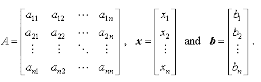
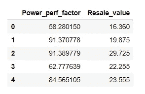
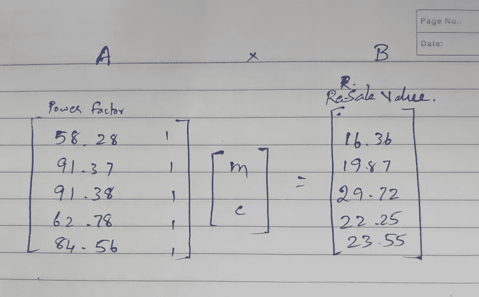
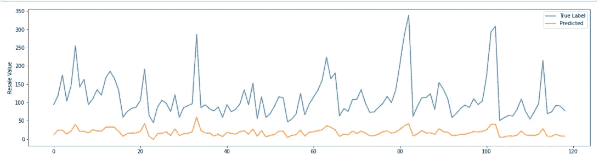

# 汽车销售预测—使用基本矩阵运算

> 原文：<https://medium.com/analytics-vidhya/car-sales-prediction-using-basic-matrix-operations-60ca8ede3bfa?source=collection_archive---------11----------------------->

我们从上学开始就一直在学习 Ax = b 这样的矩阵运算，但我们有没有意识到它的简化线性回归(y=mx+c)问题是如何。是的，今天我们将使用矩阵运算来寻找斜率(m)和截距(c)以预测**汽车转售价值**。

在进入问题之前，让我们试着回顾一下 Ax=b，下面是一个例子。



其中 A 是大小为 m×n 的矩阵，与 x(n×1)线性组合以获得目标变量 b(n×1)

**如何将这与线性回归问题联系起来？**

在我们的汽车销售数据中，我们有两列，一列是功率性能系数和转售价值，其中我们需要预测相对于输入特性功率系数(x)的转售价值(y)。

> 转售价值=斜率*功率因数+截距



为了以矩阵形式表示这一点，我们需要形成一个矩阵 A，其中一列为输入特性(功率因数)，另一列为用于添加偏差的 1，B 矩阵将是我们的转售价值，x 将是我们的斜率和截距变量。



对于单个特征，我们可能认为矩阵运算不是很必要，但认为如果您有数十亿行和数十亿个特征来预测汽车转售价值，那么以矩阵格式表示方程(y = mx + c)会使我们的预测变得更容易。

# Python 实现

```
#importing necessary libraries# pandas -- > dataframe operations
# matplot --> visualizations
# numpy --> Matrix operationsimport pandas as pd
import matplotlib.pyplot as plt
import numpy as np#reading the data set
data=pd.read_csv('Car_sales.csv')#storing input feature in variable x
x = np.array(data['Power_perf_factor'].values)#formating the input feature as matrix A as shown in above figure
mat_A = np.transpose(np.vstack((x,np.ones(len(x)))))#calculating slope and intercept (x = B/A)
output = np.matmul(np.linalg.pinv(mat_A),np.expand_dims(data['Resale_value'].values,1))#calculating ydash value based on slope and intercept(y=mx+c)
ydash = output[0,:]*x + output[1,:]#plotting the original y value and predicted y value
plt.figure(figsize=(20,5))plt.plot(y, label = 'True Label')
plt.plot(ydash, label = 'Predicted') #naming y axis
plt.ylabel('Resale Value')#to show legend 
plt.legend()
plt.show()
```

