# M5 预测案例研究-准确性|卡格尔竞赛

> 原文：<https://medium.com/analytics-vidhya/case-study-on-m5-forecasting-accuracy-kaggle-competition-893d7e124b54?source=collection_archive---------6----------------------->


# **目录:**

1.  *简介*
2.  *商业问题*
3.  *为什么解决这个问题需要 ML*
4.  *我的数据来源*
5.  *数据集*
6.  *假设*
7.  *来自 EDA 的观察结果*
8.  *模型方法*
9.  *结论*
10.  *未来工作*

# **一-简介:**

这篇博客是关于 M5 在 Google Colab 上使用 Python 预测时间序列问题的。

# **二-业务问题:**

销售预测是现代商业智能的重要组成部分。这可能是一个复杂的问题，尤其是在缺少数据缺失和存在异常值的情况下。销售可以被认为是一个时间序列。目前有多种时间序列模型，如 ARIMA、萨里玛、萨里玛等。对于销售/需求预测的时间序列，考虑不同的基于集成的方法，并组合由不同算法产生的所有预测，有可能提高预测精度。

本案例研究的主要目的是精确估计两个 28 天时间段内美国不同地点的沃尔玛商店的产品单位销售预测数。

这些数据涵盖了美国三个州(加利福尼亚州、德克萨斯州和威斯康星州)的商店，包括从 2011 年 1 月 29 日到 2016 年 6 月 19 日的 5 年内的商品级别、产品类别、部门和商店详情。此外，它还有解释变量，如促销、星期几、价格、特殊事件和节日。

对产品销售的误导性商业预测可能会导致机会和收入损失，例如，如果沃尔玛的分析师团队预测未来几周大部分地区都是晴天，但商店库存的雨伞却较少，但事实证明预测是错误的，许多地区都下了大雨，因此对雨伞的需求超过了沃尔玛的预测和商店库存。这将导致收入损失。因此，拥有一个准确的机器学习模型来执行预测以产生商业见解是非常重要的。

# **III -为什么解决这个问题需要 ML？**

问题是一个时间序列模型，它可以作为一个监督的机器学习模型(回归)来处理，这可以给我们一个很好的结果，因为机器学习算法可以在时间序列数据/回归中找到模式。时间序列分析如果作为回归问题处理会给出好的结果的原因是因为回归方法的主要假设是过去数据中的模式在将来会重复。利用这种逻辑，结合对材料的理解，我们可以向公司提交一份完整的商业计划书，进行提炼，从而减少损失。

# **四-我的数据来源:**

这是一场猜拳比赛，你可以通过[点击这里](https://www.kaggle.com/c/m5-forecasting-accuracy/data)查看比赛详情。比赛由尼科西亚大学举办。

# **虚拟数据集:**

有 3 个 csv 文件可用:

1.  **Calendar.csv:** 它包含关于产品销售日期以及当天举行的活动和节目的信息。
2.  **Sales _ train _ evaluation . CSV:**它包含从 1941 年第 1 天到第 2 天每个商店的每个产品的历史每日单位销售额。
3.  **Sell_prices.csv:** 它包含每个商店每周的产品价格信息。


数据提供方式概述

我们有来自 3 个州的数据，总共有 10 家商店，3 个类别下的 7 个部门。

# **VII -来自 EDA 的观察结果:**

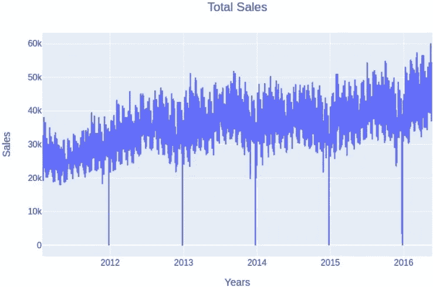

我们可以看到，数据遵循季节性趋势。每年圣诞节的销售额都会大幅下降不到 50 英镑。需求每年都在增长，不是指数增长，而是平稳增长。

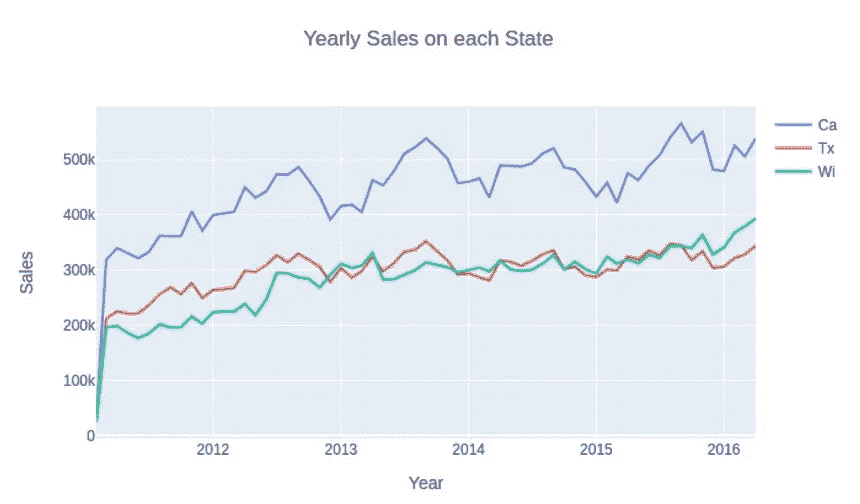

从 2013 年开始，威斯康星州和德克萨斯州的销售额几乎相互重叠。加利福尼亚的销售额高居榜首，这可能是因为与其他地方相比人口增加了。虽然威斯康星州的人口比德克萨斯州少得多，而德克萨斯州的 GDP 比威斯康星州略高，但这两个州之间的差异很小。

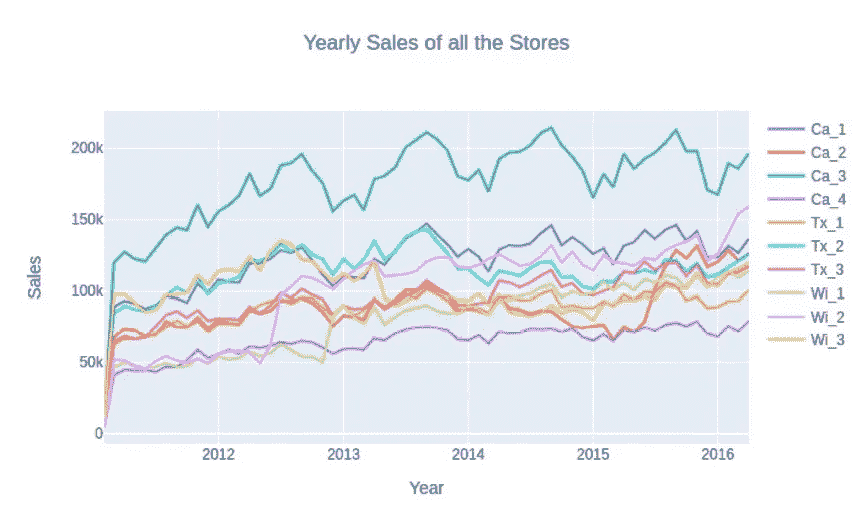

我们之前观察到，加州的销售额比德州和威斯康辛州高，但加州的 3 号店似乎是销售额最高的商店，同时也是销售额最低的商店。加州 1 号店的销售额与各州其他商店的销售额相差很大。

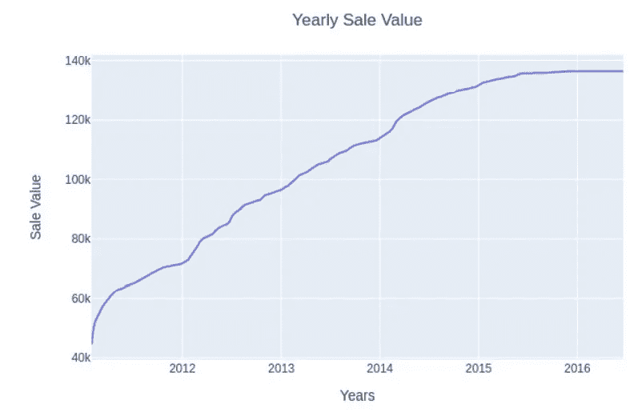

到 2015 年，总销售成本逐年增加。2015 年以后，销量几乎一直不变，没有起伏。

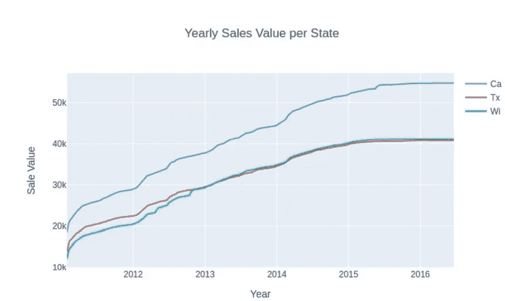

加州每年都位居销量榜首，而德克萨斯州和威斯康星州的销量几乎相同。我们可以理解，由于总销售价格图与每个州销售的产品数量相同，相同类型的产品在所有州的销售几乎相等。

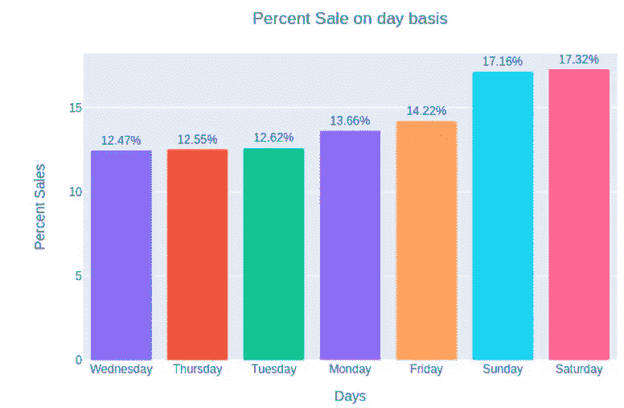

周末有大量的销售活动。从周五到周一的周末前后，销售额有升有降。

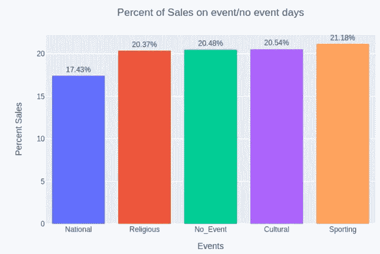

体育赛事期间的销售额略高于无赛事和其他赛事期间的销售额。全国活动日的销售额稍低，但我们可以断定这是销售额低的原因。

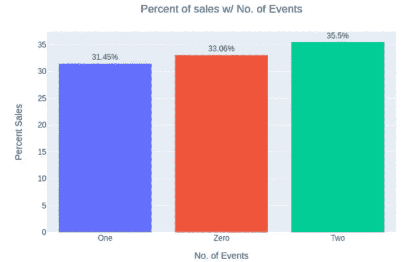

当一天有两个活动时，销售额会比没有活动时略高。但是相反，当有一个活动时，销售额比没有活动时少一点。

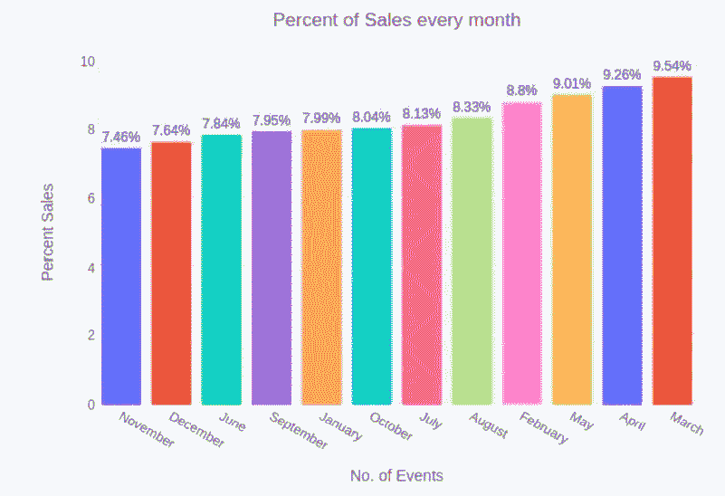

三月份销售额最高，十一月份销售额最低。这可能是因为人们在 11 月后倾向于去不同的地方旅行，享受他们的假期，这在夏天也会发生。

# **VIII -模型方法:**

在阅读了问题所需的所有文件后，我们正在创建预测所需的新特征，从 1942 年到 1969 年。然后，我们将时间序列问题创建为机器学习问题，并将所有 csv 文件合并在一起，并用产品的平均销售价格填充销售价格上的 nan 值。然后，我们删除不需要的特征，并通过用它们的分类代码替换它们来转换所有的分类特征。

```
**for** i **in** data.columns:
    **try**:
        data[i] = data[i].cat.codes
    **except** **AttributeError**:
        **pass**
```

然后，我们只添加滞后偏移功能，因为添加更多的功能会导致我们的模型过度拟合。

然后，我们将只提取 1000 天后的数据，以使处理更容易，并避免任何内存错误。然后，我们将数据分为 Train、Test 和 Val，其中 Train(X_train)包含 1000 年到 1913 年之间的数据，validation(X_val)包含 1914 年到 1941 年之间的数据，最后 test(X_test)是我们需要预测的 1941 年之后的数据。

我尝试的第一个型号是 LightGBM，事实证明它是最好的型号。

对于上面的代码，我们的输出如下所示

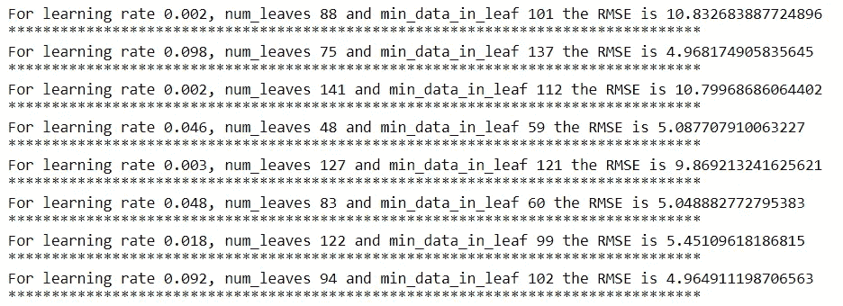

我们将得到 15 个输出，因为循环运行了 15 次。从获得的 MSE 值中，我选择了具有最小 MSE 值的参数值，并重新训练了模型。对 CatBoostRegressor 做了同样的工作，在 LGBMRegressor 的位置上，我用 CatBoostRegressor 替换它，通过它给出的最小度量值找到最佳参数。

但是对于 XGBoost Regressor，我做了一些小的修改，比如将 tree 方法改为“hist ”,将 grow_policy 改为“lossguide”。

线性回归简单直接，因为它不需要调整任何参数。然后，ElasticNet、岭回归和 Lasso 回归模型几乎是相同的，其中 ElasticNet 有两个参数来调整α和 L1 比率，但是岭回归和 Lasso 回归只有一个参数来调整α值。

对于上面的代码，我们的输出如下所示

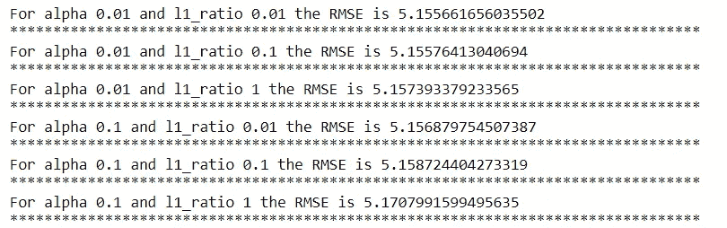

我们将得到 12 个输出，因为我们有 12 个组合。

这是我用来调整 ElasticNet 的最佳参数的代码，在这里，每个循环都用从列表“alp”中选择的 alpha 值训练一个模型，第二个/内部循环用 L1 比率值运行。利用训练好的模型，我们预测 X_val 的值并计算其 MSE。脊和套索回归也是如此，但只运行一个循环来选择最佳 alpha 值。

现在，对于每个模型，在选择了最佳参数值之后，我预测了提交所需的 X_val 和 X_test 的值，并对其进行了整形，因为之前我们对它们进行了整形，以接近作为监督模型的时间序列模型，因此现在我们将整形回提交的原始形式。

最后，我们正在制作一个适合提交的表单

首先，我们读取 submission.csv 文件，然后取前 30490 行作为验证行或用于公共分数验证的行，最后 30490 行是用于计算私有分数的评估行。创建两个数据帧，并用我们之前预测并转换/整形的值填充，然后将这两个数据帧连接成一个完整的数据帧。这些方法对所有模型都是相同的/通用的。

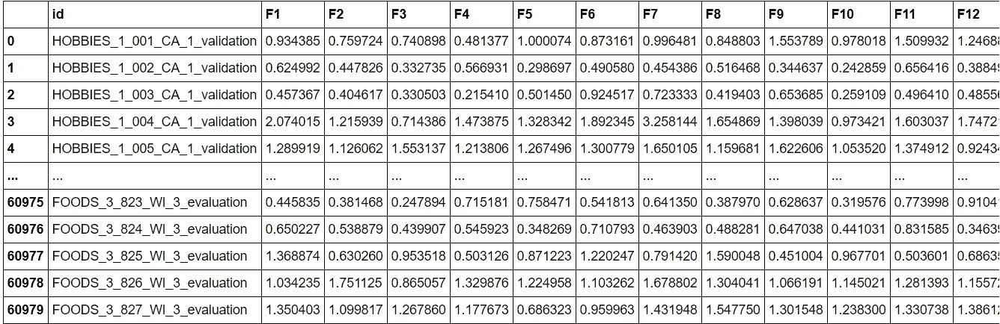

这将是上面代码的输出，我们将有产品 id 和未来 28 天的预测，F1 - F28。

收到的所有模型的最终得分

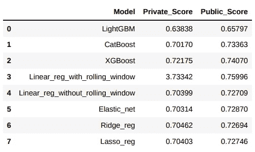

# **九-结论:**

在尝试了多种算法后，LightGBM 给出了最好的分数，在私人排行榜上 **0.63838** 位于**前 5%。训练模型也不需要很多时间。**

# X —未来工作:

这个模型可以通过使用 LSTM 深度学习模型来进一步改进，或者使用更好的交叉验证模型，比如将整个模型分成 3 个或更多个交叉验证，以便更好地训练。几个额外的功能确保模型不会过拟合，因为这个问题很容易过拟合。一些关于需求和价格的功能，虽然我尝试了一些，但没有包括在最终的模型中，因为它没有给出任何大的飞跃，甚至没有在指标中给出相当大的数量。

# **参考:**

1)[github.com M5-精准度/笔记本 M5 精准度. ipynb at master aakashveera/M5-精准度](https://github.com/aakashveera/M5-Accuracy/blob/master/Notebook%20M5%20Accuracy.ipynb)

2) [梅恩·德什拉姆的 M5 _ 准确度/EDA _ Fe . ipynb/github.com 的 M5 _ 准确度](https://github.com/Deshram/M5_accuracy/blob/main/EDA_FE.ipynb)

3) [时间序列预测的简单指数平滑| Nicolas vande put |走向数据科学](https://towardsdatascience.com/simple-exponential-smoothing-749fc5631bed)

4) [数据|免费全文|用于销售时间序列预测的机器学习模型| HTML(mdpi.com)](https://www.mdpi.com/2306-5729/4/1/15/htm)

5) [零售需求预测中的机器学习| RELEX Solutions](https://www.relexsolutions.com/resources/machine-learning-in-retail-demand-forecasting/)

6) [应用人工智能课程](https://www.appliedaicourse.com/course/11/Applied-Machine-learning-course)

可以在我的 [GitHub](https://github.com/vence-andersen/M5-Forecasting-Accuracy) 页面上找到解决方案的链接。

你可以在这里查看我的 LinkedIn 简介。