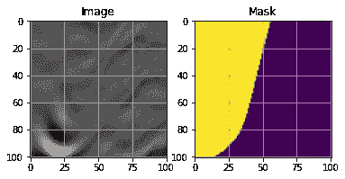
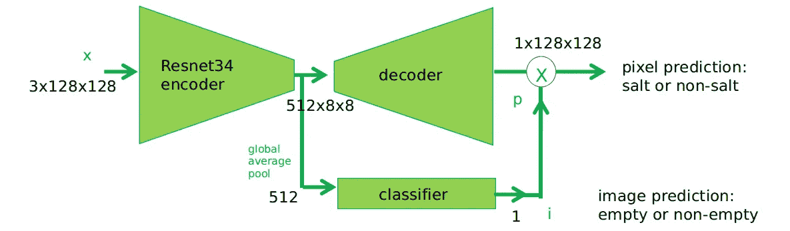
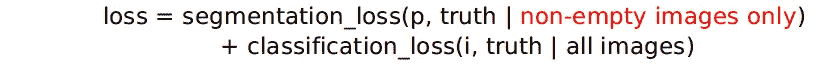

# 案例研究-TGS 盐鉴定挑战

> 原文：<https://medium.com/analytics-vidhya/casestudy-tgs-salt-identification-challenge-352435842c5c?source=collection_archive---------9----------------------->


**目录:**

1.  *简介*
2.  *商业问题*
3.  *ML 问题映射&指标*
4.  *数据描述*
5.  *现有方法*
6.  *第一次切割解决方案*
7.  *探索性数据分析*
8.  *先决条件*
9.  *型号说明*
10.  *结果&部署*
11.  *未来工作*
12.  *简介*
13.  *参考文献*

> **1。简介**

下面是一个 [kaggle 问题](https://www.kaggle.com/c/tgs-salt-identification-challenge)的案例分析。该解决方案将在 5 小时内提供排行榜前 6%的免费 colab gpu，代码是用 Pytorch 编写的。引用代码的 Colab 笔记本。

> **2。商业问题**

建立一个模型，在给定地震图像输入的情况下，该模型预测每个像素为盐或无盐。

> 对自动化的需求？

地球上有大量石油和天然气聚集的几个地区，在地表下也有大量的盐沉积。但不幸的是，知道大型盐矿床的确切位置非常困难。专业地震成像仍然需要专业人员对盐体进行解释。这导致非常主观的、高度可变的渲染。更令人担忧的是，它会给石油和天然气公司的钻探人员带来潜在的危险。

> **3。ML 问题映射&指标:**

这可以看作是一个**分割**类型的问题。在这种情况下，没有延迟限制。

这里使用的性能指标是多个 IOU 阈值的平均精度，IOU 代表交集/并集。该指标在 IOU 阈值范围内扫描，在每个点计算平均精度值。阈值范围从 0.5 到 0.95，步长为 0.05: (0.5，0.55，0.6，0.65，0.7，0.75，0.8，0.85，0.9，0.95)。换句话说，在阈值为 0.5 时，如果预测对象与基础真值对象的交集大于 0.5，则该预测对象被视为“命中”。

```
iou=.669
iou=[iou]*10
thresholds= np.arange(.5,1,.05)
metric= np.mean(iou>thresholds)
```

*提交格式*:使用**游程编码**格式，而不是直接提交掩码进行评估。

```
mask= np.random.randint(2, size=(101, 101))
def rle_encoding(mask):
    dots = np.where(mask.T.flatten() == 1)[0]
    run_lengths = []
    prev = -2#pixels are 1-indexed so correction required
    for b in dots:
        if (b > prev+1): run_lengths.extend((b + 1, 0))
        run_lengths[-1] += 1
        prev = b
    rle=' '.join(map(str, run_lengths))
    return rle
```

> **4。数据描述:**

中的数据集图像和掩膜。png 文件，下面的数据链接

[](https://www.kaggle.com/c/tgs-salt-identification-challenge/data) [## TGS 盐鉴定挑战

### 地球表面下的盐沉积

www.kaggle.com](https://www.kaggle.com/c/tgs-salt-identification-challenge/data) 

> **5。现有方法:**

*   这个[内核](https://www.kaggle.com/c/tgs-salt-identification-challenge/discussion/65226)讲的是先用焦损再用 Lovasz 损的训练，BCE 可以代替焦损。
*   [这个内核](https://www.kaggle.com/c/tgs-salt-identification-challenge/discussion/69052)使用深度监督将训练加速到 60 个历元，而正常情况下需要 200 个历元。
*   [这里](https://www.kaggle.com/c/tgs-salt-identification-challenge/discussion/69274)快照集成和坐标 Conv 已经被用来获得一个很好的分数。

> **6。第一次切割解决方案:**

首先，采用了一个简单的基线(UNet-Resnet34)。这里只应用了必要的扩充(Normalize，Totensor())。损失是二进制交叉熵，优化器 Adam 以 3e-4 的学习率被选择。

> **7。探索性数据分析**

训练数据集由 4000 幅图像组成，测试数据集由 18000 幅图像组成。竞争对手训练数据非常少。整个比赛中可能的过度配合。迁移学习和数据扩充的需要。

3x101x101 是所有训练和测试图像的大小 101x101 训练和测试集遮罩的大小。数据集中出现的一些异常是带有空遮罩的黑色图像，垂直遮罩如下所示。下面的黄色部分显示盐。



数据集一瞥


增强图像后

测试图像预处理包括获取图像并将其复制填充为 128x128，然后将图像按通道归一化为((0，0，0)，(1，1，1))。128 大小很重要，因为解决方案包括采用 UNet，UNet 易于在 2 次方维上工作。

*盐覆盖计算*:盐覆盖似乎是一个需要关注的非常重要的变量，因此训练数据集中的每个掩膜都已针对其中的盐覆盖进行了计算。

```
mask
salt_coverage= np.mean(mask)*10
#rounding this value to int for easy validation
np.rint(salt_coverage)
#values in salt Coverage= [0,1,2,3,4,5,6,7,8,9,10]
```

> **8。先决条件:**

[SCSE 块](https://www.programmersought.com/article/2032749860/)被认为是给卷积网络增加了注意机制。广义的注意力只是集中在一些事情上，而不是全部。这是通过添加参数来判断哪个空间像素和哪个通道将被聚焦来实现的。

在 Conv 网络中，当我们深入时，我们将剩下高级特征，在早期层中，我们将发现低级特征。[另一方面，超列](https://towardsdatascience.com/review-hypercolumn-instance-segmentation-367180495979)通过使网络能够访问 Conv 网络中所有较低层以及较高层的细节，应该给予网络更多的预测能力。他们通过获取每一级的输出，将其上采样到目标大小，连接所有内容并传递到最后一个卷积来实现这一点。

> **9。型号说明:**

*交叉验证:分层分割已使用 10 倍，分层已使用图像的盐覆盖完成。*

*9.1 基线*

基线表现很好，但很快过度拟合。使用 Resnet34 的 UNet 包括使用 Resnet34 作为编码器，并在 resnet 34 中的每次下采样之前获取输出，并在解码器中的相应上采样步骤之前将它们连接到解码器。解码器始终保持相当简单的 64 个通道。


蓝-青色用于训练，基线模型

因此不同的增强被用于训练和赋值。这使得在训练的每一个环节，训练损失都比 val 损失更严重。在这之后，训练很容易，因为启发式方法是训练足够长的时间，使得训练损失比 val 损失好。这似乎在一定程度上纠正了过度拟合的问题。辍学似乎是过度适应的一个非常自然的解决方案，但我避免辍学，因为它大大延迟了训练过程，与这些增强相比没有提供很大的结果。

```
transform_train = Compose([
  HorizontalFlip(p=.5),
  Compose([RandomCrop(90,90),
  Resize(101,101)],p=.2),
  OneOf([RandomBrightness(.1),
  RandomContrast(.1),RandomGamma()],p=.2),
  PadIfNeeded(128,128,cv2.BORDER_REPLICATE),
  Normalize(mean=(0,0,0),std=(1,1,1,))])
```


蓝-青色系列基线 _ 已修正

然后，Lovasz 损耗(IOU 的替代损耗函数)已经过优化。但是关于这种损失的训练非常缓慢，因此为了加速训练过程，我预先训练了基线校正的重量，这确实证明有助于加速训练过程至少 80 个周期。这里使用了具有 1e-4 学习率的 Adam。Lr 调度程序也一直在帮助训练过程，它有 1e-3 的 max_lr 和 1e-4 的 min_lr，每个周期有 10 个时期和“三角形 2”lr 模式。


基线 _lovasz

*9.2: SCSE_hypercol*

下一个模型是具有空间和通道挤压和激发(SCSE)块和超圆柱的基线。SCSE 块仅放置在解码器中，上采样用于具有双线性模式的超列中。SCSE 区块的折减系数保持默认值 16。这里的解码器也使用了上采样，而不是 ConvTranspose2d。

这个网络只有很小的改进。然后对网络进行误差分析。分析表明，相当大的误差是由于预测盐是否存在的网络不准确造成的。在 0.0 IOU 预测中存在大约 11 个假阳性和 24 个假阴性。


Scse_hypercol

*9.3 二进制 _ 判断*

下一个模型在相同的架构上尝试了一个简单的解决方案，即在中心块判断图像中是否有盐，即从编码器中取出输出并检查其中是否有盐，然后只有那些具有非空掩码的才会被训练用于语义分割。这是一种很难的关注，因为我们的目标是 1，0 倍。训练进行了 200 个时期，30 个时期有 BCE 损失，然后有 Lovasz 损失。Adam 3e-4 用于 BCE，然后 Adam 1e-4 用于 90 个时期，然后循环学习率(1e-3，1e-4)用于 80 个时期。中心块上的二元分类器在 val 集上的准确率为 92%,而度量在 val 集上的准确率为 0 . 87。



该模型的损失计算是，如果图像没有盐，则取输出并乘以 0，如果有盐，则乘以 1。然后，该输出将用于计算 lovasz 损失，并且对于分类损失(BCE ),将使用每个图像。



这个解决方案极大地改进了整个培训过程。这里收敛非常快，这样做有助于假阳性从 11 到 6，也有助于非空图像的训练。


蓝青训练二元评判模型

> 10。结果&部署:


Kaggle 最佳分数提交


模型比较


图 1


图 2:二元判断

在上图中，图例是最后一张图片，橙色->真阳性，灰色->假阴性，红色->假阳性，蓝色->真阴性。这些图像是通过在真实遮罩上重叠预测而得到的，该过程仅在 val (fold0)集合中的遮罩上进行，其中 metric ==0.0

*观察:*

*   与图 1 相比，图 2 清楚地显示了更少的错误，这是显而易见的，因为图 2 来自最佳模型。
*   大量的错误伴随着蓝色和灰色(真阴性、假阴性)。
*   此外，许多错误是在角落和边缘。对目标作物(90，90)进行度量计算比实际度量好得多。
*   模特们似乎也分不清完整的面具和没有面具。
*   不出所料，垂直屏蔽引起了一些问题。


在此表中，iou 列表示指标组，第 2 列是该指标组中整个数据集的计数。

*观察:*

*   表 1 来自最佳模型，它清楚地显示了与表 2 相比的总体改进。
*   这很有意思，因为向模型中添加二进制判断的变化意味着只影响 0.0 iou 范围(减少)，但这里 1.0 iou 范围也变得更好(增加)。

***部署:***

最好的模型已经部署在 google cloud 上，部署过程相当简单，使用 flask 完成。

部署模型工作

> **11。未来工作:**

1.  由于如此小的训练集，伪标记在这种情况下看起来非常有前途。
2.  KFold 合奏肯定会提高至少 01 IOU。
3.  快照集合或随机加权平均也肯定会提高分数。
4.  在这个网络中可以进行深度监督，以具有更好的收敛性。
5.  众所周知，CoordConv 解决方案可以稍微提高分数。

> **12。简介:**

*   [https://www.linkedin.com/in/manoj-guthikonda-5405b4112/](https://www.linkedin.com/in/manoj-guthikonda-5405b4112/)
*   [https://github.com/level14taken](https://github.com/level14taken)

> **13。参考文献:**

*   [https://colab . research . Google . com/drive/1 ua 6b 3 nxvbgwfk 4 kbxtetq 61 ytbzcwsa 6？usp =共享](https://colab.research.google.com/drive/1uA6b3NXVBGwfK4KBxtetq61YTbZcwSA6?usp=sharing)
*   [https://www . ka ggle . com/c/TGS-salt-identificati on-challenge/discussion/67693](https://www.kaggle.com/c/tgs-salt-identification-challenge/discussion/67693)
*   [https://heart beat . fritz . ai/brilliant-初学者-模型部署指南-133e158f6717](https://heartbeat.fritz.ai/brilliant-beginners-guide-to-model-deployment-133e158f6717)
*   [https://www . ka ggle . com/c/TGS-salt-identificati on-challenge/discussion/65933](https://www.kaggle.com/c/tgs-salt-identification-challenge/discussion/65933)
*   [https://www.appliedaicourse.com](https://www.appliedaicourse.com)