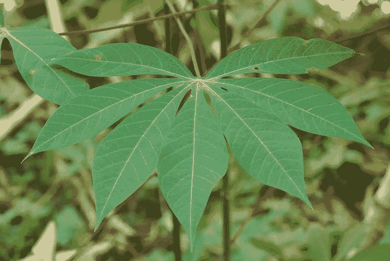
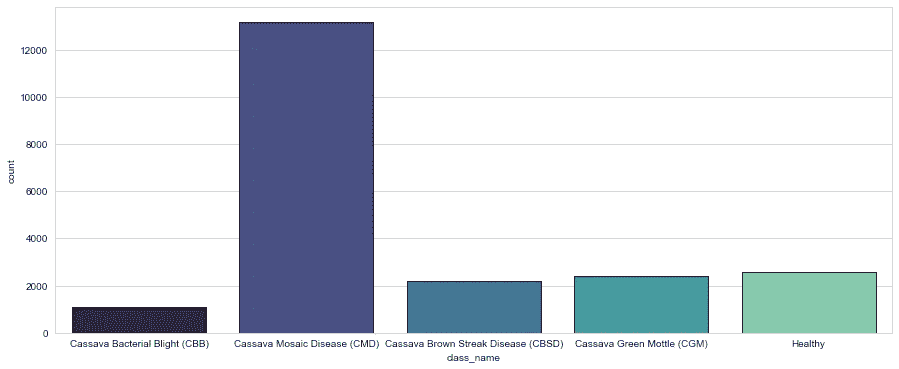

# 木薯叶疾病检测(2020)报告

> 原文：<https://medium.com/analytics-vidhya/cassava-leaf-disease-detection-2020-writeup-df6318248436?source=collection_archive---------15----------------------->

今年的木薯叶检测挑战是一个非常好的挑战，因为与去年只有 86 个团队参加相比，今年有超过 3500 个团队参加了比赛。我后来加入了这个挑战。我被安排在 1444/3900 队(前 38%)。这一次我错过了奖牌，但我很高兴幸存下来，这让我在排行榜上上升了 425 位。我希望记下在这次比赛中所做的一切和这次我所学到的一切。对我来说，将来参考这一点会很有用，对刚进入 kaggle 的新手来说也是如此，他们在如何处理一个给定的问题上有困难。所有的代码都可以在 Kaggle 笔记本[这里](https://www.kaggle.com/mohneesh7/cassava-2020-case-study-full-progress-keras-gpu)获得。那么，我们开始吧。

来源:https://plantvillage.psu.edu/topics/cassava-manioc/infos

# 问题陈述概述

作为非洲第二大碳水化合物供应商，木薯是小农种植的一种重要的粮食安全作物，因为它可以承受恶劣的条件。撒哈拉以南非洲至少 80%的家庭农场种植这种淀粉根，但病毒疾病是低产的主要原因。在数据科学的帮助下，有可能识别常见疾病，以便对其进行治疗。

现有的疾病检测方法要求农民寻求政府资助的农业专家的帮助，对植物进行视觉检查和诊断。这是劳动密集型、低供给和高成本的。作为一个额外的挑战，农民的有效解决方案必须在重大限制下表现良好，因为非洲农民可能只能获得低带宽的移动质量相机。

在这次比赛中，我们介绍了在乌干达的一次定期调查中收集的 21，367 张带标签图像的数据集。大多数图像来自农民拍摄花园照片的众包，并由国家作物资源研究所(NaCRRI)的专家与坎帕拉 Makerere 大学人工智能实验室合作进行注释。这是一种最真实地代表农民在现实生活中需要诊断的格式。

我们在本次比赛中的任务是将一幅图像分为以下五类:

*   木薯细菌性疫病(CBB)
*   木薯花叶病
*   木薯褐条病(CBSD)
*   木薯绿斑驳(CGM)
*   健康的

# 我解决问题的方法

现在我们已经了解了问题陈述是什么，我们知道这显然是一个分类问题(多类)。对于分类，我们可以在将每个图像转换为数组后使用许多机器学习模型，但 CNN 是图像的更好起点。

我尝试使用一个简单的 CNN 架构来解决每个图像分类问题，使用随机权重初始化，并使用 SGD 和内斯特罗夫动量。(如果你想了解内斯特罗夫的势头，去这里)这并没有给我带来任何好的结果。

## **我的实验流程**

*1* *。对数据做了一点 EDA，以了解阶级分布情况。*

训练数据集中的类分布

**关键见解:**

*   木薯花叶病(CMD)是构成总数据的 **61.5%** 的训练集中的优势类别。
*   数据集非常倾斜，因此可能需要对图像进行上采样或下采样。

**②*。*令人惊讶的是，这给出了 60.2%的准确度**

天真提交的公众评分

***3*** *。我最初打算不使用 K-Fold CV，因为它是资源密集型的，kaggle 对单个会话设置了 9 小时的限制。我决定使用 10%的数据作为验证集，其余的作为训练集。*

***4。起初我只是用了一些小的增强，但是一些大的增强会持续很长时间。我用相册库来扩充我的图片。***

***5。建模部分非常棘手，正如我之前说过的，我定制的 CNN 架构并不是很好，如果有什么不同的话，那就是学习过程太慢，效率太低。我想到了用迁移学习来解决问题。我用“imagenet”权重尝试了以下所有架构:***

*   ResNet50
*   VGG16
*   高效网络 B0 — B5

*在这些高效网络中，B4 是一个更好的选择，它以较短的训练时间提供了良好的结果。*

**6*。*** *使用的损失函数是* ***交叉熵*** *大部分情况下，我也尝试过使用双向逻辑损失(Google blog)。我同时使用了标签平滑，因为在训练集中有很多嘈杂的标签。要了解更多关于标签平滑的信息，看看我的代码或者点击这里***。**

****7。*** *我使用了起始学习率为 0.001 的 Adam 优化器，我没有使用任何学习率调度程序，而是使用学习率缩减器作为我的回调函数之一。**

****8。最终提交的作品是由经过训练的模型组成的软投票群体。****

**在这之后，我得到了 0.888 的 LB 分数，不错但不足以有竞争力。所以我用了 5 折 CV，重新做了上面所有的步骤。**

# *结果*

*我已经把我所有的结果以减价表的形式列出来了，请看下面。*

# ***我尝试过但没有成功的事情***

*   *冻结预训练模型的所有层，并尝试只训练额外的密集层，但没有成功，主要是因为数据集与 imagenet 数据不太相似。(这是我的想法，也是一些卡格勒人的想法)。*
*   *试图冻结批次归一化图层以保持原始平均值和标准偏差值，这大大打乱了模型。我对数据集使用了自定义的平均值和标准值，这也没有帮助。*
*   *尝试了那达慕优化以及(RMSprop 与内斯特罗夫势头)，而不是亚当。这并没有给亚当带来任何显著的改善。*
*   *尝试双向逻辑损失，这是最相似的交叉熵，所以我只是用 CE。*
*   *测试时间增加(TTA)是棘手的，因为许多竞争对手发现这非常有用，他们的准确性增加。我做了很少的旋转和翻转，这确实给了我很好的结果，但稍微重一点的 TTA 看到了 CV 分数的下降。我决定相信我的简历，并保持我的 TTA 非常轻。*
*   *这个比赛也允许使用 2019 年木薯叶数据集，但使用它没有任何帮助。*

# ***第一次学的东西***

*现在到了最重要的部分，我记下了在这一个月的奇妙旅程中学到的一切。*

*   *首先，Kaggle 是关于小的调整和实验的，PyTorch 在这种情况下非常有用，大多数 ka ggle 都使用 PyTorch。尽管 TF2 在行业中很突出，但在 kaggle 实验中使用它真的很难。TF 中新研究论文的实现没有 PyTorch 中的多。(正是因为这个原因，我开始学习 PyTorch)*
*   *我已经学会了使用 TPU 的基础知识，这大大提高了训练速度。*
*   *我学会了使用混合精度训练策略，这可以大大减少训练时间。*
*   *这是我第一次使用白蛋白进行增强，通常我使用内置的图像数据生成器。这是非常强大和易于使用的。*
*   *我了解了标签平滑和伪标签，以解决竞争中的噪声标签。*
*   *通过这次比赛，我开始了解高效网络，这是非常有趣的，现在 SOTA CNN 架构。deepmind 团队发布了一篇关于 NFnets 的论文，他们完全删除了批量标准化层，这似乎非常有趣，但不幸的是，我无法在这次比赛中尝试它们。*
*   *毫无疑问，我从许多 kaggle 笔记本和讨论线程中学到了太多的编码技术，我自己都记不清了。谢谢你们。*
*   *我知道简单的投票集合，但我知道软投票集合，你把所有的概率值加起来，然后取一个平均值，而不是选择最预测的类。(这真的很方便)。*
*   *我知道了记录你的实验结果的重要性，下次我将尝试 Neptune 或任何类似的服务。我开始时确实没有条理，这使我进一步的实验很糟糕。组织你的实验，节省几个小时的麻烦。*
*   *我了解到，在 Kaggle 信任你的简历分数和你的公众 LB 分数一样重要，因为比赛后的重组可能真的会让你付出代价，我见过有人从第三名跌至 30 名，从 1000 多名跌至 150 名。模型需要具有稳定性，而不是过度适应公共测试集。*
*   *我也研究了 CutMixup 纸，它很好，但是我没有机会在我的实验中使用它。*
*   *从每一个模特身上榨出每一盎司的准确性的诀窍是将她们全部集合起来，我在比赛结束时发现，人们使用 20-30 个模特来集合，以获得冠军。*
*   *我发现了一种新的清除 TF 变量的方法，使用**tensor flow . keras . back end . clear _ session()，***
*   *Kaggle 是一个非常好的学习这个领域新东西的地方。问任何问题，不管多么幼稚，肯定会有人回答并帮助你。*

# *结论*

*这次比赛丰富了我的知识。我想如果我有一个好的团队来迎接这个挑战，我会做得更好，但事实就是这样。下面你可以找到所有的内核链接:*

*   *完整组织案例研究:[内核 1](https://www.kaggle.com/mohneesh7/cassava-2020-case-study-full-progress-keras-gpu)*
*   *我没有记录任何结果的随机代码:[内核 2](https://www.kaggle.com/mohneesh7/cassava-leaf-disease-detection-lb-0-885-keras)*

# *编辑*

*我添加了 Streamlit 共享支持来部署这个模型。去[这里](https://share.streamlit.io/mohneesh7/cassava-kaggle-2020/main/Streamlit.py)自己测试一下。*

*那都是男生！*

*干杯！*