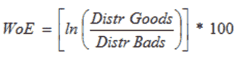

# SAS(贝叶斯编码器)中的分类特征编码

> 原文：<https://medium.com/analytics-vidhya/categorical-feature-encoding-in-sas-bayesian-encoders-by-suraj-saini-ffd83e7c32a5?source=collection_archive---------14----------------------->


## 什么是贝叶斯编码？

贝叶斯编码是一种在对分类变量进行编码时考虑类别内变异和目标均值的编码。这是一种有针对性的编码，有几个优点。例如，与其他编码方法相比，贝叶斯编码需要最少的努力。

在这篇博文中，我们将讨论不同的贝叶斯编码技术以及它们是如何工作的。

1.目标/均值编码

目标或均值编码是 Kaggle 竞赛中最常用的编码技术之一。

目标编码是相对于训练数据集中的分类类，用目标变量的平均值替换分类变量的每个类值。

因此，我们必须在 SAS Mean 编码宏中指定目标变量，如下面的代码所示。

查看这个链接，了解关于分类变量编码的更多信息。

*目标/均值编码的 SAS 宏*

```
%macro mean_encoding(dataset,var,target); 
proc sql; 
create table mean_table as select distinct(&var) as gr, round(mean(&target),00.1) As mean_encode 
from &dataset group by gr; create table new as select d.* , m.mean_encode  
from &dataset as d left join mean_table as mon &var=m.gr;
quit; 
%mend;
```

2.证据权重编码

证据权重(WoE)是一种用于区分好坏的分组技术的“**强度**的度量。开发这种方法主要是为了建立一个预测模型来评估信贷和金融行业的贷款违约风险。



如果 P(货物)/ P(货物)= 1，则 WoE 为 0。也就是说，如果结果是随机的。如果 P(Bads) > P(Goods)，那么一组中的赔率会是< 1, and the WoE will be < 0\. If, on the other hand, P(Goods) > P(Bads)，那么 WoE > 0。

WoE 非常适合逻辑回归，因为 logit 转换只是概率的对数，即(P(货物)/P(货物))。因此，通过在逻辑回归中使用 WoE 编码的预测因子，所有的预测因子都是按照相同的尺度准备和编码的。线性逻辑回归方程中的参数可以直接比较“实际定义在这里[编码](https://towardsdatascience.com/all-about-categorical-variable-encoding-305f3361fd02)。

*证据权重编码的 SAS 宏*

```
%macro woe_encoding(dataset,var,target); 
proc sql noprint; create table stats as select distinct(&var) as gr, round(mean(&target),00.1) as mean_encode from &dataset group by gr; quit; data stats; 
set stats; 
bad_prob=1-mean_encode; 
if bad_prob=0 then bad_prob=0.0001; 
me_by_bp=mean_encode/bad_prob; 
woe_encode=log(me_by_bp); 
run; proc sql noprint; 
create table new as select d.* , s.woe_encode 
from &dataset as d left join stats as s on &var=s.gr; 
quit; 
%mend;
```

3.概率比编码

“概率比编码”类似于证据权重，唯一的区别是使用了好的和坏的概率比。对于每个标签，我们计算 target=1 的平均值，即为 1 的概率(P(1))，以及 target=0 的概率(P(0))。然后，我们计算比率 P(1)/P(0)并用该比率替换标签。

我们需要为 P(0)添加一个最小值，以避免任何被零除的情况，在这种情况下，对于任何特定的类别，都没有 target=0。查看此链接了解更多信息。

*概率比编码的 SAS 宏*

```
%macro probability_encoding(dataset,var,target);
proc sql noprint; create table stats as select distinct(&var) as gr, round(mean(&target),00.1) as mean_encode from &dataset 
group by gr; 
quit; data stats; 
set stats; 
bad_prob=1-mean_encode; 
if bad_prob=0 then bad_prob=0.0001; prob_encode=mean_encode/bad_prob; 
run; proc sql noprint; 
create table new as select d.* , s.prob_encode 
from &dataset as d left join stats as s on &var=s.gr; 
quit; 
%mend;
```

*收尾*

分类特征编码是为机器学习模型清理数据的重要部分。然而，每种方法在不同的环境下工作，所以了解贝叶斯分类下的不同技术是很重要的。

如果你想看看编码是如何在 SAS 环境下运行的，你可以在我的 GitHub 页面[这里](https://github.com/Selerity/blog-categorical-feature-encoding-bayesian)找到所有的 SAS 宏定义代码。

*原载于 2021 年 2 月 19 日 https://seleritysas.com**的* [*。*](https://seleritysas.com/blog/2021/02/19/categorical-feature-encoding-in-sas-bayesian-encoders/)