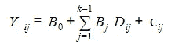

# 使用 R 的分类变量回归

> 原文：<https://medium.com/analytics-vidhya/categorical-variable-regression-using-r-c6e9c973009c?source=collection_archive---------3----------------------->

将观察值分类的变量是分类变量(也称为因子或定性变量)。他们有有限的数量，称为水平，不同的价值。例如，人的性别是一个分类属性，可以有两个层次:男性或女性。

在统计学中，分类变量是这样一种变量，它可以根据某个定性属性，根据有限且通常固定数量的可能值之一，将每个人或其他观察单位分配到某个组或名义类别。分析回归涉及数字变量。因此，当研究人员想要在回归模型中使用分类变量时，需要额外的步骤来使结果可解释。

可能正好取两个值的分类变量称为二元变量或二元变量；伯努利变量是一个重要的特例。多同态变量被称为具有两个以上可能值的分类变量。分类变量总是被认为是多同态的，除非另有说明。这些步骤中的分类变量被重新编码到一组单独的二进制变量中。这种重新编码被称为“虚拟编码”,并导致形成称为对比度矩阵的表格。

## 虚拟编码

作为一种分类手段，使用虚拟变量是因为它们根据特征将整个样本分成不同的组，并隐含地允许对每个子组进行单独的回归。取值为 0 和 1 的虚拟变量的组成员是虚拟编码技术。也就是说，特定组中的成员资格被编码为 1，其中 0 被编码为组中的非成员资格。但是，将 1 和 0 值分配给组是任意的。被赋予零值的类别有时被称为基础、基准、功效、比较或排除类别。为了逃离虚拟变量坑，虚拟变量的数量必须小于每个定性变量的划分或分类的数量。与虚拟变量相关的系数必须始终与分配零值的基础或参考类别相关联。如果一个模型有多个类别的几个定性变量，那么添加虚拟变量会消耗大量的自由度。

回归模型中的虚拟解释变量用符号“D”表示，而不是通常的符号“X ”,以强调我们处理的是定性变量。使用虚拟编码，将一个定性变量作为自变量与 k 个组或类相关的回归模型可以描述为

在哪里

Yij =组中受试者 I 的因变量得分

B0=截距，代表所有虚拟变量上编码为 0 的组的平均值

K =虚拟自变量的类别或分类数

Bj=与𝑗 𝑡ℎ组相关的回归系数，它代表相应虚拟变量上编码为 1 的组的平均值与所有虚拟变量上编码为 0 的组的平均值之间的差异。

Dij=分配给𝑗 𝑡ℎ组受试者𝑖 𝑡ℎ的虚拟变量的数值

ij=与𝑗 𝑡ℎ组中的𝑖 𝑡ℎ受试者相关的误差

## 两级分类变量

我们将使用[汽车套餐]工资数据收集，它为助理教授、副教授和学院教授提供 9 个月的学术工资。为了在预测变量(x)的基础上预测结果变量(y)，回归方程可以简单地写成 y = b0 + b1*x。回归β系数为 b0 和 b1，分别代表截距和斜率。假设我们想研究男女之间的工资差距。

> 图书馆(tidyverse)
> 
> 数据("薪金"，package = "car ")
> 
> sample_n(薪金，3)

我们可以基于性别变量构建一个新的虚拟变量，该变量的值为:

*   1 如果一个人是男性
*   如果是女性，则为 0

并且该变量在回归方程中用作预测值，导致以下模型:

*   如果人是男性，b0 + b1
*   bo 如果人是女性

您应该将系数解释如下:

*   b0 是女性的平均工资，
*   b0 + b1 是男性的平均工资，
*   b1 是男性和女性之间的平均工资差异。

以下示例通过对[car package]工资数据集合计算简单的线性回归模型，对男性和女性之间的工资差距进行建模。r 自动构造虚拟变量:

> 型号
> 
> summary(model)$coef

The function contrasts() returns the coding used by R to construct the dummy variables:

> contrasts(Salaries$sex)

A dummy variable will be established by R that takes on a value of 1 if the sex is male, and 0 otherwise. The decision to code males as 1 and females as 0 (baseline) is arbitrary and does not affect the calculation of the regression, but does modify the coefficients’ interpretation.

You can set the baseline group for males using the relevel() function as follows:

> Salaries %
> 
> mutate(sex = relevel(sex，ref = "Male "))
> 
> 模型
> 
> 总结(模型)$coef

或者，我们可以构建一个虚拟变量-1(男性)/ 1(女性)，而不是 0/1 编码方案。在模型中，这会导致:

*   b0 — b1，如果人是男性
*   如果人是女性，b0 + b1

因此，如果分类变量编码为-1 和 1，那么如果回归系数为正，则从编码组中减去它作为-1，并添加到编码组中作为 1。如果回归系数为负，则加法和减法相反。

对于具有大量级别的分类变量，将一些级别组合在一起可能会有所帮助。