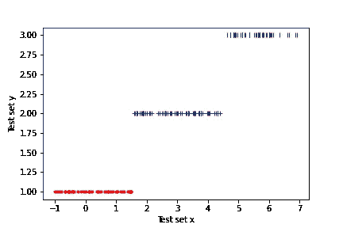

# 分类变量:如何编码，为什么？

> 原文：<https://medium.com/analytics-vidhya/categorical-variables-how-to-encode-them-and-why-cf0e6f571821?source=collection_archive---------3----------------------->

## 对背后现实的一瞥

来源:谷歌图片

## 摘要:

分类变量可以通过顺序(1，2，3，…)或一键(001，010，100，…)编码方案进行编码。对于不存在任何相关排序的分类变量，例如(男性、女性和其他)，在任何意义上没有一个大于另一个，使用序数编码可能会导致问题，因为(1，2，3)中固有的排序可能会进入计算中。我们将试图找出这个问题的真实程度，它对特征变量和响应变量是否有相似的影响，以及造成这种情况的原因是什么。在这个过程中，我们希望能对背后的现实有所了解。所以系好你的安全带！

## 问题:

来自谷歌图片

我们将尝试回答两个具体的问题-

1.  假设一个包含 3 个无序类的响应变量是有序编码的(1，2，3)。当类号映射变化时，模型输出是否不同？
2.  当分类特征变量被普通编码时，会出现类似的效果吗？

## 问题 I —响应变量的情况:

从现在开始的 1、2、3 级将分别称为红、蓝、绿；它们也将用相同的颜色绘制。它们分别编码为 1、2 和 3。

让我们有一个在范围(-1.0，7.0)上均匀分布的特征变量 *x* 。对于任何一个 *x* ，红色、蓝色和绿色都有可能发生。下面是在 *x* 范围内各个等级的概率分布。

*x* 上的分类概率分布

我们生成遵循这个概率分布的( *X_train，Y_train* )。训练集如下-

训练集数据

我们根据这些数据训练一个线性回归模型并进行预测( *X_test，Y_testPredict* )。以下是我们得到的结果-

测试集预测

因此，我们看到线性回归模型很好地捕捉到了这种分布。现在保持 *X_train* 、 *X_test* 和类别概率分布不变，我们只改变编码方案——红色-2、蓝色-1 和绿色-3。

随着这一改变的引入，训练集( *X_train，Y_train* )现在看起来如下

具有改进编码 R-2，B-1，G-3 的训练集

应用线性回归，测试集( *X_test，Y_testPredict* )现在看起来如下

具有修改的编码 R-2、B-1、G-3 的测试集

现在，您可以看到，与之前的编码方案相比，该模型显示的结果非常差，而且完全不同。

## 问题 2 —特征变量的情况

现在，我们将引入一个非常简单的观察，而不是对特征变量进行类似的研究，这将引导我们获得有价值的见解(根据上面的数字，你们中的一些人可能已经猜到了)。

假设我们有一个分类特征变量，分类标签分别为红色、蓝色和绿色。对应的 *Y* 值为 4，5，6。类别标签到数字的映射是——红色-1、蓝色-2 和绿色-3。整个数据集看起来如下-

简单的数据集

这些数据在绘制时—

编码方案 R-1、B-2、G-3(看 x 轴)

该图显示，在这种情况下，线性回归会做得很好。

使用红色-2、蓝色-1 和绿色-3 的不同编码方案，数据集将是—

编码方案 R-2、B-1、G-3

它的情节会像这样—

编码方案 R-2、B-1、G-3

线性案例现在变成了非线性，显然线性回归将无法捕捉到这一点。**特征和反应也是如此——改变编码惯例会引入非线性。**再次检查 R-2、B-1、G-3 编码方案的( *X_train，Y_train* )图，以确保响应变量也发生了类似的情况。

## 结论——抵抗运动

因此，当使用顺序编码时，由于不同的编码方案，线性模型可能变成非线性的。

现在，为了捕捉非线性，我们需要我们的模型更加灵活。这种灵活性是如何实现的？

1.  要么我们的模型本身是非线性的，例如 QDA、多项式回归等。
2.  或者我们在线性模型中有更多数量的特征——这与使用线性回归时对分类变量使用一次性编码是一样的(因为较低维度中的非线性可以在较高维度中变得相对更线性)。** *这就是在线性回归中使用多项式特征的作用。*

> **因此，当使用线性模型时，普通编码分类变量可能会导致问题(如果您不幸选择了一种编码约定，即使在良好的线性模型中也会引入糟糕的非线性)。同样，引入“独热”编码具有爆炸特征数量的潜在风险，并因此导致过度拟合或破坏模型的可解释性。因此，在线性模型中，两者之间有一个权衡；哪种方案更好取决于手头的具体情况，只能通过实验来决定。**
> 
> **对于非线性模型，顺序编码可能通过，因为它们具有捕捉非线性的固有能力。虽然，即使这样也应该通过实验运行来测试，因为我不认为有一个通用的分析证明来涵盖所有不同的场景。**

因此，我们的研究得出了一个可能有价值的结论。我希望这是一次富有成果的旅行。谢谢，再见，下次见。

**PS:** 笔记本的代码(包含所有的情节和生成数据集的方法论)可以在下面的 [*github 链接*](https://github.com/AnirbanChakraborty06/StatisticalLearning---QA-and-demos-/blob/main/Question%208%20How%20ordinal%20encoding%20of%20categorical%20variable%20for%20more%20than%202%20classes%20affects%20model%20output.ipynb) 中找到。