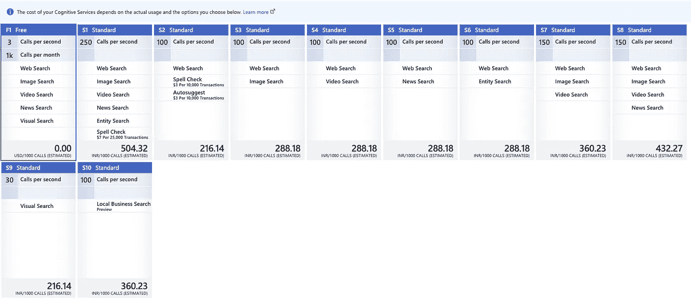
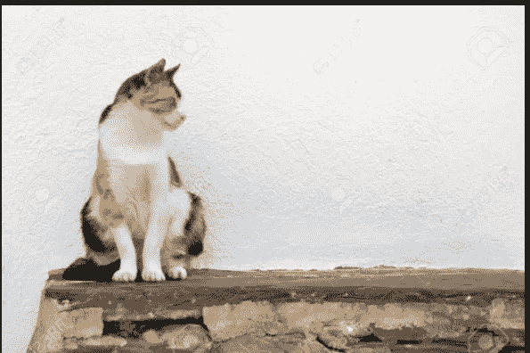
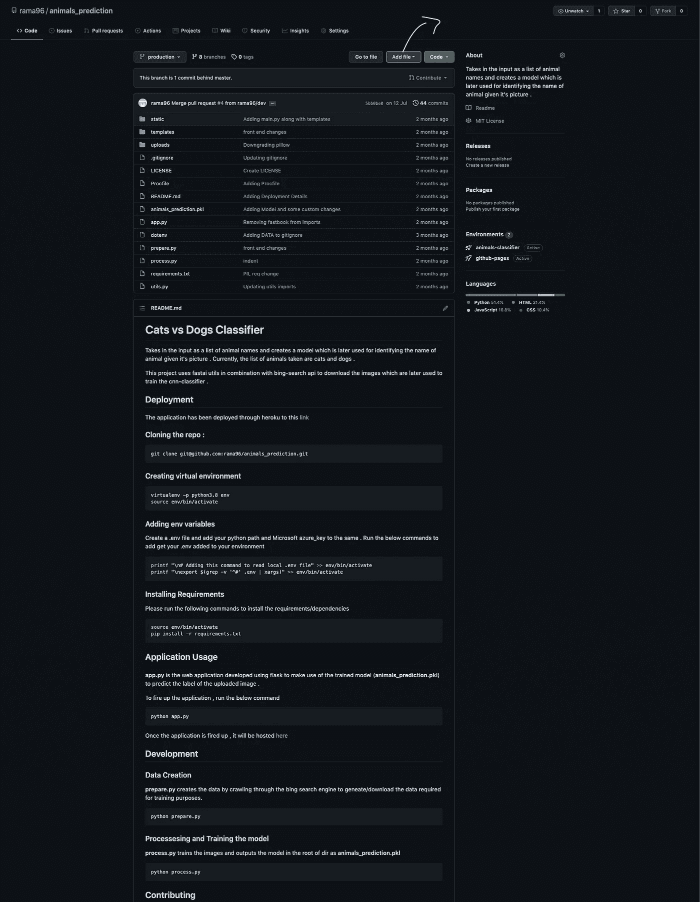
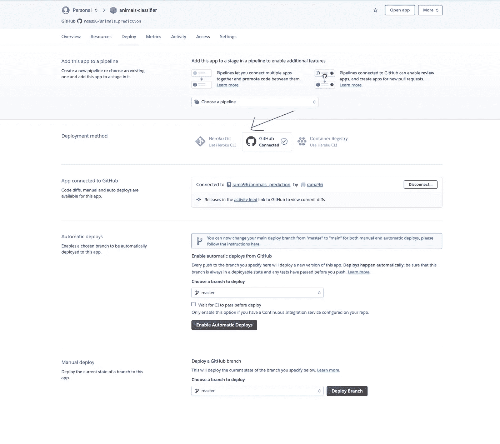
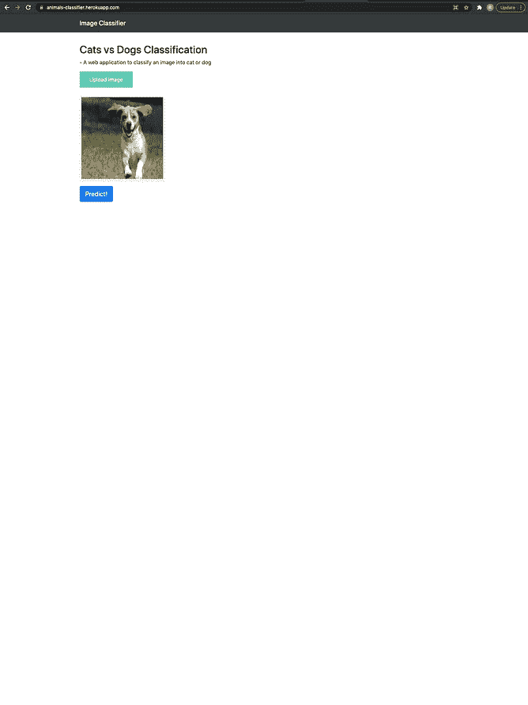
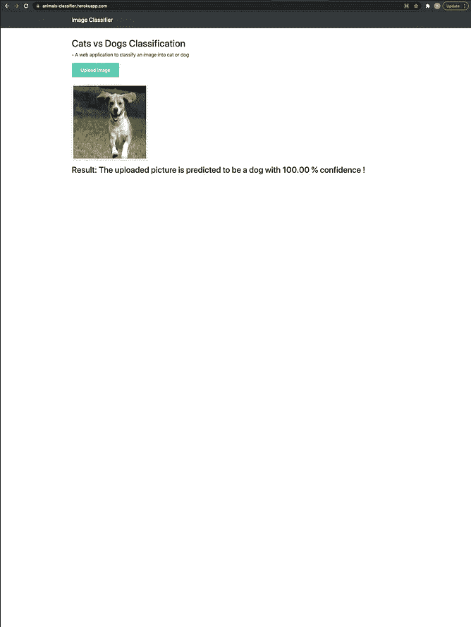

# 使用 fastai 和 flask 的猫和狗分类器

> 原文：<https://medium.com/analytics-vidhya/cats-vs-dogs-classifier-using-fastai-and-flask-44bba2f3889f?source=collection_archive---------9----------------------->

我在 fastai 上读了很多东西，尤其是在过去的几周里，我不得不说，这个图书馆里有一些非常有趣的东西。感谢**杰米·霍华德**和**拉切尔托马斯**和 fastai 社区将材料和最先进的技术公之于众，让每个人都可以使用**让神经网络再次变得不酷**😉**。**

这个特别的博客(许多博客中的第一个)从头开始创建一个狗和猫的分类器。构建任何数据科学应用程序最困难的部分之一是收集训练和测试数据集。当然，有标准数据集样本，如 Titanic、iris、Mnist 等，可用于测试不同模型的性能。但是，当您想要为现实世界中的特定用例从头开始构建模型时，这可能是最困难和最耗时的部分。幸运的是，我们有构建通用应用程序的完美解决方案，从人类的角度来看，它也非常直观。假设你想让一个孩子明白一只猫或一只狗是什么样子，你会怎么做呢？最自然的答案是用谷歌搜索猫和狗的图片，然后给孩子看，向他们解释将它们归类到各自标签的思维过程。我们，在这个博客中，将遵循完全相同的东西来建立一个分类器。我们将从搜索引擎中提取图像结果，并将其存储为输入数据，稍后将用于训练我们的分类器。

对于这个特殊的用例，我们将使用 bing 作为我们的搜索引擎。你需要注册 azure cognitive services(如果你是学生，它是完全免费的，如果不是，你需要输入你的信用卡信息，但第一年左右不会收费)，之后你就可以访问 bing 搜索关键字。

# 必应搜索图片 API

以下是 Bing seach api 的定价层。如你所见，它可以让你每月免费拨打 1K 电话，这比任何人在这种情况下所需要的都要多。(点击[此处](https://docs.microsoft.com/en-gb/rest/api/cognitiveservices-bingsearch/bing-images-api-v7-reference)查看 api 文档)



一旦我们有了密钥，我们就可以进入如何使用这个 API 提取图像的编码部分。我们将使用关键字 ***猫*** 和 ***狗来*** 抓取搜索结果。

我们应该做的第一件也是最重要的事情是从 fast ai 导入所有预定义的助手函数。

```
pip install -Uqq fastbook
import fastbook
fastbook.setup_book()import requests
from fastai.vision.all import *
from fastai.vision.widgets import *
from pathlib import Path
```

# **使用 Bing 下载图像**

然后我们使用 bing 的 API 为我们的模型下载所有的猫和狗的图片。幸运的是， ***请求*** 是这里唯一有用的库。fastai 有自己的搜索 bing 图片的功能，但由于某种原因，它有一些错误(最新版本已经修复了这个问题)。所以我做了一些研究，并创建了自己的助手函数来实现这个功能。

上面的函数返回一个 dict，其中包含了使用给定关键字进行搜索的所有信息。我们最感兴趣的部分是这些图片的 url。这可以使用**results . attr got(' content URL ')**来访问，其中 **results** 是函数 **custom_search_images_bing 的输出。**

我做了一些助手函数，创建一个名为 **DATA** 的文件夹，以类别名称( **animals)** 和子文件夹作为标签名称( **cat** 和 **dog** )根据标签将图像下载到各自的子文件夹中。

功能**download _ relevant _ images**将图像下载到这些子文件夹中，并且 **clean_label_images** 检查文件夹中损坏的图像并将其从文件夹中删除。

瞧吧！我们现在已经准备好了训练/微调我们的模型所需的数据，并准备好了！

# 数据处理和训练模型。

为了使用 fastai 库训练一个模型，我们需要给一个**数据加载器**对象作为模型的输入。**数据加载器**本质上是一个存储**数据加载器**对象(**训练**和**有效**)的类，它帮助模型在**训练**子集上训练，并通过使用有效子集进行交叉验证来检查性能。如果我们要在没有 fastai 的情况下这样做，我们通常会使用

`**from sklearn.model_selection import train_test_split**`

但是 fastai 有预定义的库，这些库在创建一个**数据加载器**对象时自动完成所有这些工作。那么我们如何创建一个**数据加载器**对象呢？

要将我们下载的数据转换成一个`DataLoaders`对象，我们至少需要告诉 fastai 四件事:

我们正在处理哪些类型的数据？

如何获取物品清单？

这些物品怎么贴标签？

如何创建验证集？

我们使用数据块 API 来指定上述内容，以创建一个**数据加载器**对象。

```
db = DataBlock( 
blocks=(ImageBlock, CategoryBlock), 
get_items = get_image_files, 
splitter = RandomSplitter(valid_pct=0.2, seed=42), 
get_y = parent_label, 
item_tfms=Resize(128))
```

**块:**将输入作为元组(数据结构(表格、图像等)，数据类型(分类、连续) )

**get_items** :用来告诉数据块如何访问我们创建的数据。 **get_image_files** 是一个预定义的 fastai 函数，它将输入作为 **Path** 变量，输出一个包含图像位置的 **Path** 变量列表。

**拆分器:**用于指定列车有效拆分

**get_y :** 我们到底要如何映射带有标签的图像**？** parent_label 是另一个将标签作为 parent_folder 名称的函数

**item_tfms :** 用于将所有下载的图像转换为 128x128 像素，以保持一致性。

现在我们有了一个数据块，可以将其转换为 dataloaders 对象，并输入到模型中进行训练。

但是，等等，我们还可以对图像做些什么来提高模型的性能吗？

# **数据扩充**

不同的图像可能在不同的位置包含图片中的主要项目。



猫图片

上面是两张不同的猫的照片。左边的那只猫位于左侧，右边的那只稍微偏向右侧。由于这些变化大部分出现在图像中，因此随机裁剪图像以让模型知道不管猫出现在哪里都是有意义的，图片仍然应该被标记为猫。这也有助于我们用有限的数据创造更多的数据点。这是通过 **RandomResizedCrop** 实现的


RandomResizedCrop 的示例

```
db = db.new(        
item_tfms=RandomResizedCrop(224, min_scale=0.5),        batch_tfms=aug_transforms()
)dls = db.dataloaders(path)
```

**aug _ transforms**指的是创建我们输入数据的随机变量，使它们看起来不同，但实际上并不改变数据的含义。常见的图像数据增强技术的例子有旋转、翻转、透视扭曲、亮度变化和对比度变化。事实证明，这些东西在为模型提供信息方面帮助很大。

一旦我们指定了如何创建 dataloaders 对象所需的细节，我们需要做的就是指定存储输入数据的路径。

# **建立模型**

对于新手或刚刚开始深度学习的人来说，只使用特定用例的数据从头训练模型有很多误解。

原来有一种更简单的方法来训练一个模特。

当您建立一个模型时，我们使用随机权重初始化，定义一个损失函数，并通过使用我们通过微分损失函数获得的梯度改变权重来保持训练模型。随着时间的推移，这需要花费大量时间来建立准确性，并且在使用小数据集时也可能容易出错。相反，我们可以使用**迁移学习**的概念，使用为类似目的制作的模型所使用的架构和权重，用适合我们用例的标签替换最后一层，并针对 **n 个时期再次训练它。**历元使模型能够根据从损失函数获得的梯度和输入的学习率更新权重。

**cnn_learner** :预定义的 fastai 函数，用于使用 imagetype 数据训练模型(使用卷积神经网络的概念)。这里使用的预训练模型是 resnet18。

在这里的 **process_and_train.py 中，**我们创建一个 datalaoders 对象，并将其输入到模型中( **learn** )。然后，我们使用 learn.fine_tune(4)使用 4 个时期的新数据再次训练模型，然后以“animals_prediction.pkl”的名称保存模型。请注意，对于这个特定的用例，我们有一个度量= error_rate，它基本上是我们在输入的所有图像中出错的分类数。在运行时，我们得到了超过 99%的准确率，这是非常好的。

# 评估模型

我们还可以通过使用以下命令构建混淆矩阵来评估模型。

```
interp = ClassificationInterpretation.from_learner(learn)
interp.plot_confusion_matrix()
```

其中 learn 是函数 **train_model 的输出。**使用以下命令，我们还可以看到模型感到难以判断或损失最大的图像。

```
interp.plot_top_losses(5, nrows=1)
```

基于这些，你可以选择删除这些图像，如果这些看起来没有增加我们的模型创建的价值。您还可以检查图像的错误分类(因为它是直接从搜索引擎中选取的)并手动纠正它们。在这个过程中，ImageClassifierCleaner(learn)可能会非常方便。

# **模型到应用**

我们现在已经建立了一个模型，可以成功地区分猫和狗。但是工作只完成了一半。

你如何让你的同事也能看到你所做的工作？


当然是通过互联网！我们现在必须制作一个 web 应用程序，它可以托管在一个网站上，每个人都可以在那里上传一张猫/狗的照片，我们输出带有所需指标的预测标签。

我们将模型存储为“animals_prediction.pkl”。这是预测图片类别所需的主要信息。您可以使用以下命令预测任何图像的类别。

```
learn_inf = load_learner('animals_prediction.pkl')
learn_inf.predict(path_to_img)
```

**load_learner :** 加载存储的模型，稍后使用 **learn_inf.predict() (** 输出预测的标签和概率度量)来预测上传图像的标签

有很多方法可以将模型转化为应用程序。在本练习中，我们使用了 flask，这是一个用于构建 web 应用程序的 python 库。

该应用中使用了 3 个函数(其中 2 个与`@app.route()`相关)

**model_predict() :** 这个函数非常简单，简单地将输入作为 img_path 和 model_path，输出一个带有标签`pred`和概率值为`prob_value`的字符串。

这是我们正在构建的网站的主起始页(姑且称之为**基页**),由 html 文件**index.html 支持。**该网页提供了一个上传按钮，用户可以将自己系统中的图像上传到网络服务器以使用该应用程序。一旦用户点击按钮`Predict!`，它会将用户重定向到**基页/预测**以及输入的图像。这就是 **upload()函数**发挥作用的地方。

**upload() :** 它接收输入的图像，将其本地存储在服务器中(以 test.jpg 的名字命名)，然后使用该图像作为 **model_predict()的输入，**获取带有标签和概率的输出字符串，并将其打印在 **basepage** 中的上传图像下。

如果您在终端中运行以下文件，您可以在浏览器中的链接([http://127 . 0 . 0 . 1:5000/')](http://127.0.0.1:5000/'))下签出本地托管的应用程序。

对于静态和 html 文件，检查我的 git repo [这里](https://github.com/rama96/animals_prediction/tree/production)

要在全球范围内托管它，你必须把这个库上传到 Github 上(如果你没有的话就注册)。您可以通过图片中标记的添加文件选项来上传存储库。



一旦将文件上传到 git 中，您就必须通过使用命令使用`pipreqs`来冻结需求

```
pipreqs path/to/python_project
```

这将创建一个 requirements.txt 文件，该文件将让服务器(用于创建网站)知道在运行应用程序之前需要安装哪些库。您还应该创建名为`**Procfile**` 的文件，该文件用于与包含应用程序的 web 服务器通信。

现在剩下的就是在 heroku 中进行部署(如果您没有 heroku 帐户，请创建一个)。

点击 heroku 仪表盘上的`create new app`并为其命名。打开你创建的应用程序，点击`Deploy`选项。您应该能够看到将您的 git repo 与 heroku 链接的选项。



我建议进行手动部署，只是因为我不想让我的提交直接反映在我的应用程序上，除非我允许它这样做，或者说，如果你未经检查就提交了错误的代码，在部署后很难恢复。一旦部署完成，*瞧！你可以在[https://your-app-name.herokuapp.com/](https://animals-classifier.herokuapp.com/)查看你的应用。*



关于 Web 应用程序如何工作的演示。

你可以在这里查看我为博客[开发的应用程序](https://animals-classifier.herokuapp.com/)。

希望这篇文章对你有所帮助。在我未来的博文中，我们将深入探讨不同的概念和改进。

—等等，更多有趣的内容即将推出。直到那时再见😉

如果你喜欢读这篇文章，请喜欢并分享这个回购和博客。

*附注——如果你感兴趣，请在此处查看代码*[](https://github.com/rama96/animals_prediction/tree/production)**(**如果你觉得有用，别忘了 to⭐回购*😉)*