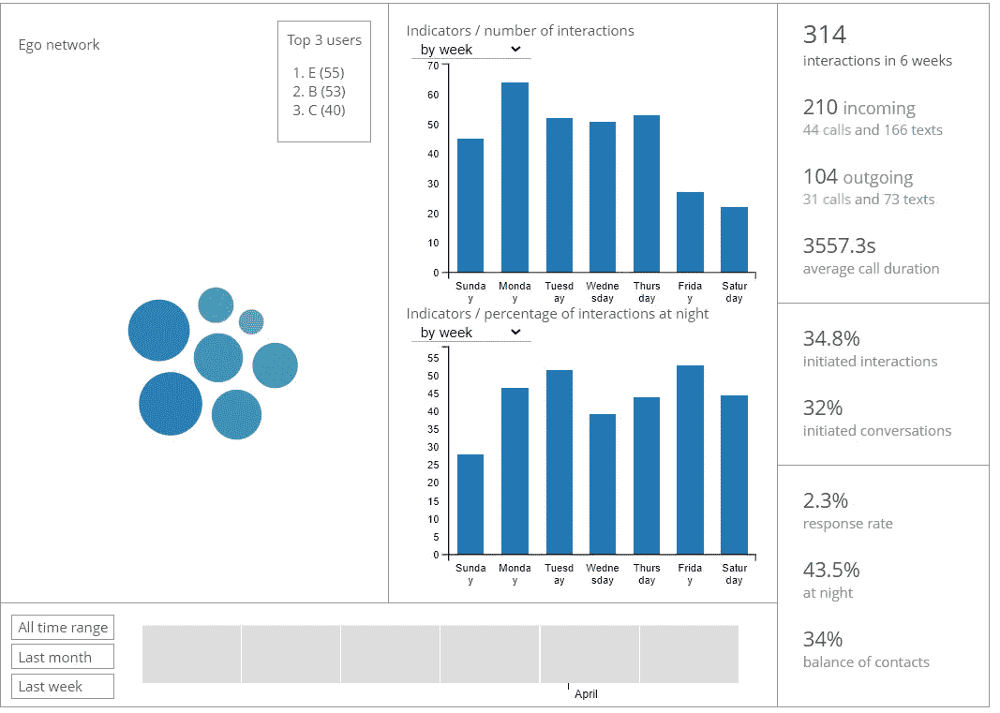

# CDR 数据分析—位置近似值

> 原文：<https://medium.com/analytics-vidhya/cdr-data-analysis-location-approximation-18fe00e616fe?source=collection_archive---------6----------------------->


你可能想知道 CDR 数据分析是什么意思。**通话** **明细** **记录**数据最初是电信公司用来监控用户的使用情况。许多研究人员和开发人员试图通过分析呼叫记录、手机信号塔数据记录和消息数据记录等数据集的组合，将这些数据用于许多新的研究项目。当涉及到客户行为时，数据科学家使用各种库和工具来最大化分析数据过程的效率，这些数据在行业中具有很高的价值。

# Python 数据分析库和工具简介

就数据科学和数据分析而言，Python 是世界上使用最广泛的编程语言之一。因此，这种语言具有可读性很强的编码方法，完成某项任务所需的行数最少，从而节省了时间。

有许多基于 Python 语言的数据分析工具。但是，在分析呼叫详细记录(CDR)数据的过程中，需要一些工具和库。


## Numpy

Numpy(数值 python)包用于 Python 矢量化数据的科学计算。使用该库可以实现数学和逻辑运算、向量形状的创建和操作、与线性代数相关的运算。

使用 numpy 代替普通 python 数组和对象的一些优点是，

*   使用固定大小数组的 numpy 数组最小化内存使用。
*   由于矢量化数组和多维数组操作以及数据过滤操作，最大限度地减少了花费在数据分析过程上的时间。

Numpy 代码库:[https://github.com/numpy/numpy](https://github.com/numpy/numpy)

numpy(PyPI):[https://pypi.org/project/numpy/](https://pypi.org/project/numpy/)

Numpy 库需要使用 pip 命令安装到 python 工作环境中。

```
pip install numpy
```

运筹学

```
pip3 install numpy
```

然后必须将其导入 python 工作环境。

```
import numpy as np
```

所有基于 numpy 的分析都可以使用“np”别名来执行。

```
np_arr = np.array(list)
```


## 熊猫

Pandas (Python 数据分析)库是一个快速、强大、灵活、广泛使用的开源数据分析工具，为 Python 语言编写，用于数据操作和分析。

熊猫官网:[https://pandas.pydata.org/](https://pandas.pydata.org/)

熊猫代码库:[https://github.com/pandas-dev/pandas](https://github.com/pandas-dev/pandas)

熊猫(PyPI):[https://pypi.org/project/pandas/](https://pypi.org/project/pandas/)

Pandas 库需要使用 pip 命令安装到 python 3 工作环境中。

```
pip install pandas
```

然后它必须被导入到 python 工作环境中。

```
Import pandas as pd
```

Pandas 能够读取 csv、tsv、xlsx、json 类型的文件，并使用内置二维数据结构的数据帧处理数据。同样，图书馆使用熊猫系列，一维数组可以存储任何类型的数据。

```
pd.read_csv(“filename”) # read csv files 
pd.read_json(“filename”) # read json files
```

使用 vanilla python 构建的数据对象可以转换为 pandas 数据帧或序列，然后可以与库提供的数据分析功能一起使用。

```
pd.DataFrame(list)
pd.Series(list)
```



## 袋狸

Bandicoot 是一个开源的 python CDR 数据分析工具，它包含许多内置函数来分析给定的手机元数据。该库能够在使用 [React](https://reactjs.org/) 前端框架构建的用户界面中可视化用户数据。

bandicoot 主要致力于提供分析个人用户数据的功能，这些数据可以分类为个人特征、空间特征和社交网络。每个类别包含一组可以使用用户对象访问的功能。

Bandicoot 官网:【https://cpg.doc.ic.ac.uk/bandicoot/ 

Bandicoot 代码库:【https://github.com/computationalprivacy/bandicoot 

bandicoot(PyPI):[https://pypi.org/project/bandicoot/](https://pypi.org/project/bandicoot/)

Bandicoot 库需要使用 pip 命令安装到 python 工作环境中。

```
pip install bandicoot
```

然后必须将其导入 python 工作环境。

```
import bandicoot as bc
```

# 库在位置逼近过程中的使用

常见的 CDR 数据文件有 txt、csv、json、xlsx 等文件类型。数据分析工具必须能够读取上述文件类型，以便处理相关数据。

不同的库在数据分析过程中提供不同类型的功能。并且通过组合两个或更多库的不同功能，我们可以实现我们想要的所需 CDR 分析功能。

说到 numpy 库，它并不是专门为 CDR 数据分析过程开发的，它提供了许多功能，如从文件中读取数据和写入文件，将数据数组转换为 numpy 数组，以及处理 n 维数组。

*   使用 genfromtxt()方法打开 csv 文件

```
Numpy_array = np.genfromtxt(“file.csv”, 
                            delimiter = “,”, 
                            skip_header=1)
```

*   另存为 txt 和 csv 文件

```
np.savetxt(“file.txt”, np_array)
np.savetxt(“file.csv”, np_array)
```

*   将列表转换为 numpy 数组

```
np_array = np.array(python_list)
```

*   将 numpy 数组转换为列表

```
python_list = np_array.tolist()
```

*   根据条件筛选数组中的项目。

```
arr_user1  = arr[arr == user1_number]
```

尽管 numpy 是 python 中处理 n 维数组的有效方法，但对于处理包含不同数据类型(例如 int 和 String)的数组，该库并不是一个好的解决方案。

然而，Pandas 库内置了在同一数组中处理不同数据类型的功能。在读取给定的文件后，数据将被处理并转换成数据帧。此外，数据打印、列删除、行过滤、数据帧追加、数据帧合并、切片和连接是 Pandas 库提供的其他重要功能。

对于 Bandicoot，该库能够读取不同类型的数据文件、清理数据、处理丢失的数据，并计算给定用户的家庭位置。然而，该库的一个缺点是，数据文件必须是特定的格式。示例数据文件在 bandicoot [演示](https://cpg.doc.ic.ac.uk/bandicoot/demo/)教程中提供。

# 选择合适的数据集

选择合适的数据集是位置计算过程中的一个重要部分。当计算数据以获得家庭和工作地点的近似值时，以下两个数据集是必不可少的。

## 呼叫数据集

当选择呼叫数据集文件时，用户、时间戳和天线 id 列是必不可少的，因为需要用户手机号码来识别相关用户，时间戳根据用户的工作开始时间、工作结束时间对记录进行分类，天线 id 获得记录的相关纬度和经度。


示例呼叫数据集文件的图像

## 天线数据集

选择天线数据集文件时，纬度和经度列是必不可少的，因为位置是使用纬度和经度计算的。此外，天线 id 应该包括在数据文件中，因为每个呼叫记录都与一个天线 id 相关联。


天线数据集文件示例的图像

# 接近用户的家和工作地点

以下方法可用于计算使用 Pandas 的选定用户的大致家庭和工作位置。

通过使用 read_csv("filename ")方法读取 csv 文件来获取呼叫和天线数据帧

```
call_df = pd.read_csv("calls.csv")
antenna_df = pd.read_csv("antennas.csv")
```

通过使用 drop(array_of_col_names)方法删除列来获取经过筛选的相关数据框。

```
c_drop = ["direction", "duration", "cost"]
call_df.drop(c_drop, inplace=True, axis=1)
```

为用户定义用户联系号码、工作开始时间和工作结束时间。根据定义的时间段计算家庭和工作地点。

```
user1_no = 7123456789
work_start_time = 7    #7am
work_end_time = 19     #7pm
```

在计算中，如果用户在工作，则 work _ start _ time < = timestamp < work _ end _ time。同样，如果上述陈述为假，则用户在家。

根据所选用户联系号码过滤呼叫数据框的行，并获取与用户相关的所有记录，如 user1_call_records_df。

```
filter1 = call_df[call_df['user']==user1_no ]
filter2 = call_df[call_df['other']==user1_no ]
user1_call_records_df = filter1.append(filter2)
```

通过基于相同的 antenna_id 对两个数据帧对象进行交集/内部连接，将呼叫和天线数据帧连接起来。

```
call_antenna_df = pd.concat([user1_call_records_df, antenna_df], axis=1, join='inner')
```

用给定的工作开始和结束时间检查时间戳，如果用户通话记录时间在工作时间段内，则返回“真”，否则返回“假”。该方法可以根据添加的 csv 文件中的时间戳列而有所不同。

```
def check_timestamp_for_work(timestamp):
    day = timestamp.day
    time = timestamp.time
    if day > 5:
        return False
    else:
        if work_end_time >= time.hour > work_start_time:
            return True
        else:
            return False
```

使用 call_antenns_df 数据帧计算家庭和工作位置。在下面的函数中，具有最大记录计数的地理位置是针对家庭和工作位置分别计算的，并以[latitude，longitude]的形式返回一个数组。

```
def compute_home_location(call_antenna_df):
    location_dict = {}
    for record in call_antenna_df.itertuples():
        at_home = not(check_timestamp_for_work(record.timestamp))
        if at_home:
            location =       
                    str(record.latitude)+","+str(record.longitude)
            if location in location_dict:
                location_dict[location] += 1
            else:
                location_dict[location] = 1
    if len(location_dict) > 0:
        latitude, longitude = map(float, max(location_dict, 
                                  key=location_dict.get).split(','))
        home = [latitude, longitude]
        return home
    return [] def compute_work_location(call_antenna_df):
    location_dict = {}
    for record in call_antenna_df.itertuples():
        at_home = check_timestamp_for_work(record.timestamp)
        if at_home:
            location = str(record.latitude)+ ","                            
                                           +str(record.longitude)
            if location in location_dict:
                location_dict[location] += 1
            else:
                location_dict[location] = 1
    if len(location_dict) > 0:
        latitude, longitude = map(float, max(location_dict, 
                                  key=location_dict.get).split(','))
        home = [latitude, longitude]
        return home
    return [] home_location = compute_home_location(call_antenna_df)
work_location = compute_work_location(call_antenna_df)
```

位置的准确性随着所选用户的数据文件中的记录数量的增加而增加。

如果数据量较大，并且数据计算过程需要大量时间，numpy 库可以帮助最小化时间。

现在，你可以用 [Pandas](https://pandas.pydata.org/docs/development/index.html#development) 和 [Bandicoot](https://cpg.doc.ic.ac.uk/bandicoot/demo/) 库进行编码，并分析数据文件以找到各种用户模式，如用户出行和天线周围的人口。此外，您可以使用 python 数据可视化库，如 [Matplotlib](https://pypi/project/matplotlib/) 、[folio](https://pypi/project/folium/)来可视化结构化数据。