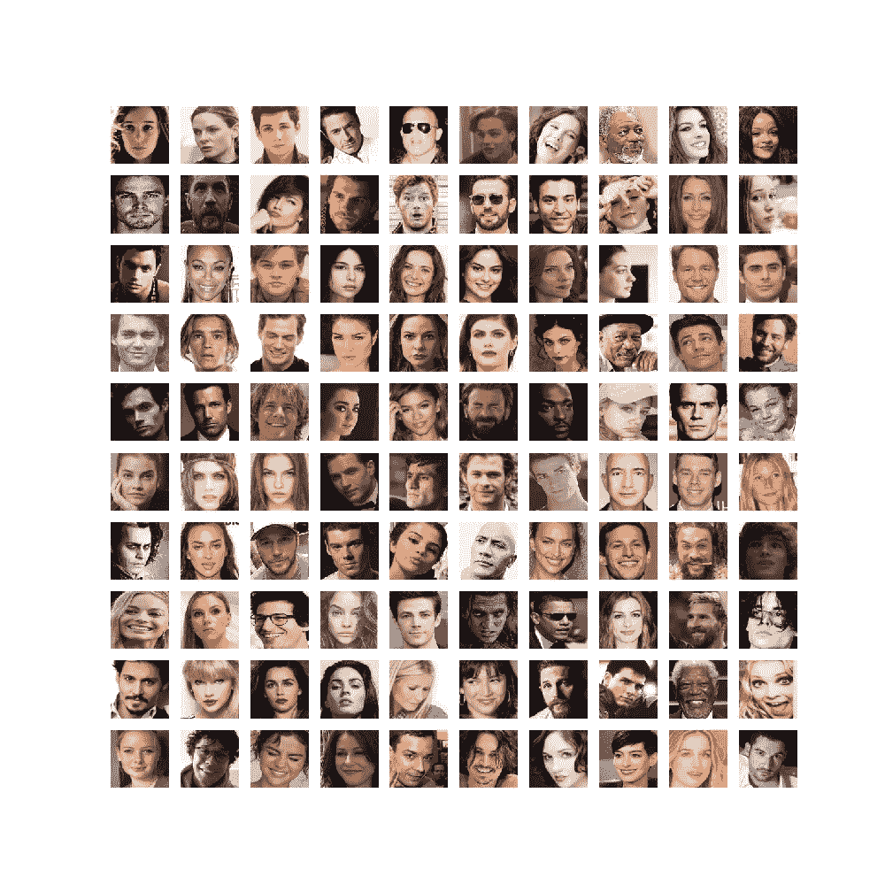
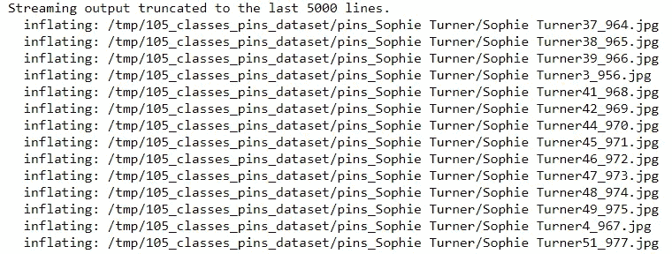
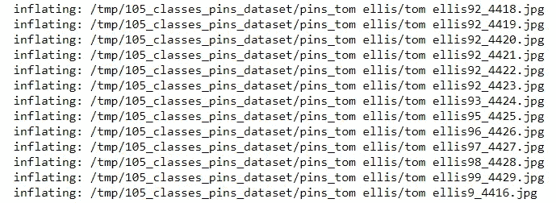
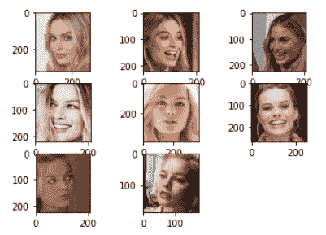
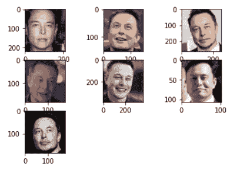
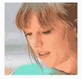
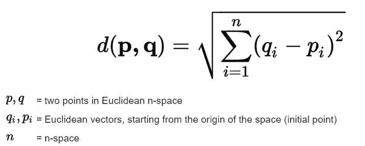

# 从零开始使用 KNN 的名人人脸识别

> 原文：<https://medium.com/analytics-vidhya/celebrity-face-recognition-using-knn-from-scratch-76287bdab088?source=collection_archive---------10----------------------->

你能从下图中找出你最喜欢的名人吗？当然可以！计算机是如何完成同样的任务的？让我们在接下来的几分钟内训练一个模型来识别名人的面孔！

> 关于 KNN 的更多信息，请参考我以前的博客— [**从头开始使用 KNN 的 KNN 和 MNIST 手写数字识别初学者指南**](https://tp6145.medium.com/a-beginners-guide-to-knn-and-mnist-handwritten-digits-recognition-using-knn-from-scratch-df6fb982748a)
> 
> 我们将使用相同的算法来完成这项工作！



图片来源:Kaggle — Pins 人脸识别

*你可以在这里找到数据集*[](https://www.kaggle.com/hereisburak/pins-face-recognition/activity)**——这是一个最初从 Pinterest 获得的精心策划的数据集——被裁剪并贴上标签！总共有* ***105 位名人*******17534 张面孔*** *从* ***阿德里亚娜·利马*** *到* ***【汤姆·伊莱斯*** *还有所有人都在中间！***

***通过 Kaggle 临时令牌导入 Kaggle 数据集(在 Google Colab 上):***

> **更多关于 Google Colab — [**机器学习入门指南**](/analytics-vidhya/a-beginners-guide-for-getting-started-with-machine-learning-7ba2cd5796ae)**

```
****from** **google.colab** **import** files 
*"""upload your Kaggle temporary token downloaded from your Kaggle account onto your local device"""* files.upload() **Out:** Saving kaggle.json to kaggle.json
{'kaggle.json': b'{"username":"xxx","key":"yyy"}'}**
```

***下载您的数据集:***

```
**!mkdir -p ~/.kaggle
!cp kaggle.json ~/.kaggle/
!chmod 600 ~/.kaggle/kaggle.json!kaggle datasets download -d hereisburak/pins-face-recognition**Out:** Downloading pins-face-recognition.zip to /content
 97% 361M/372M [00:13<00:00, 20.9MB/s]
100% 372M/372M [00:14<00:00, 27.8MB/s]**
```

***检查您的文件是否已下载:***

```
**!ls**Out:** kaggle.json   pins-face-recognition.zip   sample_data**
```

***解压你的文件:***

```
**!unzip "pins-face-recognition.zip" -d /tmp**
```

****

**………**

****

***检查每个目录下的文件数量:***

```
****import** **os**
print(len(os.listdir('/tmp')))
print(len(os.listdir('/tmp/105_classes_pins_dataset/')))
print(len(os.listdir('/tmp/105_classes_pins_dataset/pins_tom ellis/')))
print(len(os.listdir('/tmp/105_classes_pins_dataset/pins_margot robbie/')))**Out:** 1
105
180
221**
```

***让我们随机拍摄一系列图像，并打印出它们的形状:***

```
****import** **cv2**
a = 60
b = 3241
**for** i **in** range(8):
  im = cv2.imread('/tmp/105_classes_pins_dataset/pins_margot robbie/
  margot robbie'+str(a+i)+'_'+str(b+i)+'.jpg')
  print(im.shape)**Out:** (320, 302, 3)
(221, 209, 3)
(225, 209, 3)
(221, 209, 3)
(387, 365, 3)
(266, 251, 3)
(225, 209, 3)
(185, 175, 3)**
```

> **它们都有不同的维度:(**

***让我们试着在* ***玛格特·罗比*** *的目录下绘制一系列照片:***

```
****from** **matplotlib** **import** pyplot 
**from** **matplotlib.image** **import** imread 
folder = '/tmp/105_classes_pins_dataset/pins_margot robbie/' 
**for** i **in** range(8):  
    pyplot.subplot(330 + 1 + i)  
    filename = folder+'margot robbie'+str(a+i)+'_'+str(b+i)+'.jpg'  
    image = imread(filename)  
    pyplot.imshow(image) 
pyplot.show()**
```

****

***让我们试着用* ***埃隆马斯克*** *做同样的事情吧，他的目录又名《2020 年 1 月世界首富***！****

```
****from** **matplotlib** **import** pyplot 
**from** **matplotlib.image** **import** imread 
folder = '/tmp/105_classes_pins_dataset/pins_elon musk/' 
a = 191 
b = 1575 
**for** i **in** range(7):  
    pyplot.subplot(330 + 1 + i)  
    filename = folder+'elon musk'+str(a+i)+'_'+str(b+i)+'.jpg'  
    image = imread(filename)  
    pyplot.imshow(image) 
pyplot.show()**
```

****

> **啊！那个十亿美金的微笑:))**

***我们需要的几个库:***

```
****import** **numpy** **as** **np
from** **PIL** **import** Image
**import** **operator**
**from** **operator** **import** itemgetter**
```

***让我们试着调整一张图片的大小——比如泰勒·斯威夫特的(128*128*3)***

```
****from** **PIL** **import** Image 
img = Image.open('/tmp/105_classes_pins_dataset/pins_Taylor Swift/Taylor Swift4_4643.jpg') 
img = img.resize((128,128)) 
img**
```

****

```
**np.asarray(img) *#display the pixel array***Out:** array([[[187, 191, 202],
        [187, 191, 202],
        [187, 191, 202],
        ...,
        [ 94,  85,  78],
        [104,  95,  87],
        [ 98,  89,  80]],

       [[187, 191, 202],
        [188, 192, 203],
        [188, 192, 203],
        ...,
        [ 82,  72,  66],
        [ 95,  84,  77],
        [ 92,  82,  73]],

       [[187, 191, 202],
        [187, 191, 202],
        [187, 191, 202],
        ...,
        [107,  96,  91],
        [105,  94,  87],
        [100,  90,  81]],

       ...,

       [[244, 143, 171],
        [243, 143, 171],
        [242, 145, 172],
        ...,
        [186, 135, 105],
        [190, 137, 109],
        [193, 138, 111]],

       [[236, 144, 169],
        [234, 144, 169],
        [234, 149, 172],
        ...,
        [187, 147, 117],
        [191, 148, 121],
        [184, 140, 114]],

       [[232, 142, 167],
        [230, 143, 167],
        [232, 150, 172],
        ...,
        [170, 137, 107],
        [152, 116,  89],
        [143, 104,  78]]], dtype=uint8)**
```

***现在，让我们检查调整后的图像的宽度和高度:***

```
**width, height = img.size
print(width, height)**Out:** 128 128**
```

***现在，棘手的部分来了:让我们一个目录接一个目录地迭代，然后迭代该目录中的每张图片——动态地将它们的大小调整为(128*128 ),并将每张图片的像素数组附加到 X，将其对应的名人标签附加到 y——跟踪我们的计数:***

```
**X = []
y = []
count = 0
dir="/tmp/105_classes_pins_dataset/"
**for** i **in** os.listdir(dir):
    print(i,":",len(os.listdir(dir+"/"+i)))
    count+=len(os.listdir(dir+"/"+i))
    **for** j **in** os.listdir(dir+"/"+i):
        img = Image.open(dir+"/"+i+"/"+j)
        img = img.resize((128,128))
        X.append(np.asarray(img))
        y.append(i)
print(count)
X = np.asarray(X)
y = np.asarray(y)
print(X.shape, y.shape)**Out:** pins_ellen page : 188
pins_Avril Lavigne : 162
pins_Marie Avgeropoulos : 161
pins_Rebecca Ferguson : 178
pins_Robert De Niro : 156
pins_Emilia Clarke : 210
pins_Dwayne Johnson : 141
pins_Josh Radnor : 117
pins_Ben Affleck : 126
pins_Zoe Saldana : 186
pins_camila mendes : 162
pins_Morgan Freeman : 105
pins_Alvaro Morte : 139
pins_Pedro Alonso : 125
pins_Taylor Swift : 131
pins_Natalie Dormer : 198
pins_Andy Samberg : 196
pins_grant gustin : 183
pins_Brie Larson : 169
pins_Lindsey Morgan : 169
pins_Lionel Messi : 86
pins_kiernen shipka : 203
pins_Mark Ruffalo : 178
pins_Gwyneth Paltrow : 187
pins_tom ellis : 180
pins_Tuppence Middleton : 133
pins_Tom Hardy : 198
pins_Wentworth Miller : 179
pins_Amanda Crew : 117
pins_Nadia Hilker : 133
pins_Jason Momoa : 184
pins_Megan Fox : 209
pins_Rami Malek : 160
pins_Zendaya : 138
pins_Stephen Amell : 159
pins_Elizabeth Lail : 158
pins_gal gadot : 199
pins_margot robbie : 221
pins_Dominic Purcell : 146
pins_Leonardo DiCaprio : 237
pins_Tom Holland : 189
pins_Jessica Barden : 141
pins_Penn Badgley : 171
pins_Sarah Wayne Callies : 159
pins_Bill Gates : 122
pins_Johnny Depp : 182
pins_Jimmy Fallon : 113
pins_Chris Evans : 166
pins_Jennifer Lawrence : 180
pins_Richard Harmon : 148
pins_scarlett johansson : 201
pins_Brenton Thwaites : 209
pins_elizabeth olsen : 221
pins_elon musk : 135
pins_Irina Shayk : 156
pins_Henry Cavil : 195
pins_Inbar Lavi : 127
pins_Sophie Turner : 204
pins_Shakira Isabel Mebarak : 154
pins_Jeremy Renner : 167
pins_barack obama : 119
pins_Chris Pratt : 176
pins_amber heard : 218
pins_Madelaine Petsch : 192
pins_Lili Reinhart : 150
pins_Ursula Corbero : 167
pins_Alex Lawther : 152
pins_Zac Efron : 191
pins_Selena Gomez : 186
pins_alycia dabnem carey : 211
pins_Morena Baccarin : 175
pins_Danielle Panabaker : 181
pins_Emma Watson : 211
pins_Katharine Mcphee : 177
pins_Logan Lerman : 212
pins_Anne Hathaway : 203
pins_Rihanna : 133
pins_jeff bezos : 106
pins_Jake Mcdorman : 159
pins_Mark Zuckerberg : 95
pins_Adriana Lima : 213
pins_Brian J. Smith : 102
pins_barbara palvin : 197
pins_Robert Downey Jr : 233
pins_Emma Stone : 139
pins_Tom Cruise : 192
pins_Eliza Taylor : 162
pins_Cristiano Ronaldo : 98
pins_Maisie Williams : 193
pins_Miley Cyrus : 178
pins_Millie Bobby Brown : 191
pins_Alexandra Daddario : 225
pins_Christian Bale : 154
pins_melissa fumero : 154
pins_Natalie Portman : 166
pins_Neil Patrick Harris : 116
pins_Anthony Mackie : 124
pins_Bobby Morley : 138
pins_Krysten Ritter : 171
pins_Hugh Jackman : 179
pins_Katherine Langford : 226
pins_Chris Hemsworth : 159
pins_Tom Hiddleston : 181
pins_Maria Pedraza : 122
pins_Keanu Reeves : 160
17534
(17534, 128, 128, 3) (17534,)**
```

> ****注意:**这里可以做的改进——你可以将这些图像转换为**灰度**并调整大小——处理灰度图像的计算成本会更低，同时考虑到颜色在这里的意义更小。**

***重塑* ***X (17534，128，128，3)*** *到* ***(17534，128*128*3)*** *:***

```
**X = X.reshape(17534, 49152).astype('float32')**
```

***归一化 0 到 1 之间的像素:***

```
**X/=255
X.shape**Out:** (17534, 49152)**
```

# **从头开始实施**

***让我们先定义一个函数，它返回两点之间的* [***欧氏距离***](https://en.wikipedia.org/wiki/Euclidean_distance)*:***

****

**图片来源:Science Direct——欧几里德距离公式**

```
**def euc_dist(x1, x2):
    return np.sqrt(np.sum((x1-x2)**2))**
```

> ****注意:**可以做的改进——可以使用曼哈顿距离代替欧几里德距离，因为求平方是一种开销很大的操作，尤其是在处理像这样的高维像素阵列时！—参考: [**从头开始使用 KNN 进行 KNN 和 MNIST 手写数字识别的入门指南**](https://tp6145.medium.com/a-beginners-guide-to-knn-and-mnist-handwritten-digits-recognition-using-knn-from-scratch-df6fb982748a)**

***现在，让我们写一个类‘KNN’并为****‘K’值:*** 初始化一个实例**

```
**class KNN:
    def __init__(self, K=3):
        self.K = K**
```

***让我们添加另一个函数到我们的类中，该函数初始化实例以适应我们的训练集——X-train 和 y-train:***

```
**class KNN:
    def __init__(self, K=3):
        self.K = K
    def fit(self, x_train, y_train):
        self.X_train = x_train
        self.Y_train = y_train**
```

***现在让我们将预测函数添加到这个类中:***

```
**def predict(self, X_test):
    predictions = [] for i in range(len(X_test)):
        dist = np.array([euc_dist(X_test[i], x_t) for x_t in   
        self.X_train])
        dist_sorted = dist.argsort()[:self.K]
        neigh_count = {}
        for idx in dist_sorted:
            if self.Y_train[idx] in neigh_count:
                neigh_count[self.Y_train[idx]] += 1
            else:
                neigh_count[self.Y_train[idx]] = 1
        sorted_neigh_count = sorted(neigh_count.items(),    
        key=operator.itemgetter(1), reverse=True)
        predictions.append(sorted_neigh_count[0][0]) 
    return predictions**
```

> **哇哦。代码太多了！让我们一行一行地理解这个—**

**我们已经初始化了一个列表来存储我们的预测，然后运行一个循环来计算每个测试示例到每个对应的训练示例的欧几里德距离，并将所有这些距离存储在一个 NumPy 数组中，之后我们返回了距离的前 K 个排序值的索引，然后我们创建了一个字典，将我们的类标签作为键，将它们的出现次数作为每个键的值。**

**然后，我们将每个计数附加到每个键-值对的 neigh_count 字典中，之后，我们从最常出现的值到最少出现的值对我们的键-值对进行排序，其中，我们最常出现的值将是我们对每个训练示例的预测。然后我们返回预测。**

*****最终代码—*****

```
****def** euc_dist(x1, x2):
        **return** np.sqrt(np.sum((x1-x2)**2))
**class** **KNN**:
    **def** __init__(self, K=3):
        self.K = K
    **def** fit(self, x_train, y_train):
        self.X_train = x_train
        self.Y_train = y_train
    **def** predict(self, X_test):
        predictions = []
        count = 0
        **for** i **in** range(len(X_test)):   
            count = count + 1         
            dist = np.array([euc_dist(X_test[i], x_t) **for** x_t **in** self.X_train])
            dist_sorted = dist.argsort()[:self.K]
            neigh_count = {}
            **for** idx **in** dist_sorted:
                **if** self.Y_train[idx] **in** neigh_count:
                    neigh_count[self.Y_train[idx]] += 1
                **else**:
                    neigh_count[self.Y_train[idx]] = 1       
            sorted_neigh_count = sorted(neigh_count.items(), key=operator.itemgetter(1), reverse=**True**)
            print(str(count)+' '+str(sorted_neigh_count[0][0]))
            predictions.append(sorted_neigh_count[0][0])
        **return** predictions**
```

> **这就是 KNN 的全部实现，现在让我们在处理过的数据集上测试我们的模型！**

**另外，如果你正在使用 Google Colab——切换到 GPU 运行时，这样事情会变得更快！**

```
****from** **sklearn.metrics** **import** accuracy_score
model = KNN(K = k) *#experiment with different k values*
model.fit(X_test, y_test)
pred = model.predict(X_test)
*""" You can now test your model on different classification metrics! Good Luck!"""***
```

> **我知道一下子很难接受。但是你坚持到了最后！恭喜你。不要忘记看看我即将发表的文章！**
> 
> **关于这方面的更多信息，请查看我之前的博客 [**这里**](https://tp6145.medium.com/a-beginners-guide-to-knn-and-mnist-handwritten-digits-recognition-using-knn-from-scratch-df6fb982748a) **！****

*****要获得完整的代码，请查看我的 GitHub 库—*****

**[](https://github.com/tanvipenumudy/Winter-Internship-Internity/blob/main/Day%2008/Day-8%20Notebook-2%20%28Face%20Detection%20using%20KNN%29.ipynb) [## tanvipenumudy/Winter-实习-实习

### 存储库跟踪每天分配的工作-tanvipenumudy/Winter-实习-实习

github.com](https://github.com/tanvipenumudy/Winter-Internship-Internity/blob/main/Day%2008/Day-8%20Notebook-2%20%28Face%20Detection%20using%20KNN%29.ipynb) 

> **如果你喜欢这篇文章，不要忘了鼓掌并跟随:****