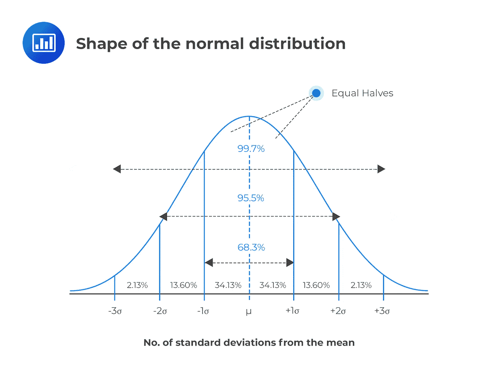

# 中心极限定理

> 原文：<https://medium.com/analytics-vidhya/central-limit-theorem-5b2069b5663c?source=collection_archive---------4----------------------->

## 以一种你不会忘记的方式理解

不管你正常不正常，平均都是正常的。这是我用来记忆中心极限定理的方法，中心极限定理是数学领域最基本也是最重要的概念之一。

图片来源:[https://www . scotth young . com/blog/2019/07/17/normal-distribution/](https://www.scotthyoung.com/blog/2019/07/17/normal-distribution/)

现在让我们来看看一些重要的统计术语，你需要知道这些术语才能更好地理解。

**种群和样本:** A **种群**是一个整体，它是一个群体中的每一个成员。而样本是一组的一部分或百分比。

**正态分布:**正态分布是一种对称分布，其中大部分观测值聚集在中央峰值周围。它也被称为高斯分布和钟形曲线。正态分布的属性有:

*   平均值、众数和中位数都是相等的。
*   **曲线**在中心对称(即围绕平均值μ)。
*   正好一半的值在中心的左边，正好一半的值在右边。

图片来源:[https://analyst prep . com/CFA-level-1-exam/quantitative-methods/key-properties-normal-distribution/](https://analystprep.com/cfa-level-1-exam/quantitative-methods/key-properties-normal-distribution/)

**有限均值:**如果一个随机变量的均值的可能结果集位于一个有限的值区间内，则称该随机变量具有有限均值。

**有限方差:**如果一个随机变量的方差的可能结果集位于一个有限的值区间内，则称该随机变量具有有限方差

假设有 5000 人，我们正在观察他们的年龄。对大多数人来说，最小年龄是 1 岁甚至更小，最大年龄是 100 岁。在这种情况下，这 5000 名成员所有年龄的平均值和方差都在[1，100]范围内。因此，我们可以说随机变量‘年龄’有一个有限的均值和一个有限的方差。然而，如果我们谈论恒星，“年龄”变量将有一个无限的均值和方差，因为我们不知道恒星的寿命有多长。

# 什么是中心极限定理？

**中心极限定理**指出，无论总体分布如何，随着样本大小(N)的增加，抽样均值的抽样分布形状将遵循正态分布/高斯分布。

样本均值的抽样分布表明，如果从随机变量 X 的值的总体中抽取给定大小 n 的重复随机样本，其中总体均值为μ(μ),总体方差为σ2(σsqaure ),则所有样本均值(X-bar)的均值将为总体均值μ(μ),方差将为σ2/n(σsqaure 乘 n ),因为 n 趋于无穷大。

中心极限定理起作用的要求是:

1.我们需要一个均值和方差都有限的总体。

2.样本大小必须大于或等于 30。从理论上讲，当 n 接近无穷大时，抽样平均值的抽样分布遵循正态分布，但在现实世界中，当 n≥30 时，它往往工作得很好。n≥30 是一般的经验法则。

[https://upload . wikimedia . org/Wikipedia/commons/7/7b/illustrationcentrathltheorem . png](https://upload.wikimedia.org/wikipedia/commons/7/7b/IllustrationCentralTheorem.png)

## 中心极限定理的重要性是什么？

中心极限定理被统计学家和数据科学家广泛使用，因为它允许他们对**数据进行统计推断。研究整个人口有时很困难，这就是 CLT 的用武之地。所以我们利用样本，试图确定数据中的模式。然后，使用上述正态/高斯分布的特性，将这些模式用于准确预测群体特征。**

摘要:本文阐述了什么是中心极限定理，以及如何容易理解和记忆中心极限定理。