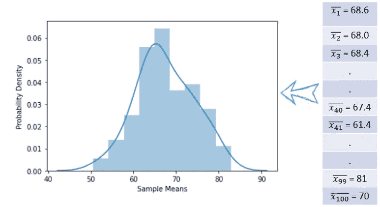

# 中心极限定理变得简单！

> 原文：<https://medium.com/analytics-vidhya/central-limit-theorem-made-easy-a61319d6ee1f?source=collection_archive---------3----------------------->


T **何中心极限定理(CLT)** 是统计学中最重要的课题之一。它在许多现实世界的问题中派上了用场。在这个博客中，我们将看到什么是中心极限定理及其重要性。我们还将通过 Python 演示来验证中心极限定理的性质。

让我们首先讨论一些术语:

**群体**是我们想要研究的一组相似的项目或个体。例如，印度所有人的血糖水平。

**样本**是总体的一个子集或一小部分，具有与更大总体相似的特征。

假设您正在研究医疗保健数据，您想要确定印度所有人的平均血糖水平。这意味着你必须分析大约 12 亿人的数据。你不可能询问每个人的血糖水平。这将是极其昂贵和耗时的。那么，当我们没有信息时，我们如何获得关于人口的洞察力呢？答案是，我们可以用抽样分布。


作者图片

## 抽样分布

让我们借助一个例子来理解抽样分布。假设一个班有 75 名学生。我们需要找到班上学生的平均数学成绩。平均分的准确计算值为**68.06**；然而，对于这个例子，我们假设均值是未知的。下面给出了 75 人的数学成绩。在 75 名学生中，随机选择 5 名学生，计算他们的平均分。


作者图片

用红色标记的学生是随机选择的。让我们计算他们的数学成绩的平均值，如下所示。


当我们选择不同的样本时，均值会发生变化。在对大量这样的样本(比如 100 个样本，每个样本大小为 5)进行分析后，我们将获得几个这样的平均值。所有 100 个样本平均值的平均值给出了抽样分布的平均值。


作者图片


下图显示了 100 个这样的平均值及其分布。



抽样分布

因此，样本均值的抽样分布是总体样本均值的概率密度函数。

抽样分布具有某些有用的性质，这些性质统称为**中心极限定理**。该定理指出，无论原始总体如何分布，抽样分布将保持以下三个特性为真:


让我们借助 Python 中的一个例子来验证这些属性。

在这个演示中，我们将使用一个数据集，其中包含关于 NBA 球员的信息。该数据集包含了 NBA 球队中每个球员 20 多年的数据。它捕捉人口统计变量，如年龄，身高，体重和出生地，履历细节，如球队的比赛，全年选秀。在本演示中，我们将只使用高度功能。

```
# Import packagesimport warningswarnings.filterwarnings("ignore")import pandas as pd, numpy as npimport matplotlib.pyplot as plt, seaborn as snsimport scipy.stats as statsnp.random.seed(42) # With the seed, same set of numbers will appear every time.# PopulationNBS_Dataset = pd.read_csv('all_seasons.csv')NBS_Dataset.head()
```


NBS_Dataset 包含 **11145 行 22 列。**在这次演示中，我们将只考虑**【球员身高】**栏。

```
# Extract Only height ColumnNBS_Dataset_height = NBS_Dataset[['player_height']]
```

让我们看看 NBA 球员身高的分布。

```
sns.distplot(NBS_Dataset_height. Player_height)plt.show()
```


NBA 球员身高的概率分布

我们可以看到分布接近于**正态**。

```
NBS_Dataset_height.player_height.mean()**# Output**: 200.8128NBS_Dataset_height.player_height.std()**# Output:** 9.19097
```

这些是总体的真实均值和标准差。


让我们从这些数据中随机抽取一个样本(大小= 30)来分析样本均值。

```
samp_size = 30NBS_Dataset_height.player_height.sample(samp_size).mean()**# Output:** 196.84999999999994NBS_Dataset_height.player_height.sample(samp_size).mean()**# Output:**198.28933333333327
```

每次取样，我们的平均值都不一样。样本均值本身存在可变性。样本本身是否服从分布？让我们对此进行评估。

让我们从整个数据集中随机挑选大约 1000 个大小为 30 的样本，并计算每个样本的平均值。

```
sample_means = [NBS_Dataset_height.player_height.sample(samp_size).mean() for i in range(1000)];sample_means = pd.Series(sample_means)
```

绘制所有这些样本均值的分布图(这是我们的样本分布)。

```
sns.distplot(sample_means)plt.show()
```


抽样分布

我们可以观察到抽样分布接近于**正态**。现在我们将计算这个抽样分布的平均值和标准偏差。

```
sample_means.mean()**# Output:** 200.77
```

这个抽样分布的平均值(或者换句话说，我们所取的所有样本平均值的平均值)就是 **200.77** 。如您所见，该值非常接近于原始总体平均值 **200.81** 。这证明了中心极限定理的第一个性质，


然而，推断总体平均值与样本平均值完全相等是不公平的。这是因为取样过程中的缺陷总是容易造成一些误差。因此，样本平均值的报告必须有一定的误差。


```
sample_means.std()**# Output:** 1.70NBS_Dataset_height.player_height.std()/np.sqrt(samp_size)**# Output:** 1.68
```

类似地，当我们计算抽样分布的标准偏差时，我们观察到以下关系:


这验证了中心极限定理的第二个性质，


现在我们已经验证了这两个属性，让我们观察样本大小对最终采样分布的影响。在本演示中，我们将观察到，随着样本量的增加，基本采样分布将接近正态分布。

```
sample_sizes = [3, 10, 30, 50, 100, 200]plt.figure(figsize=[10,7])for ind, samp_size in enumerate(sample_sizes):sample_means = [NBS_Dataset_height.player_height.sample(samp_size).mean() for i in range(500)]plt.subplot(2,3,ind+1)sns.distplot(sample_means, bins=25)plt.title("Sample size: "+str(samp_size))plt.show()
```


我们可以观察到，随着样本量超过 30，抽样分布变得越来越**正态。**

这验证了中心极限定理的第三个性质，


> **结论**

现在我们已经了解了中心极限定理的性质，我们可以用它来从样本均值推断总体均值。

领英:[https://www.linkedin.com/in/ankita-banerji-8940369b/](https://www.linkedin.com/in/ankita-banerji-8940369b/)

# 推荐文章

1.  [关于线性回归的假设检验](/nerd-for-tech/hypothesis-testing-on-linear-regression-c2a1799ba964)
2.  [线性回归中的梯度下降](/analytics-vidhya/gradient-decent-in-linear-regression-ec2308439478)
3.  [选择 K 均值聚类中的聚类数](https://ankitajhumu.medium.com/selecting-number-of-clusters-in-k-mean-clustering-d60a1f85d65b)