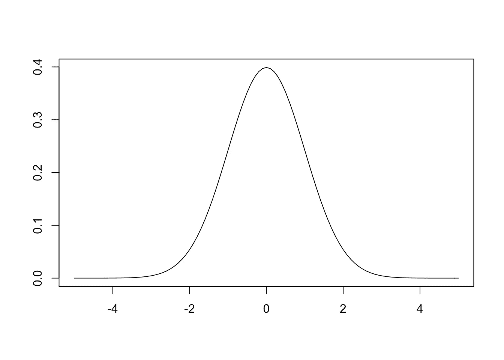
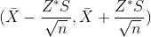

# 中心极限定理-一页

> 原文：<https://medium.com/analytics-vidhya/central-limit-theorem-one-pager-76f9cfea9f25?source=collection_archive---------18----------------------->

这篇文章可以被认为是对初学者的温和介绍，或者是对有经验者的快速复习。

推断统计学利用样本数据对总体数据进行推断。CLT 中心极限定理是一个帮助我们验证这一假设的过程。以下是 CLT 的属性:

1.  样本均值【T1(μX)=**总体均值【T3(μ)】,因为我们没有或无法计算总体均值**
2.  **抽样分布的标准差** ( **标准差** ) = σ√n 抽样分布完全是另外一个话题。假设均值来自样本
3.  **对于 n > 30** ，采样分布变为**正态分布**

理论上(或现实中)当样本数大于 30 时，我们得到一个正态分布曲线

让我们用一个例子来计算 CLT:

假设一个组织有 20000 名员工。我们想计算员工的平均通勤时间。实际上不可能计算每个人，所以我们可以计算少量样本，比如 100 名员工，然后推断总体情况。

这 100 名员工的平均通勤时间为 35 分钟。我们可以假设总体平均值应该接近 35 分钟，即

总体平均值= 35 +或-误差值

这个样本平均正负误差被称为**置信水平**。计算置信水平的公式为

置信区间

**样本平均值= 35 (X 条)**

**得到抽样分布的 SD = 9 (S)**

**n = 100** (总样本数)

我们需要 Z 分数，它取决于我们定义的置信度。比方说 95%

因为这是一个双尾检验= 0.95+(1–0.95)/2 = 0.975

对于. 975 的 z 分数是 1.96

将这些值应用到我们得到的公式中

35–1.74，35+1.74 哪个是

所有员工的平均通勤时间将在 33.26 至 36.74 分钟之间

继续阅读关于 [**假设检验**](https://padmanaabhah.medium.com/hypothesis-testing-a-kutty-short-story-609c2da72ea8)