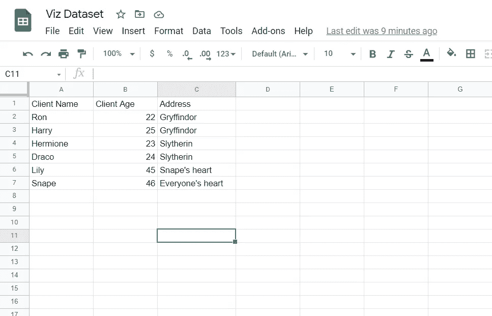
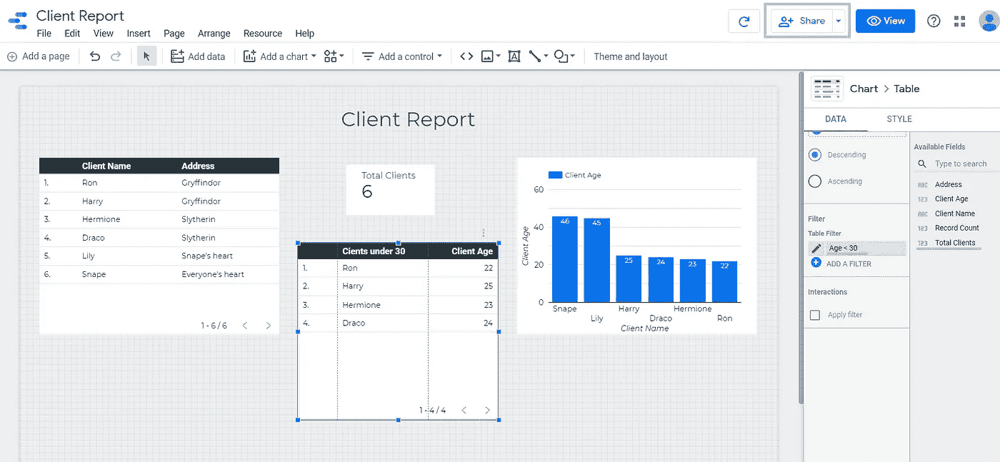
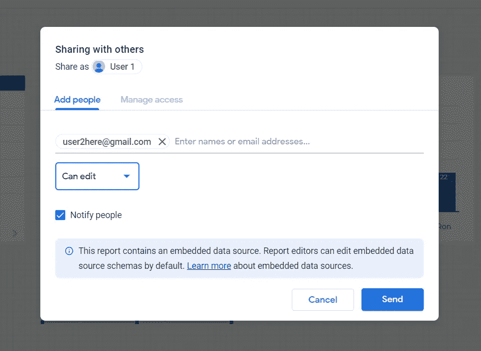
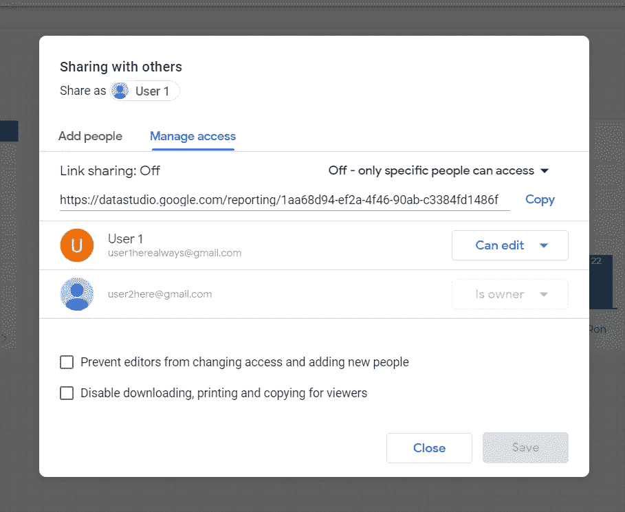
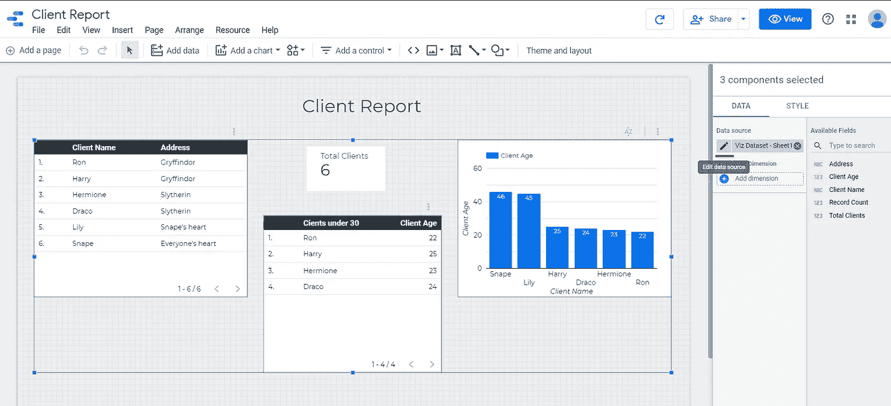

# 改变你的谷歌数据工作室可视化的所有权

> 原文：<https://medium.com/analytics-vidhya/changing-ownership-of-your-google-data-studio-visualization-f5ba2893fa6d?source=collection_archive---------4----------------------->

假设你是一家公司的实习生，你使用你的个人账户在 Data Studio 上创建仪表板。有一天，你的老板让你把你赚的所有钱都转到公司的账户上，也就是说，让他们的账户成为仪表盘的所有者，这样当你离开的时候，你的工作就不会被转移。

> 术语表
> 1。报告:你的视觉化。
> 2。数据源:嵌入到可视化中的数据。这样，您可以通过添加计算字段、筛选器等来更改报表的架构。
> 3。数据集:要可视化的数据。
> 4。连接器:用于获取数据的平台。在这里，我们使用 Google sheets。

在 Data Studio 中，当报表的所有权发生变化时，数据源也会发生变化，因此下一个用户可以更改嵌入数据的模式。即使在改变数据集(您的 google sheet)的所有权之后，报表和数据集之间的连接也会断开。因此，本文将关注如何更改您的仪表板的所有权，这也有可能反映下一个所有者在数据集中所做的更改。

**以下是您(用户 1)需要遵循的步骤:**

创建数据集。如果你有 excel 表格形式的数据，把它转换成谷歌表格。

永远的德拉米恩！

创建报告。

好吧。我写报告没那么差。

您可以看到右上角有一个名为“客户总数”的计算字段和一个过滤器“年龄< 30’ in the right pane. I have added these to make sure everything’s intact even after changing ownership.

Click on the **份额**按钮，以及在**下一个所有者(用户 2)** 的电子邮件 id 中的**添加人员**部分类型。

现在，换一个你仪表盘的主人(我觉得我眼睛都冒汗了)。点击**管理访问**并使用户 2 成为所有者。

在这之后，您还需要遵循相同的步骤来更改数据集(这里是 Viz Dataset)的所有权。

**现在，如果你是老板或仪表板的下一任所有者，你需要遵循以下步骤:**

> 用户 2 将收到一封关于用户 1 转让所有权的电子邮件。通过邮件中链接打开报告。

点击**编辑**模式，选择所有图形后，点击**数据源**的铅笔图标，显示**编辑数据源。**

随后，选择**编辑连接**并从您拥有的工作表中选择目标工作表(Viz 数据集)(只是为了确认)。点击**重新连接**。如果您仍然可以看到计算字段和使用的过滤器，您做到了！现在，报表和数据集已经连接，可以用来可视化更多的记录。

希望你的老板让你转报告的时候，你能找到这篇文章。

感谢您的阅读！