# 使用细胞神经网络的语言模型的字符意识

> 原文：<https://medium.com/analytics-vidhya/character-awareness-for-language-models-using-cnns-6b1c1a331042?source=collection_archive---------1----------------------->

本文将通过 PyTorch 和 Python 上实现的实际细节来介绍将 CNN 用于 NLP 的用例。它基于论文“[字符感知神经语言模型”](https://arxiv.org/pdf/1508.06615.pdf)。

[阿丽娜·格鲁布尼亚](https://unsplash.com/@alinnnaaaa?utm_source=medium&utm_medium=referral)在 [Unsplash](https://unsplash.com?utm_source=medium&utm_medium=referral) 上的照片

# **背景:**

**语言模型:**语言模型为句子或短语分配概率。给定一些单词，我们可以预测下一个单词，它将赋予该短语最高的概率。我们经常看到它们被用于消息服务的文本补全

孩子们在 _ _ _ _ _ _ _ _ _ _

一门好的语言应该能够预测下一个单词是“park”还是其他有意义的词。

更正式地说，

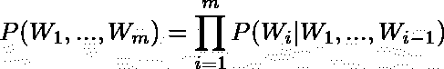

我们可以对一个给定的“m”个单词序列的概率进行建模，方法是接受每个单词，并根据之前出现过的单词计算概率。

在前 Transformer 时代，大多数论文使用 **RNNs** 来完成这样的任务，论文中使用的模型就是这种情况。

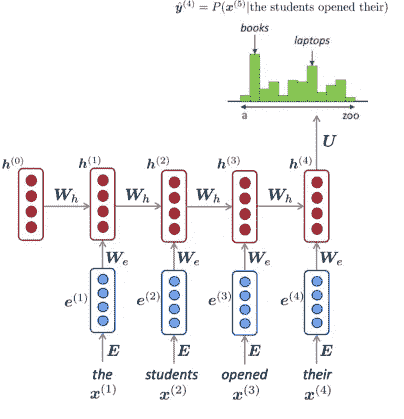

用于语言建模任务的典型 RNN 架构

给定一个单词，在预定义的词汇表中查找该单词的嵌入，并使用权重矩阵 **W_e** 进行线性变换。循环部分来自隐藏状态**‘h’，**，其中我们再次在每个时间步长**使用相同的权重矩阵 **W_h** 。然后，它被非线性压缩，通常是一个 **tanh** 。**

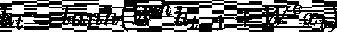

最后，在预测下一个单词时，我们使用 softmax 来输出词汇的分布。

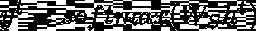

每个矩阵的形状如下:

1.  **h_t** : (D_h，)→隐藏状态形状
2.  **W_h** : (D_h x D_h) →隐藏状态的权重矩阵的形状
3.  **x_t** : ( E，)→每个单词的嵌入形状
4.  **W_e:** ( D_h x E ) →嵌入的权重矩阵的形状

概括地说，在训练过程中，我们逐字逐句地接受每个输入，并查找它们的单词级表示，通过 RNN 输入它们以生成预测。然后，我们根据词汇中标签的真实概率分布来训练我们的网络。

尽管这些单词级嵌入在实践中非常有效；当我们遇到不认识的单词或生僻的单词时，我们的预测可能不那么准确。

通常，对于我们的词汇表中没有的任何未知单词，我们使用一个“unk”标记，它本身具有某种嵌入表示。

在上述论文中，使用了每个单词的字符级表示，这是通过对字符级嵌入进行 1d 卷积而获得的。

**文字的字符表示:**

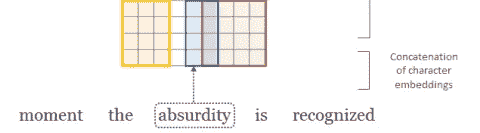

我们将每个字符表示为一个 1D 向量，并将它们连接起来表示每个单词。我还想补充一些实际的实现细节。所以让我们一步一步来。最初，我们需要每个字符的一个表示作为索引。

我们用左右括号({，})来表示一个单词在句子中的开始和结束。我们还必须定义一个函数，该函数接收句子列表并输出字符索引(我们之前映射的那些)

例如:

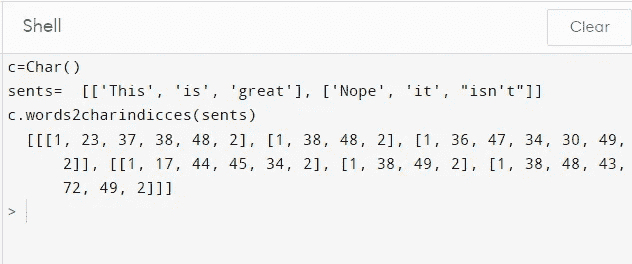

使用我们之前定义的字典将每个单词转换成索引。此外，它们以 1 ( {)开始，以 2 ( })结束。但是句子和单词的长度会不同。**因此，我们必须填充每个单词以获得相等的长度**。

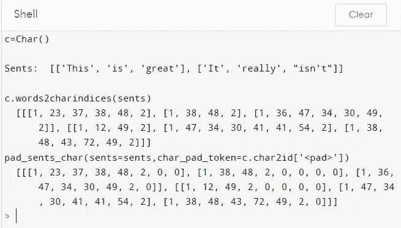

对于这些索引中的每一个，我们查找特定的字符嵌入并将它们连接在一起，以使它们准备好通过卷积层。

所以如果最大的字的大小是**‘m’**&字符嵌入维数是**‘d’**，那么在 CNN 层上传递的矩阵的大小就是**(m×d)**。我们可以把这个叫做 X_emb。

**Conv 图层:**

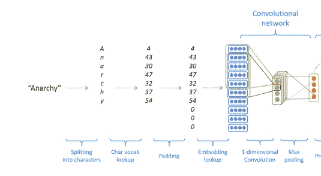

现在我们已经得到了我们的串联字符嵌入，我们通过 1D 卷积和最大池来获得一个固定维度的单词的嵌入。

在最初的论文中，作者使用了具有**单独过滤器宽度**的多个过滤器，其中每个过滤器将捕捉不同的表示。根据作者的说法，“过滤器本质上是挑选一个字符 n-gram，其中 n-gram 的大小对应于过滤器宽度”。例如，如果我们有单词“无政府状态”，大小为 3 的过滤器宽度可能集中在“ana”、“nar”或“arc”上，以查看它们是否有意义。

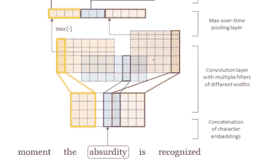

从( **m x d) X_emb** 矩阵中，我们必须遵循以下步骤:

1.  整形为( **d x m)** :这只是因为 PyTorch 在矩阵的最后一个维度上执行卷积。所以我们想沿着列移动卷积(即每个字符)。
2.  我们选择“过滤器”的数量，这最终将是我们想要的单词嵌入维度的大小。所以我们可以称这个数为“ **E”，**如上面 RNN 例子中提到的。另一个超参数是宽度**“k”**。
3.  利用 X_emb 的整形后的矩阵，我们计算每个宽度为“k”的滤波器的元素乘积和。
4.  对于每个字，我们计算每个滤波器的**(m k+1)长向量。我们有 E 个过滤器，我们最终得到形状为 **E x (m-k+1)的最终矩阵。****

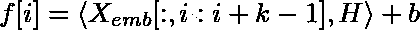

上面的等式只是表示我们如何计算 m-k+1 长向量的第 I 个元素。我们用大小为**(d×k)的滤波器 H 取大小为 k 的窗口的 Frobenius 内积(这就像矩阵的点积，逐元素相乘+求和)。**

5.贴上这个我们添加一个非线性像 tanh 或 Relu。在论文中他们使用了 tanh。

6.最后，我们在第二维上使用最大池，以得到大小为 e 的单个向量。

概括一下，对于每个单词，我们从一个矩阵 **(m x d) → E x (m-k+1) → E**

所以，最后对于每个单词，我们都有一个从字符派生的单词嵌入。现在在报纸上，他们把这个传递给一个“高速公路网”。关于这项技术的论文可以在[这里](https://arxiv.org/abs/1505.00387)找到。

**公路网:**

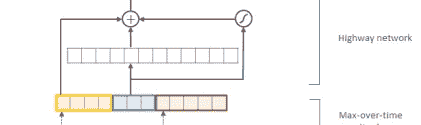

我们使用一个“门”来控制有多少输入被送入 RNN，而不是将从 conv 层得到的单词 _embedding 直接传递给 RNN。这似乎有助于改善梯度流，并优化一般。

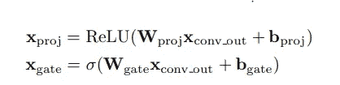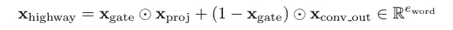

由 sigmoid 控制的门具有需要传递“多少”信息的含义。投影是用非线性系数计算的&乘以门。其余的直接以(1-x_gate)的因子传递。

权重 W_proj & W_gate 的形状为**(E x E)ie word _ embedding x word embedding。**

**最终层和预测**

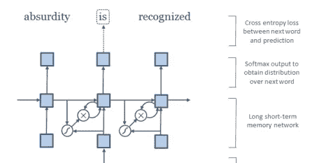

公路图层的输出被传递到 RNN(本例中为 LSTM)。而且是用下一个词的真实标签训练出来的。

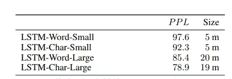

根据该论文，该模型能够实现比具有少量参数的单词级模型更好的准确性。这里 PPL 指的是“困惑”，一种评估语言模型的度量。(越低越好)