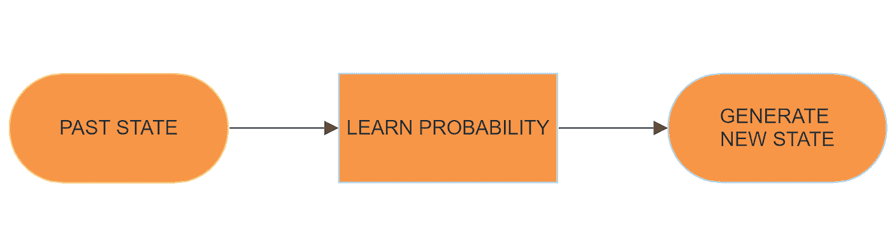
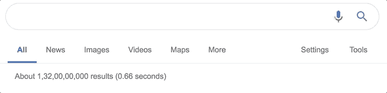
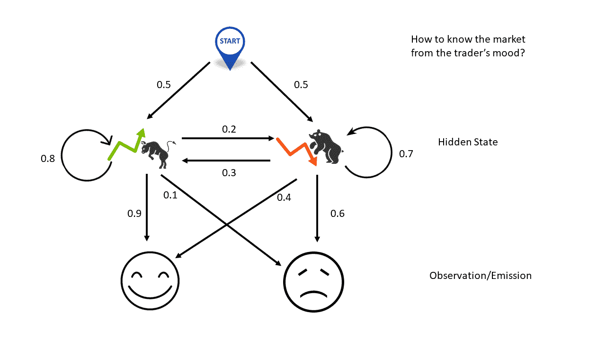
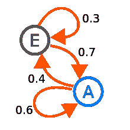
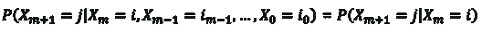
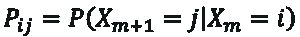
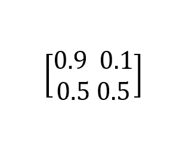
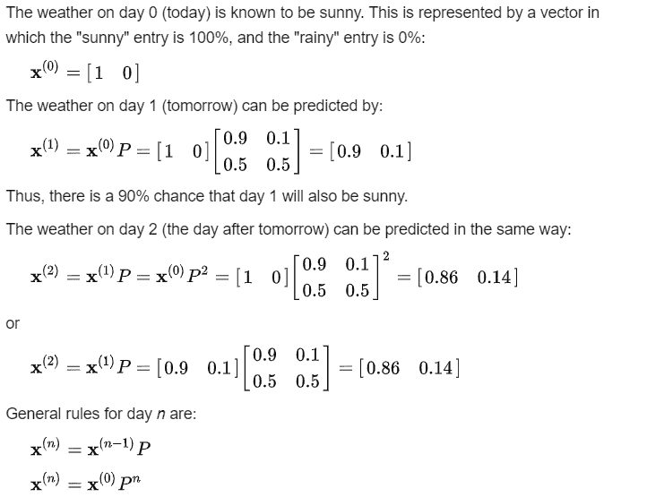
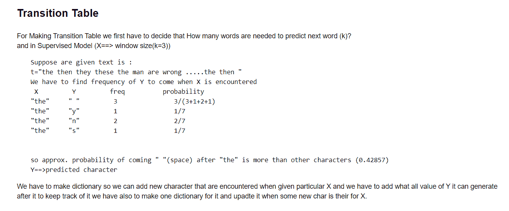
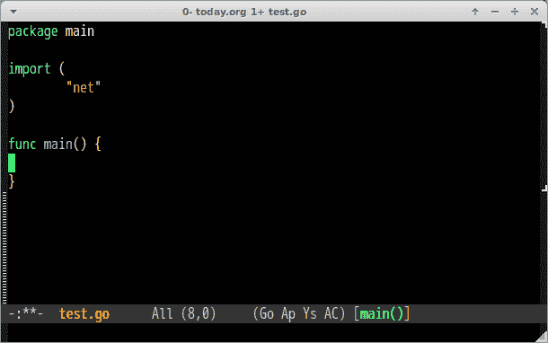

# 基于字符的语言模型

> 原文：<https://medium.com/analytics-vidhya/character-based-language-model-759711370350?source=collection_archive---------8----------------------->

> 你有没有想过 Gmail 自动回复是如何工作的？或者你的 WhatsApp 在发短信时是如何建议下一个单词的？或者我们如何产生音符？生成文本序列的一般方法是训练一个模型，在给定所有先前单词/字符的情况下预测下一个单词/字符。这样的模型被称为**统计语言模型**。什么是统计语言模型？统计语言模型是经过训练的单词序列的概率分布。

它的主要任务是在给定一个数据序列中所有先前字符的情况下预测下一个字符，即逐字符生成文本。

> 马尔可夫链是基于一种**【无记忆】**的原理。换句话说，过程的下一阶段只取决于前一状态，而不是状态序列。这个简单的假设使得条件概率的计算变得容易，并且使得该算法能够应用于许多场景。

在现实生活的问题中，我们通常使用隐马尔可夫模型，它是马尔可夫链的一个进化版本。

*文本/自然语言生成的概率模型(生成新文本的简单有效方式)*

这是一个随机过程(表示一个系统在特定时间有观测值，其结果，也就是每个时间的观测值是一个随机变量。)包含随机变量，根据某些假设和明确的概率规则从一种状态转换到另一种状态。

## ***我们从数学上推导一下:***

设随机过程为，{Xm，m=0,1,2,⋯}.

只有当这个过程是马尔可夫链时，

对于所有的 m，j，I，i0，i1，⋯im-1

对于有限数量的状态，S={0，1，2，⋯，r}，这叫做有限马尔可夫链。

P(Xm+1 = j|Xm = i)这里表示从一个状态转移到另一个状态的转移概率。这里，我们假设转移概率与时间无关。

这意味着 P(Xm+1 = j|Xm = i)不依赖于‘m’的值。因此，我们可以总结如下:

这个方程代表了马尔可夫链。

现在让我们通过一个例子来理解马尔可夫链到底是什么

# 一个简单的天气模型:

给定前一天的天气，天气条件(模拟为下雨或晴天)的概率可由转换矩阵表示:

# P=⬇️

矩阵 *P* 表示天气模型，其中晴天之后有 90%的可能是另一个晴天，雨天之后有 50%的可能是另一个雨天。列可以标记为“晴天”和“雨天”，行可以以相同的顺序标记。( *P* ) *i j* 是这样的概率，如果给定的一天属于类型 *I* ，那么它后面将是类型 *j* 的一天。

# 预测天气

# Python 中的马尔可夫链

为了运行这个，我将使用 Python。

现在让我们开始编码吧！

[基于字符的语言模型](https://github.com/aryangulati/Character-Based-Language-Model)(见本笔记本)

做 [python](https://www.ics.uci.edu/~pattis/common/handouts/pythoneclipsejava/python.html) 的基本安装，从[这里](https://www.python.org/downloads/)下载

通过在 cmd 上运行 pip install jupyter 在 Jupyter 笔记本上练习。基本[安装](https://jupyter.readthedocs.io/en/latest/install.html)见此

# **关于马尔可夫链的预见**

让我们看看下面的文字:

艺术艺术艺术艺术艺术艺术艺术艺术

我们可以这样说:

> 当当前单词是“arty”时，下一个单词将 100%是“arts”。
> 
> 当当前单词是“arts”时，下一个单词 75%的时间是“arty ”,其余时间(25%)是换行符。

就是这样！我们现在已经定义了一个马尔可夫链。

根据概率的定义，我们现在可以帮助用户编写相似的文本，或者我们可以自主地生成全新的文本。

*   先说“艺”。
*   生成器知道“arts”后面可能出现的下一个单词的概率:75%“arty”，25% newline。
*   如果我们正在编写一个自动提示键盘，我们现在可以把“arty”放在突出位置，而把类似“enter”的东西放在不那么突出的位置。
*   如果我们正在构建一个文本生成器，我们会随机选择下一个单词。要么完全随机(50% arty，50%换行符)，要么按比例(arty 的机会是换行符的 3 倍)。我们在这里使用第二种方法，因为它生成的文本更接近原始文本。
*   假设我们以“附庸风雅”告终。生成的字符串现在是“arts arty”。
*   接下来，我们把最后一个单词(“arty”)重复一遍。
*   “附庸风雅”的概率很简单(100%“艺术”)。如果我们正在编写一个自动建议键盘，我们甚至可以在不询问用户的情况下插入“arts”(如果这是我们所处的领域的话)。
*   我们现在有“艺术艺术”。
*   如此反复下去。

[您可以在此](https://en.wikipedia.org/wiki/Markov_chain)进一步阅读

## **马尔可夫链的现实应用**

*⦿PageRank:* 谷歌搜索使用的一种算法，用于在其搜索引擎结果中对网页进行排名。其中每个网页可以是一个状态，并且这些页面之间的链接或引用可以被认为是具有概率的转换。所以不管你怎么搜索，进入某个网页的机会是固定的。

*⦿Typing 单词预测:*用于预测即将出现的单词。像 Gmail 和 WhatsApp 用在自动补全和建议上。

*⦿Text 生成器:*它生成虚拟文本或生成大型文章并编辑演讲。也用于你在网上看到的名字生成。

更多的...

> 你也可以看看这个:【http://ieee.msit.in/blogs/4/character-based-language-model