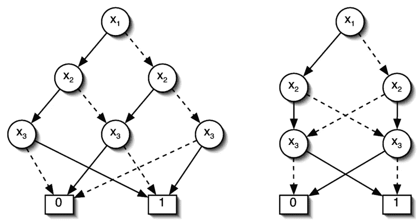

# 图表和图形类型

> 原文：<https://medium.com/analytics-vidhya/chart-graph-types-bd84c3513e66?source=collection_archive---------2----------------------->

**数据可视化**是一种强大的方法，可以简化我们数据中的**复杂性**，并以一种可理解、有洞察力和可操作的形式呈现出来。从早期穴居人的绘画到今天复杂的信息仪表板，我们从远古时代就开始以某种形式使用数据。**数据可视化**是将**数据**以**图形**或图表的形式呈现的过程。它有助于非常容易地理解大量复杂的数据。

> 可视化就像一堆篝火，我们聚集在一起讲故事。

## 线图

*   用于可视化随时间分布的**数据**
*   每个数据点都绘制在图表上，并用一条线连接起来，以了解一段时间内的趋势

## 多线图

*   折线图可以用不同图案或颜色的线条来反映多个数据集

## 条形图

*   **比较不同类别的简单方法**
*   一个轴包含类别，而另一个轴代表数值
*   比较数值或与数值相关的数据的理想选择

 [## 回归分析

### 回归分析是一种测量或估计变量之间关系的技术。

enosjeba.medium.com](https://enosjeba.medium.com/regression-analysis-90d2944f7ecb) 

## 箱形图

*   用于可视化数据的分布形状，找到数据的中心值并了解数据的可变性
*   **最小值**给定数据集中的最小值
*   **第一个四分位数(Q1)** 第一个四分位数是数据集下半部分的中位数
*   **中位数**中位数是数据集的中间值，它将给定的数据集分成相等的两部分。中位数被认为是第二个四分位数
*   **第三个四分位数(Q3)** 第三个四分位数是数据上半部分的中位数。
*   **最大值**给定数据集中的最大值。

除了这五个术语，箱线图中使用的其他术语有

*   **四分位距(IQR)** 第三个四分位与第一个四分位之差称为四分位距。(即)IQR = Q3-Q1
*   **异常值**落在有序数据最左侧或最右侧的数据被测试为异常值。通常，异常值落在第一个和第三个四分位数的指定距离之外。

## **饼状图**

*   当**比较整体的各个部分时**最有效的可视化
*   可以快速比较数据中元素的分配或分段

 [## 连接 Git 和 R-Studio

### 通过简单的几步。

enosjeba.medium.com](https://enosjeba.medium.com/connecting-git-with-r-studio-fcbc2b6ee19e) 

## 马赛克或 Mekko 图表

*   用于可视化**多元数据**
*   能够比较多个类别，并以清晰明了的方式说明所有变量
*   每个横截面的大小和颜色对应于它的分段

## **人口金字塔**

*   理想的形象化到**形象化两个群体**
*   该图通常看起来像一个金字塔
*   不符合一般形状的人口金字塔表明人口的不规则性
*   人口金字塔并不总是用于按年龄比较人口，因此与名字不符

## 蜘蛛图

*   如果你是一个未知玩家的战场迷，你可能会熟悉这张图表，它显示了你的个人资料中的杀戮条纹和技能
*   用于比较和可视化 **3 个或更多的定量变量**
*   也称为雷达图/星图
*   该图表配备了一系列从中心点展开的半径
*   辐条的长度与被比较的值成比例。辐条然后用指定图案的线连接

 [## 进口那个

### Python 的禅

enosjeba.medium.com](https://enosjeba.medium.com/import-that-48bd30272594) 

## 股票图表

*   这张图表帮助投资者跟踪市场
*   该图用直线显示股票的表现，从而帮助投资者做出购买决定
*   它提供一段时间内的数据
*   可以同时跟踪和比较多只股票

## **流程图**

*   用于**解释业务、应用程序或任何工业活动中的流程**
*   它从开始到结束都有一系列的步骤
*   它们可以有多个开始和结束
*   从开始到结束，也可能有无数的路径和旅程
*   常用于说明具有多个决策或条件的更复杂序列

## Gnatt 图表

*   用于**指导进度表**的特殊类型图表
*   条形图反映了项目的开始和结束日期
*   条形用颜色编码，以了解涉及不同团队的工作流程

## 控制图

*   也被称为**过程行为图**
*   帮助确定数据集是否在平均值或预定范围内
*   计算每个点的平均值，图表的中心线在平均值上
*   然后使用每个点计算平均值的标准偏差
*   确定并绘制控制上限和下限，以反映偏差超出预期标准的点

## 瀑布图

*   用于**核算和定性分析**
*   说明初始值如何受到各种因素的积极或消极影响
*   也称为浮动砖块或马里奥图表，因为它们通常显示为在图表中浮动的条形

## 层级图

*   用于说明一个组织的**结构**及其内部的关系
*   可以说明从任何员工到高层的指挥链
*   也用于显示科学分类、人口统计和任何具有相似分布的数据

## 散点图

*   数据点**分散在两个轴**上
*   可以用不同的颜色绘制多个数据，以了解趋势或群体主义
*   也称为散点图

## 格子图

*   用于比较**可以用一个图形表示的更多数据集**
*   也称为格子图或格子图

 [## 编程语言的产生

### 这一切都是从 1 和 0 开始的！

medium.com](/analytics-vidhya/generation-of-programming-languages-6e74aff63109) 

## 功能图

*   用于通过绘制结果来确定公式的**值**
*   函数的图形是其坐标满足方程的所有点的集合
*   常见形状的函数图在视觉上与其对应的代数公式相关联

## 二元决策图

*   用于说明从一个决策到另一个决策的**路径**
*   道路的选择是在两种选择之间
*   可用于其操作基于两个值的任何过程，即真或假、是或否、1 或 0

## 电路图

*   一个**电路的可视化表示**
*   借助于简单的图形，电路的互连可以很容易地形象化
*   路径和连接是准确的，该图不一定代表电路的成比例的空间结构

 [## 命令行技巧，

### 你一生中至少应该尝试一次！

enosjeba.medium.com](https://enosjeba.medium.com/command-line-tricks-34fcec03b2a0) 

## 时间表

*   显示一段时间**内的时间线**
*   与事件相关的重要日期在它们按时间顺序出现的地方被突出显示
*   可以与其他可视化结合使用

## 树形图

*   **层次图的一种形式**
*   它可以从一个祖先开始，然后画出他或她的后代、他们的兄弟姐妹、婚姻和孩子等等

## 旭日图

*   这是一个**多级饼图**
*   用于使用同心圆说明分层数据
*   每个环代表层次结构中的一个级别，根节点位于中心，层次结构向外移动
*   它可以用来细分时间段的数据
*   不同的类别可以指定不同的色调
*   环可以进一步划分，以表示同一组织级别内的多个部门
*   例如，多级饼图由层组成，每层代表一组独立的数据，这可能是完美的解决方案
*   不是显示三个不同的图表，多级饼图可以代替三个，也提供了每个结果的更清晰的视觉比较

## 堆积面积图

*   用于绘制**多个变量随时间的变化**
*   线条可以相乘来代表不同的状态

## 堆积条形图

*   可以同时比较**多个变量**
*   堆积条形图结合了传统条形图和饼图的元素，在单个插图中传达总数、趋势和比例

## 格子条形图

*   用于可视化**三维条形图**，但是添加一个额外的轴有时会显得混乱和不清晰，尤其是在打印形式中
*   通过在模块化设计中组合一系列条形图，可以很容易地比较其他数据集

## venn 图表

*   经典的维恩图，也称为逻辑图，说明了指定集合之间所有可能的**逻辑关系。**
*   大部分是用圆圈画出来的
*   使用的圆圈越多，通过它们的重叠可以表示的逻辑结论就越多
*   图表中所有数据的组合集称为并集
*   重叠的区域称为交叉点

## 格子线图

*   网格图允许科学家检查复杂的、**多变量数据集**，一次比较大量的信息
*   虽然单个折线图可以说明一个城市在特定时间段内的数据，但网格折线图将在单个图形中显示 50 个城市的相同数据

## 帕累托图

*   **条形图+折线图** =帕累托图
*   不仅用于显示类别单个值，还用于显示整个集合的累计总数
*   图表突出了一系列因素中最重要的一个

## 球形等高线图

*   球形图
*   用于揭示全球温度、降雨量趋势，方法是为每个值指定一种特定的颜色，然后用相应色调的点绘制数据

## 象形图

*   图像和符号用于说明数据
*   也称为象形文字
*   众所周知，图像比原始数据具有更大的情感力量，所以象形图经常被用来展示医学数据

## 解剖图

*   用于说明解剖学、治疗方法或疾病病理学，以便向没有广泛生物医学背景的患者和其他人解释治疗方法
*   无论图纸有多详细，解剖图都是为了清晰有效地呈现数据而设计的
*   就像复杂的等高线图一样，这些图关注的是关键信息，即使这些信息是从大量的医学或科学数据中选取的

## 等高线图

*   用于分析**二维格式**中的三个变量
*   该图还显示了基于阴影或颜色的第三个值，而不是沿着两个主轴绘制数据

## 热图

*   热图借助颜色专门绘制了不同数据点的不同变化

## 散点图

*   用于说明两个数据集之间的**关系**

## 三维图形

*   技术现在允许统计学家以真实的形式显示多维数据集
*   用专门的软件创建的三维图形反映了三个轴上绘制的三个变量之间的关系。

也阅读

我在数学上遇到 alphabet 的那天。当你哭泣的那一刻… |作者 Enos Jeba | Medium

[指挥行诡计。你应该至少尝试一次用你的… | by Enos Jeba | Medium](https://enosjeba.medium.com/command-line-tricks-34fcec03b2a0)