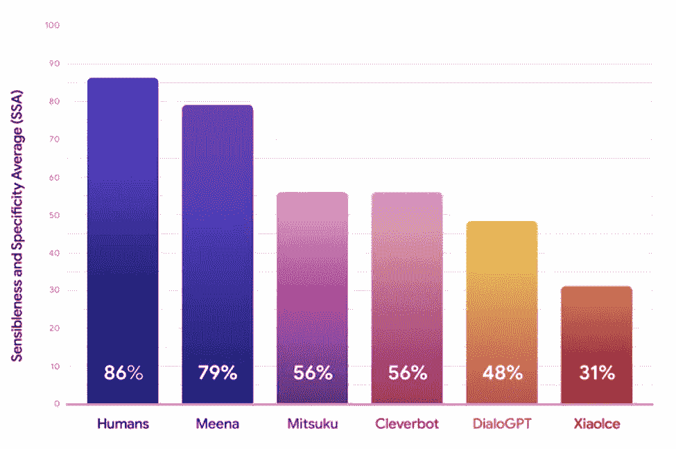
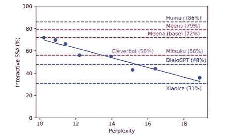

# 用类似人类的开放域聊天机器人聊任何事情

> 原文：<https://medium.com/analytics-vidhya/chat-about-anything-with-human-like-open-domain-chatbot-7649408fe279?source=collection_archive---------10----------------------->

谷歌开发的评估开放域聊天机器人的指标

今天的大多数聊天机器人在他们的对话中非常具体(根据他们的使用领域)，用户不能偏离他们的预期用途。他们不善于从过去的对话中保留上下文，有时会给出无意义、不合逻辑的回答，并且很容易给出“我不知道”的回答。

开放域聊天机器人是对话代理，可以谈论任何事情，并具有关于现实世界的基本知识。在研究论文“[迈向类似人类的开放域聊天机器人](https://arxiv.org/abs/2001.09977)”中，谷歌介绍了 Meena。Meena 被称为最聪明的聊天机器人，与其他聊天机器人不同，它的反应非常明智和具体。

聊天机器人面临的挑战之一是它们的评估。没有自动和定量的方法来确定一个开放域聊天机器人对人类的表现有多好。在本文中，我们将讨论两个这样的指标，但在此之前，让我们先看看什么是 Meena。

## 米娜的建筑

Meena 是一个神经会话模型，由 1 个进化的编码器(*处理来自过去会话的上下文)*和 13 个进化的解码器*(从编码器开发对上下文的响应)。* Meena 是一个进化的 transformer sequence2sequence 架构，旨在最小化困惑(选择下一个令牌/单词的不确定性)。在超参数调整之后，推断出强大的解码器对于更好的对话技巧是必要的。

Meena 使用 341 GB 的预处理社交媒体文本在 26 亿个参数上进行训练，这是 OpenAI 的 GPT-2(前最新生成模型)训练数据的 8.5 倍。

它是使用神经结构搜索(NAS)发现的。NAS 通过允许将更多资源用于性能良好的架构，而将更少或没有资源用于性能不佳的模型，来自动化神经架构的开发。

## **敏感性和特异性平均值(SSA)**

谷歌引入了一种新的评估开放域聊天机器人的指标，称为敏感度和特异性平均值(SSA)。为了进行测试，谷歌众包了 Meena 和其他一些开放域聊天机器人，如 Cleverbot、DialoGPT 等。

对于聊天机器人的每一个回答，人们都被问了两个问题:“这个回答是明智的吗”和“是具体的吗”。例如，如果一个人说“*我喜欢网球*”，聊天机器人回答说“*那很好*”。在这种情况下，聊天机器人的回复是*合理的*但不是*特定的*，因为它可以用于多种情况。反之，如果它回复“*太好了！！我爱罗杰·费德勒*，那么它也会被认为是特定的。

敏感和特异性平均值是敏感反应分数和特异性反应分数的平均值。结果证明，微调 Meena(79%)优于其他开放域聊天机器人，接近人类水平(86%)。所以基本上米娜在 SSA 评分上更胜一筹。

使用 SSA 的缺点是人工操作会降低聊天机器人的评估速度。

人类和各种开放域聊天机器人的 SSA 分数(来源:ai.googleblogs.com)

从上图可以明显看出，Meena(大号)在谈话艺术上接近人类水平。

## 困惑

困惑是一种自动度量，用于更快地评估语言模型。它衡量模型对用户将要说的话的预测程度。

此外，在研究过程中，得出的结论是，困惑与人类评估技术 SSA 高度相关，可用于聊天机器人的高效开发。

SSA vs 困惑(来源:ai.googleblogs.com)

这是令人鼓舞的，因为困惑是自动的，可以用标准的交叉熵损失函数来优化。

语言模型的高置信度由较低的困惑分数表示。Meena(没有微调)的困惑度为 10.2(越小越好)，这反映了 72%的 SSA。

# **进一步研究&结论**

除了敏感性和特异性之外，个性和真实性也是评估指标的一些属性。需要通过优化神经网络的算法、数据和架构来减少困惑。

出于安全考虑，谷歌目前没有发布任何外部研究演示。

所以，最后，困惑是迄今为止评估你的聊天机器人的最佳自动方式，因为它与人类的评估方法(SSA)有很强的相关性，我们离无法区分人类和聊天机器人的对话的时代不远了。

关于米娜更深入的直觉，请参考下面的链接。

 [## 走向类似人类的开放领域聊天机器人

### 我们提出 Meena，一个多回合的开放域聊天机器人，在从公共域挖掘和过滤的数据上进行端到端的训练…

arxiv.org](https://arxiv.org/abs/2001.09977) 

干杯，快乐学习

阿迪亚·普拉卡什·辛格，

Ontribe 首席人工智能官—【https://ontribe.in/ 