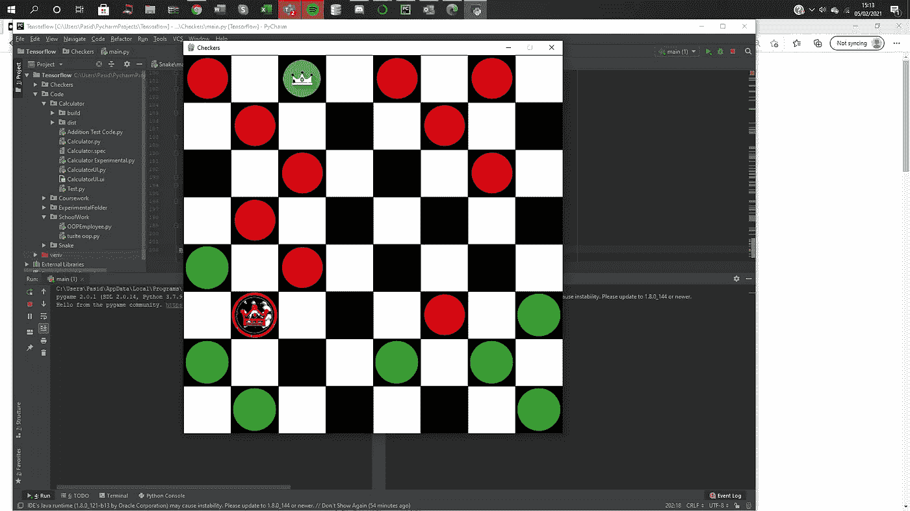

# 跳棋-Python

> 原文：<https://medium.com/analytics-vidhya/checkers-python-eff2786b985b?source=collection_archive---------1----------------------->



在过去的两天里，我花了几个小时在 python 上编写了一个简单的 checkers。总的来说，这个项目确实教会了我很多关于组织变量和装饰器使用的经验，尽管它们都没有进入应用程序的最终代码。如果有人试图自己开发应用程序，我建议您使用网格代码，然后自己尝试实现代码。为了提高代码的效率，我还建议您不要使用单独的 2d 数组来执行所有的检查；相反，挑战你自己，在包含所有部分的网格阵列上运行所有的东西。源代码将包含在下面:

```
import pygame
import random
import sys
from itertools import combinations

WIDTH = 800
ROWS = 8

RED= pygame.image.load('red.png')
GREEN= pygame.image.load('green.png')

REDKING = pygame.image.load('redKing.png')
GREENKING = pygame.image.load('greenKing.png')

WHITE = (255,255,255)
BLACK = (0,0,0)
ORANGE = (235, 168, 52)
BLUE = (76, 252, 241)

pygame.init()
WIN = pygame.display.set_mode((WIDTH,WIDTH))
pygame.display.set_caption('Checkers')

priorMoves=[]
class Node:
    def __init__(self, row, col, width):
        self.row = row
        self.col = col
        self.x = int(row * width)
        self.y = int(col * width)
        self.colour = WHITE
        self.piece = None

    def draw(self, WIN):
        pygame.draw.rect(WIN, self.colour, (self.x, self.y, WIDTH / ROWS, WIDTH / ROWS))
        if self.piece:
            WIN.blit(self.piece.image, (self.x, self.y))

def update_display(win, grid, rows, width):
    for row in grid:
        for spot in row:
            spot.draw(win)
    draw_grid(win, rows, width)
    pygame.display.update()

def make_grid(rows, width):
    grid = []
    gap = width// rows
    count = 0
    for i in range(rows):
        grid.append([])
        for j in range(rows):
            node = Node(j,i, gap)
            if abs(i-j) % 2 == 0:
                node.colour=BLACK
            if (abs(i+j)%2==0) and (i<3):
                node.piece = Piece('R')
            elif(abs(i+j)%2==0) and i>4:
                node.piece=Piece('G')
            count+=1
            grid[i].append(node)
    return grid

def draw_grid(win, rows, width):
    gap = width // ROWS
    for i in range(rows):
        pygame.draw.line(win, BLACK, (0, i * gap), (width, i * gap))
        for j in range(rows):
            pygame.draw.line(win, BLACK, (j * gap, 0), (j * gap, width))

class Piece:
    def __init__(self, team):
        self.team=team
        self.image= RED if self.team=='R' else GREEN
        self.type=None

    def draw(self, x, y):
        WIN.blit(self.image, (x,y))

def getNode(grid, rows, width):
    gap = width//rows
    RowX,RowY = pygame.mouse.get_pos()
    Row = RowX//gap
    Col = RowY//gap
    return (Col,Row)

def resetColours(grid, node):
    positions = generatePotentialMoves(node, grid)
    positions.append(node)

    for colouredNodes in positions:
        nodeX, nodeY = colouredNodes
        grid[nodeX][nodeY].colour = BLACK if abs(nodeX - nodeY) % 2 == 0 else WHITE

def HighlightpotentialMoves(piecePosition, grid):
    positions = generatePotentialMoves(piecePosition, grid)
    for position in positions:
        Column,Row = position
        grid[Column][Row].colour=BLUE

def opposite(team):
    return "R" if team=="G" else "G"

def generatePotentialMoves(nodePosition, grid):
    checker = lambda x,y: x+y>=0 and x+y<8
    positions= []
    column, row = nodePosition
    if grid[column][row].piece:
        vectors = [[1, -1], [1, 1]] if grid[column][row].piece.team == "R" else [[-1, -1], [-1, 1]]
        if grid[column][row].piece.type=='KING':
            vectors = [[1, -1], [1, 1],[-1, -1], [-1, 1]]
        for vector in vectors:
            columnVector, rowVector = vector
            if checker(columnVector,column) and checker(rowVector,row):
                #grid[(column+columnVector)][(row+rowVector)].colour=ORANGE
                if not grid[(column+columnVector)][(row+rowVector)].piece:
                    positions.append((column + columnVector, row + rowVector))
                elif grid[column+columnVector][row+rowVector].piece and\
                        grid[column+columnVector][row+rowVector].piece.team==opposite(grid[column][row].piece.team):

                    if checker((2* columnVector), column) and checker((2* rowVector), row) \
                            and not grid[(2* columnVector)+ column][(2* rowVector) + row].piece:
                        positions.append((2* columnVector+ column,2* rowVector+ row ))

    return positions

"""
Error with locating opssible moves row col error
"""
def highlight(ClickedNode, Grid, OldHighlight):
    Column,Row = ClickedNode
    Grid[Column][Row].colour=ORANGE
    if OldHighlight:
        resetColours(Grid, OldHighlight)
    HighlightpotentialMoves(ClickedNode, Grid)
    return (Column,Row)

def move(grid, piecePosition, newPosition):
    resetColours(grid, piecePosition)
    newColumn, newRow = newPosition
    oldColumn, oldRow = piecePosition

    piece = grid[oldColumn][oldRow].piece
    grid[newColumn][newRow].piece=piece
    grid[oldColumn][oldRow].piece = None

    if newColumn==7 and grid[newColumn][newRow].piece.team=='R':
        grid[newColumn][newRow].piece.type='KING'
        grid[newColumn][newRow].piece.image=REDKING
    if newColumn==0 and grid[newColumn][newRow].piece.team=='G':
        grid[newColumn][newRow].piece.type='KING'
        grid[newColumn][newRow].piece.image=GREENKING
    if abs(newColumn-oldColumn)==2 or abs(newRow-oldRow)==2:
        grid[int((newColumn+oldColumn)/2)][int((newRow+oldRow)/2)].piece = None
        return grid[newColumn][newRow].piece.team
    return opposite(grid[newColumn][newRow].piece.team)

def main(WIDTH, ROWS):
    grid = make_grid(ROWS, WIDTH)
    highlightedPiece = None
    currMove = 'G'

    while True:
        for event in pygame.event.get():
            if event.type== pygame.QUIT:
                print('EXIT SUCCESSFUL')
                pygame.quit()
                sys.exit()

            if event.type == pygame.MOUSEBUTTONDOWN:
                clickedNode = getNode(grid, ROWS, WIDTH)
                ClickedPositionColumn, ClickedPositionRow = clickedNode
                if grid[ClickedPositionColumn][ClickedPositionRow].colour == BLUE:
                    if highlightedPiece:
                        pieceColumn, pieceRow = highlightedPiece
                    if currMove == grid[pieceColumn][pieceRow].piece.team:
                        resetColours(grid, highlightedPiece)
                        currMove=move(grid, highlightedPiece, clickedNode)
                elif highlightedPiece == clickedNode:
                    pass
                else:
                    if grid[ClickedPositionColumn][ClickedPositionRow].piece:
                        if currMove == grid[ClickedPositionColumn][ClickedPositionRow].piece.team:
                            highlightedPiece = highlight(clickedNode, grid, highlightedPiece)

        update_display(WIN, grid,ROWS,WIDTH)

main(WIDTH, ROWS)
```

当涉及到游戏逻辑的编程时，没有什么是过于复杂的，这个游戏几乎是我以前制作的象棋游戏的简化，但是这个程序增加了特定的复杂性，如果玩家杀死一个棋子，我们需要给他们增加额外的移动，如果他们能够杀死一个棋子，我们需要改变一个棋子的潜在移动。我确实试图尽可能地将我的代码分割成函数，以使任何查看代码的人都能理解。

使用 decorators，您可以添加检查玩家何时赢得游戏的功能。你可以用一个静态的方法来计算每一方移动后的棋子数量，如果数量为 0，那么对方就赢了。如果你从未听说过装修工

本质上，装饰者所做的就是在你已经创建的函数上添加额外的功能。

注意:如果你要复制我的源代码，你需要找到一些新的作品来展示在黑板上，并把它们命名为 green.png、red.png 等。还要注意的是，我在我的图像上使用了背景去除剂，你可以很容易地在网上找到，你可以通过绘画降低图像的尺寸。

如果您对代码有任何问题，请留下您的评论，我会回复您可能需要的任何指导。我希望这篇文章有用！