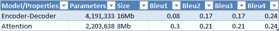

# 胸部 x 光图像字幕

> 原文：<https://medium.com/analytics-vidhya/chest-x-rays-image-captioning-70abb55d41c4?source=collection_archive---------4----------------------->

使用胸部 x 光预测结果


[来源](https://evergreen.team/assets/images/articles/machine-learning/image_generator.png)

# 目录

1.  介绍
2.  商业问题
3.  问题到 ML 问题的映射
4.  性能指标和业务约束
5.  现有解决方案和方法
6.  探索性数据分析
7.  特征工程
8.  建模和评估
9.  丰富
10.  链接
11.  参考

# 1.简介:

I 图像字幕是基于图像生成文本(字幕)的过程。图像字幕使用自然语言处理(NLP)和计算机视觉(CV)来生成文本输出。x 射线是一种电磁辐射，用于医学成像。x 光可以用来发现骨折、骨伤或任何肿瘤。分析 X 射线报告是放射科医生和病理学家的一项非常重要的任务，以向患者推荐正确的诊断。

# 2.业务问题:

该数据集可从以下网址获得。

PNG 图像:

[](http://academictorrents.com/details/5a3a439df24931f410fac269b87b050203d9467d) [## 印第安纳大学-胸透(PNG 图片)

### @article{，title = {印第安纳大学-胸透(PNG 图片)}，关键词= {放射学，胸透}，作者=…

academictorrents.com](http://academictorrents.com/details/5a3a439df24931f410fac269b87b050203d9467d) 

XML 报告:

[](http://academictorrents.com/details/66450ba52ba3f83fbf82ef9c91f2bde0e845aba9) [## 印第安纳大学-胸部 x 光检查(XML 报告)

### 来自印第安纳大学医院网络的 1000 份胸部 x 光影像放射学报告。

academictorrents.com](http://academictorrents.com/details/66450ba52ba3f83fbf82ef9c91f2bde0e845aba9) 

在这个特殊的案例研究中，我们得到了一组图像(胸部 x 光)和放射科医生从这些图像中推断出的印象。

我们必须开发和训练一个模型，该模型基于以图像格式提供的胸部 X 射线和发现以及以 XML 格式提供的一些其他数据来生成印象。

这种类型的模型可以为放射科医生节省大量分析报告和给出印象的时间。此外，该模型可以用作验证某些决策的基础模型，因为与其他领域不同，医疗领域的错误成本非常高。

# 3.问题到 ML 问题的映射:

在这个案例研究中，我们要解决的问题是医学图像字幕或报告生成。

基本上，我们必须从头开始使用卷积神经网络(CNN)或使用迁移学习(最好是因为我们的数据量较少)从图像中提取特征(瓶颈)特征。然后使用这些提取的特征来预测字幕。输出将是一个单词序列。

# 4.性能指标和业务限制:

不同 n-gram(1，2，3，4…)的 BLEU 分数在顺序输出模型的情况下是一个很好的度量。

*   可解释性相当重要。
*   没有延迟限制。
*   由于医疗领域的错误成本非常高，该模型的预测应该非常好。即使尝试了不同的架构，数据越多，模型的性能越好。

# 5.现有解决方案和方法:

**美国有线电视新闻网关于 x 光的预培训:**

为了从图像中提取特征，我们有多个预先训练好的网络(模型),如 Vgg16、EfficientNet 等。接受过各种图像的训练。CheXNet 是一个 121 层的 CNN，在 ChestX-ray14 上训练，包含超过 1 个 lakh 正面视图 X 射线图像。经过训练后，它在识别 14 种疾病方面比放射科医生表现得更好。由于我们正在解决的问题也包含类似类型的图像，预训练的 CheXNet 可以用于从 X 射线中提取特征。

**贪婪搜索和波束搜索解码器:**

对于在解码器端生成字，可以实施不同的策略。

贪婪搜索是生成输出的普通实现。从整个词汇中选择一个概率最大的单词。

但是在解码器的每个时间步长的波束搜索中，我们选择出现可能性最大的顶部 K 个字(K =波束长度)并生成字。我们实例化模型的 K 个独立版本，并使用它们来生成单词。但是随着波束宽度的增加，推断时间增加，使得预测变得缓慢，并且存储器消耗增加。

# 6.探索性数据分析:

**数据集分析:**

提取后。使用 tarfile 的 tgz 文件的统计信息是

图像总数:7470

报告总数:3955 份

由于每个患者都有一份独特的报告，因此少数患者会有一份以上的 X 射线报告。

**检查图像尺寸:**

图像尺寸的独特宽度:1

图像尺寸的独特高度:304

所有图像的宽度相同，但高度不同。必须根据预先训练的图像模型输入大小的 i/p 大小来重新调整图像的大小。

**从 XML 中提取信息&创建数据帧:**

每个病人的报告和发现都以 XML 格式给出。该 XML 报告还包含与每个患者相关的 X 射线图像名称。

使用上面的代码片段提取患者 id、与患者相关的 X 射线图像以及放射科医师从 X 射线中推断出的结果。

**统计与每个患者相关的图像数量:**


与每个患者相关的 x 光片数量

*   超过 3000 名患者有两张与报告相关的 x 光图像
*   大约 500 名患者有一张与报告相关的 x 光片
*   极少数病人有两个以上的 X 射线与报告

因此，为了捕捉大部分信息，我们给模型输入两个图像，如下所示

*   如果患者有一张与报告相关的 x 光片，我们复制相同的图像两次，作为图像 1 和图像 2
*   如果患者有两张以上与报告相关的 x 光片，我们随机选择两张 x 光片作为图像 1 和图像 2

**文本特征的基本处理(发现):**

*   将文本转换成小写
*   使用帖子 https://stack overflow . com/questions/1979 01 88/expanding-English-language-contractions-in-python 中的代码扩展收缩
*   其他基础处理如下所示

**调查结果栏统计的字数:**


字数

99%的调查结果的字数少于或等于 76 个单词。

而 50%的调查结果的字数少于或等于 29 个单词。

**一个样本 X 射线和相应的发现:**


x 光和相应的发现

# 7.特征工程:

**在 x 光片上加载预先训练好的 CNN 模型，提取瓶颈特征:**

预训练的 CheXnet 模型可以在下面的链接中找到。

[](https://github.com/brucechou1983/CheXNet-Keras) [## Bruce Hou 1983/chex net-Keras

### 这个项目是一个构建 CheXNet 类模型的工具，用 Keras 编写。ChexNet 是一种深度学习算法，可以…

github.com](https://github.com/brucechou1983/CheXNet-Keras) 

创建了一个 DenseNet121 模型，并加载了预训练 CheXnet 模型的权重。放弃模型的最后两层，使用瓶颈特征作为图像的表示。

由于每个患者对应两个 X 射线，因此根据 DenseNet121 模型的输入对每个图像进行预处理，并在最后连接两个图像的模型预测。

**添加开始和结束标记:**

用于解决图像字幕问题的模型架构通常遵循编码器-解码器类型的架构。

需要对文本进行符号化来训练模型，并在模型训练时计算损失。标记化是指将句子拆分成单词，并将每个单词分配给一个整数。在模型架构中需要输入文本的地方，我们创建一个[嵌入层](https://keras.io/api/layers/core_layers/embedding/)，并给出标记化的文本作为输入。该层具有参数 Trainable = True，这意味着通过模型训练学习单词嵌入，或者如果设置为 False，则可以使用预训练的单词嵌入。

开始和结束标记是分别添加在句子开始和结尾的特殊标记，以让模式学习句子的开始和结束。

```
data['findings_total'] = '<start>' + ' ' + data.findings.astype(str) + ' ' +'<end>'data['dec_ip'] = '<start>' + ' ' + data.findings.astype(str)  #Decoder inputdata['dec_op'] = data.findings.astype(str) + ' ' +'<end>'     #Decoder output
```

使用 pickle 库将包含预处理文本和图像特征的数据框保存到 Pickle 文件中，以备后用。

# 8.建模和评估:

使用的模型架构是编码器-解码器和注意力模型。

编码器-解码器架构


编码器-解码器架构

时间分布设计层在最后应用，因为输出是顺序输出，并且应该应用于输出的每个时间片。

注意力模型架构:


注意力模型架构

```
#Bahdanau's additive style Attention codeself.decoder_hidden_state = decoder_hidden_stateself.encoder_output = encoder_outputself.decoder_hidden_state = tf.expand_dims(self.decoder_hidden_state,axis = 1)score = self.v(tf.nn.tanh(self.w1(self.decoder_hidden_state) + self.w2(self.encoder_output)))attention_weights = tf.nn.softmax(score, axis=1)context_vector = attention_weights * self.encoder_outputcontext_vector = tf.reduce_sum(context_vector, axis=1)
```

使用波束搜索来预测句子。

注意模型+波束搜索对测试数据的一些预测

**预测一:**

原句为:<start>心脏大小正常。稳定的心脏纵隔轮廓。没有气胸，胸腔积液，或局灶性空气病变。骨骼结构排列整齐，没有断裂。</start>

预测的句子是:<start>心脏大小正常，纵隔轮廓在正常范围内。没有胸腔积液或气胸。没有局灶性空气间隙阴影提示肺炎。没有胸腔积液或气胸。</start>


预测-1

**预测二:**

原句是:<start>纵隔轮廓正常。肺部没问题。没有气胸或大量胸腔积液。</start>

预测的句子是:<start>心脏大小正常。肺部清晰无浸润。没有积液或气胸。</start>


模型比较:



模型比较

使用 streamlit 创建并部署了一个 webapp。使用该应用程序实时做出的预测可以在下面的 gif 中查看。


可交换的图像格式

# 9.改进:

*   不同的架构可以用[论文](https://arxiv.org/pdf/1703.09137.pdf)中提到的选项进行试验
*   通过增加波束宽度可以提高推理输出质量，但要以牺牲计算资源为代价
*   显然，在这个案例研究中，数据集的大小非常有限，因此更多的数据可以提高模型预测

# 10.链接:

[](https://www.linkedin.com/in/srinivasa-raja-yaramati-aba535113/) [## Srinivasa Raja Yaramati -数据科学家- Infosys | LinkedIn

### 查看 Srinivasa Raja Yaramati 在世界上最大的职业社区 LinkedIn 上的个人资料。斯里尼瓦萨拉贾有 1…

www.linkedin.com](https://www.linkedin.com/in/srinivasa-raja-yaramati-aba535113/) 

存储库的 Github 链接

[](https://github.com/Srinivasa-Raja/Chexnet_Image_Captioning) [## srinivasa-Raja/chex net _ Image _ 字幕

### 此存储库由以下笔记本组成 cs2_preprocess_V2.ipynb:对图像数据和文本数据进行预处理…

github.com](https://github.com/Srinivasa-Raja/Chexnet_Image_Captioning) 

# 11.参考资料:

[https://machinelementmastery . com/beam-search-decoder-natural-language-processing/](https://machinelearningmastery.com/beam-search-decoder-natural-language-processing/)

[https://nlp.seas.harvard.edu/slides/emnlp16_bso.pdf](https://nlp.seas.harvard.edu/slides/emnlp16_bso.pdf)

[](https://towardsdatascience.com/image-captioning-using-deep-learning-fe0d929cf337) [## 使用深度学习的医疗报告生成

### 利用编解码模型和注意机制生成胸部 x 光医学报告。

towardsdatascience.com](https://towardsdatascience.com/image-captioning-using-deep-learning-fe0d929cf337) 

[https://www.appliedaicourse.com/](https://www.appliedaicourse.com/)