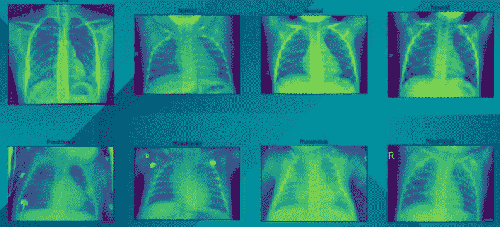
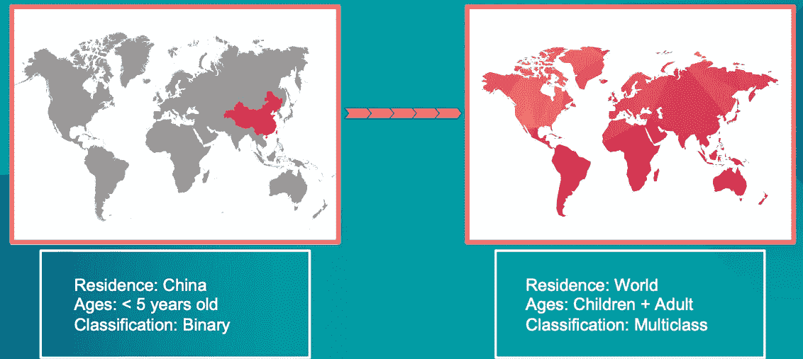

# 基于卷积神经网络的胸部 X 线肺炎检测

> 原文：<https://medium.com/analytics-vidhya/chest-x-rays-pneumonia-detection-using-convolutional-neural-network-b9316f527c15?source=collection_archive---------5----------------------->

## 使用深度学习 CNN 从 X 射线图像检测肺炎的完整指南


[疾控中心](https://unsplash.com/@cdc?utm_source=medium&utm_medium=referral)在 [Unsplash](https://unsplash.com?utm_source=medium&utm_medium=referral) 拍摄的照片

# 背景

**什么是肺炎？**

肺炎是一种感染，使一个或两个肺部的气囊发炎。气囊可能会充满液体或脓液(脓性物质)，导致咳嗽伴有痰或脓、发烧、发冷和呼吸困难[1]。肺炎患者可能需要住院或入住重症监护室(ICU) [2]。

***关于肺炎的一些事实？***

*   肺炎每年导致 100 多万人住院，50，000 多人死亡[3]。
*   这是世界上五岁以下儿童死亡的主要原因。
*   在美国，肺炎是儿童和成人住院的最常见原因[3]。

***挑战***

*   胸部 x 光被认为是检测任何形式肺炎的最佳工具。研究表明，即使是经验丰富的放射科医生也很难正确识别 X 射线上的某种物质是否是渗透物(密度大于空气的物质，如脓或液体)[4]，从而导致诊断延迟，增加疾病的严重程度。
*   对许多人来说，肺炎的风险是巨大的，尤其是在污染严重、医疗资源和人员不足的发展中国家。例如，在非洲的 57 个国家中，存在着 230 万医生和护士的缺口。医生和护士的缺乏使得肺炎的诊断和治疗更加困难。

# 目标


迫切需要对肺炎进行准确和快速的诊断，尤其是对贫困人群而言。我的目标是建立一个深度学习模型，通过检查 x 光图像来自动识别病人是否患有肺炎。

# 资料组

本项目使用的数据集可在[https://www . ka ggle . com/paultimothymooney/chest-x ray-pneumonia](https://www.kaggle.com/paultimothymooney/chest-xray-pneumonia)找到。该数据集包含来自中国广州一家医疗中心的 5 岁以下儿科患者的 5，856 张检查 X 射线图像。



# 数据探索

数据集包括两类图像，正常图像和肺炎图像。我将整个数据集分成 70%的训练、20%的验证和 10 %的测试。数据集的每组具有相同的类别分布，即肺炎图像的 73%和正常图像的 27%。


***导入必要的库***

***拆分数据集***

# 图像预处理

通过像素归一化和数据扩充对训练数据集中的图像进行预处理。

```
Found 4099 images belonging to 2 classes.
Found 1172 images belonging to 2 classes.
Found 585 images belonging to 2 classes.
```

# 建模

我训练了 20 多个模型，这些模型具有不同的模型架构，具有不同数量的卷积层、时期、密集层、特征图、漏失和批量归一化。我的最佳性能模型有 3 个卷积 2D 层，每个层后面都有一个最大池层。展平后，它被送入一个具有 ReLU 激活的全连接层。由于这是一个二元分类问题，我使用 sigmoid 激活来预测输出概率。

```
Epoch 1/10
33/33 [==============================] - 25s 745ms/step - loss: 0.6201 - acc: 0.6800 - val_loss: 0.5333 - val_acc: 0.7295
Epoch 2/10
33/33 [==============================] - 24s 747ms/step - loss: 0.4780 - acc: 0.7644 - val_loss: 0.2911 - val_acc: 0.8780
Epoch 3/10
33/33 [==============================] - 23s 706ms/step - loss: 0.3938 - acc: 0.8081 - val_loss: 0.2997 - val_acc: 0.8951
Epoch 4/10
33/33 [==============================] - 23s 699ms/step - loss: 0.3121 - acc: 0.8784 - val_loss: 0.3531 - val_acc: 0.8439
Epoch 5/10
33/33 [==============================] - 23s 715ms/step - loss: 0.2873 - acc: 0.8818 - val_loss: 0.2817 - val_acc: 0.8985
Epoch 6/10
33/33 [==============================] - 24s 721ms/step - loss: 0.3011 - acc: 0.8698 - val_loss: 0.2276 - val_acc: 0.9096
Epoch 7/10
33/33 [==============================] - 24s 722ms/step - loss: 0.2601 - acc: 0.8908 - val_loss: 0.1999 - val_acc: 0.9334
Epoch 8/10
33/33 [==============================] - 24s 727ms/step - loss: 0.2638 - acc: 0.8884 - val_loss: 0.1975 - val_acc: 0.9172
Epoch 9/10
33/33 [==============================] - 24s 720ms/step - loss: 0.2416 - acc: 0.8950 - val_loss: 0.3122 - val_acc: 0.8643
Epoch 10/10
33/33 [==============================] - 23s 725ms/step - loss: 0.2839 - acc: 0.8806 - val_loss: 0.2026 - val_acc: 0.9138
```

# 评估模型性能

## 训练和验证损失图

**训练和验证损失**:损失值由损失函数计算得出。损失函数用于优化模型性能。损失是根据训练和验证计算的，其解释基于模型在这两个数据集中的表现。它是训练集或验证集中每个示例的误差总和。损失值意味着每次优化迭代后模型表现的好坏。

## 训练和验证准确度图

**训练和验证精度**:模型的精度通常是在模型参数之后确定的，以百分比的形式计算。这是衡量模型预测与真实数据相比有多准确的标准。

## 混淆矩阵

## ROC 曲线和 AUC 评分

**ROC 和 AUC** : AUC — ROC 曲线是在各种阈值设置下对分类问题的性能度量。ROC 是概率曲线，AUC 代表可分性的程度或度量。它告诉我们这个模型在多大程度上能够区分不同的类。

## 汇总统计数据

*   **准确度= (TP + TN) /(总观察值)**:模型正确的预测总数
*   **Precision = TP / (TP+FP)** :预测阳性数中的真阳性数
*   **真阳性率/召回率/灵敏度= TP / (TP+FN)** :实际总阳性数中的真阳性数
*   **特异性= TN / (TN+FP)** :实际总阴性数中的真阴性数
*   **假阳性率= 1 —特异性= FP / (TN+FP)** :实际总阴性数中的假阳性数
*   **F1 得分**:精度和召回率的调和平均值。当一个模特的 F1 分数很高时，你知道你的模特做得很好。

# 结果

*   通过学习过程中的每个时期，验证损失和训练损失彼此接近，这意味着我们的模型没有太多的过拟合或欠拟合。此外，训练和验证准确度分数最终也收敛到它们几乎相等的一些点。


*   对于检测肺炎的情况，我们的目标是高召回率，因为任何延误的诊断都意味着有人可能真的生病，并可能失去生命。该模型的召回率为 98.36%，令人印象深刻，这正是我们的目标。

```
[Summary Statistics]
Accuracy = 96.24% | Precision = 96.55% | Recall = 98.36% | Specificity = 90.51% | F1 Score = 97.45%
```

# 结论

1.  我们的 CNN 模型可以以极高的准确性有效地检测肺炎疾病。
2.  放射科医生可以结合这个模型和他们的专业知识，做出高度准确的肺炎诊断。

# 未来的工作



*   要使模型更加稳健，请增加数据集中的数量和多样性。例如，包括来自不同国家和不同年龄的患者的 X 射线图像。
*   我们目前的模型是二元分类模型，识别患者是否患有肺炎。事实上，患者可能患有不同类型的肺病。在未来，我想收集不同类型的肺部 X 射线图像，并建立一个模型来自动诊断肺部疾病的类型。

# 参考

[1]:肺炎[https://www . mayo clinic . org/diseases-conditions/Pneumonia/symptomics-causes/syc-20354204](https://www.mayoclinic.org/diseases-conditions/pneumonia/symptoms-causes/syc-20354204)

[2]:美国肺脏协会。(2020 年 5 月 27 日)。*了解肺炎*。[https://www . lung . org/lung-health-diseases/lung-disease-lookup/pneumonia/learn-about-pneumonia](https://www.lung.org/lung-health-diseases/lung-disease-lookup/pneumonia/learn-about-pneumonia)

[3]:美国胸科学会。2019 年 20 大肺炎事实。[https://www . thoracic . org/patients/patient-resources/resources/top-pneumonia-facts . pdf](https://www.thoracic.org/patients/patient-resources/resources/top-pneumonia-facts.pdf)

[4]: GE 医疗保健。(2019 年 2 月 25 日)。人工智能可能是通过 x 光识别肺炎的关键。[https://www . gehealthcare . com/feature-article/ai-could-hold-the-key-to-identifying-pneumonia-via-x-ray #:~:text = Chest % 20X % 2 ray % 20 have % 20 long，via % 20X % 2 ray % 20a % 20 challenge](https://www.gehealthcare.com/feature-article/ai-could-hold-the-key-to-identifying-pneumonia-via-x-ray#:~:text=Chest%20X%2Drays%20have%20long,via%20X%2Dray%20a%20challenge)。