# 使用 FbProphet 预测芝加哥犯罪率

> 原文：<https://medium.com/analytics-vidhya/chicago-crime-rate-forecasting-using-fbprophet-17757f45e9bb?source=collection_archive---------6----------------------->

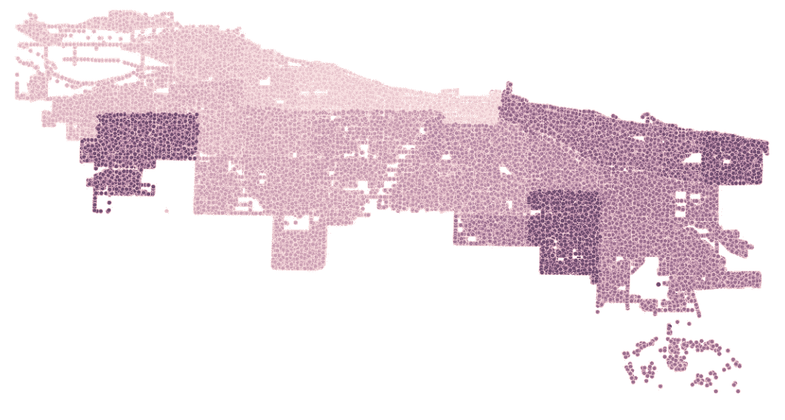

这篇博文重点分析了 2001 年至 2016 年芝加哥的犯罪率，并根据历史趋势预测了 2017 年的犯罪率统计数据。芝加哥是美国最大的城市之一，该市的整体犯罪率，尤其是暴力犯罪率，高于美国平均水平。数据集已从芝加哥警察局的 CLEAR(公民执法分析和报告)系统获得，可在此[下载](https://www.kaggle.com/currie32/crimes-in-chicago)。该数据集包含 16 年的 7，941，282 个条目。数据集包含以下列:

1.  **ID:** 犯罪事件的唯一标识符。
2.  **案例号:**记录分配给事件的部门号。
3.  **日期:**事件发生的日期。
4.  **块:**块事件的地址。
5.  **IUCR:** 伊利诺伊州统一犯罪举报代码。
6.  **主要类型:**根据 IUCR 法典对犯罪的主要描述。
7.  **描述:**事件的二级描述。
8.  **地点描述:**事件发生地点的描述。
9.  **逮捕:**判断正误罪犯是否被逮捕。
10.  **国内:**判断事件是否与国内相关。
11.  **巡逻区:**一个巡逻区是最小的警务地理区域——每个巡逻区都有专门的警务巡逻车。
12.  **地区:**事件发生的地区。
13.  **选区:**事件发生地的市议会区。
14.  **社区区:**芝加哥有 77 个社区区。
15.  **联邦调查局代码:**根据联邦调查局国家事故报告系统(NIBRS)进行的犯罪分类。
16.  **X 坐标:**事件的 X 坐标。
17.  **Y 坐标:**事件的 Y 坐标。
18.  **年份:**事件发生的年份。
19.  **更新日期:**记录上次更新的日期和时间。
20.  **纬度:**事发的纬度。
21.  **经度:**事发地点的经度。
22.  **地点:**事发地点

注意:这项研究严格意义上是出于教育目的，旨在帮助个人分析数据。由于这个原因，我使用了 2001 年至 2016 年的数据，而不是更近的数据。

# FB 先知

脸书先知是一个时间序列预测模型，其核心是一个加性回归模型。它适用于具有强烈季节性影响的数据和几个季节的历史数据。Prophet 对异常值、缺失数据和时间序列的剧烈变化也很稳健。与其他预测模型相比，Prophet 提供了两个主要优势， **Prophet 使创建合理、准确的预测变得更加简单**和 **Prophet 预测可以以非专家直观的方式定制。**FB prophet 的四个主要组件包括:

*   分段线性或逻辑增长曲线趋势。Prophet 通过从数据中选择变化点来自动检测趋势的变化。
*   使用傅立叶级数模拟的年度季节分量。
*   使用虚拟变量的每周季节性成分。
*   用户提供的重要节假日列表。

# 数据分析

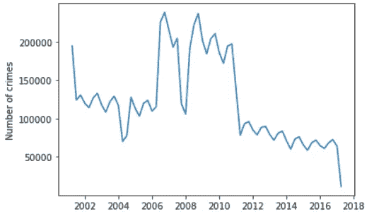

从上图可以看出，犯罪数量从 2006 年开始急剧上升，然后在 2011 年开始下降。自 2011 年以来，我们可以看到犯罪数量呈下降趋势。在这一点上，我提出一个假设，芝加哥的**犯罪将在 2017-2018 年继续减少。**

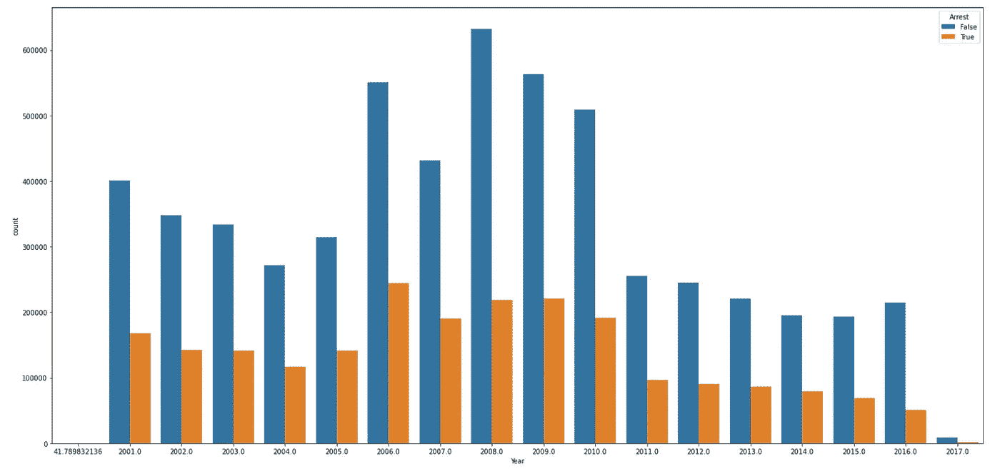

芝加哥警察局成功地减少了犯罪总数。蓝色条显示没有导致逮捕的犯罪，橙色条显示导致逮捕的犯罪。

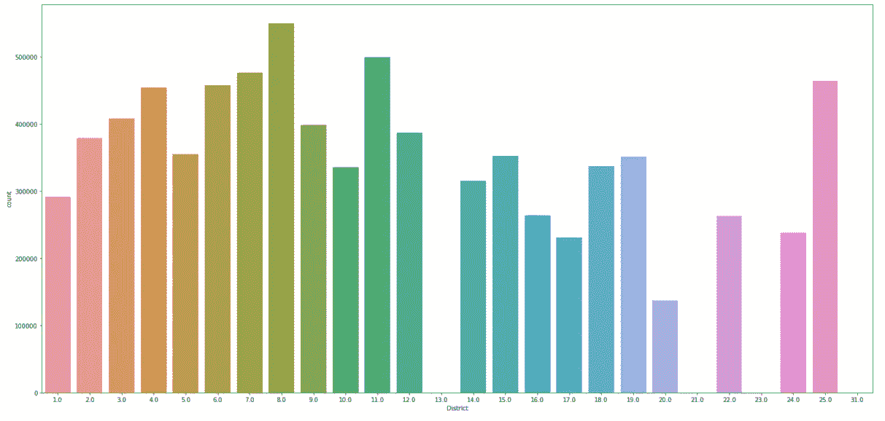

第 8 区的犯罪率最高，第 20 区的犯罪率最低。(第 13、21、23 和 31 区的犯罪率为零，这可能是因为数据不完整)

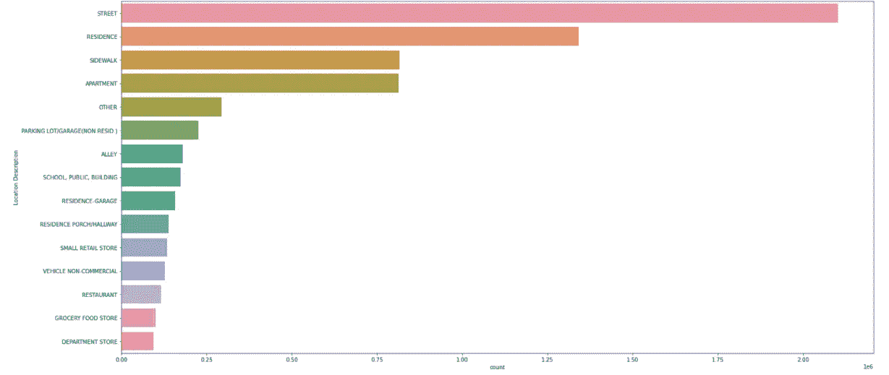

图表显示，芝加哥的街道是最不安全的，街道上的犯罪数量是人行道上犯罪数量的两倍多。

在下图中，你可以看到盗窃是芝加哥最常见的犯罪，只有 10%的盗窃案导致逮捕，其余的仍未破案。

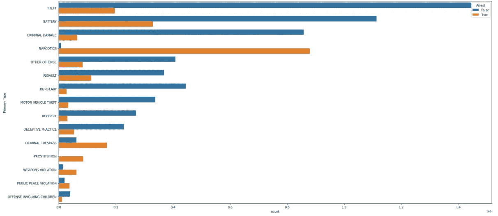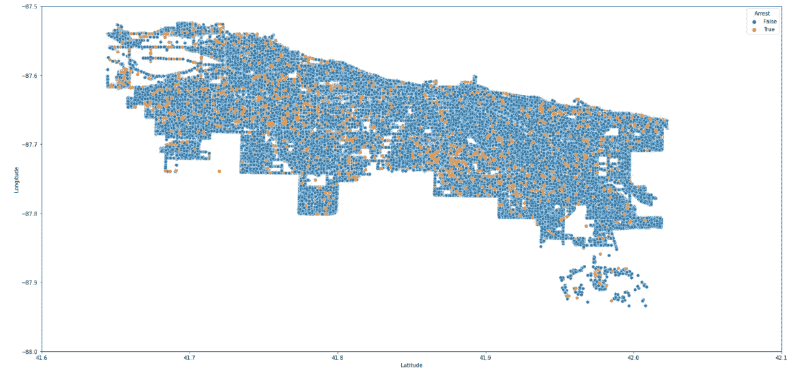

橙色标记表示导致逮捕的罪行，蓝色标记表示不会导致逮捕的罪行。只有在一小部分犯罪中，罪犯被逮捕。

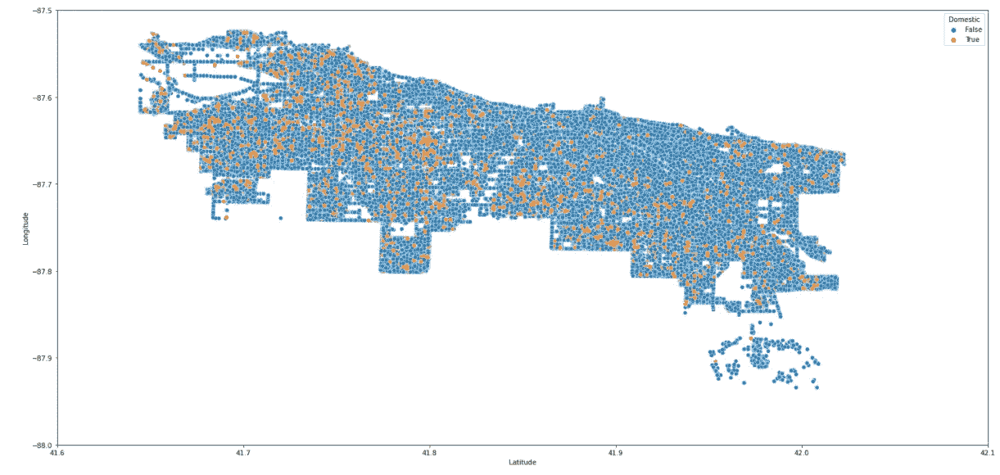

该图显示犯罪是否是家庭犯罪，橙色标记显示与家庭相关的犯罪，蓝色标记显示非家庭犯罪。

# **模型拟合**

按照以下步骤下载 FbProphet:

```
1\. conda create -n fbp python=3.8.82\. conda activate fbp4\. conda install numpy cython -c conda-forge

5\. conda install matplotlib scipy pandas -c conda-forge6\. conda install pystan -c conda-forge7\. conda install -c conda-forge fbprophet
```

将模型拟合到包含特定日期的犯罪日期和数量的数据框架中。使用以下命令重命名数据帧:

```
df = df_prophet.rename(columns={'Date':'ds', 'Crime_count': 'y'})
```

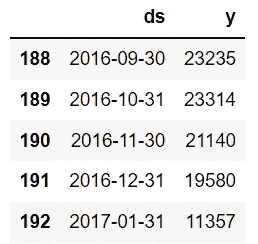

```
**from** **fbprophet** **import** Prophetprophet = Prophet()
prophet.fit(df)forecast = prophet.predict(
prophet.make_future_dataframe(periods=365))figure = prophet.plot(forecast, xlabel='Years', ylabel='Crime Rate')
```

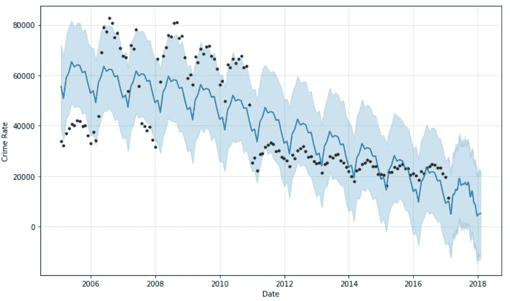

# 结果

该图显示了 2017-18 年的负面趋势，这符合我们最初的假设，即芝加哥正日益成为一个越来越安全的城市。

此外，使用 FbProphet，我们还可以分析以下图表:

```
figure = prophet.plot_components(forecast)
```

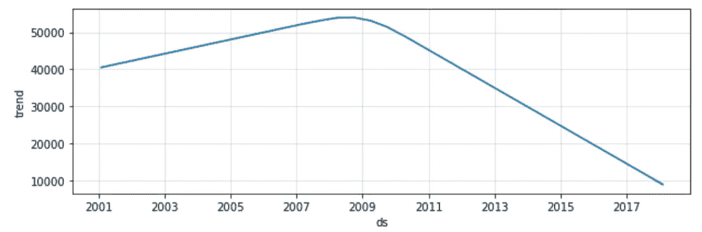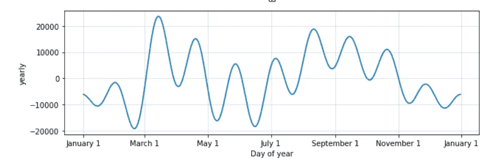

该图显示了 3 月 1 日至 5 月 1 日的最高犯罪率和 11 月 1 日至 3 月 1 日的最低犯罪率。