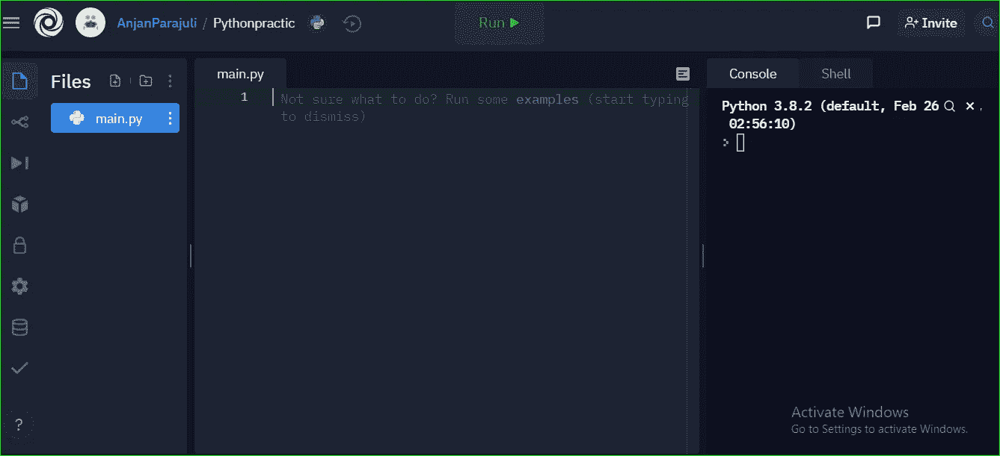
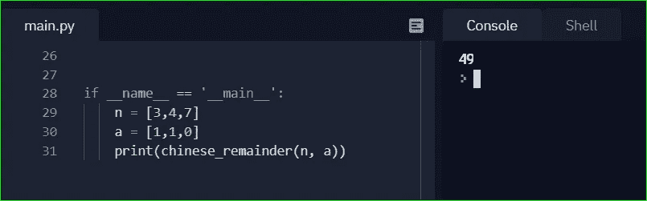

# 用 Python 实现中国剩余定理

> 原文：<https://medium.com/analytics-vidhya/chinese-remainder-theorem-using-python-25f051e391fc?source=collection_archive---------3----------------------->


感谢中国剩余定理帮助我们计算大整数。因为在开发计算机时，普遍存在硬件和软件的问题。选择它所能计算的极限数量在某种程度上决定了我们硬件的复杂性。

如果使用不太复杂的计算机，更高数值的计算会更加困难。但是这个定理已经帮助我们的计算受限的设备通过用允许的值表示它们来执行更高值的计算。它表示使用元组除以相对素的正整数后的余数形式的大数。

等等，什么？

你说最容易，但要理解这一段开头也很难。

😀😀好了，不用担心，现在我们要解决那些与定理相关的问题。在深入应用部分之前，我只是提供了一些理论来帮助你获得一点点关于你为什么学习这个定理的智慧。

伙计们，我们开始吧。

## 步骤 1:打开您可以编码的 python 环境。



这里我用 repl.it 来编码。这是一个免费的平台，你可以写任何代码。要使用它，在浏览器中打开 [repl.it](https://replit.com/) 并创建一个新的 repo，选择语言为 python。

## 第二步:用 Python 复制我在这里给出的代码。

```
*# Python 3.6*
**from** functools **import** **reduce**
**def** chinese_remainder**(m**, a**)**:
    **sum** = **0**
    prod = **reduce(lambda** acc, b: acc*b, m**)**
    **for** n_i, a_i **in** **zip(**n, a**)**:
        p = prod // n_i
        **sum** += a_i * mul_inv**(**p, n_i**)** * p
    **return** **sum** % prod

**def** mul_inv**(**a, b**)**:
    b0 = b
    x0, x1 = **0**, **1**
    **if** b == **1**: **return** **1**
    **while** a > **1**:
        q = a // b
        a, b = b, a%b
        x0, x1 = x1 - q * x0, x0
    **if** x1 < **0**: x1 += b0
    **return** x1

**if** __name__ == '__main__':
    m= **[3,4,7]**
    a = **[1,1,0]**
    **print(**chinese_remainder**(m**, a**))**#Code referenced from [rosettacode.org](https://rosettacode.org/wiki/Chinese_remainder_theorem#Python)
```

这里，程序求解线性同余系统的形式为:

x ≡1(模 3)
x≡1(模 4)
x≡0(模 7)

## 第三步:如何输入

输入时需要代码末尾的三行，其中
m =模数列表。

所以，上面的线性同余系统会有

m=[3，4，7]

a 是开头的整数列表

a=[1，1，0]

这是你如何写你的投入。对于任意数量的线性同余，您可以使用本步骤中给出的相同格式。是的，你只需要理解最后三行就可以解决你的中国余数问题，根本不用任何 python 语言。

## 步骤 4:查找输出

插入 m 和 a 的值后，保持最后一行代码不变，然后运行程序。得到的输出值就是解。



上述系统的输出为 49。所以这意味着任何与
49 模(3*4*7)全等的值都将是上述方程组的解。这里，(3*4*7)是所有模数的乘积。

解=49+k*105

其中 k 是任意整数。

哦是的！！😀我们做到了。我们终于做到了。拍拍你的背。这是一个我们应该理解和解决的重要概念，而你解决了它。

谢谢我的朋友们陪我这么久。

我会定期发布像这样的重要概念。

一会儿见。