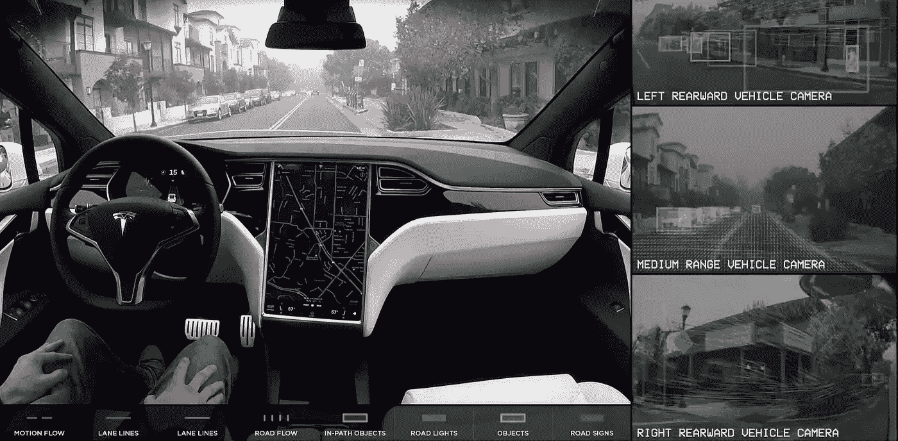

# 数据科学和机器学习工作的拓扑结构

> 原文：<https://medium.com/analytics-vidhya/choose-the-type-of-problem-you-want-to-solve-not-the-job-that-sounds-fancy-429aae86c59e?source=collection_archive---------14----------------------->

汽车公司和 NVIDIA 等其他巨头的目标是开发革命性的无人驾驶软件

当我思考我可以在数据科学和机器学习(以下简称 DSML)社区的广阔领域中导航我的职业生涯的各种方式时，我不禁感到被选择麻痹 w.r.t .的新类型的工作和新技能所淹没，这些工作和技能可供我选择并培养我的专业知识。和我尴尬的# YOE(1.5 年)相比，今天的工作期望…