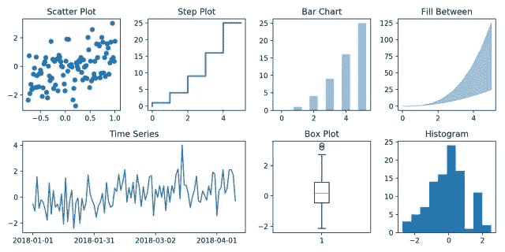
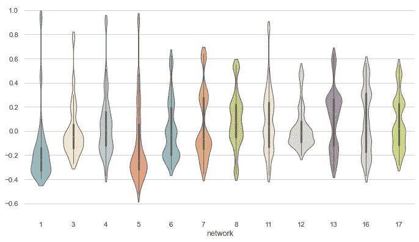
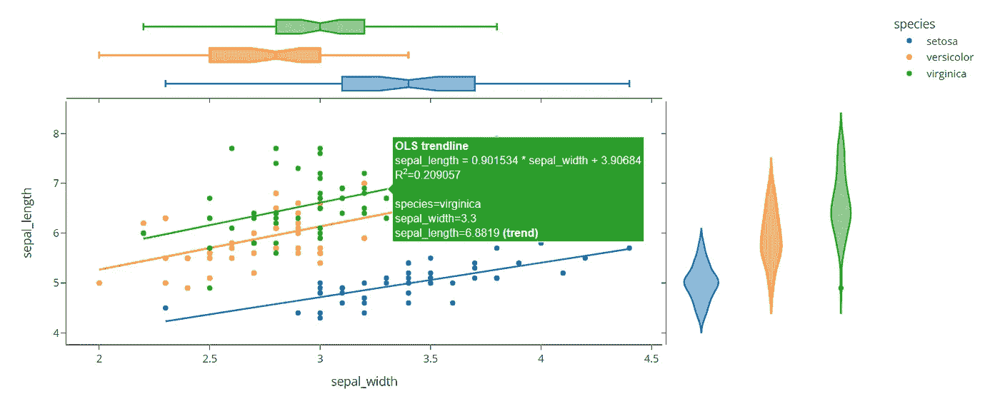
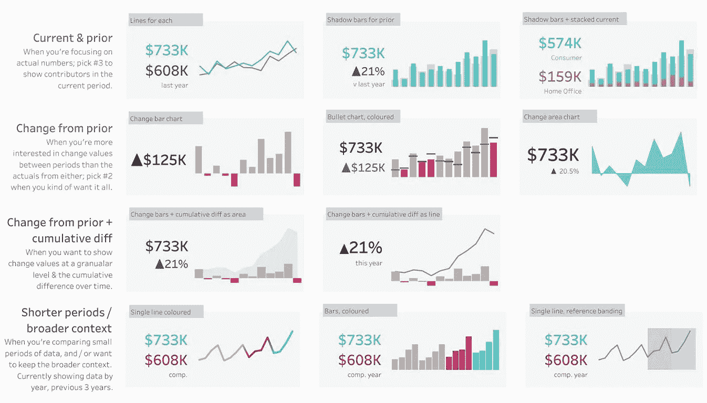

# 在 Python 和 Tableau 之间选择数据可视化

> 原文：<https://medium.com/analytics-vidhya/choosing-between-python-and-tableau-for-your-data-visualization-156a7a6bafc9?source=collection_archive---------4----------------------->

## 正确的选择会改善你的结果

来自[派克斯](https://www.pexels.com/photo/photo-of-person-holding-mobile-phone-3183153/?utm_content=attributionCopyText&utm_medium=referral&utm_source=pexels)的[派克斯](https://www.pexels.com/@fauxels?utm_content=attributionCopyText&utm_medium=referral&utm_source=pexels)拍摄的照片

我一直想知道，为了更好地理解数据，可视化数据的最佳方式是什么——外观有那么重要吗？或者我应该选择更有洞察力的方法？这总是在我做的每一项与数据分析相关的工作中产生冲突。理解数据是开始分析的最重要的因素之一。

我几乎所有的工作都使用 Python，因为它是我最喜欢的数据分析和机器学习编程语言。我学会了如何使用库来实现我的数据可视化——它们工作得非常好，也很容易学习，但是它们需要时间来准备。通过 Tableau，我了解到该软件因其用户友好的系统而提供的效率。Tableau 中的图表对数据科学家和希望了解结果的最终用户来说更有吸引力，但它们也有局限性。那么我应该选择哪一个呢？

# **Python 数据可视化库**

Matplotlib 数据可视化示例。图片由 [Machine Learning Plus 中的](https://www.machinelearningplus.com/plots/matplotlib-tutorial-complete-guide-python-plot-examples/) [Selva Prabhakaran](https://www.machinelearningplus.com/author/selva86/) 提供。

Python 向 Matplotlib、Seaborn 和 Plotly 等数据科学家提供了各种免费的数据可视化库。这些库在 Python 用户中最受欢迎。使用 Matplotlib，您可以可视化任何数据，并且它们可用的[文档](https://matplotlib.org/stable/contents.html)提供了更好的用户体验。这个库提供了简单的可视化分析，比如分布图、条形图和回归图。然而，Matplotlib 的一个大问题是它们的可视化过于基本，对最终用户来说可能不太有吸引力。据说 Matplotlib 是其余 Python 数据可视化库的基础，这就是为什么我们也将查看其他流行库的原因。

Seaborn 数据可视化示例。图片由 [Seaborn Gallery](https://seaborn.pydata.org/examples/wide_form_violinplot.html) 提供。

Seaborn 是一个基于 Matplotlib 的库，它通过创建更有吸引力的可视化来改进 Matplotlib 的功能，并且需要更少的代码来构建它们。使用 Seaborn，您可以用各种颜色和形状构建可视化效果，为最终用户提供更好的视觉体验。Seaborn 也有可用的[文档](https://seaborn.pydata.org/tutorial.html)，但是，与 Matplotlib 相比，它的信息量可能要少一些。对于 Matplotlib 用户来说，如果他们想在编码时节省时间，如果他们想在他们的可视化中有更好的美感，那么更改为 Seaborn 可能是有益的。

Plotly 交互式数据可视化示例。图片由 [Plotly 网站](https://plotly.com/python/plotly-express/)提供。

Plotly 是另一个数据可视化库，它简化了图形的创建。与 Seaborn 相同，它比 Matplotlib 需要更少的代码，并且具有吸引人的美感。与 Seaborn 相比，Plotly 在定制图形时效果更好。这个库提供了图形的交互性，并允许您探索不同的数据点。Plotly 也有可用的[文档](https://plotly.com/python/getting-started/)来改善用户体验。

# （舞台上由人扮的）静态画面

Tableau 数据可视化示例。图片由[当天的 Tableau 公开 Viz](https://public.tableau.com/en-us/gallery/current-vs-comparison-period?tab=viz-of-the-day&type=viz-of-the-day)。

Tableau 是一个用于商业智能的交互式数据可视化软件。用户可以与数据互动:比较、过滤、将一些变量与其他变量联系起来等。此外，可以使用高度可视化的工具创建图表和仪表板，这有助于快速理解数据。Tableau 不需要编码来创建图形。

Tableau 易于使用，虽然一些先前的数据分析知识可以有所帮助，但这是不必要的。Tableau 帮助用户创建各种可视化，如折线图、分布图、热图和散点图。Tableau 的缺点是它不是免费的——与市场上的其他 BI 软件相比，它们的定价很贵。Tableau 的主要缺点是只允许您对数据进行基本的预处理，这对于数据清理来说效率不高。

# 选哪个，什么时候？

Clark Tibbs 在 [Unsplash](https://unsplash.com?utm_source=medium&utm_medium=referral) 上拍摄的照片

选择哪一个以及何时选择取决于您的分析目的和数据类型。如果数据需要更广泛的清理，最好的解决方案是通过 Python。Tableau 在数据预处理方面有局限性。一种替代方法是使用 Python 进行数据清理，使用 Tableau 进行可视化，但是在遵循特定的工作顺序时，这可能会产生冲突。

在机器学习中，第一步是理解数据结构——这不需要吸引人的可视化。Matplotlib 会让你完成机器学习目标。在进行集群时，Seaborn 也是一个不错的选择，因为有更多的定制。

Tableau 很贵，所以对于初学者来说，与 Python 或其他 BI 软件提供的免费库相比，它不是最佳选择。但是，Tableau 在报告连接到其数据库的仪表板时非常适合公司。大公司通常有能力支付许可费用，并让他们的员工能够使用 BI 软件。Tableau 允许更多的交互性，并且比编码更容易制作情节。

在决定使用哪一个时，最重要的是关于工作流程。当处理需要高级分析的各种数据时，Python 是最好的。在机器学习中，一个好的工作流会改善结果，并保持对工作的更好理解。为了更吸引人的绘图，Python 提供了各种库来实现这一点。如前所述，Tableau 对于那些希望与图形进行交互并拥有吸引人的可视化效果的公司或希望实现同样目的的用户来说是一个很好的选择——这就是为什么它非常适合商业智能。每个数据科学家对可视化都有自己的喜好，但他们应该关注什么能提供更好的结果。在向他人展示结果时，创造力也会提高你的结果。

[关注我了解更多信息](https://duranerick2011.medium.com/)