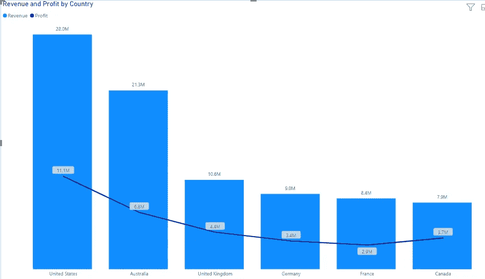

# 为您的仪表板选择正确的图表

> 原文：<https://medium.com/analytics-vidhya/choosing-the-right-chart-for-your-dashboard-35388f3c71d5?source=collection_archive---------13----------------------->

## #DearAnalyst

> ***“最好的视觉是用最少的墨水展示最多的信息”——爱德华·塔夫特***

如果你只能从整个故事中挑出一件事，那应该是上面的引用。随着我们继续前进，你会更好地理解。

所以我们有这个设计很差的仪表板:

本文的目标是改进这个仪表板。让它更像样&美观。

但首先，让我们找出仪表盘的问题所在:

*   第一张图表；*副产品利润*肯定可以更好地呈现&变得更干净。它包含太多可能受到限制的数据点。
*   第二张图是时间图，可以用更好的图来显示。你认为它会被哪一个取代？
*   散点图可以用一个更具描述性的标题更清晰
*   *收入&利润按国家*以百分比%表示？这不是个好主意。

一个接一个地把它拆开；

仪表板上的第一个图表

这太吵了，首先，它可以呈现在条形图上，这样分类标签更容易查看；

条形图

现在我们不用伸长脖子看有什么*产品*了。

第二，我们可以限制图表中条形(*产品)*的数量，因为老实说，没有人想看到每种产品产生的利润。因此，我们要做的是找出 10 种最赚钱的产品&放在仪表盘上:

像这样

现在看起来好多了。

**继续下一个:**

显示时间(即年、月、周等。)柱形图**上的图表**并不完全是个坏主意，因为您仍然可以从左向右读取数据，这使得您可以看到一段时间内的趋势。但是如果有一个不那么模糊的图表可以使用，我们绝对应该去做。

强烈推荐的时间分析是**折线图:**

看这个对眼睛来说有多轻。这些趋势也更容易捕捉。

还有另一个我们可以用来代替**折线图**，一个**面积图:**

对比图

**面积图**基本上是一个折线图，但有一个阴影部分，可用于显示数据点距离基线有多高/多低。在这种情况下使用**折线图**更好，但是你可以选择一个**区域。不管是谁惹你生气了。当你做决定的时候，想想你的听众。**

**下一个:**

散点图

显然，通过这张**散点图**，我们试图看到*收入&利润*之间的关系，它们是如何相互影响的。积极或消极。这是一个**正**关系，因为趋势似乎是从左下角流向右上角。如果是另外一种方式，那就是**负**关系。

图表没问题，不用改。

然而，标题却不是。因此，我们可以将其改为更具描述性的内容，如*“rev .&利润之间的关系”。*

我们也可以去掉 x 轴和 y 轴。它们毫无用处。我们需要看到的是趋势而不是数字，所以那些可以走&我们会留下一个更清晰的图表:

标题已更改，轴已删除。

**最后一个:**

百分比堆积柱形图

*“少墨，少墨，唉”*。

这是一个 **100%堆积柱形图**，这意味着它将数字相加&显示超过 100 个数字。如果我们试图找出有多少男性或女性在场，这个图表可以工作，但我们在这里试图显示的是*利润&收入*。我们需要数字。使用 100%图表不太合适。

我们能做的是一个**组合图**(即一个线形&柱形图):

组合图

有了这个图表，我们遵守了墨迹原理&也准确地显示了信息。现在可以比较每个国家的 *rev. & profit* 值。

将所有调整后的图表整合到一个仪表板中:

精心设计的仪表板

看它看起来多简单。

为了对比。

仪表板不应该太复杂而难以解释。这就是为什么它被称为仪表板，它通常只是一个页面。它应该包含简单易懂的摘要信息。

然而，报告向受众提供了更深入的粒度信息。可以不止一页。这是你可以包含更多技术视觉效果的地方，因为没有摘要。

所以下次你设计仪表板的时候，要有意识地选择。

如果你想用我用过的数据集练习，在这里复制它****。****

***PS** :使用的工具是 **Power BI。***

**新年快乐*👋*