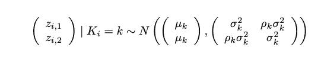

# 使用计算方法的染色质识别和基因组注释

> 原文：<https://medium.com/analytics-vidhya/chromatin-identification-and-genome-annotation-using-computational-methods-aaff4971c2dc?source=collection_archive---------21----------------------->

一个人的表观基因组与他们的 DNA 的关系的模型。([图像来源](https://epigeneticsandchromatin.biomedcentral.com/articles/10.1186/s13072-021-00390-y)

# 表观基因组及其功能

## 表观基因组是什么？

人体有 210 多种细胞类型，尽管每一种细胞的 DNA 中都储存着相同的信息。这怎么可能呢？**表观基因组储存关于细胞类型和细胞状态的信息**:它创造影响基因表达的化学修饰。

这些修改可以用各种不同的方式编码:

*   **甲基化:**在某些核苷酸上添加甲基基团，下调基因表达
*   **核小体**:定位核小体以确定 DNA 的哪些部分可用于转录
*   **组蛋白:**帮助组成染色质结构的蛋白质

## 在核小体中储存信息

表观基因组的结构。([图像源](https://en.wikipedia.org/wiki/Epigenetics))

DNA 通过染色质和核小体紧紧包裹在体内。核小体是这种包装的单位，由 DNA 可以包裹的组蛋白组成。有四种主要的组蛋白:H2A、H2B、H3 和 H4，它们在表观基因组中都有不同的功能。

核小体**以两种方式编码表观基因组**的信息:

*   **染色质可及性:**如上所述，将核小体定位在 DNA 上的特定位置会**改变 DNA 某些部分的转录速率**。对于转录，RNA 聚合酶必须与启动子区域结合，而核小体的存在可能会阻碍 RNA 聚合酶这样做的能力。
*   **组蛋白修饰:**组蛋白含有从其中央结构突出的尾部。这些尾可以通过甲基化、乙酰化和其他化学结合参与修饰。这意味着**组蛋白可以允许相同的基因组以不同的方式转录**:有超过 100 种不同的组蛋白修饰。

## 影响生物功能的表观遗传修饰

乙酰化和甲基化的区别。([图像来源](https://www.researchgate.net/figure/Schematic-drawing-of-histone-methylation-and-acetylation-in-relation-to-chromatin_fig2_312349806))

这方面的一个例子可见于增强子区域；这些增强子可以通过乙酰化或甲基化与特定的启动子接触，从而激活被抑制的启动子。

这将允许**增加启动子区域**的激活，并且还通过监测增强子区域在体内的运动来提供对 DNA 转录何时发生的洞察。

通过计算方法进行表观基因组鉴定的总体途径。([图片来源](https://hbctraining.github.io/Intro-to-ChIPseq/lessons/05_peak_calling_macs.html)

# 芯片(染色质免疫沉淀)技术

## 概观

芯片技术帮助**将 DNA 分裂成特定的片段，这些片段在基因组上的位置表示转录因子或组蛋白修饰的位置。**这是以有效的方式(不需要分析整个 DNA)识别染色质和表观基因组标记的第一步，非常有用。

芯片工作原理的流程图。([图像来源](https://www.cellsignal.com/applications/chip-and-chip-seq/regulation-expression-in-cell-and-tissue))

芯片的工作方式如下:

*   **细胞暴露于特定的交联剂**，这使得 DNA 和组蛋白之间形成共价键。
*   **然后从细胞核中** **分离出基因组 DNA**。
*   **这种分离的 DNA 被酶剪切**(通过剪切到期望的片段范围来制备用于分析的 DNA)。
*   **培养抗体**识别组蛋白。
*   **然后将抗体加入溶液**中进行**免疫沉淀**(分离特定蛋白质)并纯化复合物。
*   **交联被逆转**并且 DNA 片段被纯化用于分析。

## 结果

初始染色质免疫沉淀后的各种分析方法。([图像来源](https://www.nature.com/articles/nrg2641))

ChIP 的结果是**DNA 的短序列，**对应于组蛋白结合的 DNA 中的特定位置。

为了将这些片段与基因组匹配，荧光标记可以用于一个叫做**芯片-芯片的过程中。**另一种方法是使用 **ChIP-seq** 对这些片段进行下一代测序；这种方法使用频率更高，因为它的检测范围更广，速度更快。

为了推断特定组蛋白在 ChIP-seq 后富集的位置，必须将 DNA 片段映射到 DNA 上(**阅读映射**)，然后必须找到具有统计学意义的感兴趣区域(**峰调用**)。这些将在本文后面进行更深入的探讨。

## 替代—亚硫酸氢盐测序

亚硫酸氢盐测序的工作原理。([图像来源](https://www.genewiz.com/Public/Services/Next-Generation-Sequencing/Epigenomics/Whole-Genome-Bisulfite-Sequencing/)

亚硫酸氢盐测序是一种**方法，用于确定 DNA 甲基化的特定区域**，允许发现 DNA 甲基化的组蛋白尾部。

亚硫酸氢盐处理通过将未甲基化的胞嘧啶转化为尿嘧啶起作用，但不影响甲基化的胞嘧啶。然后，可以比较有和没有亚硫酸氢盐测序的基因组 DNA，以确定胞嘧啶甲基化的位点。

*请注意，在亚硫酸氢盐测序中，未甲基化的胞嘧啶向尿嘧啶的不完全转化会产生假阳性。*

# 质量控制指标

由于与芯片测序相关的实验偏差，输出可能具有不同的质量。因此，质量控制指标在数据集上创建了作为一个整体的**阈值**，以确定数据是否具有足够的质量用于进一步分析。

## 使用输入的 DNA 作为对照

使用输入 DNA 作为峰分析的对照。([图片来源](https://www.biorxiv.org/content/10.1101/2019.12.17.880013v1.full))

基因组的可及区域更容易断裂，这导致不均匀的断裂。为了控制这种偏差，**在不使用抗体的情况下运行芯片实验。**

然后可以将这种“输入 DNA”片段化并绘制成一种背景信号轨迹，可以将免疫沉淀的 DNA 绘制成背景信号轨迹并与之进行比较。

## 阅读水平测序质量评分

质量分数图表示例。([图像源](https://www.bioinformatics.babraham.ac.uk/projects/fastqc/Help/3%20Analysis%20Modules/2%20Per%20Base%20Sequence%20Quality.html))

每个碱基对都与一个质量分数相关，下一代测序中给出的读数也包含质量分数。**较低的质量分数意味着很大的错配概率**，这意味着研究人员可以设置一个拒绝碱基对的阈值。

## 映射的短读取部分—多个

注意基因组中的每个读数可以映射到一个、一个或多个位置。对于多个位置，有一些方法可以解决这个问题:

*   **保守:**不向任何位置分配读取(con —可能会丢失读取)
*   **概率性:**将读取分数地分配给所有位置(con —可能会在放置读取的位置产生不真实的峰值)
*   **采样:**仅随机选择一个位置进行读取(con 可能会在读取位置产生不真实的峰值)
*   **期望最大化:**基于明确读取的密度来映射读取，其中可以计算读取映射到特定区域的先验概率，给定每个区域内的密度是恒定的
*   **成对末端**:通过 DNA 两端测序确定作图

## 映射的短读取部分—无

很可能没有不映射到基因组的读数；然而，那些不符合的可以用质量控制标准来检查。**为每个区域计算映射**的区域的比例，对于没有达到阈值的区域，忽略它们或者重新进行实验。

这是因为这些区域可能缺乏装配覆盖率。

## 交叉相关和库分析

交叉相关是一个复杂的质量控制指标，但本质上，它发现映射到正向链通过的读数数目和映射到反向链通过的读数数目之间的相关性，作为两个读数之间距离的函数。

库调用是非冗余读取的**部分**。这可以通过 NRF 或非冗余分数来计算。

NRF 的低值表明复杂性低或 DNA 不足。对于大约 1000 万次唯一映射读取，一般目标是 0.8。

# 读取映射

阅读作图决定了将一个给定阅读分配到基因组中相应位置的最佳方式**。由于人类基因组的规模巨大，任何试图绘制 read 的算法都必须在空间和时间复杂性方面具有令人难以置信的效率，并注意到不同样品之间测序错误或 SNP 修饰造成的错配。**

过去的读取映射是通过多种方法完成的:

Needleman-Wunsch 算法概述。([图像源](https://www.researchgate.net/figure/Representation-of-the-Needleman-Wunsch-global-alignment-algorithm-A-An-optimal_fig4_326839021))

*   **序列比对和 Needleman-Wunsch 算法**(此处[解释](/analytics-vidhya/sequence-alignment-and-the-needleman-wunsch-algorithm-710c7b1a23a4?source=your_stories_page-------------------------------------)):序列比对是“比较两条核苷酸链以发现一系列突变的过程，这些突变从另一条链中产生一条链。”一种常用的算法是 Needleman-Wunsch 算法，它使用动态编程来**确定两个字符串之间最长的公共子序列**，然后推断突变。

BLAST 局部/全局比对如何与 Karp-Robin 算法一起工作。([图像来源](/analytics-vidhya/matching-genetic-sequences-through-the-blast-and-karp-rabin-algorithm-ffebc810a9d0))

*   **BLAST 和卡普-罗宾算法**(此处解释[):BLAST 用于“在数十亿个核苷酸的集合中将精确的核苷酸序列与人类基因组进行匹配。”Karp-Robin 算法使用**散列来增强字符串匹配**。](/analytics-vidhya/matching-genetic-sequences-through-the-blast-and-karp-rabin-algorithm-ffebc810a9d0)

虽然这两种算法都有快速的计算运行时间，但它们缺乏内存。序列比对有 O(mn)运行时，线性时间字符串匹配或 BLAST 有 O(m + n)运行时，后缀数组有 O(m)运行时。但是，**这些算法都有 O(mn)时间**的巨大内存需求，极大的阻碍了算法。

## 布伦斯-惠勒变换—编码

**Burrows-Wheeler 变换在 O(m)时间内运行，只需要 O(m)空间。**它允许压缩字符串并重新排列字符串，使其旁边有相邻的重复字母。

以下是 Burrows-Wheeler 变换的步骤:

*   对于给定的参考基因组，**在字符串的开头和结尾添加特殊字符**。**生成该字符串所有可能的旋转**。
*   按字母顺序对这些循环进行排序，排序后的字符排在最后。
*   **保留排序旋转的最后一列**。

可以用 HAPPY 显示一个示例。

*   快乐变成了^HAPPY@.^HAPPY@所有可能的轮换是^HAPPY@、@^HAPPY、Y@^HAPP、PY@^HAP、PPY@^HA、APPY@^H 和 HAPPY@^.
*   按字典顺序排列的名单如下:APPY@^H、HAPPY@^、PPY@^HA、PY@^HAP、Y@^HAPP、^HAPPY@、@^HAPPY.
*   排序旋转的最后一列是 H^APP@Y.

下面的另一个例子显示了以单词 BANANA 作为输入的 Burrows-Wheeler 转换。

用 Burrows-Wheeler 变换将香蕉编码成 BNN^AA@A。([图像来源](https://ocw.mit.edu/ans7870/6/6.047/f15/MIT6_047F15_Compiled.pdf))

## 布伦斯-惠勒变换——解码

这种转换也可以反过来计算原始字符串。该方法如下:

*   给定转换后的字符串，**按字母顺序对字符串进行排序**。这给出了转换的第一列。
*   **将最后一列与第一列**合并，得到字符对。
*   **对配对进行分类，并重复**步骤#1 和#2。

该解码过程允许使用线性大小的空间来转化基因组。

下面的例子显示了如何解码的布伦斯-惠勒转换 BNN^AA@A 回到原来的字符串^BANANA@.

使用布伦斯-惠勒变换将 BNN^AA@A 解码成^BANANA@。([图像来源](https://ocw.mit.edu/ans7870/6/6.047/f15/MIT6_047F15_Compiled.pdf)

## Burrows-Wheeler 变换的意义

*   同一个字母的所有出现都是**紧挨着**，而不是分散在整个基因组中。
*   字符在第一列中的第 I 次出现对应于字符在最后一列中的第 I 次出现。这使得**能够更快地对经过转换的单词**进行子串搜索。
*   **每一个读数都是参考基因组中一个旋转的前缀**，这有助于给出该读数在基因组中的位置。

# 高峰呼叫

峰值呼叫直方图示例。([图片来源](https://sites.google.com/site/danposdoc/tutorial/dpeak))

一旦产生了这些读数，就可以产生信号轨迹。这些轨迹被排列成跨越基因组长度的**直方图的形式，其中每个点对应于在基因组中特定点发现的芯片读取次数**。这些读数越多，意味着正在寻找的特定表观遗传标记的存在就越强。

**峰调用**是从这个直方图中找到具有统计学意义的峰，以确定哪些位置具有特定组蛋白的最高表达。

## 信号轨道

样本信号轨道。([图像源](https://ocw.mit.edu/ans7870/6/6.047/f15/MIT6_047F15_Compiled.pdf))

第一步是生成信号轨道，将读取的计数转换成可以放在直方图上的强度信号。使用来自质量控制度量的互相关分析，可以对每个读数进行排序，以发现关于该读数所属片段的信息。将此与控制数据的信号轨迹进行比较将允许**比较分析来确定峰值。**

## 峰值呼叫— p 值和 eFDR

比较由峰值呼叫给出的不同表观基因组样本。([图像来源](https://ocw.mit.edu/courses/electrical-engineering-and-computer-science/6-047-computational-biology-fall-2015/lectures_slides/MIT6_047F15_Lecture11.pdf))

许多峰值调用程序，如 MACS 和 PeakSeq，**使用 p 值和 eFDR 估计来确定统计上显著的峰值位于何处**。每个程序使用不同的统计程序:MACS 使用局部泊松分布，而 PeakSeq 使用条件二项式模型。

为了模拟读取计数分布，可以使用泊松分布来估计来自控制数据的预期读取计数。然后，确定该读取计数不产生峰的概率，如果其低于某个阈值 p 值，例如 0.0001，则该基因组区域被认为是峰。

对于泊松分布，上述计算用于确定 p 值。然后，通过将芯片实验数据与输入数据交换，可以将该 p 值转化为**经验错误发现率** (eFDR)，类似于质量控制映射步骤中所做的。

通过分析输入数据中哪些区域的读数已经增加，可以从真实的实验峰中过滤出对照峰。对于每个 p 值，【the eFDR 就是输入数据的峰数除以对照数据的峰数。

## 不可约发现率

在实践中使用 IDR。([图片来源](https://ccg.epfl.ch//var/sib_april15/cases/landt12/idr.html))

这方面的一个主要问题是，没有通用的 eFDR 或 p 值可用于所有计算，这些值在很大程度上取决于各种因素。此外，eFDR 对其阈值的微小变化很敏感。

不可约发现率或 IDR 可以避免这些相关问题，并消除关于数据中的丰富性和重要性之间关系的假设。它允许我们在不设置显著性阈值的情况下找到峰值，而是使用生物复制。

他们依赖的想法是，真实信号可以在重复中重现，而噪音则不能。因此，将每个重复中的前 N 个峰相互比较，并根据其他重复，为整个测试样品集选择峰。

**IDR 仅仅是一个重复中出现在前 N 个峰中的峰的分数，这些峰在其他重复中不存在。**

## IDR 的数学分析

*注意:这将深入统计和分析各种分布。*

由于 IDR 对其峰值使用等级，这意味着**边缘分布是均匀的**，而**联合分布是变化的，并对大部分信息进行编码**。这些联合分布可以通过 copula 模型或每个变量的边际概率保持一致的多元分布来建模。

如果 C_x 是 copula 函数，F(x)是某个变量 x 的累积分布，则函数 F(x)定义如下:

我们可以**分析伯努利分布 K_i ~ Bern(pi_i)** 给出该信息，该信息将告诉我们第 I 个峰值是否与进一步分析相关或者它是否是虚假集合的一部分。

设 z_{0，i}表示它来自生物复制 I 中的虚假集，设 z_{1，i}表示它来自生物复制 I 中的一致集。

那么，如果 K_i = 1，则 z_1 = (z_{1，1}，z_{1，2})，如果 K_i = 0，则 z_0 = (z_{0，1}，z_{0，2})。因此，**我们可以将 z_{1，1}和 z_{0，1}建模为下面的**，注意这些点中的每一个都遵循正态分布，并且它们的值基于 read 作图阶段中给出的基因组值。

注意，在乱真集中，**均值为 0，方差平方为 1。**因此，z 得分简单地等于来自生物复制 I 中虚假点的数据点。在真实组中，平均值大于 0，其相关因子在 0 和 1 之间，这意味着其 z 得分将遵循 z =(x-均值)/(标准偏差)的平凡公式。

可以使用以下公式对变量进行建模，以使用正态累积分布函数作为概率分布来确定乱真集合中峰值的加权平均值。

然后，我们可以发现，对于信号轨道中的特定信号，基于边际分布和由上述等式计算的值，它成为峰值的**概率是多少。**

最后，**我们可以使用一种期望最大化算法来推断不可再现的发现率**，该算法推断出一致集的均值、相关性、标准偏差和转移概率，然后找到 P(K_i = 1 | (x_{i，1}，x_{i，2 }；θ)。

最后，为了**对来自每个生物复制的各种顶部 N 个峰**中的每一个进行排序，我们可以使用以下等式来取最大值:

有关更详细的分析，请参考[这篇](https://arxiv.org/pdf/1110.4705.pdf)文章了解更多信息。

## IDR 的意义和优势

*   对于每个生物复制，可以用不同数量的峰 N 进行 IDR 分析。基于该 N，可以达到期望的 IDR。
*   IDR 使得**实验之间的重现性更容易。**
*   其他方法，如两个生物复制的联合(将在每个数据集中获取峰和噪声)和两个生物复制的交集(将错过许多真正的峰)，**不能准确找到数据集中的所有峰。**
*   IDR 结合了上述两种方法，接受两个峰值并确定不可再现率。

# 推断染色质特征

*注意:本节假设您之前已经了解什么是 hmm 以及它们是如何工作的。*

现在，使用阅读作图和峰调用算法，有可能解释染色质标记和推导表观基因组特征。这将允许我们做两件事:

*   **聚集已知的染色质信号**(如 H3K4me3)
*   **推断特征类型**(启动子、增强子、非编码区等。)

更简单地说，DNA 可以呈现一系列隐藏状态，每种状态都发出特定的表观遗传修饰组合。利用观察到的表观遗传修饰，我们想用计算方法来推断 DNA 区域的特征类型。

## 染色质注释的 HMMs

使用 HMMs 的染色质注释的最终结果。([图片来源](https://ocw.mit.edu/ans7870/6/6.047/f15/MIT6_047F15_Compiled.pdf))

我们可以使用 hmm 来识别由于给定的表观基因组修饰而最有可能发生的染色质标记的组合。请注意，对于隐藏状态，我们必须**捕捉状态的功能排序和整个基因组的染色质域差异。**

由于跃迁和发射概率不是立即知道的，类似于 Baum-Welch 算法的期望最大化算法可用于找到这些参数的最大似然值。

## 排放状态— HMMs

具有 51 个染色质状态的 HMM 的发射态。([图片来源](https://ocw.mit.edu/ans7870/6/6.047/f15/MIT6_047F15_Compiled.pdf))

与传统 hmm 发出单一值不同，每个状态**发出表观遗传标记的组合，该组合被表示为 n 维向量，每个表观遗传标记具有二进制值**。

在数学上，对于 n 个输入标记，每个状态 k 发出标记 1 至 n 的概率向量(p_k1，p_k2，…，p_kn)。观察一组这些标记的概率是观察单个标记的概率的乘积，因为这些标记中的每一个都被假定为独立的。

## 过渡状态—hmm

**必须通过期望值最大化算法来推断转换状态。**这里可以看到算法的一个这样的结果。

具有 51 个染色质状态的 HMM 的过渡态。([图像源](https://ocw.mit.edu/ans7870/6/6.047/f15/MIT6_047F15_Compiled.pdf))

## 州数——HMMs

**选择状态的数量也至关重要**，因为将模型的复杂性增加太多会导致数据过度拟合，这意味着模型不会推广到人群。

**贝叶斯信息准则(BIC)** 可用于优化模型的复杂性。注意，对于 BIC，在模型复杂性和可解释性之间有一个折衷，BIC 不会帮忙。因此，BIC 总是会产生一个比理想模型有更多状态的模型。

可以采取几个步骤来解决这个问题:

*   **从一个隐藏状态**多于必要数量的模型开始(例如，使用 BIC 状态数)。
*   **删除隐藏状态**，直到只捕获感兴趣的状态。
*   **尝试许多随机初始化**并交叉引用样本，以确定某个状态的显著性是否在所有样本中保持不变。
*   **迭代几次**，直到产生最佳数量的状态。

模型的最终结果——与状态相关的染色质标记组合。([图片来源](https://ocw.mit.edu/ans7870/6/6.047/f15/MIT6_047F15_Compiled.pdf))

# 摘要

*   **表观基因组**是影响人体内基因表达的一组翻译后化学修饰或标记。化学修饰包括**甲基化**和**乙酰化**。
*   **芯片**，一种确定组蛋白与 DNA 结合位置的方法，或者**亚硫酸氢盐测序**，一种确定甲基化发生位置的方法，可以用作**表观基因组分析**来确定转录因子和组蛋白的位置。
*   **质量控制图谱**旨在消除芯片测序产生的偏差，从表观基因组数据中创建最准确的分析。
*   **读图谱**试图将一个给定的读数分配到基因组内部的最佳匹配位置。由于最佳内存分配，使用了 **Burrows-Wheeler 变换**，而不是使用传统算法，如 **BLAST** 或 **Needleman-Wunsch 算法**。
*   **峰值呼叫**使用特定的信号轨迹来寻找产生高富集水平的区域。 **P 值测试**和 **eFDR** 可用于对峰值的显著性进行统计分析，但这可能会变得难以使用，因为 eFDR 值会根据实验而变化。
*   **IDR** 比较不同**生物复本**之间不可再现的峰部分，而不是使用显著性检验，这绕过了 eFDR 提到的问题。
*   **HMMs** 可用于解读染色质表达。**贝叶斯信息准则**可用于优化模型所需的状态数。**期望值最大化算法**可用于实验确定发射和转移概率。

# 额外资源

*   **论文:** [超快、记忆高效的短 DNA 序列与人类基因组的比对。](https://genomebiology.biomedcentral.com/articles/10.1186/gb-2009-10-3-r25)
*   **论文:** [芯片——序列:欢迎来到新边疆](https://pubmed.ncbi.nlm.nih.gov/17664943/)
*   **书:** [计算生物学:基因组、网络、进化](https://ocw.mit.edu/ans7870/6/6.047/f15/MIT6_047F15_Compiled.pdf)
*   **论文:** [跨代表观遗传:神话与机制](https://www.cell.com/fulltext/S0092-8674(14)00286-4)
*   **论文:** [发现和表征染色质状态，用于人类基因组的系统注释。](https://www.nature.com/articles/nbt.1662)
*   **论文:** [九种人类细胞类型的染色质状态动力学作图与分析。](https://www.nature.com/articles/nature09906)
*   **论文:** [测量高通量实验的再现性。](https://arxiv.org/pdf/1110.4705.pdf)
*   **论文:** [DNA 甲基化检测:亚硫酸氢盐基因组测序分析](https://www.ncbi.nlm.nih.gov/pmc/articles/PMC3233226/)
*   **文章:** [序列比对和 Needleman-Wunsch 算法](/analytics-vidhya/sequence-alignment-and-the-needleman-wunsch-algorithm-710c7b1a23a4)
*   **条** : [BLAST 和 Karp-Rabin 算法](/analytics-vidhya/matching-genetic-sequences-through-the-blast-and-karp-rabin-algorithm-ffebc810a9d0)
*   **论文:**
*   **论文:**

*如果你想聊更多，安排一个会议:* [*日历*](https://calendly.com/adityamittal307) *！关于我目前正在做的项目的信息，可以考虑订阅我的* [*简讯*](https://preview.mailerlite.com/h4z4w7) *！下面是* [*订阅*](https://forms.gle/pLWuNuBuJQokMk3N8) *的链接。如果你有兴趣连线，关注我关于*[*Linkedin*](https://www.linkedin.com/in/adityamittal-/)*，*[*Github*](https://github.com/adityamittal13)*，以及*[*Medium*](/@adityamittal307)*。*