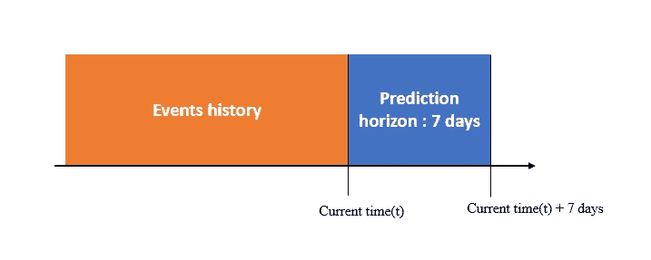
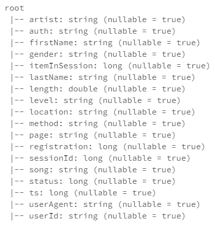
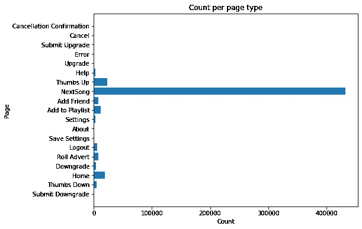
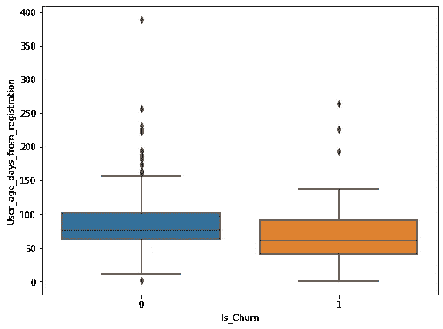
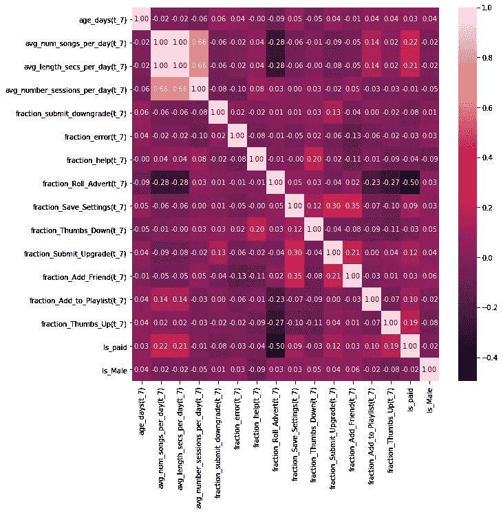
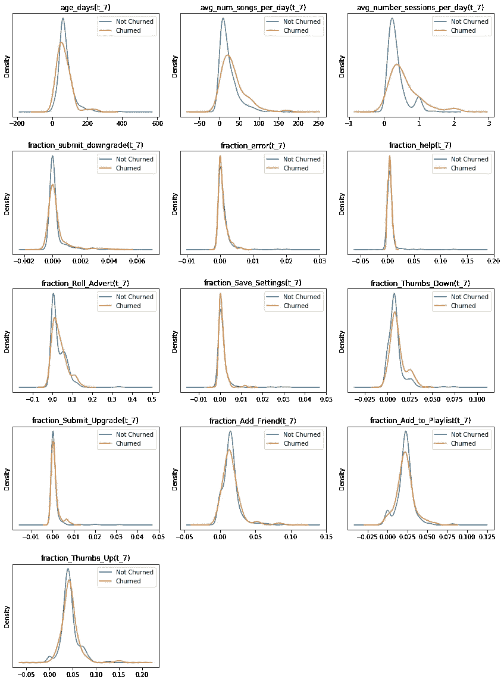
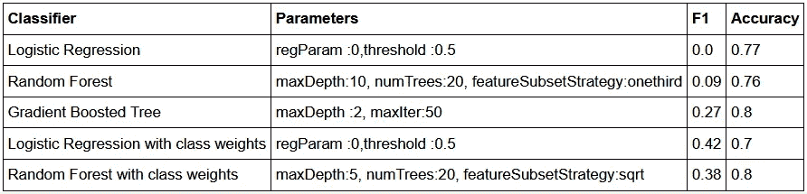
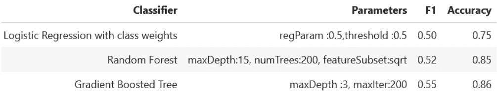

# 音乐流服务的流失预测

> 原文：<https://medium.com/analytics-vidhya/churn-prediction-for-music-streaming-service-with-pyspark-761259cc33e8?source=collection_archive---------19----------------------->

# **1。简介**

虚构的音乐流媒体服务 Sparkify 是为了模仿 Pandora 或 Spotify 等公司生成的数据集而创建的。数百万用户通过这类服务定期播放他们喜爱的歌曲，要么使用付费订阅模式，要么通过播放广告的免费层。用户可以升级或降级他们的订阅计划，但也可以随时取消它，所以确保用户喜欢这项服务很重要。

每当用户与 Sparkify 应用程序交互时，无论是听歌曲、将歌曲添加到播放列表、用拇指向上/向下评价歌曲、添加朋友、更改设置、注销或登录，都会生成并收集用户活动日志。这些日志可以帮助企业了解客户对服务是否满意。

根据研究，众所周知，获得一个客户比留住一个客户更昂贵。因此，为了提高公司的盈利能力，重要的是预测可能流失的客户——要么取消服务，要么降低订阅级别，并通过激励/折扣提前与这些有风险的客户接洽，以防止收入损失。此外，了解流失客户的独特行为和特征可以为改进公司提供的音乐流媒体服务提供有用的见解。

# **2。项目概述**

在该项目中，我们希望建立一个模型，该模型可以根据用户过去的活动和与该服务的交互日志等可用数据，提前预测面临取消 Sparkify 音乐流媒体服务风险的客户。这个项目是用 PySpark 实现的，PySpark 是使用 Apache Spark 分布式计算功能的 python API。整个项目首先在完整数据集的一个小子集(2/100)上进行。在 AWS 云平台上部署的 Elastic MapReduce(EMR)集群的帮助下，在一个完整的数据集(12GB)上实现了在小数据集上表现良好的模型。在最后一节中，本文还添加了完整数据集的结果。

**2.1 问题陈述**
该项目的目标是建立一个二元分类器，能够准确预测处于取消服务风险中的用户，比他们的取消时间表提前一周。选择这一周的提前窗口是为了让公司有足够的时间与面临风险的用户重新接触，以激励客户并防止客户取消服务。

客户事件历史和预测范围

**2.2 性能指标** 考虑到我们希望预测尽可能多的真实流失用户(高召回率)，同时不希望将实际非流失用户错误地预测为流失用户(高精度)，我们将使用 **F1 得分**作为模型的优化和主要性能指标。包括准确度、召回率和精确度在内的其他评估指标也因其更好的可解释性而被计算在内。

进一步的项目将包括以下主要步骤:
-数据理解和数据清理
-特征工程和探索性数据分析
-建模和评估
-结果总结
-结论

# **3。数据理解和数据清理:**

Sparkify 用户活动日志数据的完整数据集(12GB)中的一小部分(256MB)用于理解数据和进一步分析。可以在下面显示的数据集架构中看到数据可用的列。

数据集的架构

**采取以下步骤以更好地理解和清理数据:**
-加载“medium _ spark ify _ event _ data . JSON”数据集
-检查数据大小、列数据类型和汇总统计以理解数据并识别异常
-探索异常并清理数据
-检查并处理重复行
-探索空值(缺失)& Nan 值并处理它们
-将时间戳转换为可用于进一步分析和特征工程的格式

**基于我们的综合数据分析，我们从数据中得出以下观察结果:**

*   数据集由 543705 行/日志和 18 列组成。
*   日志数据仅在 2018 年 10 月 1 日至 2018 年 12 月 1 日的两个月内可用。
*   日志数据属于 448 个不同的用户。UserId 为空字符串的数据主要属于已注销的用户，因此已从我们的数据集中删除。
*   根据数据，用户总共可以访问 19 个不同的页面。
*   共有 21247 个独特的艺术家和 80292 首独特的歌曲。

完整日志数据中已访问的页面计数

**4。探索性数据分析:**

基于最初的探索性数据分析，在比较流失和非流失用户时得出以下观察结果:
-在总共 448 个用户中，99 个用户根据用户活动日志数据流失。
-流失用户和非流失用户中男女用户的比例几乎相同。平均而言，免费用户比付费用户更容易流失。
-在可用的日志数据中，两个类别的平均收听歌曲数、平均会话数和平均会话长度的分布没有显著差异。平均而言，流失用户的年龄小于非流失用户。

流失和非流失客户的用户年龄(从注册之日算起)

# **5。特征工程:**

基于关于用户年龄的初始分析，该特征需要是每单位时间或用户总活动的一部分，因为存在具有不同寿命长度的用户。根据我们的问题定义，由于我们希望提前 7 天预测用户流失事件，因此每个用户最近 7 天的活动日志数据将无法用于功能生成。此外，年龄小于 7 天的用户将被删除，因为他们不符合我们的问题定义场景。

**5.1 我们将考虑以下特性:**

*用户统计特征:*

*   从注册时间戳开始的用户年龄，级别-免费/付费，性别-男/女

*用户行为和活动特征:*

*   每个用户在完整可用数据上每天的平均功能:播放的歌曲数量、播放的歌曲长度、会话数量
*   访问页面的比例(总活动的比例):
    -负面影响功能:错误、帮助、滚动广告、设置、提交降级、拇指向下
    -正面影响功能:添加朋友、添加到播放列表、提交升级、拇指向上

**5.2 功能探索**

对探索特征做了如下观察:
*相关热图:*
-Avg _ num _ songs _ per _ day(t _ 7)&Avg _ num _ secs _ per _ day(t _ 7)几乎完全正相关。因此，我们可以删除 Avg_num_secs_per_day(t_7 ),只保留这两个变量。
-Is _ payed 和 Fraction_roll_advert(t_7)负相关，因为广告只显示给免费订阅用户。

特征的相关热图

*分布密度图:*
-非流失用户的平均年龄大于流失用户
-平均而言，流失用户每天播放的歌曲更多，听的时间更长，会话更多
-平均而言，流失用户比非流失用户有更多的竖拇指和竖拇指
-平均而言，流失用户中滚动广告更多
-平均而言，流失用户比非流失用户有更多的添加好友活动

流失用户和非流失用户的密度分布比较

# 6。建模和评估

在本节中，我们使用了 Spark ML 功能。我们从简单的逻辑回归开始，然后进一步实施基于树的模型，包括随机森林和梯度增强树，这些模型可以通过减少方差来提高性能。对于每个模型，考虑了不同的参数，如下一节提到的结果表总结中所述。

对于每个二元分类模型， 我们已经执行了以下步骤:
步骤 1:建立*流水线*
-用向量汇编器
对数字特征进行矢量化-标准化数字特征
-将二进制和数字特征组合起来并用向量汇编器
对它们进行矢量化-选择二进制分类器
步骤 2:定义*网格搜索参数 grid* 并用 *F1 作为优化度量*进行*三重交叉验证*以找到最佳模型参数 使用训练数据上的最佳参数(80%)
步骤 4:使用训练好的拟合模型，*预测*测试数据(20%)
步骤 5: *评估模型性能* -F1、召回率、精确度、准确度
步骤 6:可视化*特征重要性*对于模型

# **7。结果汇总(含数据子集):**

*   基于本项目中的建模，我们在网格搜索交叉验证的帮助下搜索具有最佳参数的模型，并进一步在训练数据上训练这些模型，并预测测试数据的客户流失标签。
*   在比较评估指标时，我们可以清楚地看到，当我们考虑类的权重来处理数据中存在的不平衡时，逻辑回归和随机森林的 f1 得分显著提高。
*   在基于树的模型中，考虑类权重的随机森林比基于我们到目前为止所考虑的参数的梯度增强表现得更好。到目前为止，我们还没有考虑的另一个改进领域是概率阈值调优。默认阈值 0.5 被认为是现在计算所有考虑的模型的 F1 分数。
*   不同的模型对不同的特征提出了不同的重要性。查看功能重要性图，一些重要的功能是每天的平均会话数、提交降级活动的比例和用户年龄。
*   在基于这个小数据集构建的所有模型中，我们看到当考虑类权重时，逻辑回归在 f1 性能方面排名第一。这可能是因为逻辑回归的参数性质，与基于非参数树的模型相比，逻辑回归需要较少的数据进行训练。当我们使用更大规模的数据集进行训练时，模型的这种性能排名可能会发生变化。
*   在各种车型中，F1 整体表现不佳的一个可能原因是所考虑的数据量。使用更大的数据集建模可以稳定并显示模型的实际性能。

结果摘要

# 8。结论

**8.1 反射:**

在这个项目中，我们首先通过 Sparkify 音乐流媒体服务分析小部分用户的活动日志数据，最终能够构建二元分类器，这些分类器可以在可能的流失事件发生前一周预测可能流失的客户。在现实世界的生产场景中，一旦用户活动日志生成并添加到他们的历史记录中，我们的模型就可以根据客户过去的交换行为，警告公司客户是否有离开音乐服务的风险，并允许公司通过激励措施吸引和锁定特定客户，以防止客户流失。

该项目的最有趣和最具挑战性的是设计能够代表用户过去行为活动的特征，同时这可能导致识别流失和非流失用户之间的差异。这个问题的另一个创造性部分是，在定义您的问题陈述时，您如何能够记住现实世界的业务问题场景。

**8.2 未来工作范围和潜在改进:**

在这个问题的许多方面，肯定还有进一步工作和潜在改进的余地。其中一些是:

*   数据探索:我们没有探索用户日志活动数据的位置，这些数据可能会为公司提供有趣的见解，并可以帮助他们专注于用户位置。
*   特征工程:我们考虑了用户聚合活动特征和人口统计特征，但没有考虑代表用户行为随时间动态变化的特征。代表用户活动倾向行为的特征有助于区分流失用户和非流失用户。
*   建模:正如在结果总结中看到的，类平衡权重和概率阈值的使用需要通过随机森林和梯度提升树来进一步探索，这可以进一步提高模型性能。
*   增加数据集大小:到目前为止，我们一直在完整数据集的子集上训练我们的模型，这可能不会代表实际的人口分布，因此可能不会提供实际的性能。为了确认这些模型的稳健性，需要在更大的数据集上对这些模型进行训练、验证和测试。

# **9。**结果汇总(含完整数据集):

基于完整数据(12GB 和 26M 行)的训练，我们的性能指标 F1 在所有型号上都有所提高。梯度增强的树表现最好，F1 值为 0.55。

结果摘要

# **10。参考文献**

 [## 使用机器学习预测客户流失:主要方法和模型

### 作者 Altexsoft。客户维系是基于订阅业务的产品的主要增长支柱之一…

www.kdnuggets.com](https://www.kdnuggets.com/2019/05/churn-prediction-machine-learning.html) 

关于这个项目的更多细节和代码，请点击我的 GitHub 资源库可用 [**这里**](https://github.com/ankitaggarwal64/Customer-Churn-Prediction-for-Digital-Music-Service-with-PySpark) 。