# 分类:印刷失败的方式有几种？

> 原文：<https://medium.com/analytics-vidhya/classification-how-many-ways-can-a-print-fail-80e5715edff5?source=collection_archive---------10----------------------->

## 通过机器学习，Quinly 不仅可以控制你的 3D 打印机，还可以监督它。

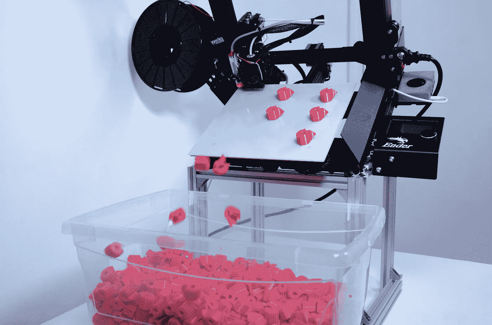

尽可能地为安德 3-尽可能地推掉完成的打印

# 初学者的挣扎

我承认——当我得到第一台 3D 打印机时，我对它们的工作原理甚至使用方法知之甚少。作为一名机械工程专业的学生，当我买下它时，我真正想的是，“哇，这将是我所有项目的原型制作，太棒了！”和“现在一切都将变得如此简单！”在某些方面，我认为这是正确的。我的 3D 打印机在我的许多项目中都很棒，但我不会说它让一切都变得容易，尤其是在开始的时候。

我没想到的一件事是 3D 打印可能失败的方式之多。老实说，我只是认为我的 3D 打印机开箱后就能完美工作，我需要做的只是按下按钮，几个小时后就会出现一个美丽的、完全在公差范围内的 3D 对象。然而，事实并非如此。如果我没记错的话，我的第一张 3D 打印作品以“意大利面条”告终——尽管我当时并不知道这个术语(我实际上不得不在互联网上搜索了一下，才找到这个术语——意大利面条)。不知道这些故障模式的名称是一个问题，因为这使得很难通过快速的谷歌搜索来解决这种情况。我当时的方法是浏览几个 3D 打印失败指南，试图找到适合我情况的部分，但这是一个繁琐的过程。

# Quinly —从一开始就让 3D 打印变得简单

从这次经历中，我发现一些库存的 3D 打印机并不像你想象的那样容易使用，打印问题会导致浪费灯丝和时间。由于这些常见的问题， [3DQue](https://www.3dque.com/) 已经开发出了很棒的软件，可以更容易地从浏览器控制您的打印机，目前正在开发一个 3D 打印故障检测模型，该模型将集成到未来的软件更新中。有了这个机器学习模型， [Quinly](https://shop.3dque.com/products/quinly-automated-print-manager-for-ender-3) 不仅能控制你的 3D 打印机，还能监督它。这一增加将允许它中止和重新开始不可恢复的打印，就轻微的打印缺陷发出警告，并创建重复出现问题的日志，以建议预防性维护。

# 机器学习和分类

在数据科学领域，分类是一种受监督的机器学习方法，其中经过训练的模型能够识别和分类给定的一组新数据。它可用于多种数据类型，包括原始数字、图像、音频和文本数据。在我们的例子中，我们将使用对象检测，它包括定位和分类图像中的关键特征。为了让计算机学习这些关键特征并知道如何对它们进行分类，必须制作一个标签列表。我们当前的课程列表如下:

# 上层社会

## 意大利式细面条

最明显的 3D 打印失败之一被称为意大利面条，因为它与食物相似。当细丝在打印过程中突然开始到处挤压，并形成一堆没有意义的东西，而不是你希望的 3D 对象时，就会出现意大利面。这可能是由多种原因造成的，例如打印分离或零件断裂。有些时候，印刷品是可回收的，因为印刷品可以在以后恢复，多余的可以被切掉。即便如此，还是经常会看到这些打印灾难性地失败，所以根据意大利面的位置和数量，这可能是检测后可能会中止并重新启动的类之一。

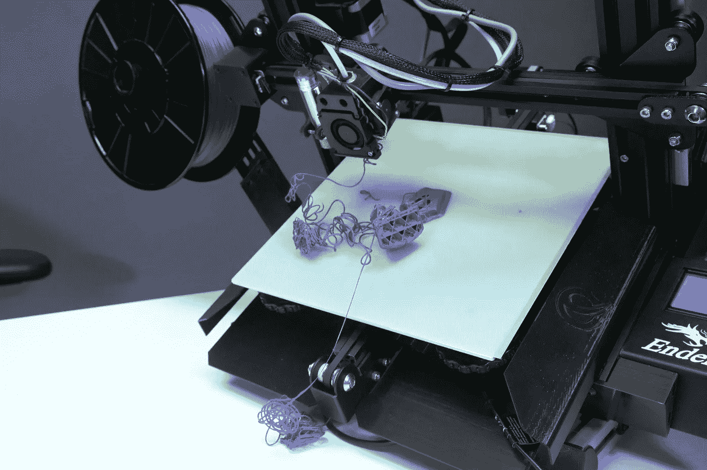

意大利面条——数码相机

## 图层转换

另一个明显的故障称为层偏移，它发生在打印作业的中途，此时打印机随机开始打印所有新层，这些新层与之前的层相距一段距离。移位上方和下方的部分看起来结构一致，只是向右、向左、向前或向后移位。这通常是由打印机的 x 轴或 y 轴同步带的问题引起的，因为这些问题可能会突然跳过皮带上的齿。对于大多数人来说，这种类型的失败是不希望的，并且很难修复，所以再次，该类很可能被归类为 Quinly 的高优先级，并且将被中止和重新启动。

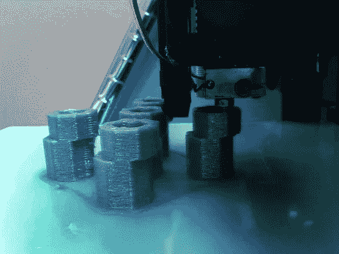

图层转换— Pi 相机

## 派遣

根据您的印刷表面和基座水平，印刷分离可能是罕见的，也可能是常见的。这是指大部分甚至整个印迹从构建板的表面脱落。这可能会导致其他故障，因为零件移动太多，灯丝无法准确放置在未来的层中。就我个人而言，我的打印机附带的普通床有不少问题，但使用套装中的 VAAPR 床效果更好。由于这种类型的故障通常会导致许多其他故障，Quinly 也很可能会因这个问题而中止并重新开始打印。

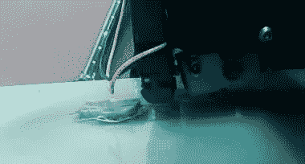

分离-Pi 相机

## 喷嘴斑点

有时，喷嘴斑点很难看到，直到它们已经相当大并且具有破坏性，因为它通常位于直接视野之外(就在酒店的正下方)。由于这个问题，我们将 Pi 摄像机安装在携带 hotend 的杆的末端，以便摄像机角度跟随并随着喷嘴尖端向上移动，为我们提供最佳视角。喷嘴液滴通常始于差的初始层，该层分离并开始成意大利面条状。由于热灯丝开始在如此接近床的地方成意大利面条状，灯丝开始球化，变成一团，甚至大到足以覆盖喷嘴及其内部和周围的一些区域。这种类型的故障极难恢复，并可能损坏打印头，因此 Quinly 可能需要中止这种故障并重新开始打印。

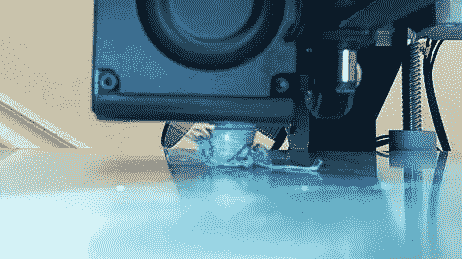

喷嘴斑点— Pi 相机

## 挤压不足/过度挤压

稍微不太明显的印刷失败是挤压不足和挤压过度，因为最终的印刷结构类似于期望的模型，但是表面通常具有不期望的纹理。挤压不足会产生孔洞，而过度挤压会导致表面熔化或不平整。由于这些类型的故障模式更多地与美观有关，而不是结构，一些人可能认为最小的挤压不足或过度挤压是可以接受的，因此我认为最好的方法是及时发出通知，而不是立即中止打印。由于这有点主观，我们希望也给用户更多的控制权，什么是他们的打印可以接受的，以保证重新启动打印失败。

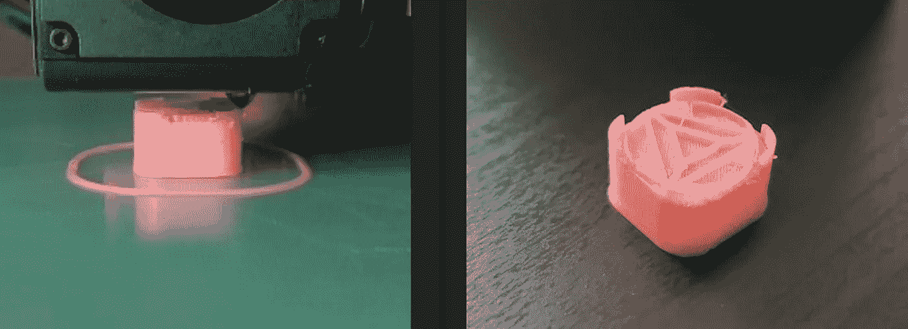

挤压下— Pi 相机、数码相机

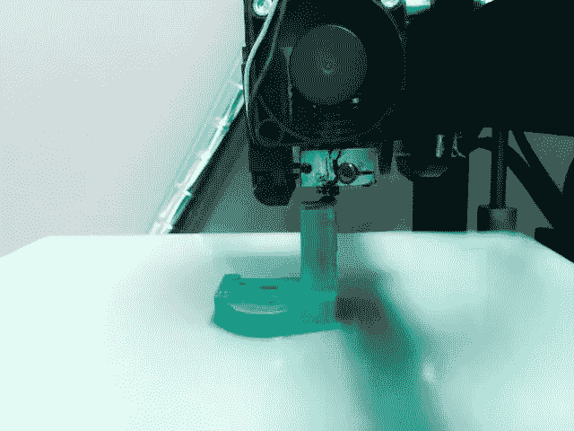

过度挤压— Pi 相机

## 不良初始层

完美的初始层是每个 3D 打印爱好者都喜欢并努力追求的东西，但取决于第一层有多差，它可能没有重要到足以重新开始打印。一个坏的第一层可能看起来非常不同，这取决于导致它的问题，但一般来说，这一层看起来不均匀，甚至可能有小块意大利面条混合在一起。如果图层只是稍微有点不均匀，并且完成后会在打印的底部，许多人可以接受不太理想的初始图层。因此，针对这种类型的故障发送通知可能会更好。

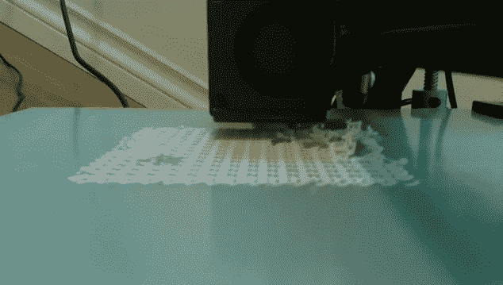

差的初始层-Pi 相机

## 翘曲

根据您最常用的材料类型，翘曲可能是您面临的常见烦恼。它通常发生在一组特殊的材料上，由于周围床层和热环境温度的差异，这些材料冷却不均匀，导致收缩，从而使层上升和变形。由于许多材料可能存在这种问题，这取决于打印机的设置，所以即使问题很小，能够识别出来也是很好的。由于翘曲有时很小，很微妙，Quinly 很可能会发送通知，让您决定是否重新开始打印。

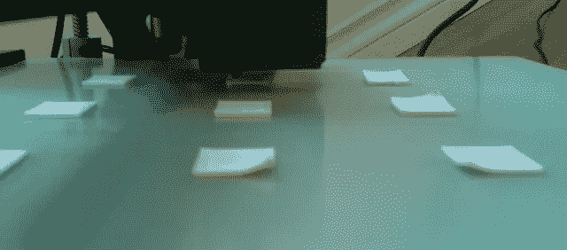

扭曲-Pi 照相机

## 桥接不良

在许多模型中，如果模型可以以最佳方式定向，则桥接可能不会发生，但对于某些模型，桥接是不可避免的，必须对逐渐突出进行战略建模。即便如此，一些制造这些无支撑突出物的努力导致不良的桥接，并使连接结构之间的空间充满下垂的细丝。通常这种情况只出现在建造桥梁时的底层，所以如果只有一些下垂的部分，它们可以被切掉。由于这一点，我不会说重启总是必要的，所以 Quinly 可能会选择通知你的情况，而不是中止和重启。

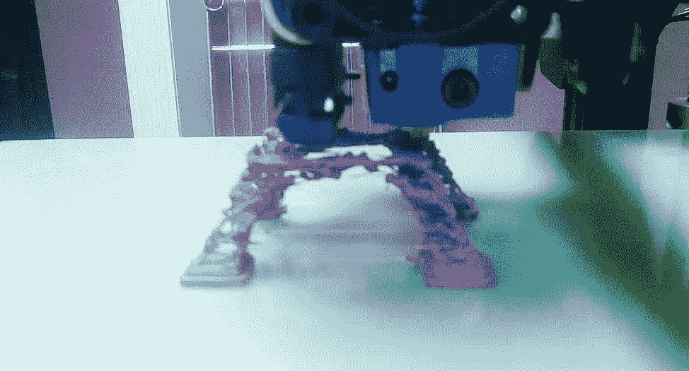

桥接不良— Pi 摄像头

## 串

我能想到的最不严重的失败是穿线，因为细线比任何其他失败都更容易取下，并且在取下后印刷品的总体结构仍然完好无损。拉丝通常是由于收缩和温度设置以及在大跨度的开放空间上行进。3D 打印领域的初学者可能不知道这个术语，因此帮助识别并让 Quinly 发送通知是很好的，但放弃并重新开始打印可能不值得。

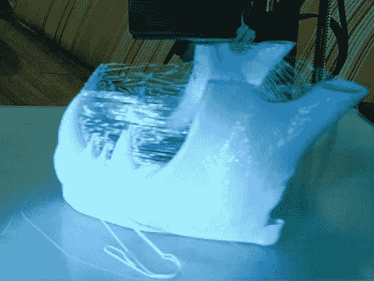

穿线— Pi 摄像机

## 模型

这个分类模型的当前列表中的最后一个类是打印对象本身。包含这个类是为了让我们可以跟踪模型在图像帧中的位置，以及比较故障在模型中的位置和所占空间。从机器学习的角度来看，这门课会很有趣，因为大多数模型在颜色、形状和大小方面看起来会有很大的不同。更常见的是看到具有明显的一般形状、大小和颜色的物体，这使得模型更容易识别物体。由于 3D 打印对象的差异，我们将需要获得大量数据来尽可能地概括我们的模型。

# 然后

“数据采集:为失败而设计”是本系列的下一篇文章。虽然这可能被视为机器学习过程中最无聊的一步，但数据采集是最重要的。没有好的数据，机器学习工具对你毫无用处。同样重要的是要注意，为了得到一个健壮的、工作良好的模型，必须不断地添加数据以进行进一步的训练。所以在某种程度上，你可以说这一步永远不会真正结束。具体到我们的项目，我们寻找的故障数据类型很难在网上找到。因此，我们设计了一种方法，使用 Python 创建随机失败的部分，并使用 Pi 相机和 Bash 脚本对这些失败进行自动延时。在本文中，我将进一步解释我制作的脚本和其他数据收集注意事项。

# TL；博士:

本文是一个五部分系列的第二部分，描述了我创建一个对象检测机器学习模型的旅程，该模型将用于 [3DQue](https://www.3dque.com/) 的 Quinly 软件。在这里，我解释一下 3D 打印中不同类别的故障模式，我们希望通过创建一个机器学习模型来识别这些模式，并使用它来使 3D 打印机实现自主。如果您有任何其他建议的故障模式来训练模型进行检测，请在下面发表评论！

# 如果你错过了第一篇文章:

 [## 自主 3D 打印之路

### 如果 3D 打印机可以通过使用计算机视觉识别抽象的 3D 打印故障来监督自己，会怎么样？

medium.com](/analytics-vidhya/the-path-to-autonomous-3d-printing-c1c0f40b461a)