# 展示广告点击率预测中的分类

> 原文：<https://medium.com/analytics-vidhya/classification-in-click-through-rate-prediction-in-display-advertising-a487a03f8631?source=collection_archive---------9----------------------->


CTR

# **简介**

O 如今，在线展示广告是一项价值数十亿美元的业务，2016 财年的年收入为 317 亿美元，比 2015 财年增长 29%。展示广告努力解决的一个核心问题是在正确的时间，在正确的背景下，向正确的人投放正确的广告。准确预测点击率是解决这一问题的关键，在过去的几年里受到了广泛的关注。

> CTR 预测中涉及的数据通常是多字段分类数据，这些数据在除了显示广告之外的许多应用中也非常普遍，例如推荐系统。这种数据具有以下特性。首先，所有的特征都是分类的，并且非常稀疏，因为它们中的许多是标识符，因此，特征的总数很容易达到数百万。第二，每个特征属于一个且仅属于一个领域，可以有几十到几百个领域。

多字段分类数据的特征显示了一些独特的挑战:

1- **特征交互很普遍，需要专门建模。**

来自一个领域的特征通常与来自其他不同领域的特征有不同的交互。

3- **需要注意潜在的高模型复杂性。**

根据这些提到的问题，通常常用的分类模型在这种数据上不能很好地运行。在本文中，首先，我们将解释我们的数据集的特点，其次，我们将实现一些著名的分类算法，如逻辑回归，SVM，随机森林，等等。

# 资料组

多亏了 Yektanet(伊朗的一个数字广告平台),我们将要处理的数据集才得以呈现。数据集标记为“训练”的部分包含超过 400 万个数据。

该数据集由 14 个特征+ 1 个目标组成，即点击了的**。拥有唯一**【用户 Id】**的用户每次访问拥有**【文档 Id】**的网页，都会有页面浏览量。对于每个页面视图，将产生一个唯一的**‘显示 Id’**。在每个页面视图中，一些广告会同时显示给用户。**‘时间戳’**表示事件发生的时间。正如我们可以从标题中得知的那样，**“一天中的某个小时”**和**“一周中的某一天”**显示了事件发生的时间。每个广告内容由**‘创意 Id’，**表示，并且这些内容中的每一个都属于由**‘活动 Id’**表示的广告活动，每个活动属于由**‘广告商 Id’**表示的广告商。每个用户使用一个特定的**【设备】**来访问一个网页。我们很容易识别出**‘OS’**栏表示用户使用的操作系统。**‘浏览器’**栏显示用户使用什么浏览器访问网页。每个广告显示在被称为窗口小部件的网页的特定部分，**‘窗口小部件 Id’**指示网页的哪个部分被分配给该广告。每个网页都有一个**‘发布者’**和一个**‘来源’**。**

你也可以把我们在这里做的所有工作用在其他免费的著名的 CTR 预测数据集上。由于版权问题，我们不能公布我们数据的内容。

# 数据清理

首先，我们将看到大约 10 个数据样本，以确定我们正在处理的是什么:

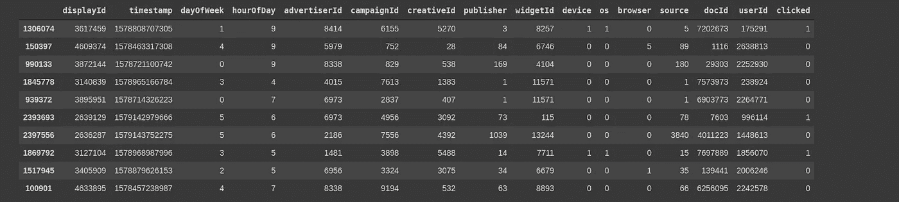

数据样本

然后，您需要迭代所有要素并找到 NaN 或 Null 值:

```
*count_missing = df_train.isnull().sum()
missing_value_df = pd.DataFrame({ ‘Count Missing’ : count_missing})
missing_value_df*
```

上面的代码片段将向我们展示，我们的数据集没有太多的清理问题:

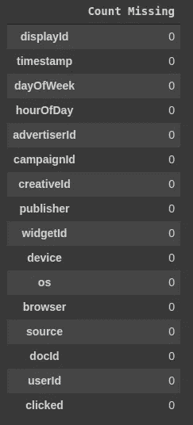

正如您所看到的，这里没有太多要讨论的，所以我们将只打印特性之间的相关性。我们想删除一些冗余的数据和列。这会让我们对将要做的事情有所了解。

```
cor = df_train.corr()plt.figure(figsize=(15,15))sns.heatmap(cor, annot=True, cmap=plt.cm.Reds)plt.show()
```

上述代码片段的输出将类似如下:

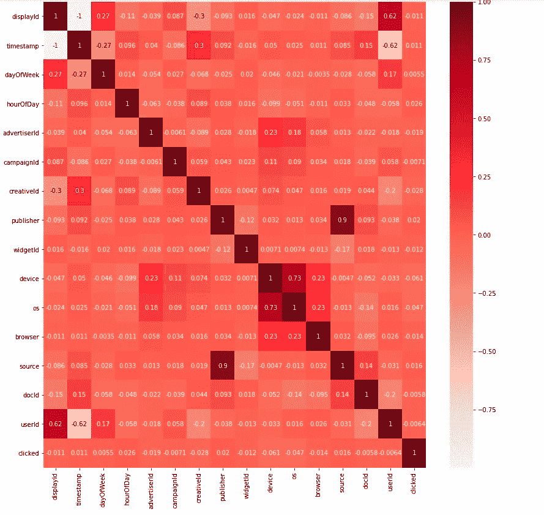

如您所见，我们的一些特征高度相关，因此我们可以每对去掉一个。

例如，我们看到(' timestamp '，' display ')，(' source '，' publisher ')，(' os '，device ')'在这里是双绞线，我们将删除每个功能中的一个。但是正如我上面所描述的，我们可以在数据集描述中看到,“时间戳”和“显示 Id”在数据集中是唯一的，我们可以将这一特征解释为索引，并删除这两个特征。

```
drop_columns = ['timestamp', 'publisher','os', 'displayId']df_train = df_train.drop(columns=drop_columns, axis=1)
```

到目前为止，我们在每个数据集中所做的只是正常和明显的清理标准，但在这种数据中，我们需要做一些魔术来增加功能交互，并丢弃无用的数据，如我们在整个数据集中只看到几次的“userId ”,或“docId”或任何其他具有类似行为的功能。

# 删除无用的列

首先，我们将绘制一些关于每个特征的 PDF 和 CDF 的有用图表，然后基于这些图表，我们将为每个特征选择一个阈值，并删除无用的行。

例如,“userId”上这两个函数的输出如下所示:

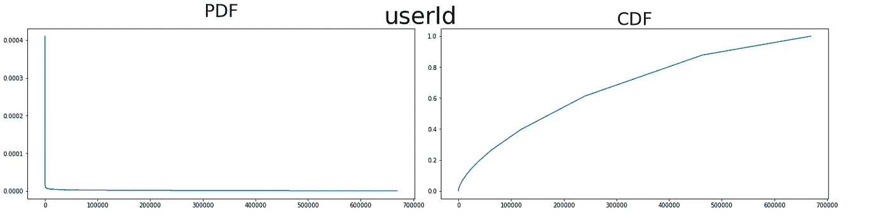

“用户 Id”的 PDF 和 CDF 分发

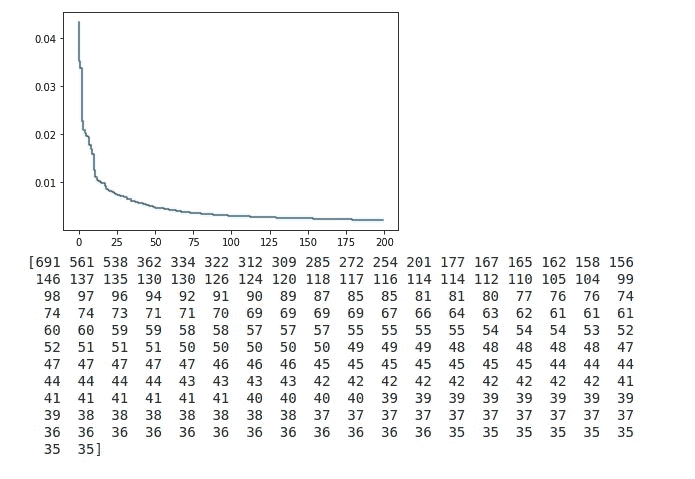

基于重复次数的最佳用户标识

基于我们所看到的，我们为每个特性选择一个阈值，并删除不符合该条件的行。然后，我们将对选定的行进行聚合，并删除重复的行。

通过这项工作，剩余的数据将确保我们每个数据至少有一个好的特征。

丢弃无用的数据

# 不平衡数据集

您可能知道，在点击率预测类型的数据集中，我们总是会遇到不平衡的格式。我不会讨论什么是不平衡数据集，你也可以在这里阅读这个[](https://towardsdatascience.com/having-an-imbalanced-dataset-here-is-how-you-can-solve-it-1640568947eb)**和[](https://elitedatascience.com/imbalanced-classes)**。****

****对于这个问题，我们将使用下采样(欠采样)方法。****

> ****缩减取样前负类的形状:(2926235，16)****
> 
> ****缩减采样后负类的形状:(842181，16)****

# ****一键编码****

****如您所知，这类数据中的所有特征都是分类的，在这些情况下，您必须对您的特征进行一次性编码。****

****这种情况下的一个严重问题是，您必须管理您的训练和测试集，使其具有相同的特性(要了解更多信息，您可以阅读 [**这篇**](/@vaibhavshukla182/how-to-solve-mismatch-in-train-and-test-set-after-categorical-encoding-8320ed03552f) 简短文章)****

# ******逻辑回归******

****在我们做了所有的工作之后，现在我们将实现我们的分类方法。****

****您可以在下面的代码片段中看到逻辑回归的实现:****

****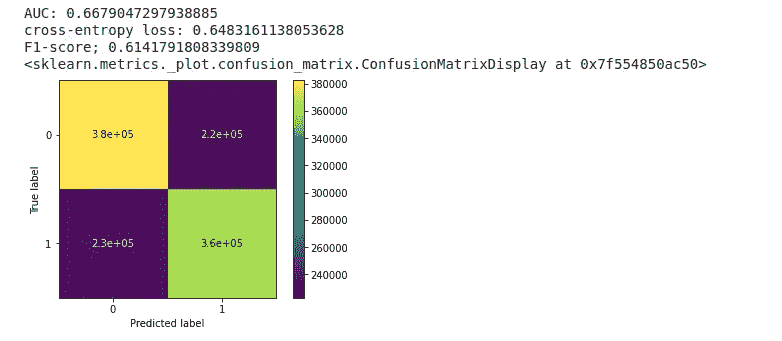****

# ****SVM****

****SVM 在这一特定领域有许多倒退，例如，你不能在可行的时间内用超过 20k 的数据在 SVM 上训练，而且 SVM 在稀疏数据上工作得很差。****

****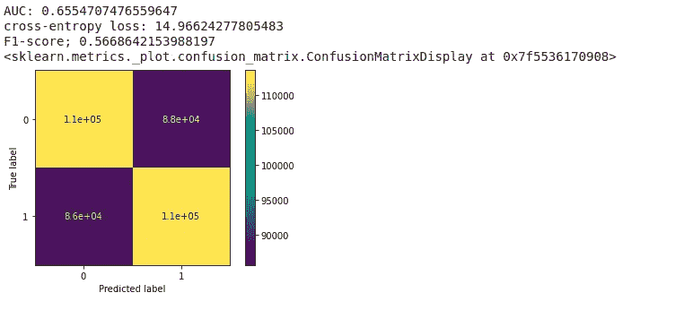********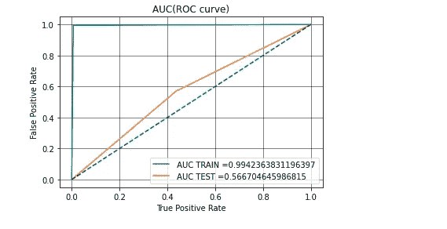****

# ****随机森林****

****这个特定区域的随机森林回退是关于使用具有许多特征的稀疏矩阵，所以我们只能在我们的树中使用一点深度，这表明我们可能没有很好的准确性。****

*******交叉验证部分:*******

*******火车上的评价:*******

*******对测试的评价:*******

****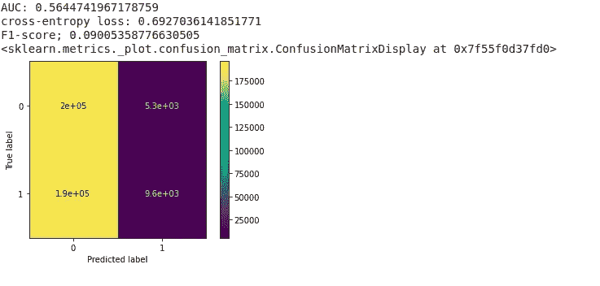********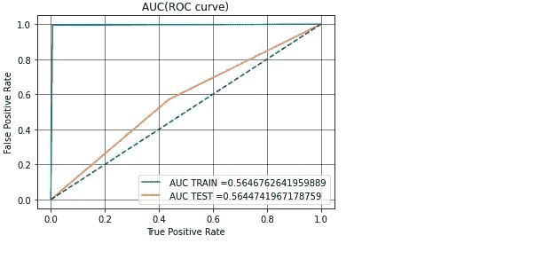****

# ****XGBoost****

****XGBoost 比以前的方法快得多，并且获得的结果也是可接受的。(但还不够好)****

*******列车上评价:*******

*******对测试的评价:*******

****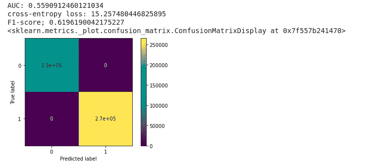********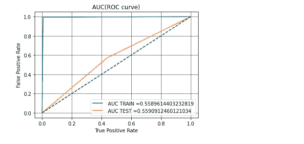****

# ****结论****

****正如您可能注意到的那样，所有解释的方法在该数据集上的表现都不好，这种方法中如此巨大的稀疏矩阵存在一个巨大的问题，在下一篇文章中，我们将介绍两种全新的方法，称为因子分解模型和字段权重因子分解模型，它们在稀疏数据集上工作得非常好。****

****你可以在 [**这个链接**](https://colab.research.google.com/drive/1D12AIDb9ODnCrxhEiNxD7U3_oGY3UFqO?usp=sharing) 里看到所有解释的代码和其他方法比如 FM，FWFM****