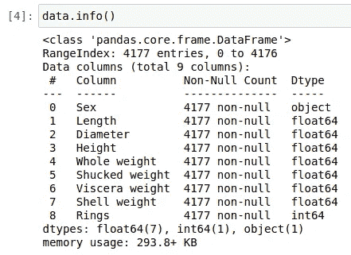

# 估计鲍鱼年轮数的分类方法

> 原文：<https://medium.com/analytics-vidhya/classification-method-for-estimating-the-numbers-of-rings-of-abalone-bb13264dd186?source=collection_archive---------4----------------------->

来自北加州的红色鲍鱼壳内部的彩虹色表面(相邻的硬币直径为 25 毫米)(来源:[https://en.wikipedia.org/wiki/Abalone](https://en.wikipedia.org/wiki/Abalone)

# 介绍

鲍鱼是鲍鱼科中一组小到非常大的海螺，海洋腹足类软体动物的统称。

其他常见的名称有耳壳、海耳，以及澳大利亚部分地区的 muttonfish 或 muttonshells，英国的 ormer，南非的 perlemoen，新西兰三个物种的毛利语名称是 pāua。

鲍鱼是海洋蜗牛。它们的分类学将它们归入鲍鱼科，该科只包含一个属，鲍鱼，该属曾包含六个亚属。这些亚属已经成为鲍鱼的替代代表。全世界公认的物种数量在 30 到 130 之间，描述了超过 230 个物种级分类群。对该科最全面的处理认为 56 个种是有效的，另外还有 18 个亚种。

鲍鱼的壳具有低的、开放的螺旋结构，其特征是在壳的外边缘附近有几个连续的开放呼吸孔。贝壳厚厚的内层由珍珠层(珍珠母)组成，在许多物种中，珍珠层是高度彩虹色的，产生一系列强烈、多变的颜色，这使得贝壳作为装饰品、珠宝和彩色珍珠母的来源对人类具有吸引力。

鲍鱼的肉被广泛认为是一种理想的食物，各种文化都生吃或烹饪鲍鱼。

在本文中，我们将尝试使用一种分类方法来预测鲍鱼的年轮。

# 方法学

数据集是从 http://archive.ics.uci.edu/ml/datasets/Abalone 的 T2 检索的。然后，我们检查数据以确保数据中没有缺失值。

然后我们对数据进行预处理，然后用几个分类器进行分类。

我们将使用的分类器是逻辑回归、随机森林和 SVM。

# 导入重要的库

在我们完成所有的过程之前，首先我们导入所有我们需要的库。

# 获取数据集

数据集是从 http://archive.ics.uci.edu/ml/datasets/Abalone 的[检索的。给出的是属性名称、属性类型、度量单位和简要描述。环数是要预测的值。](http://archive.ics.uci.edu/ml/datasets/Abalone)

b

现在我们得到了数据集

现在看一下数据条件

从以上信息来看，除了性别特征，所有特征都是连续变量。那么在高度特征中，最小值为零。这种可能性要求数据中有缺失值，我们将处理缺失值。

接下来，看一下环列中的目标

我们可以看到目标是 1 到 29(但是没有 28)，所以我们要做的分类是多类分类

# 数据预处理

**处理缺失值**

我们首先检查身高特征中有多少缺失值，以及它属于哪个类。

缺失值的数量为 2，并且处于婴儿性别。然后，我们将值 0 更改为 null。我们将用婴儿性别的平均身高特征来填充缺失值

因此，我们将用 0.107996 来填充缺少的值

**编码分类特征**

正如我们所看到的，性别特征是一个分类特征，所以我们需要对这个特征进行编码。我们将对此进行一次性编码。

在我们完成编码后，该列增加到 11。

**拆分数据**

我们将数据分成 3 部分，即训练集、测试集和验证集。我们这样做是因为我们不可能交叉验证数据，因为有几个目标只有 1 的数量。

为了加快分类学习，我们首先对数据进行标准化

**数据标准化**

为了加快分类学习，我们首先对数据进行标准化

# 分类

我们将使用四种分类器对数据集进行分类，即逻辑回归、随机森林和 SVM。

我们还将确定每个分类器的最佳参数。为了确定最佳参数，我们不使用交叉验证，因为有几个目标总共有 1 个。为了确定每个分类器的最佳参数，我们使用简单的网格搜索方法。

## 逻辑回归

我们将使用逻辑回归为分类设置的参数是 C 和 solver。由于这是一个多类分类，我们确定牛顿-cg、sag、saga 和 lbfgs 之间的求解器。Multiclass 我们设置多项式，penalty 我们设置 l2。

使用最佳参数，我们得到训练集的分数为 0.29，测试集的分数为 0.25

## 随机森林

我们将使用随机森林为分类设置的参数是 criterion、max_depth 和 dan max_features。

使用最佳参数，我们得到训练集的分数为 0.29，测试集的分数为 0.27

## 支持向量机

我们将使用 SVM 为分类设置的参数是核、C 和 gamma。

使用最佳参数，我们得到训练集的分数为 0.31，测试集的分数为 0.26

我们可以将每个分类器的得分总结如下

我们可以观察到每个模型的精度都在 0.3 以下，这对于预测来说是相对较低和困难的。这可能是由于大量的水平和我们的目标高度不平衡。

# 摘要

在本报告中，使用了三种分类算法来预测目标特征。对于每种方法，都使用简单网格搜索方法。我们在超参数调整中使用简单的网格搜索，并基于它们的准确性获得每个模型的最佳性能。最后，我们以训练集分数和测试集分数的形式给出并讨论了结果。基于以上分析，随机森林模型在所有分类模型中具有最好的精度。但是，并没有显著高于其他型号。由于存在局限性，需要进一步分析。

# 参考

1.[https://en.wikipedia.org/wiki/Abalone](https://en.wikipedia.org/wiki/Abalone)
2。韩，人。2019.机器学习项目——预测鲍鱼的年龄。RMIT 大学
3。Andreas C. Müller 和 Sarah Guido.2017 .使用 Python 进行机器学习的介绍