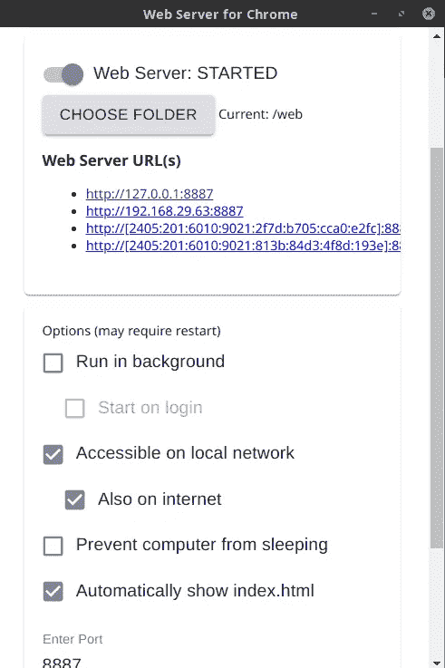

# 使用 Tensorflow.js 的自定义数据集分类模型变得简单:以下是您需要了解的内容

> 原文：<https://medium.com/analytics-vidhya/classification-model-on-custom-dataset-using-tensorflow-js-9458da5f2301?source=collection_archive---------0----------------------->

从头开始构建一个模型，并使用它在浏览器上获得一个预测。

Niklas Ohlrogge 在 [Unsplash](https://unsplash.com?utm_source=medium&utm_medium=referral) 上拍摄的照片

所以，我最近有机会试用了 Tensorflow.js，这是一个用 **JavaScript** 编写的机器学习的库。可以在 **JavaScript** 中开发 ML 模型，**直接在浏览器或者节点中使用** ML。 **js** 。

因为我是新手，所以我想在分类任务的自定义数据集上尝试一下。相信我，当我告诉你我找不到一个单独的教程来展示如何从零开始建立一个模型，并使用它在浏览器上得到一个预测。我探索了很多，并把我所有的知识应用到这个项目中。希望这篇文章能帮助你开始 tensorflow.js 学习之旅。

# **获取数据集**

对于这个项目，我将使用从 Kaggle 下载的[‘花卉分类](https://www.kaggle.com/alxmamaev/flowers-recognition)’数据集。文件采用给定的格式:

训练-> 5 个文件夹，文件夹名称为类
测试- > 5 个文件夹，文件夹名称为类

图片来源:作者

# 获取和处理数据

创建一个 data.js 文件，该文件将用于数据加载。现在，我们假设文件夹名称“n_flowername.png”中的每个图像，其中“n”是图像的编号，“flower”是花的名称。

# 创建模型

现在，让我们创建一个演示模型来训练数据。这应该是一个新的文件 model.js，这个文件将只包含模型架构。

因为我们有一个多类分类问题，我们将使用“分类交叉熵”。如果你只有两个类，你可以选择“二进制交叉熵”。

# 让我们把它们放在一起

创建一个 main.js 文件，该文件将调用所有函数并执行它们。请确保更改数据集所在的路径

# 现在让我们使用浏览器来获得一个预测

我们将首先创建 predict.js，在其中加载我们预先训练的模型并获得预测。

# 注意！

> 尽管所有的文件都是静态的，我们的 Html 文件仍然需要一个服务器来加载 model.json。

你可以在谷歌浏览器中使用“ [Web Server for Chrome](https://chrome.google.com/webstore/detail/web-server-for-chrome/ofhbbkphhbklhfoeikjpcbhemlocgigb?hl=en) ”扩展来实现这一点(我假设你正在使用谷歌浏览器打开 HTML 文件)

只需启动应用程序，并保持如下设置。

图片来源:作者

选择 HTML 文件所在的文件夹，然后就完成了。打开“web 服务器 URL”下面的第一个链接，您的 Web 应用程序就可以正常工作了。

## 在这里找到全部代码→ [花卉分类](https://github.com/Garima13a/Flower_Classification_Tensorflow.js)

# 结论

在本文中，我们探讨了如何在 tensorflow.js 中为分类任务使用自定义数据集。如果您想要创建一个 web 应用程序，该项目将指导您创建一个应用程序，其中您只需要一个模型，推理将在客户端进行。

谢谢大家！

我希望你喜欢这篇文章！