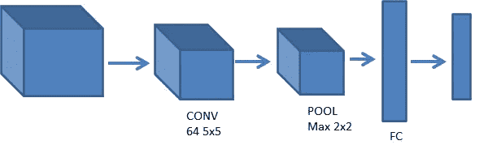

# 德国交通标志的分类

> 原文：<https://medium.com/analytics-vidhya/classification-of-german-traffic-signs-309eb040dbee?source=collection_archive---------24----------------------->


# 背景

随着自动驾驶汽车开发的研究继续进行，关键挑战之一是计算机视觉，使这些汽车能够从数字图像中了解他们的环境。特别是，这涉及到识别和区分路标的能力——停止标志、限速标志、让行标志等等。

在这个项目中，我将使用 TensorFlow 建立一个神经网络，根据这些标志的图像对路标进行分类。为此，我将使用一个带标签的数据集:一组已经按照路标分类的图像。

存在几个这样的数据集，但对于这个项目，我们将使用德国交通标志识别基准(GTSRB)数据集，它包含 43 种不同类型的道路标志的数千张图像。

# 模型

构建卷积神经网络，对 GTSRB 数据集提供的路标进行训练和分类。

**模型 1**


**图 1.1 —模型 1**

该模型包括一个利用 ReLu 激活的 32–3x 3 过滤器的卷积层，接着是一个 2x2 的 MaxPooling 层，接着是一个利用 ReLu 激活的具有 128 个节点的全连接密集层和一个利用 softmax 激活的具有 43 个节点的最终输出层，以将输出分类为 43 种不同的路标。

```
tf.keras.models.Sequential([
        tf.keras.layers.Conv2D(
        32, (3, 3), activation='relu', input_shape=(IMG_WIDTH, IMG_HEIGHT, 3)),
        tf.keras.layers.MaxPooling2D(pool_size=(2, 2)),
        tf.keras.layers.Flatten(),
        tf.keras.layers.Dense(128, activation="relu"),
        tf.keras.layers.Dropout(0.50),
        tf.keras.layers.Dense(NUM_CATEGORIES, activation="softmax")
    ])
```

该模型的准确率为 96.96%。


**图 1.2 —模型 1:训练结果**


**图 1.3 —模型 1:模型总结**

模型 1 提供了 96.96 的精度，决定修改卷积层。

**型号 2**


**图 2.1 —模型 2**

该模型包括一个利用 ReLu 激活的 64–3x 3 过滤器的卷积层，接着是一个 2x2 的 MaxPooling 层，接着是一个利用 ReLu 激活的具有 128 个节点的全连接密集层和一个利用 softmax 激活的具有 43 个节点的最终输出层，以将输出分类为 43 种不同的路标。

该模型的准确率为 97.57%。

```
tf.keras.models.Sequential([
        tf.keras.layers.Conv2D(
        64, (3, 3), activation='relu', input_shape=(IMG_WIDTH, IMG_HEIGHT, 3)),
        tf.keras.layers.MaxPooling2D(pool_size=(2, 2)),
        tf.keras.layers.Flatten(),
        tf.keras.layers.Dense(128, activation="relu"),
        tf.keras.layers.Dropout(0.50),
        tf.keras.layers.Dense(NUM_CATEGORIES, activation="softmax")
    ])
```


**图 2.2—模型 2:训练结果**


**图 2.3 —模型 2:模型总结**

前两个模型产生的准确率不到 98%。修改了网络，看看能不能提高准确率。

**模型 3**


**图 3.1 —模型 3**

该模型包括一个利用 ReLu 激活的 32–3x 3 过滤器的卷积层，接着是另一个利用 ReLu 激活的 64–3x 3 过滤器的卷积层，接着是一个 2x2 的 MaxPooling 层，接着是一个利用 ReLu 激活的具有 128 个节点的全连接密集层和一个利用 softmax 激活的具有 43 个节点的最终输出层，以将输出分类为 43 种不同的路标。

该模型的准确率为 99.11。

```
tf.keras.models.Sequential([
        tf.keras.layers.Conv2D(
        32, (3, 3), activation='relu', input_shape=(IMG_WIDTH, IMG_HEIGHT, 3)),
        tf.keras.layers.Conv2D(
        64, (3, 3), activation='relu', input_shape=(IMG_WIDTH, IMG_HEIGHT, 3)),
        tf.keras.layers.MaxPooling2D(pool_size=(2, 2)),
        tf.keras.layers.Flatten(),
        tf.keras.layers.Dense(128, activation="relu"),
        tf.keras.layers.Dropout(0.50),
        tf.keras.layers.Dense(NUM_CATEGORIES, activation="softmax")
    ])
```


**图 3.2 —模型 3:训练结果**


**图 3.3 —模型 3:模型总结**

最后一个模型的准确率不到 99%。修改了网络，看看能不能用更少的参数提高准确率。

**模式四**


**图 4.1 —模型 4**

该模型包括一个利用 ReLu 激活的 32–3x 3 过滤器的卷积层，接着是一个 2x2 的 MaxPooling 层，接着是另一个利用 ReLu 激活的 64–3x 3 过滤器的卷积层，接着是一个 2x2 的 MaxPooling 层，接着是一个利用 ReLu 激活的具有 128 个节点的全连接密集层和一个利用 softmax 激活的具有 43 个节点的最终输出层，以将输出分类为 43 种不同的路标。

该模型的准确率为 98.60。

```
tf.keras.models.Sequential([
        tf.keras.layers.Conv2D(
        32, (3, 3), activation='relu', input_shape=(IMG_WIDTH, IMG_HEIGHT, 3)),
        tf.keras.layers.MaxPooling2D(pool_size=(2, 2)),
        tf.keras.layers.Conv2D(
        64, (3, 3), activation='relu', input_shape=(IMG_WIDTH, IMG_HEIGHT, 3)),
        tf.keras.layers.MaxPooling2D(pool_size=(2, 2)),
        tf.keras.layers.Flatten(),
        tf.keras.layers.Dense(128, activation="relu"),
        tf.keras.layers.Dropout(0.50),
        tf.keras.layers.Dense(NUM_CATEGORIES, activation="softmax")
    ])
```


**图 4.2 —模型 4:训练结果**


**图 4.3 —模型 4:模型总结**

修改了网络，看看我是否可以通过引入另一个完全连接的密集层，用更少的参数来提高准确率。

**型号 5**


**图 5.1 —模型 5**

该模型包括一个利用 ReLu 激活的 32–3x 3 过滤器的卷积层，接着是一个 2x2 的 MaxPooling 层，接着是另一个利用 ReLu 激活的 64–3x 3 过滤器的卷积层，接着是一个 2x2 的 MaxPooling 层，接着是一个利用 ReLu 激活的具有 128 个节点的全连接密集层，接着是一个利用 ReLu 激活的具有 128 个节点的全连接密集层，最后是一个利用 softmax 激活的具有 43 个节点的输出层，以将输出分类为 43 种不同的路标。

该模型的准确率为 98.32。

```
tf.keras.models.Sequential([
        tf.keras.layers.Conv2D(
        32, (3, 3), activation='relu', input_shape=(IMG_WIDTH, IMG_HEIGHT, 3)),
        tf.keras.layers.MaxPooling2D(pool_size=(2, 2)),
        tf.keras.layers.Conv2D(
        64, (3, 3), activation='relu', input_shape=(IMG_WIDTH, IMG_HEIGHT, 3)),
        tf.keras.layers.MaxPooling2D(pool_size=(2, 2)),
        tf.keras.layers.Flatten(),
        tf.keras.layers.Dense(128, activation="relu"),
        tf.keras.layers.Dense(128, activation="relu"),
        tf.keras.layers.Dropout(0.50),
        tf.keras.layers.Dense(NUM_CATEGORIES, activation="softmax")
    ])
```


**图 5.2 —模型 5:训练结果**


**图 5.3 —模型 5:模型总结**

使用 5x5 过滤器，用卷积层重复上述 5 个模型。最好的结果是模型三，准确率为 99.30

**型号 6**


**图 6.1 —模型 6**


**图 6.2 —模型 6:训练结果**


**图 6.3 —模型 6:模型总结**

**型号 7**



**图 7.1 —模型 7**


**图 7.2 —模型 7:训练结果**


**图 7.3 —模型 7:模型总结**

**型号 8**


**图 8.1 —模型 8**


**图 8.2 —模型 8:训练结果**


**图 8.3 —模型 8:模型总结**

**型号 9**


**图 9.1 —模型 9**


**图 9.2 —模型 9:训练结果**


**图 9.3 —模型 9:模型总结**

**型号 10**


**图 10.1 —模型 10**


**图 10.2 —模型 10:训练结果**


**图 10.3 —模型 10:模型总结**

# 结果和讨论

下表总结了卷积神经网络中各种组合的实验结果。


我在卷积层使用了 5x5 滤镜，保持所有其他超参数不变，得到了更好的结果。

# 结论

使用模型 8 进行预测。


**图 12 —利用模型 8** 的预测

*完整代码点击* [*此处*](https://github.com/Nbandhi/AI-ML/blob/main/Road-Signs/traffic.py)