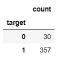
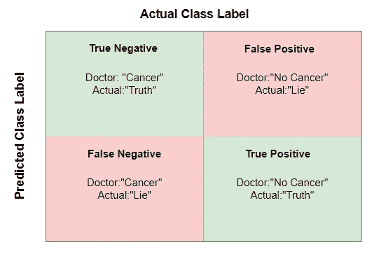
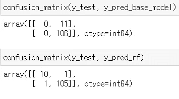
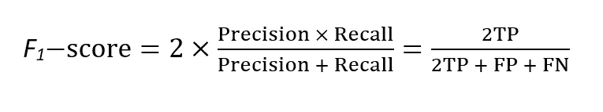
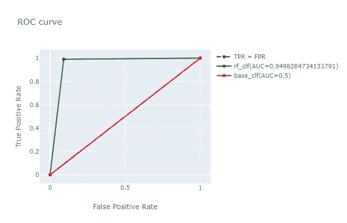

# 使用 Python Sklearn 的分类性能度量

> 原文：<https://medium.com/analytics-vidhya/classification-performance-metric-with-python-sklearn-d8342ac25898?source=collection_archive---------5----------------------->

艾米丽·莫特在 [Unsplash](https://unsplash.com/s/photos/confusion?utm_source=unsplash&utm_medium=referral&utm_content=creditCopyText) 上的照片

今天，我们将浏览来自 Sklearn 的乳腺癌数据集，以了解分类问题的不同类型的性能指标，以及为什么有时一种比另一种更受青睐。

尽管这是一个简单的话题，但当有人问“什么是精度/召回率？”时，答案不会立即出现通过看这些例子，我希望每个人，包括我自己，都能牢牢把握这个话题。

大多数人只是在分类问题中使用“准确性”作为性能指标，尽管这是可以的(有时)，但在处理不平衡数据集的情况下应该避免。

> 度量是我们用来比较不同模型的，因此我们可以选择最适合我们问题的模型

因此，使用不适当的度量会导致选择非最优模型。不平衡数据集是指具有不平衡的类标签。

以下是我们今天要讨论的主要话题:

*   混淆矩阵
*   精确度、召回率、F1 分数
*   ROC 曲线

首先，让我们导入 breast_cancer 数据集以及依赖项。此外，我们将从数据集中排除一些“恶性”患者，以代表现实世界中罕见的“恶性”患者。

我们已经将从 sklearn 加载的数据转换为 pandas dataframe，并排除了除 30 名恶性肿瘤患者之外的所有患者。仔细检查我们分组的每个标签的数量，并计算目标值。

目标计数

我们可以看到，在 387 名患者中，30 名为恶性，357 名为良性。通常的惯例是，我们想要分类的被称为“阳性/1”类，因为我们想要分类“恶性”患者，我们最初应该给它加上阳性/1 标签，然而在这种情况下，它是相反的。

让我们创建两个模型，并使用**精确度**比较它们的性能。

模型 1(基础分类器):简单地将每个患者分类为“良性”。这是强化学习中的常见情况，模型会找到最快/最简单的方法来提高性能。当模型发现将所有患者分类为“良性”实际上会导致良好的性能(当使用准确性时)时，它可能会停留在那里。

模型 2 (rf_clf):随机森林分类器，因为我们不想缩放 X 变量…

Accuracy_score 是被正确分类为恶性或良性的患者的比例。

我们可以看到，即使使用我们的基本分类器(所有患者都是良性的)，我们也可以获得相当高的准确性，因此我们可能会被说服选择这个模型来对乳腺癌进行分类。然而，由于基本分类器将所有患者分类为良性，所以他们中的一些实际上将是恶性的，这会导致有害的后果。在这种情况下，我们应该更加重视尝试正确识别癌症，即使我们将一些良性患者归类为恶性，因为知道自己患有癌症，而实际上没有比不知道自己患有癌症更好。

这就是**混淆矩阵**发挥作用的地方。混淆矩阵中的每一行代表预测类，每一列代表实际类。因此，在我们的示例中，第一行预测所有患者患有癌症，根据实际类别，如果正确，则指定为真，否则为假。

我经常使用的一个技巧是首先查看预测的标签负/正，然后查看预测是否为真/假。

以下是混淆矩阵中的一些关键词:

*   **真阴性**:预测恶性，实际恶性
*   **真阳性**:预测良性，实际良性
*   **假阴性**:预测恶性，实际良性
*   **假阳性**:预测良性，实际恶性

混淆矩阵也是 sklearn 提供的，只需将 actual_y 和 predicted_y 传入混淆矩阵()方法即可。

下面显示了我们创建的两个模型的混淆矩阵。我们的基本模型导致有害的后果，因为它不能识别恶性患者，而即使随机森林模型识别一个不太良性的患者，它也减少了未识别恶性患者的数量，因此它将是我们的问题的优选模型。

混淆矩阵是比较模型的有用方法，然而，假设我们以自动化的方式比较多个模型，则很难绘制多个混淆矩阵并对它们进行比较。因此，我们必须使用定量测量，这就是**精度**和**召回**的用武之地。

**精度**:在所有的正面预测中，有多少是正确的？在所有良性预测中，有多少是真正良性的？

*   精度= TP/(TP + FP)

**回想一下**:在所有实际阳性中，有多少被预测为阳性？在所有良性患者中，有多少被预测为良性？

*   召回= TP/(TP + FN)

很容易混淆，区别在于它们的分母。**精确预测是分母，召回是分母。**

在 sklearn 中，精确分数和召回分数都是作为方法提供的。我们可以通过使用混淆矩阵中的值来计算精度和召回率，从而进行双重检查。

请注意，根据问题的不同，有时您需要高精度(识别癌症)，而有时您需要高召回率(识别商店扒手)。完美的模型将具有良好的精确度和召回率，然而在现实生活中存在可以通过改变阈值来调整的折衷。例如，如果我们将阈值从 0.5 降低到 0.4，0.4~0.5 中的更多值现在被分类为“1”，这增加了召回率并降低了精确度。

例如:Precision _ base _ model = 106/(106+11)= 0.906

在这里，我们需要比较两个指标，尽管这比使用混淆矩阵更容易，但我们可以通过结合两者来简化它， **F1-score** 。

*   分数的范围从[0，1]开始，它是精确度和召回率的*调和*平均值，也就是说，较低的值被赋予更多的权重。
*   偏好具有相似精度和召回分数的分类器，这是它也被称为“平衡 F 分数”的原因。

就像所有其他指标一样，f1_score 作为 sklearn 方法提供。

之前，我们已经讨论过调整阈值来获得特定于我们问题的精确度和召回率。为了做到这一点，我们必须汇总每个阈值产生的所有混淆矩阵，这就是 **ROC 曲线**的用途。

对于我们想要比较的每个阈值**，接收器工作特性(ROC)曲线绘制**真阳性率(精度)对假阳性率(1-TNR)** 。**

让我们绘制每个分类器的 ROC 曲线，以比较我们应该选择的阈值，然后通过使用 AUC(用于比较 ROC 曲线的 ROC 曲线下面积)分数，我们将比较两个分类器的 ROC 曲线。

代表 TPR = FPR 的黑色斜线被我们的基本分类器覆盖，这意味着正确分类的良性**患者的比例与错误分类的恶性**患者的比例相同。****

我们使用 3 个阈值[2，1，0]分别绘制了点[(0，0)，(0.2，1)，(1，1)]，从图中我们可以看到，阈值 1 产生了精度和 FPR 的组合，因此它是最优选的阈值。

最后，我们可以看到我们的随机森林分类器具有高得多的 AUC 分数，因此我们可以说随机森林分类器比基本分类器具有更好的性能。

总之，拥有正确的性能指标与拥有下降模型一样重要，因为使用不正确的指标可能会将您引向错误的方向。尽管我们只讨论了二元分类器，但是这些度量也扩展到了多类分类问题。希望这个博客是有帮助的，也希望每个人都为他们的模型选择合适的度量标准！

参考资料:

*   [使用 Scikit-Learn 进行机器实践学习& Tensorflow](https://www.amazon.com/Hands-Machine-Learning-Scikit-Learn-TensorFlow/dp/1492032646) 第 3 章
*   [多类分类器的混淆矩阵](https://towardsdatascience.com/confusion-matrix-for-your-multi-class-machine-learning-model-ff9aa3bf7826)
*   [谐音的意思是](https://www.mathsisfun.com/numbers/harmonic-mean.html)
*   [精准，召回，F1-得分](https://www.youtube.com/watch?v=2osIZ-dSPGE&ab_channel=codebasics)
*   [stat quest 的 ROC 和 AUC](https://www.youtube.com/watch?v=4jRBRDbJemM&ab_channel=StatQuestwithJoshStarmer)