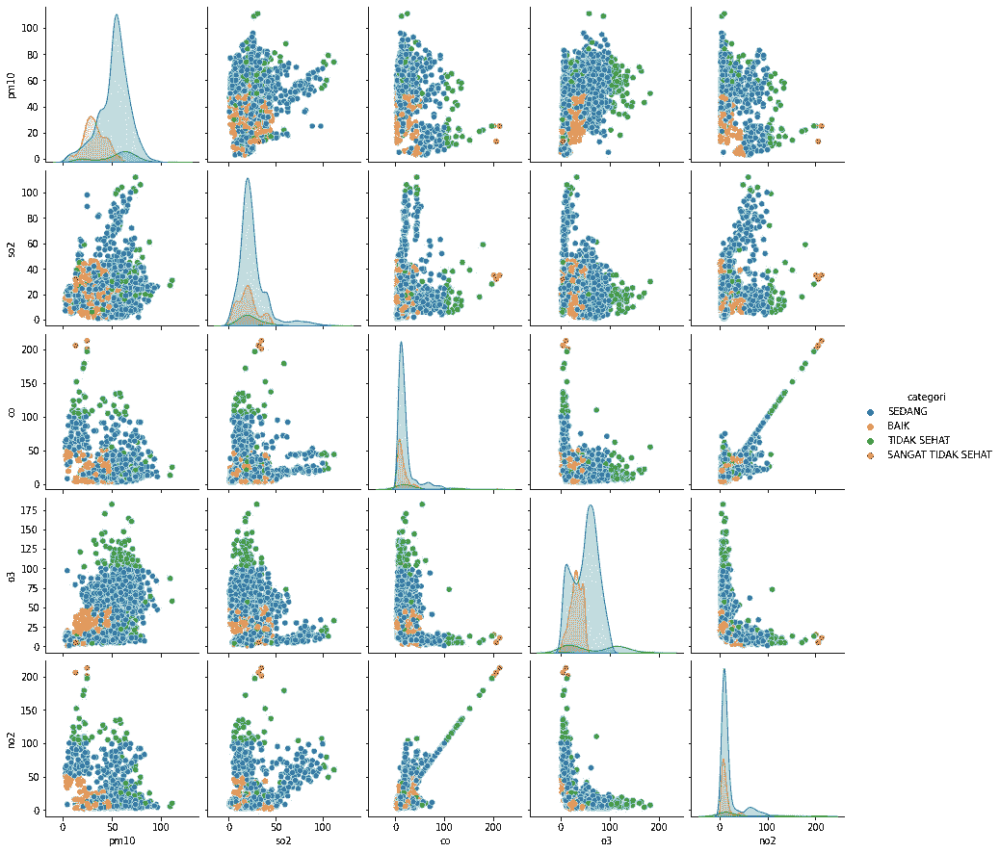
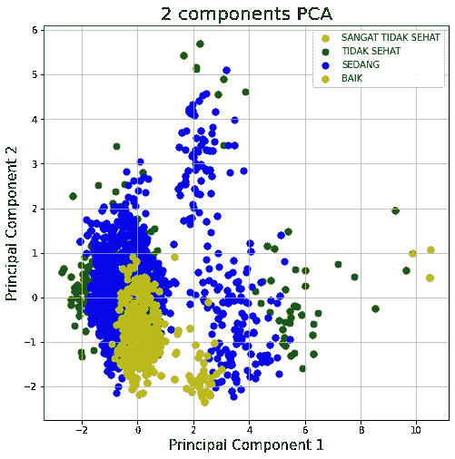
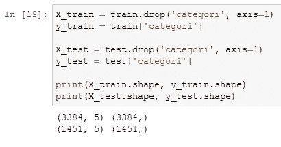
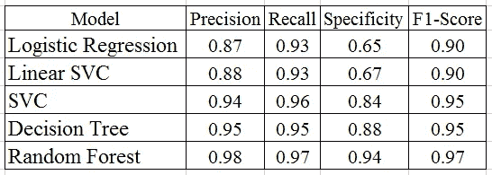

# 空气污染标准指数分级

> 原文：<https://medium.com/analytics-vidhya/classifying-air-pollution-standard-index-9baa783f8ca5?source=collection_archive---------7----------------------->

# 介绍

空气污染是指大气中存在一种或多种物理、化学或生物物质，其数量会危害人类、动物和植物的健康，影响美观和舒适，或损害财产。

空气污染可能是由自然因素和人类活动造成的。一些物理公害的定义，如噪音污染、热、辐射或光污染，被认为是空气污染。空气的性质决定了空气污染的影响是直接的、局部的、区域性的或全球性的。

在本文中，我们将尝试使用几个监督学习分类器对空气污染指数进行分类。

# 目标

*   估计能对空气污染标准指数进行分类的分类器。

# 方法

1.正在获取数据集。
2。检查数据集。
3。对数据集进行可视化。
4。对数据集进行要素工程。
5。比较有和没有目标转换的回归模型。

我们将使用的分类模型是:
1。逻辑回归
2。线性 SVC
3。决策树
4。随机森林
5。交换虚拟电路

# 关于数据集

我们从网站[https://data . Jakarta . go . id/dataset/indeks-standar-pence Maran-udara-ispu-tahun-2020](https://data.jakarta.go.id/dataset/indeks-standar-pencemaran-udara-ispu-tahun-2020)和[https://data . Jakarta . go . id/dataset/indeks-standar-pence Maran-udara-ispu-tahun-2021](https://data.jakarta.go.id/dataset/indeks-standar-pencemaran-udara-ispu-tahun-2021)。我已经综合了所有的数据，你可以在 https://github.com/dhiboen/Project/blob/main/ISPU.csv 的网站上找到。

给出的是属性名称、属性类型、度量单位和简要描述。

该数据集包含 2021 年雅加达省 5 个空气质量监测站测得的空气污染标准指数。上述数据集中的变量解释如下:

1.空气质量测量日期
2。stasiun:在工位
3 的测量位置。pm10:颗粒物(被测参数之一)
4。pm25:颗粒物(被测参数之一)
5。so2:硫化物(以 so 的形式(被测参数之一)
6。co:一氧化碳(被测参数之一)
7。o3:臭氧(被测参数之一)
8。no2:氮氧化物(被测参数之一)
9。max:同时测量的所有参数的最高测量值
10。关键:测量结果最高的参数
11。类别:空气污染标准指数计算结果的类别

在这个数据集中，目标是变量“类别”

# 导入库

我们首先导入我们需要的库

# 获取数据集

我们先得到数据集。我们通过 https://github.com/dhiboen/Project/blob/main/ISPU.csv 网站获得数据集。

该数据集具有 4，875 个样本和 11 个变量

# 检查数据集

我们首先检查数据的条件，包括特征类型和数据描述。

在`pm25`栏中，4875 个样本中只有 1081 个样本被填充。因此在`pm25`列中只有大约 22%的数据被填充。因此，我们将删除`pm25`列。

我们还将删除`max`和`critical`列，因为它们仅包含测量的最高值信息。

接下来，我们先来看看目标的状况。

有 40 个样本具有目标标签“TIDAK ADA DATA ”,这意味着样本中没有数据。因此，我们将删除目标标签为“TIDAK ADA DATA”的样本。

现在数据是 4835 个样本。

我们再来看看数据的情况。

我们可以看到，整个样本都被填满了。只是如果我们看网站上包含的原始数据，有一些空的部分标有“—”。

我们将首先处理这些缺失的值。

# 处理缺失值

我们首先用 NaN 改变“—”，它的意思不是一个数

我们再次查看测量参数的数据。这些数据类型是对象，所以我们首先将它们转换成浮点或整数。

我们可以看到“测量参数”列有缺失值。

我们将根据`stasiun`列组填充缺失的值。因此，我们将根据每个`stasiun`的平均值来填充缺失值。

现在，所有样品都已填充。

# 数据预处理和可视化

## 分割数据集

我们首先来看看目标的状况

从目标条件中，我们知道我们正在处理一个不平衡的数据集。因此，我们将对数据进行分层分割。

但是首先我们删除`tanggal`和`stasiun`列，因为我们只需要测量的参数。

## 数据可视化

我们将使用 pairplot 和个人成分分析来可视化数据，以估计正确的模型。

接下来，我们将使用主成分分析(pca)来可视化数据。

我们首先将数据分成 X_train、X_test、y_train 和 y_test。

接下来，我们使用 pca 可视化数据。

根据可视化，我们可以预测线性分类器将不会对该数据进行最佳工作。

# 建模

接下来，我们将进行数据建模。首先我们对目标进行编码。

## 编码目标

目标上有 4 种标签，分别是“BAIK”、“SEDANG”、“TIDAK SEHAT”、“SANGAT TIDAK SEHAT”。标签的顺序是“BAIK”>“SEDANG”>“TIDAK se hat”>“SANGAT TIDAK se hat”，因此标签代码如下:

*   BAIK = 3
*   SEDANG = 2
*   TIDAK SEHAT = 1
*   SANGAT TIDAK SEHAT = 0

我们再次将数据分成 X_train、X_test、y_train 和 y_test。

我们再来看看 y_train 和 y_test 上的标签条件。

## 首次建模

对于第一个建模，我们将使用逻辑回归、线性 SVC 和 SVC 模型。这是因为模型需要缩放以加速收敛。

## 第二次建模

对于第二个模型，我们将使用决策树和随机森林。这两种模型都不需要特征缩放。

# 结果和讨论

从我们使用的模型中，我们得到以下混淆矩阵

物流回归混淆矩阵

线性 SVC 混淆矩阵

SVC 混淆矩阵

决策树混淆矩阵

随机森林混淆矩阵

## 0 级(SANGAT TIDAK SEHAT)

根据混淆矩阵，0 级条件可总结在下表中:

下表总结了精确度、召回率、特异性和 F1 值:

在所有模型中，0 类中的所有精度都是 1.00。同时，所有模型的召回值都是 1.00，除了逻辑回归是 0.50。这是因为四个模型完美地识别了类别 0，而逻辑回归具有 1 的假负值。所有模型的假阳性率都是零，所以所有模型的真阴性率都是 1。

除了 0.67 的逻辑回归之外，0 类的四个模型的 F1 分数是 1。

## 1 级(TIDAK SEHAT)

根据混淆矩阵，1 级条件可总结在下表中:

下表总结了精确度、召回率、特异性和 F1 值:

线性 SVC 模型获得了最高的精度值和真阴性率。通过随机森林模型获得真实阳性率和最高 F1 分。

## 第二类(色当)

根据混淆矩阵，2 级条件可总结在下表中:

下表总结了精确度、召回率、特异性和 F1 值:

随机森林模型将类别 2 分类得非常好。这由随机森林模型中精度、真阳性率、真阴性率和 F1 分数的最高分数来表示。

## 三级(白)

根据混淆矩阵，3 级条件可总结在下表中:

下表总结了精确度、召回率、特异性和 F1 值:

随机森林模型很好地将类别 3 分类。这由随机森林模型中精度、真阳性率、真阴性率和 F1 分数的最高分数来表示。

基于以上数据，本文选择随机森林模型对空气污染标准指数进行分类。这是因为随机森林模型在分类所有类方面工作得很好，尤其是从 F1 分数的角度来看。在每个类中，随机森林模型的得分最高。虽然在 0 类中，Random Forest 的 F1 得分与其他三款车型相同，但 F1 得分是获得的最高分。

基于这些数据，随机森林模型的准确性也是其他模型中最高的。随机森林模型的精度值为 0.96。下表显示了本文中使用的模型的准确性:

# 结论:

根据以上情况，可以得出以下结论:

1.  本文中可用于空气污染标准指数分类的最佳模型是随机森林模型
2.  随机森林模型的精度值为 0.96，参数如下:

*   标准=熵
*   max_depth=9
*   最大功能=5
*   n _ 估计值=200
*   随机状态=42

# 进一步分析

如果我们看数据集的目标组成，我们知道数据集是不平衡的数据。因此，在对数据集进行分类时，需要考虑使用过采样或欠采样或其他方法对数据集进行重采样。