# 脑-机接口的脑信号分类(简介)

> 原文：<https://medium.com/analytics-vidhya/classifying-brain-signals-for-brain-computer-interfaces-a-short-introduction-53fe70486653?source=collection_archive---------17----------------------->

了解一个简单的头盔如何将你的想法转换成计算机命令

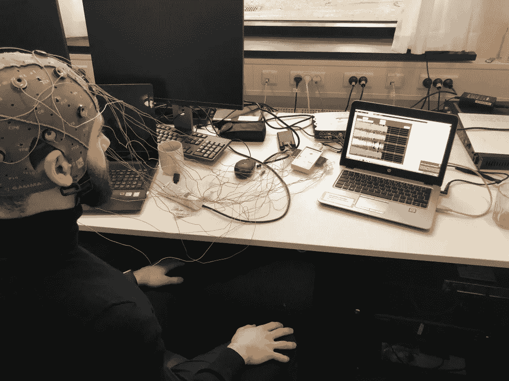

你真正的分类大脑信号(言语想象和声带运动想象)与脑电图建立一个精神控制的老虎机赛车设置

为什么分类？

这是一个很好的问题！

生物医学信号的分类是建立脑-机接口以区分不同精神活动的关键。

信号分类的更高分辨率与单个 BCI 系统能够管理的精神命令的数量成正比。基本上定义了 BCI 用户界面(UI)的范围。

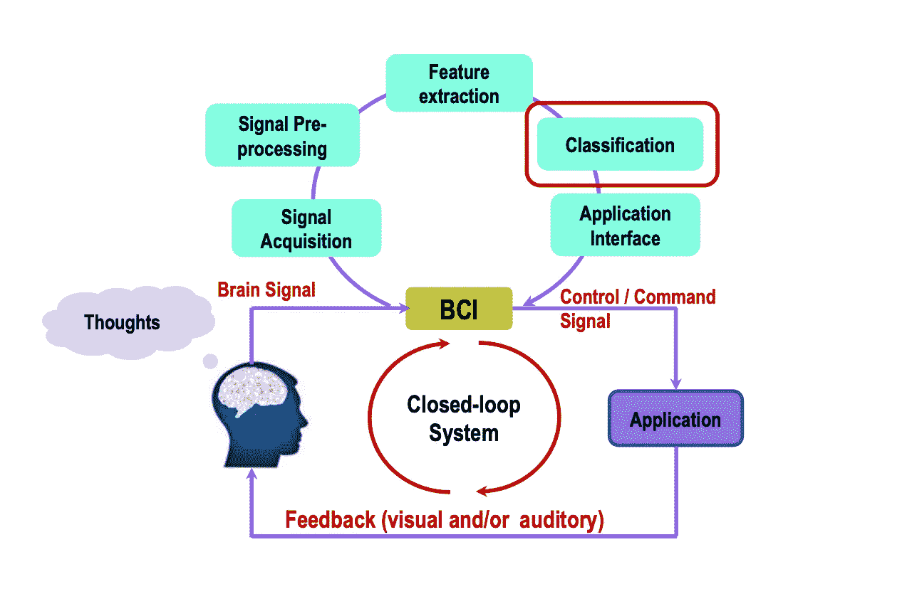

脑-机接口的组成部分

信号分类是构建 BCI 的第四步。如果你想了解前面的步骤，[看看我的其他帖子](https://younessubhi.medium.com/)。

现在，让我们来回答问题*“为什么要分类？”*深入！

许多 BCI 应用需要从 N 个命令中选择 *1 个，例如:
单词拼写器:从 26–29 个*字母中选择 *1 个
带选项菜单:从 N 个*选项中选择 *1 个
半自动机器人:从 N 个*高级命令中选择 *1 个*

所以！通过对大脑信号进行分类，我们可以均衡某些提取的特征集，以对应某些命令。如下图所示，只用思维的力量打字！(还有一个脑电图仪，但是..嘘，细节！)

2019 年的拼字游戏

在其最简单的情况下，分类技术可以用于将给定的脑信号分类到几个类别的 *1 中，例如二进制分类(2 个类别)。*

# 分类方案

在这篇文章中，我将讨论 5 类常用的分类方案:线性分类器、神经网络(NN)分类器、非线性贝叶斯分类器、最近邻分类器和分类器组合。

如果大部分是像阅读行话一样，不用担心。我会帮助你理解每个主题的基本原理。

## 基本原则

首先，让我们从定义什么是分类和分类器开始。

生物医学信号的分类(来自脑振荡记录)，是对我们的记录设备测量的电活动进行分类的过程。换句话说，*它是根据集合中所有值共有的属性对集合中的值进行分组的过程。结果，我们在数据集内获得了一组子群体。将这个过程形象化，我们见证了一个*模式识别的例子。(请看下图中的图表；“LDA”分类示例)**

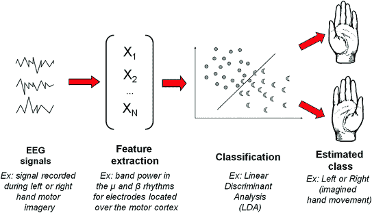

图片来源:Lotte F. (2014)脑机接口中精神状态识别的 EEG 信号处理技术指南，[https://doi.org/10.1007/978-1-4471-6584-2_7](https://doi.org/10.1007/978-1-4471-6584-2_7)

分类器是用于获得分类的计算工具。最佳分类器基于统计方法，从简单的线性分类器到基于神经网络的更复杂的机器学习系统。虽然分类器越复杂，可以实现的分类就越多，但也必须考虑所选分类器的计算要求。使用深度神经网络进行简单的二进制分类可以用线性判别来解决，这将浪费计算能力，并使 BCI 系统缓慢且低效。

总之:*分类方案是基于通过使用分类器获得的对象共有的特征将对象排列或划分成组的描述性信息。*

其次，让我们确立三个关键点:

1.  脑电信号噪声很大，需要进行降噪处理
2.  我们应该致力于为分类选择最佳特征
3.  对给定特征的最重要通道进行优先排序有助于分类(维数减少)

使用法拉第笼可以最好地降低噪声，但由于它在实际设置中远非最佳，我们可以调整算法，并在信号处理步骤中应用滤波器，以降低录音中的噪声和伪像。

在对提取的特征进行分类之后，我们可能会遇到同一事件出现多个类别的特征的可能性。特征的优先级取决于预期的应用。

最后，对给定特征的某些通道进行优先排序，将放大选择的特征(例如，通过对某些电极位置进行优先排序)。这可以通过主成分分析(PCA)等降维方法来实现。

[*点击这里*](https://younessubhi.medium.com/from-brain-signals-to-computer-commands-part-2-processing-brain-signals-fb1b0d08656b) 阅读更多关于 BCI 的降维方法

## 分类基础

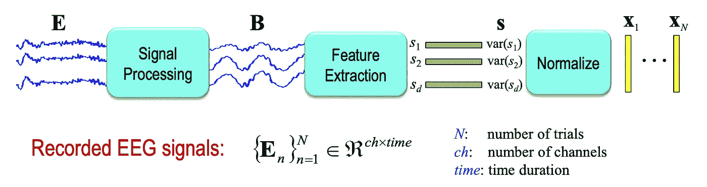

脑电信号的信号处理和特征提取

为了对脑电信号进行分类，我们必须将每个脑电信号转换成一个特征向量。让我们称特征向量为 *x* 。

利用上面的函数，我们可以得出以下结果:

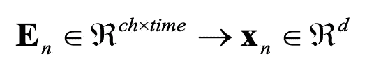

为了最好的分类，必须提取重要的特征

这又允许我们获得一组特征向量作为矩阵，给出如下:

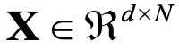

作为矩阵的特征向量

一旦完成特征提取，就可以执行分类:

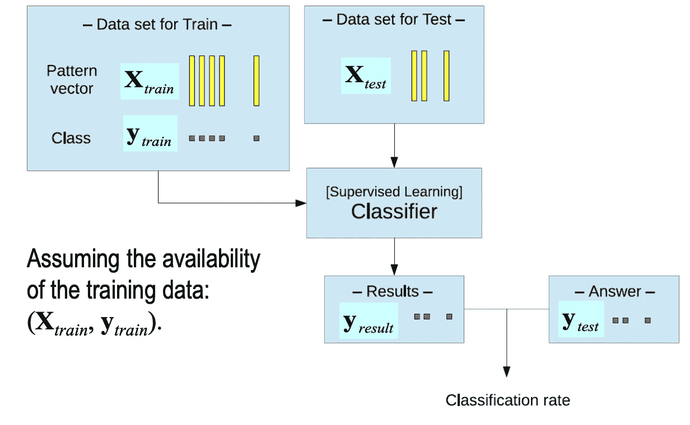

使用监督学习分类器的分类方案概述

## BCI 系统的分类算法

如前所述，我们将在这篇文章中讨论五种不同的分类算法。我会尽最大努力把它简化成最基本的东西，然后一步一步来。我希望这能让非技术读者理解它。(不然通知我！)

我们将讨论的五个分类器是:

1.  线性分类器
2.  神经网络分类器
3.  非线性贝叶斯分类器
4.  最近邻分类器
5.  以上各项的组合

我们走吧！

**1。线性分类器**

线性分类器是使用线性函数来区分类别的判别算法。

两个例子是:

*   线性判别分析(LDA，也称为费希尔 LDA (FLDA))
*   支持向量机(SVM)

**线性判别分析**

LDA 是一种非常流行的二元分类方法。

它是基于平均向量和协方差矩阵的模式为个别类。

LDA 基本上使用超平面来分离类别。

使用 LDAs 作为分类器的一个优点是它们需要非常低的计算处理能力(负载),这适用于在线 BCI 系统。

此外，它使用简单，并且通常显示出用简单的数据集提供良好的结果。

缺点:它的线性度在复杂的 EEG 数据集上提供了很差的结果。

好吧。我们来形象化一下吧！

d 维特征向量 *x* 被投影到更低的维度(这里是标量),使得这些类别的投影平均值相距很远，而投影数据的分布很小:

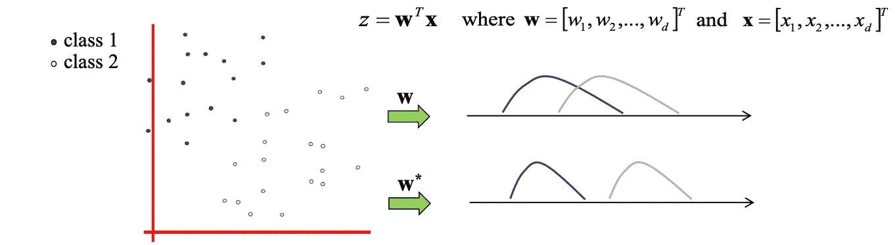

这可以通过优化与类内协方差矩阵( *S_w* )和类间协方差矩阵( *S_b* )相关的成本函数来实现:

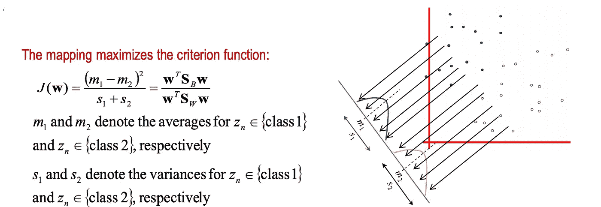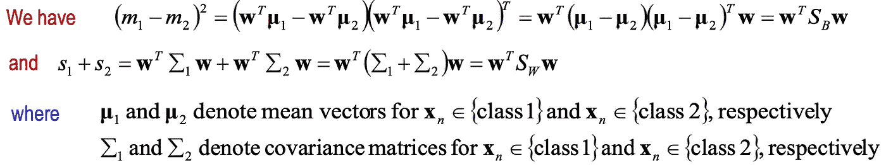

成本函数的解由下式给出:

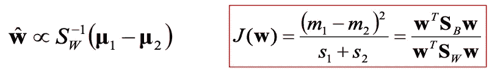

最后，我们可以选择一个最佳阈值*z0*，然后通过以下方式对任何 *x* 进行分类:

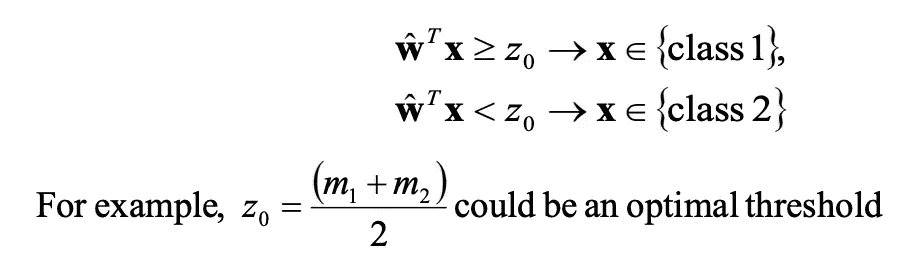

**支持向量机(SVM)**

在我看来，支持向量机有点接近最简单的监督学习机器学习算法。

支持向量机使用判别超平面来识别类别。

所选择的超平面最大化了边缘(因此具有更好的泛化属性)。

此外，支持向量机使用正则化参数。

通过使用“核技巧”，可以用支持向量机创建非线性决策边界，从而使用核函数(*高斯*和*径向基函数(RBF)* )将数据映射到更高维度。这些被称为高斯支持向量机和径向基支持向量机。

超参数(*正则化参数*和 *RBF 宽度*)需要手动找到。

再一次..可视化！

假设我们想对以下数据集进行分类:

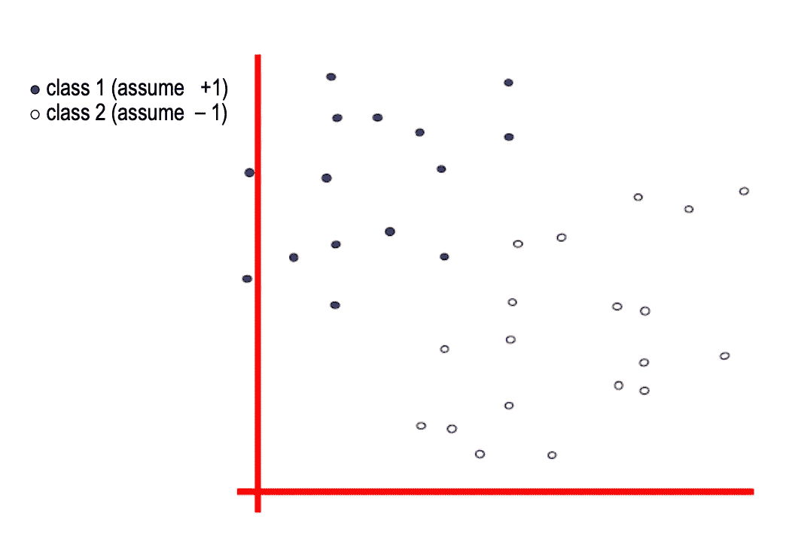

这看起来很简单。如果你在想“嗯，这只是第一类*和第二类*之间的一条直线！*“你说的完全正确！但是..什么直线会是*最好的直线*？*

毕竟，这些都没问题吗？

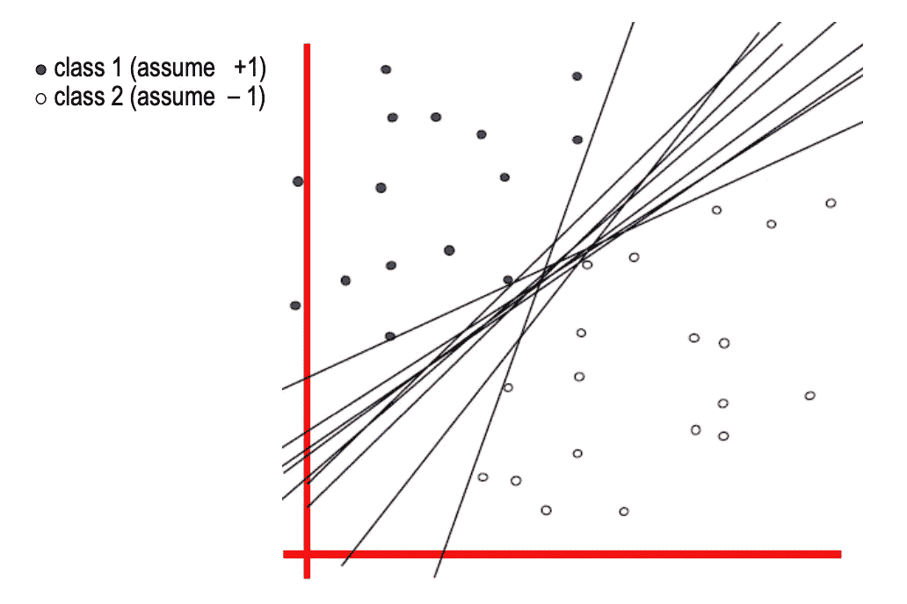

为了找到最佳线，首先我们必须定义*分类器余量*。线性分类器的*分类器余量*是在命中任何数据点之前边界可以增加的宽度。(下面以黄色显示)

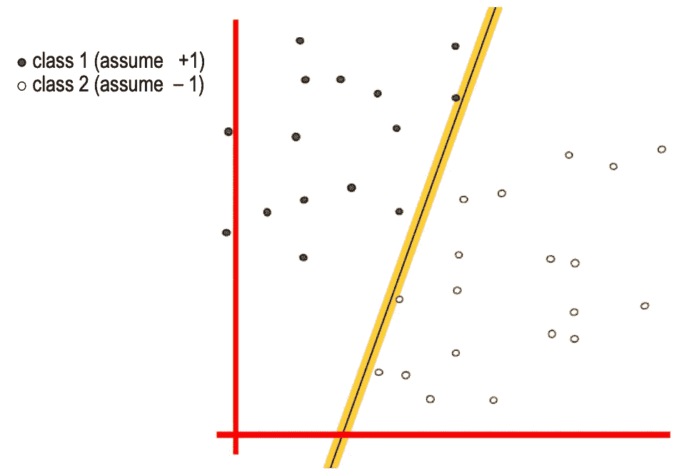

*最大间隔线性*分类器是具有最大间隔的线性分类器。

这是最简单的一种 SVM(称为 LSVM，如下所示):

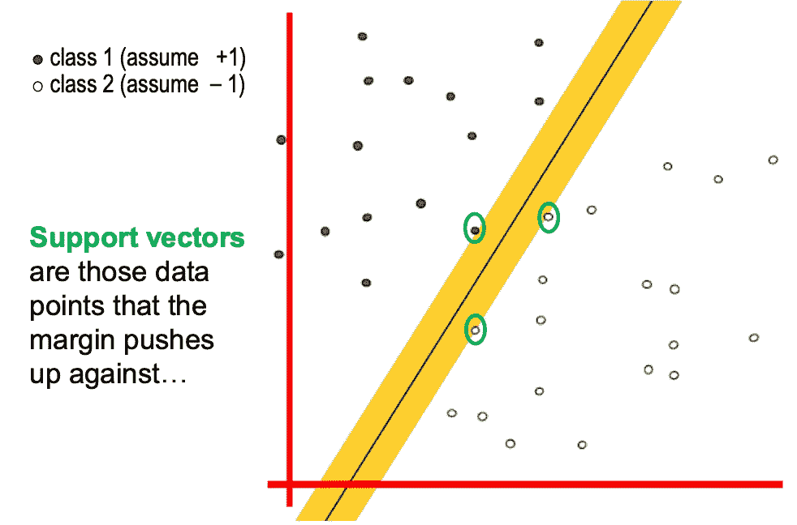

现在你可能会想，“*为什么是最大利润？”* —很高兴你问了！

*   直觉上，这是最安全的
*   如果我们在边界的位置上犯了一个小错误，在垂直方向上颠簸，这给我们造成错误分类的机会最小
*   我们可以应用*留一交叉验证** (LOOCV)，这是一种简单的验证方法，因为该模型不受任何非支持向量数据点移除的影响
*   根据经验，它已经被证明非常非常有效！

*LOOCV:每个点保持一次，模型在剩余的点上被训练，在保持的点上被测试，并且对所有点重复同样的循环。

> 我很想写一篇关于 SVM 的帖子。这里的内容实在太多了，无法一一涵盖！如果我应该写一篇关于 SVM 的文章，请在评论区告诉我:)
> 
> 其中，它将涵盖如何通过利用“更硬”的 1 维在 1 维数据集中使用支持向量机，允许非线性基函数更好地进行线性回归，交叉验证，模型选择，SVM 核函数(多项式)和其他非常高维的基函数，这些基函数可以通过径向基型核函数和神经网络型核函数实现。

**神经网络**

神经网络利用*多层感知器(MLPs)* ，制造通用逼近器。

这使得神经网络对过度拟合敏感。特别是对于噪声和非平稳数据。

因此，必须仔细选择架构和正则化。

NNs 非常适合需要非线性分类的数据集。

神经网络通过“学习”和调整一个*权重 w* 来最小化所有输出单元的总输出平方误差(成本函数),通过反向传播可以改变它自己的*权重*值。

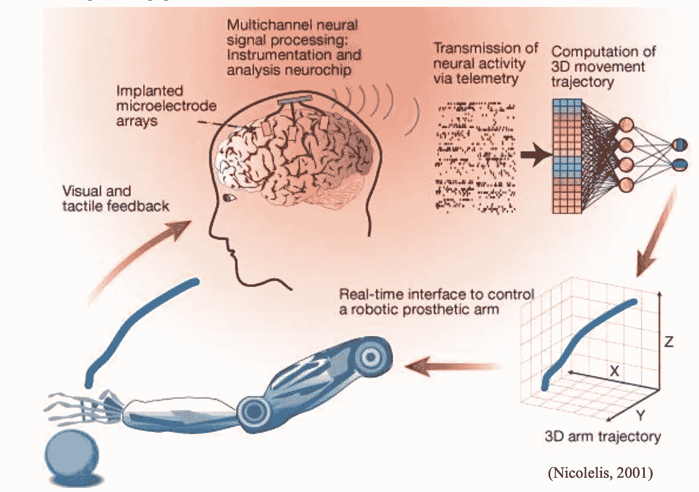

传统神经网络(CNN)在 BCI 系统中的应用示例

还开发了能够提高分类精度的深度学习(DL)模型，其性能优于在基准数据集上评估的最先进方法，并且在计算上相对高效。由 *S. Puthusserypady (2018)* 设计的模型结合了两个 DL 架构:
两个多层卷积神经网络(CNN)提取特征
全连接输出(softmax)层
(见下文)

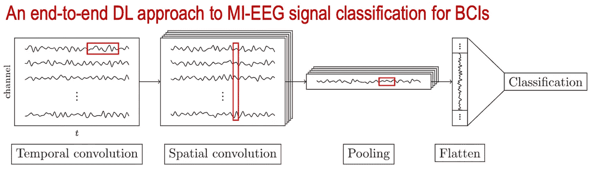

来源:H.Dose，J . S.Mø ller，H.K.Iversen 和 S.Puthusserypady，“用于 BCIs 的 MI-EEG 信号分类的端到端深度学习方法”，专家系统与应用，第 115 卷，第 532-542 页，2018 年

**简而言之:深度学习神经网络**

深度学习是机器视觉和自然语言处理的有力工具。

DL 模型的高容量以及 GPU 上并行计算的发展使它们能够超越其他最先进的分类算法。

近年来，它已被广泛应用于各行各业。

它需要将问题公式化为一个 DL 框架。

同样，为了更好地推广，它需要大量的数据。

> 就像支持向量机一样，我可以在 NNs，CNN 和 DL 上发表整篇文章。再一次，让我知道你是否想看到关于 BCI /神经技术/神经科学焦点的这些话题的帖子！关于这些话题的一般知识，网上有比我在一个中型博客上能提供的更好的资源:)

**非线性贝叶斯分类器**

基本上有两种类型的非线性贝叶斯分类器用于 BCI 系统:

1.  贝叶斯二次
2.  隐马尔可夫模型(HMM)

它们通过产生非线性决策边界来工作。

它们是*生成型*(因此，与判别分类器相比，它们能够有效拒绝不确定样本)。

非线性贝叶斯分类器在 BCI 应用中不如 LDA、SVM 和 NN 分类器流行。

贝叶斯分类总结为三点:
i .将最高概率分配给特征向量所属的类别
ii .贝叶斯规则用于计算后验概率
iii。使用最大后验概率(MAP)规则和计算的概率，可以确定特征向量的类别。

HMM 总结:

HMM 是语音识别中流行的动态分类器。

当使用时间序列时，它们已经被证明是好的分类器(使它们适合于基于 EEG 的 BCI)

HMM 可以被视为一种概率自动机，它可以提供观察给定特征向量序列的概率。

对于 BCI 相关的应用，这些概率通常是高斯混合模型(也称为 GMM)

输入输出 HMM (IOHMM)是另一种已经在 BCI 应用中使用的 HMM。

**最近邻分类器**

最近邻分类器很简单。

简而言之，它们是有区别的非线性分类器。

这些模型根据其最近邻将特征向量分配给一个类别。邻居可以是来自训练集的特征向量，如 k-最近邻居(kNN)的情况，或者是类别原型，如 *Mahalanobis 距离* (MD)。

基于 MD 的分类器很简单，但是很健壮。它甚至被证明适用于多类或异步 BCI 系统。尽管如此，它的良好表现，在 BCI 文学中还是很少见的。

在使用 kNN 的情况下，目标是在训练集内，在其 kNN 的主导类中分配一个看不见的点(对于 BCI，最近邻是使用度量距离获得的)。

有了足够大的 k 和足够多的训练样本，kNN 可以逼近任何能够产生非线性决策边界的函数。

不属于 BCI 系统中更受欢迎的分类器的原因是最近邻系统中的*维数灾难*。

**组合量词**

使用分类器组合的原因是为了提高 BCI 系统的性能。

在 BCI 系统中组合分类器有不同的策略:

*   **Boosting** : *使用级联的几个分类器*
    ——这可以通过将几个弱分类器组合在一起构建一个强大的分类器。不太可能过度训练。
    -然而有贴错标签的倾向。
    -MLP 已经尝试了增压
*   **投票** : *正在使用的几个分类器，每个分类器将输入特征向量分配给一个类别* -最终的类别将是多数人的类别
    -投票是 BCI 研究中最流行的组合分类器的方式，因为它简单而有效(例如，用 NN、MLP 和 SVM 投票已经尝试过)
*   **堆叠:** *几个分类器，每个分类器对输入的特征向量进行分类(0 级分类器)
    -* 这些分类器的输出然后被馈送到元分类器(1 级分类器)以做出最终的决定(例如，BCI 的 HMM-SVM)。
    ——堆叠的主要优点，是相似分类器的组合有可能胜过单个分类器。
    -已知该组合减少了方差，从而减少了分类误差

# 性能指标

通常使用分类器的准确度来评估给定算法或分类方案的性能度量。

来自不同方面的分类器的比较可以使用不同的度量(灵敏度、特异性、Youden 指数鉴别能力和计算时间/负载)来完成

分类器的性能可以在后处理阶段得到提高。

根据后处理块中的一些测量，可以优化分类器的一些参数，以便减少错误检测的数量。

我将把这张表留给你们(F. Lotte 和 L. Fabrice，2007；我知道已经过时了😅);显示 BCI 研究中使用的分类器的属性

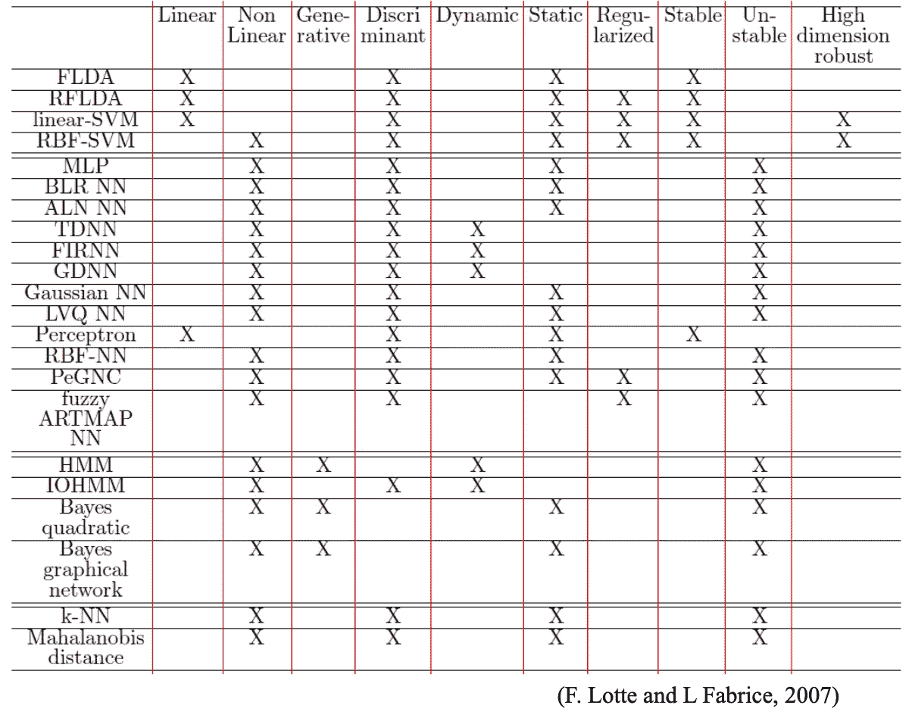

请注意，自 2007 年以来，无论是在机器学习研究方面，还是在提高不同分类器可行性的计算能力的增加方面，以及最终更好的记录技术方面，都取得了巨大的发展。

> *该系列的下一篇文章将是关于 BCI 的应用(主要基于脑电图)
> 在同一系列:*
> 
> * [从脑信号到计算机命令，第二部分:处理脑信号](https://younessubhi.medium.com/from-brain-signals-to-computer-commands-part-2-processing-brain-signals-fb1b0d08656b)
> * [从脑信号到计算机命令，第一部分:获取信号](https://younessubhi.medium.com/how-to-turn-brain-signals-into-computer-commands-acquiring-signals-5f9ef1130bb6) * [神经工程、神经技术简介&脑机接口](https://younessubhi.medium.com/a-short-introduction-to-neural-engineering-neurotechnology-brain-computer-interfaces-d4921ccbf419)

> 这就是这篇文章的全部内容。让我知道在下面的评论中涉及哪些话题。反馈同样受到高度赞赏🙌