# 使用简单的 CNN 对 CIFAR-10 进行分类

> 原文：<https://medium.com/analytics-vidhya/classifying-cifar-10-using-a-simple-cnn-4e9a6dd7600b?source=collection_archive---------2----------------------->

在这篇文章中，我们将简单地讨论什么是深度学习，什么是卷积神经网络(CNN)，以及我们如何制作一个简单的 CNN 模型。本文假设你对人工智能、机器学习和 Python 编程有一定的基础知识。

# 什么是深度学习？

深度学习是机器学习和人工智能的子集之一。深度学习方法试图模仿人类大脑处理数据并在其中寻找模式的功能。深度学习既可以用于监督学习，也可以用于非监督学习。深度学习使用人工神经网络来执行不同的任务，人工神经网络的设计考虑了大脑中神经元的功能。深度学习方法被用于许多不同的领域，例如图像分类、文本生成和天气预报。

在本文中，我们将创建一个卷积神经网络来分类一些图像。

# 卷积神经网络；

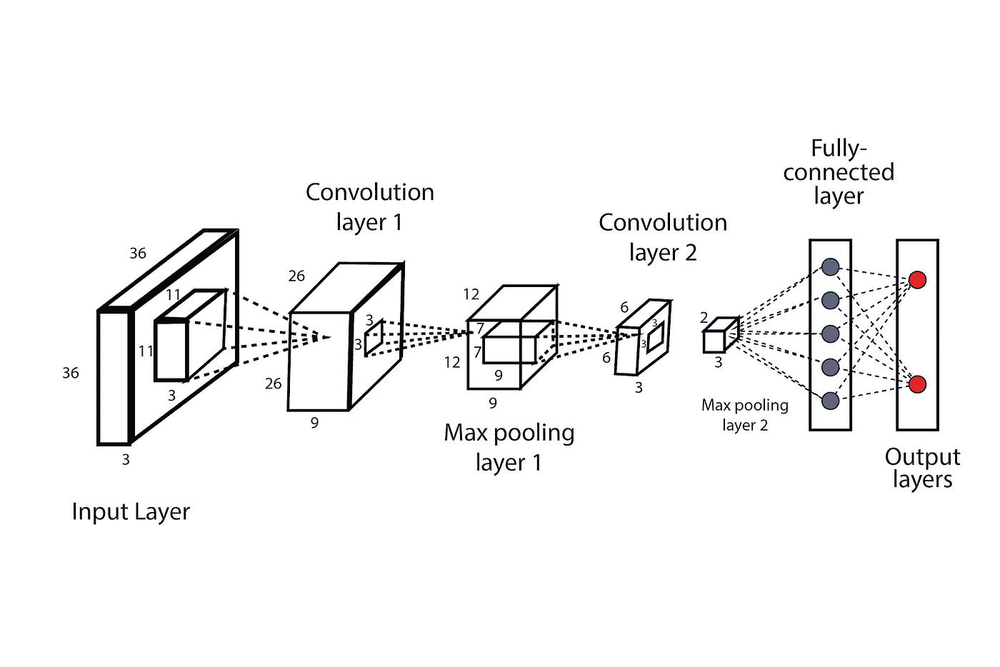

[来源](https://www.analyticssteps.com/blogs/convolutional-neural-network-cnn-graphical-visualization-code-explanation)

卷积神经网络或 CNN 是一种深度学习方法，通常用于图像分类和特征提取。为了理解 CNN 是如何工作的，我们首先需要理解一些概念:

*   **图像数据**
*   **卷积层**
*   **汇集层**
*   **密集层**

**图像数据**:每幅图像由 3 部分组成:高度、宽度、通道。通道的数量代表图像的深度，并与创建图像时使用的颜色相关。例如，RGB 图像有 3 个通道，每个通道对应一种用于创建图像的原色。因此，对于每个像素，我们有 3 个(通道数)值，每个值都在 0 到 255 之间。

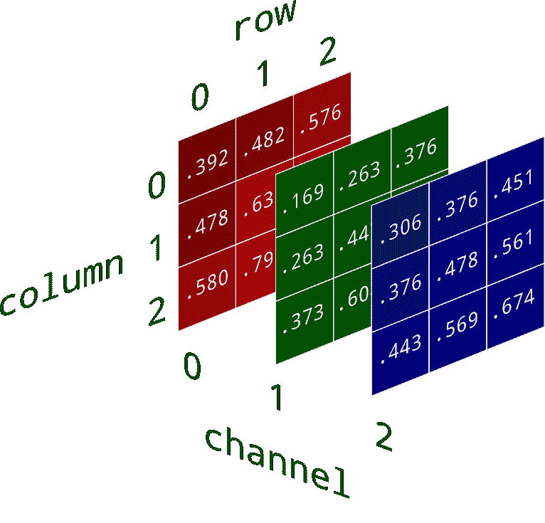

[3 通道图像](https://www.google.com/url?q=https://www.kdnuggets.com/2019/12/convert-rgb-image-grayscale.html&sa=D&source=editors&ust=1628492555932000&usg=AOvVaw3227oejgIbf8Gqwr93vM1H)

**密集层:**密集层是神经网络中的全连接层。密集层中的每个神经元接收来自前一层中所有神经元的信息。密集层是神经网络中最常用的层。具有 M 个神经元的密集层的输出是 M 维向量。这种类型的层通常用于神经网络的末端，以确定图像属于哪一类。

**卷积层:**每个卷积神经网络由一个或多个卷积层组成。这些层是 CNN 的主要构建组件，其任务是在图像中寻找可用于图像分类的模式。密集层用于在图像上寻找全局特征，而卷积层用于检测局部模式。当我们有一个密集连接的层时，该层中的每个节点都可以看到前一层的所有数据。这意味着这一层查看所有的信息，并且只能在全局范围内分析数据。卷积层使用滤波器来实现这种局部模式检测。每个卷积层由几个大小相同的滤波器组成，每个滤波器寻找图像内部的不同信息。滤镜是我们在图像中寻找的 m x n 像素模式。卷积层的输出深度等于该层中使用的滤波器数量。如果你想了解更多关于过滤器及其工作原理的知识，你可以看看[这篇文章](https://www.saama.com/different-kinds-convolutional-filters/)。

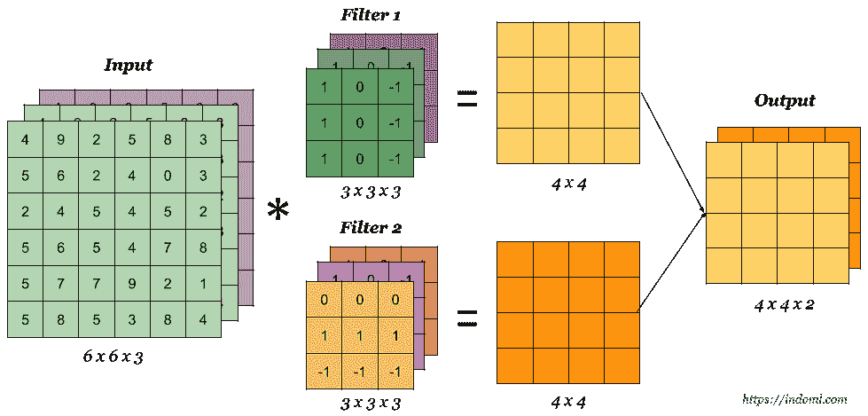

[卷积层滤波器的例子](https://www.google.com/url?q=https://indoml.com/2018/03/07/student-notes-convolutional-neural-networks-cnn-introduction/&sa=D&source=editors&ust=1628492588302000&usg=AOvVaw0XinMPijit38Y6G5M31FPX)

**汇集层:**汇集层用于对卷积层的输出进行下采样，并降低其维数。有 3 种类型的池:最大池，最小池，平均池。池化通常使用步长为 2 的 2x2 窗口来完成，这将输出的大小减少了 2 倍。

现在我们已经熟悉了卷积神经网络的构建组件，我们可以讨论它的架构以及如何创建它。

# 创建模型:

我们将在本文中使用 Keras 和 Tensorflow 来创建我们自己的图像分类器。该图像分类器将把 [Cifar 图像数据集](https://www.cs.toronto.edu/~kriz/cifar.html)中的图像分类到 10 个可用类别中的一个。该数据集包括 60000 个 32×32 的图像，每个类有 6000 个图像。这些类别的标签是:飞机、汽车、鸟、猫、鹿、狗、青蛙、马、船、卡车。

如上所述，我们将使用 Keras 和 Tensorflow 来创建我们的模型。您可以将 Keras 和 Tensorflow 安装到您自己的设备中，也可以使用 Google Colaboratory 等平台为您的模型编写和运行代码。

如果你像我一样使用 Google Colab 笔记本，你必须做的第一件事就是在笔记本内部启用 GPU 硬件加速。这允许你的模型在训练和测试阶段使用 GPU，从而大大加快了这个过程。要激活硬件加速，请单击屏幕顶部的编辑菜单，然后单击笔记本设置，并在新窗口中选择 GPU 作为硬件加速器。如果您之前运行了笔记本中的任何内容，您需要重置并重新运行代码。

要检查 Tensorflow 是否连接到 GPU，您可以在笔记本中运行下面的代码片段。

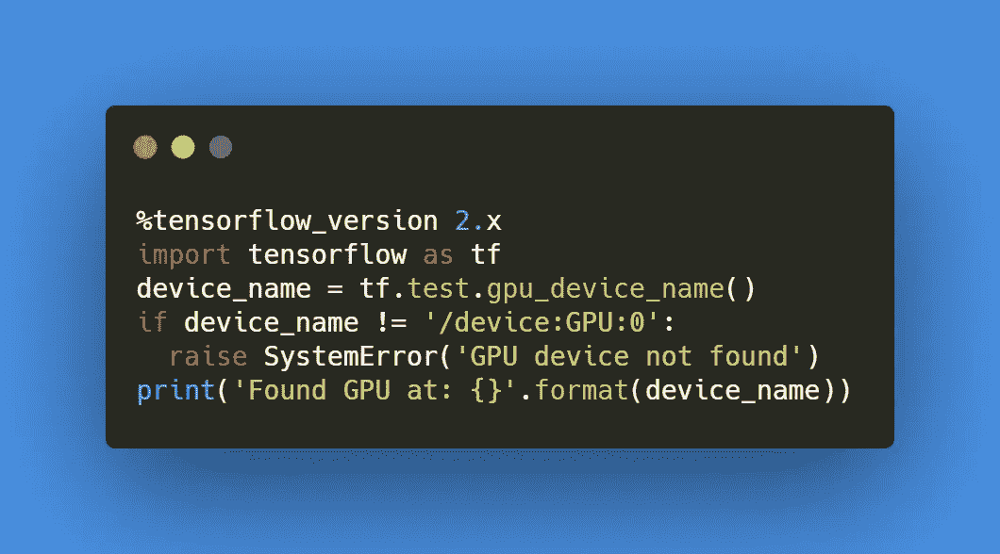

现在，我们将加载我们的数据集。为此，我们将使用 Keras API 来加载 Cifar-10 数据集。

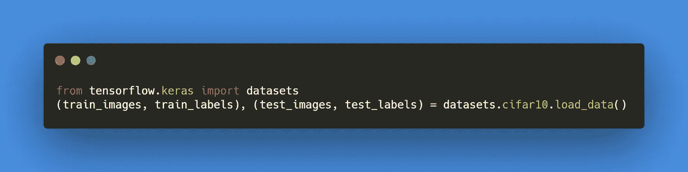

通过运行上面的代码，我们已经下载了 Cifar-10 数据集，并将其分成训练和测试部分。训练部分用于训练模型，而数据的测试部分用于评估我们模型的准确性。要查看数据集中的实际内容，您可以运行下面的代码来绘制数据集中的一些图像。

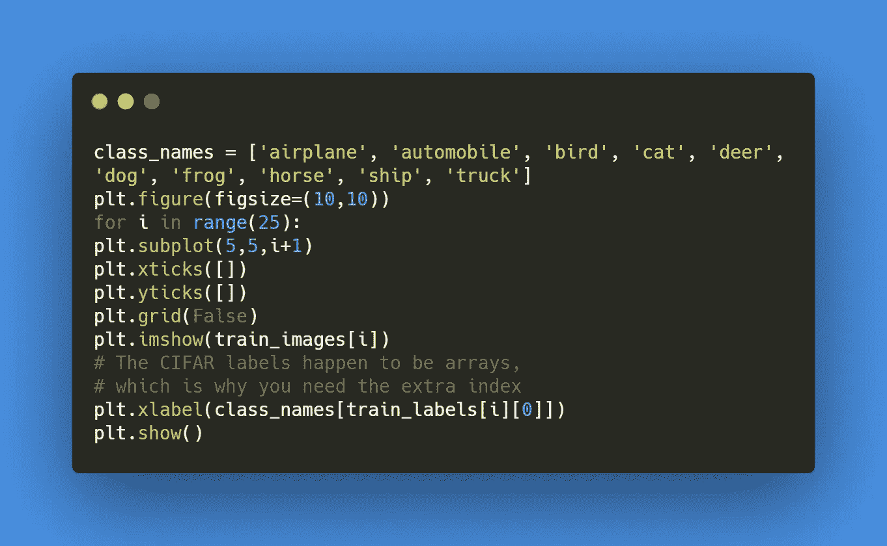

您应该得到这样的输出，显示每个类中的数据图片。

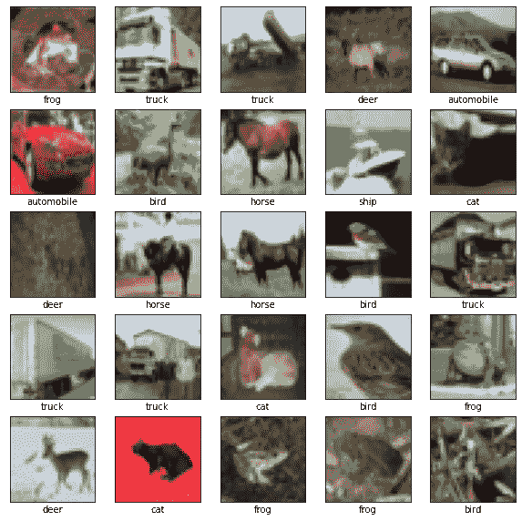

由于 Cifar-10 数据集中的图像为 32x32，因此输出图像的质量不高。在创建模型并将数据集作为输入之前，我们最好做的另一件事是将图像的像素值归一化到 0 和 1 之间。我们这样做是为了在反向传播阶段，我们不会在校正神经元的权重时过度/不足补偿。

准备好要处理的数据集后，我们将从头开始创建一个简单的 CNN 来处理这些数据。如前所述，我们将使用 Keras 来创建这个模型。Keras 作为 Tensorflow 机器学习库的接口，使得模型的开发变得更快更简单。我们将在这里使用 Keras 创建的是一个顺序模型。顺序模型基本上是层的线性堆叠。首先，我们从 keras 库中导入层和模型。然后，我们创建一个新的顺序模型，并定义模型中的不同层。

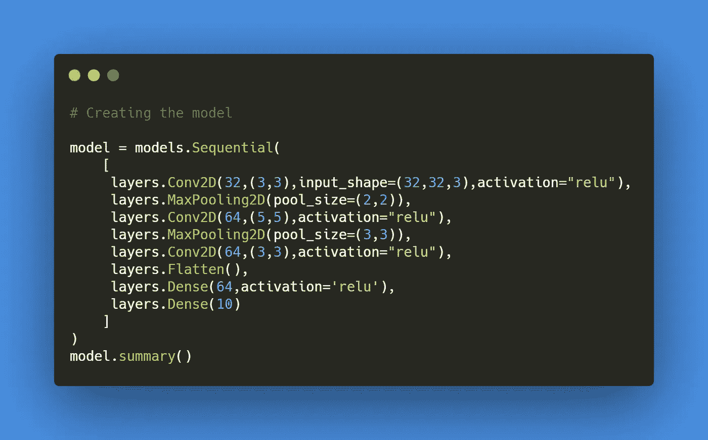

让我们看看代码的每一部分是做什么的。如您所见，我们创建了一个顺序模型，并添加了几个层。第一个添加的层是 2D 卷积层。该层中的第一个参数是我们希望该卷积层具有的滤波器数量，下一个参数(3，3)定义了这些滤波器的大小。 *input_shape* 仅用于顺序模型的第一层，定义输入数据的形状，在本例中为 3 通道 32x32 图像。最后，我们有层的激活函数。激活函数用于确定层内每个节点或神经元的输出。要了解激活函数是做什么的，有哪些不同的激活函数，你可以阅读[这篇文章](/the-theory-of-everything/understanding-activation-functions-in-neural-networks-9491262884e0)。野兔，我们将使用 ReLU 作为这一层的激活功能。

接下来，我们有一个池层来减少卷积层输出的大小和维度。我们将使用一个大小为 2x2 的 *MaxPooling2D* 层，在它的输入的每个 2x2 窗口中选择最大的数字。在这个模型中，我们还有 2 个卷积层和 1 个池层。最后一个卷积层的输出是 1x1x64。我们将把这个输出展平成一个 64 值的 1D 输入，用于它之后的下一个密集层。最后一层是另一个 10 码的致密层。这一层基本上是模型的分类器，确定输入图像属于 10 个类别中的哪一个。通过使用 *model.summary()* 行，我们可以看到我们刚刚创建的模型的架构。

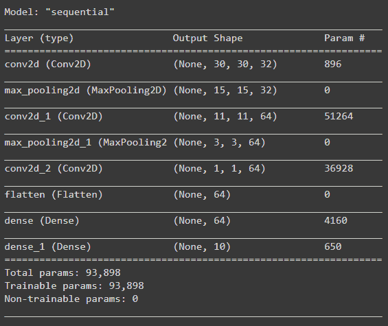

您可以看到每一层对数据形状的影响，以及每一层中有多少可训练的参数。既然我们已经定义了模型的架构，我们需要编译并运行它。为了编译模型，我们运行下面的代码行。

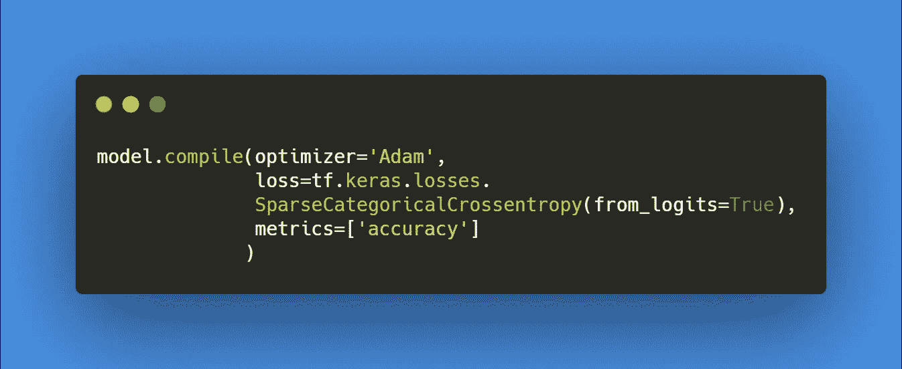

优化器是在我们的模型中用来最小化误差损失函数的方法。优化器有助于了解如何改变神经网络的权重和学习速率，以减少损失。激活函数有很多，最常用的是“Adam”。我们在这里使用稀疏分类交叉熵作为我们的损失函数。我们还选择了一个在训练和测试过程中由模型评估的指标列表。我们的模型准备好了。我们现在要做的就是在我们的训练和测试数据集上运行它，看看它对图像的分类有多好。

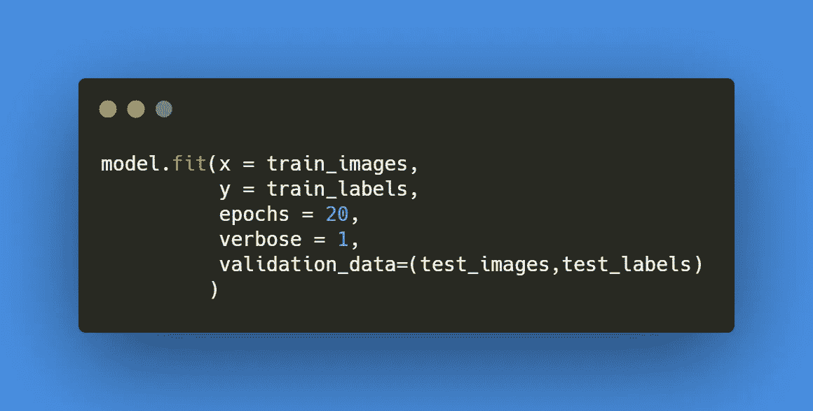

在这个函数中， *epochs* 决定了我们希望整个数据集通过模型的次数。太多的时期会导致过度拟合，而太少的时期可能不会让模型达到其最佳精度。你应该得到大约 70%的准确率，对于这样一个简单的模型来说，这已经很不错了。

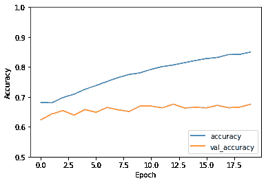

您可以更改层中的激活函数、优化器和时期数，以查看最终结果会发生什么。

我希望这篇文章能够帮助你学习和理解这些概念。