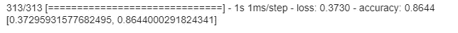

# 利用深度神经网络对服装类别进行分类

> 原文：<https://medium.com/analytics-vidhya/classifying-clothing-categories-using-deep-neural-network-4594ad45ff36?source=collection_archive---------14----------------------->


时尚 MNIST 数据集

**深度神经网络(DNN)** 是一种基本的神经网络，具有*快进*的特性，数据从输入层通过几个隐含层流向输出层，而不会倒退。

DNN 由一组被称为“人工神经元”的相互连接的“节点”组成。这些节点或人工神经元类似于生物大脑中的神经元。神经网络中连接节点的集合，称为“隐藏层”；这是处理输入数据以便产生输出的地方。


DNN 建筑

正如你在上面看到的架构，神经元是分层排列的:一个输入层，一个或多个“隐藏”层，以及一个输出层。我们将你试图学习的内容的表示填充到输入层。这些被激活的神经元影响下一层神经元的权重。这些权重会影响该层神经元的激活方式，从而影响下一层的权重，以此类推，直到最终到达输出层，网络在那里进行预测。

# 时尚 MNIST 数据集-图像服装类别分类器

在本教程中，我们将尝试构建一个简单的深度神经网络(显然使用 Python)，它可以从服装图像中分类出 10 个类别。时尚 MNIST 是一个伟大的数据集开始建立这个图像分类器。它包含 60，000 个样本的训练集和 10，000 个样本的测试集。每个示例是一个 28x28 灰度图像，与来自 10 个类别的标签相关联。你可以在这里找到这个数据集的完整文档:[时尚 MNIST](https://github.com/zalandoresearch/fashion-mnist) 。

> ****免责声明:在本教程中，我们并不打算构建一个具有完美准确性的模型，本教程的目标只是通过练习使用 Keras 构建一个简单的模型来了解神经网络的架构和工作原理****

好了，让我们跳到代码！

**导入库**

首先，像我们一直要做的那样，导入所有需要的库，这样我们就可以继续输入了。

```
import tensorflow as tf
from tensorflow.keras.models import Sequential 
from tensorflow.keras.layers import Dense, Flatten
import matplotlib.pyplot as plt
```

您可以尝试打印 Tensorflow 版本，以确保我们在本练习中使用相同的版本。目前，我使用的是 2.4.1 版本。

**导入数据集**

```
mnist = tf.keras.datasets.fashion_mnist
(training_images, training_labels), (test_images, test_labels) = mnist.load_data()
```

时尚 MNIST 数据集附带 Tensorflow 库。您可以使用`load_data()`功能导入数据集。它有四个对象；*训练图像，训练标签，测试图像，测试标签*。

让我们试着从 training_images 中打印一个数据。

```
plt.imshow(training_images[42])
print(training_labels[42])
print(training_images[42])
```


踝靴

**正常化**

在我们进一步进行建模之前，我们想先对我们的数据进行规范化，这样它将包含一个从 0 到 1 的一致的范围数。

```
training_images = training_images / 255.0
test_images = test_images / 255.0
```

为什么我们必须对数据进行标准化？很高兴你这么问。我们实际上不需要标准化数据，因为它是可选的。标准化数据消除了有偏差的权重，也降低了我们的网络试图解决的问题的复杂性。

这么说吧，我们有两个属性的数据:年龄和收入。年龄通常在 0 到 100 之间。收入在 10000 到 100000 英镑之间。现在你明白问题所在了吧？如果我们直接将这种数据进行建模，那么我们将会有一个有偏见的权重，因为我们的模型将收入视为比年龄更重要的特征，因为它具有更大的价值。

**建造模型**

这是我们旅程的核心，建立一个模型，这样我们就可以训练我们的机器理解我们数据集中服装图像之间的差异。

```
model = Sequential()
model.add(Flatten()) # takes a square and turns it into a 1-D vector
model.add(Dense(128, activation='relu')) # neurons
model.add(Dense(10, activation='softmax')) # another neurons
```

如果您想知道该模型中的术语是什么，下面是每行的简要解释:

*   **Sequential** 是一个神经网络(NN) API，它简单地将 Keras 层按顺序排列。大多数神经网络具有顺序的层，并且数据以给定的顺序从一层流到另一层，直到数据最终到达输出层。简单地说，你可以说 Sequential 是一个强制性的东西，必须放在你想要建立一个模型之前。
*   **扁平化**，顾名思义，它会把我们的数据扁平化，变成一个一维向量(矩阵变成单个数组)。如果你仍然困惑，看看下面的图片:


展平解释

*   **密集**，它是我们的神经元，它是常规的深度连接的神经网络层，将完成所有计算。我们可以这样描述密集对简单的 5 行代码的实际影响:

```
import numpy as np
input = [ [1, 2], [3, 4] ] # input from our dataset
kernel = [ [0.5, 0.75], [0.25, 0.5] ] # weight data
result = np.dot(input, kernel) # calculations based on the activation
result array([[1\. , 1.75], [2.5 , 4.25]]) # output from dense
```

我们的模型还没完成。构建完美模型的最后一步是先编译。

```
model.compile(optimizer=tf.keras.optimizers.Adam(), loss='sparse_categorical_crossentropy', metrics=['accuracy'])
```

**使模型适合训练集**

```
model.fit(training_images, training_labels, epochs=5)
```

*有哪些纪元？*基本上就是我们要从一个循环中循环计算多少次的步骤。一个时期是指整个数据集仅通过神经网络传递一次。

运行上面的代码后，我们将得到如下输出:


每个历元有两个输出参数，分别是*损耗*和*精度*。就优化而言，损失是收敛指标；这意味着它会告诉您模型的预测值与输入的真实值之间的差距。然而，准确性被定义为测试数据或训练数据的正确预测的百分比，因为我们没有在拟合函数上设置验证测试。

从上面的输出，我们可以看到我们的损失在减少，而精度在提高。这可能意味着我们的模型计算和学习时代的每一步。由于我们只使用了 5 个历元，我们在训练集上得到了 89%的准确率；这是一个很好的百分比，但我们已经通过在我们的验证/测试集上测试来验证该模型。

**使用测试集**验证模型

```
model.evaluate(test_images, test_labels)
```



我们从测试集中得到了最终的准确率，是 86%。通过从准确性(训练和测试)进行比较，我们可以简单地说，我们有一个过拟合模型，因为我们的模型往往在训练上具有高准确性，但在测试上具有低准确性。这意味着我们的模型在训练中学习了很多好的东西，但却不能推广看不见的数据。但是在我看来，86%的测试和 89%的训练仍然是一个可以接受的模型。

您可以通过减少网络层的数量或添加一个断开层来解决此类问题。但与此同时，我们在这之前都很好。

**未来改进**

*   使用一个`Dropout`层来消除过度拟合问题
*   使用卷积和池来提高模型的准确性
*   添加一些层和时代(显然)将是一个伟大的想法

*参考文献:*

*   [*Keras 教程—教程要点*](https://www.tutorialspoint.com/keras/)
*   [*基本分类:对服装图像进行分类| TensorFlow Core*](https://www.tensorflow.org/tutorials/keras/classification)
*   [*zalandoresearch/fashion-mnist:一个类似 mnist 的时尚产品数据库。*基准(github.com)](https://github.com/zalandoresearch/fashion-mnist)