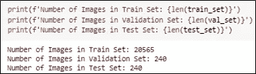
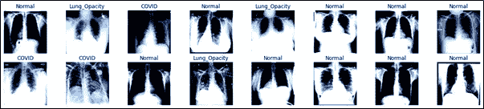
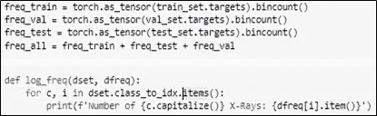
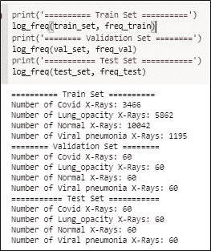
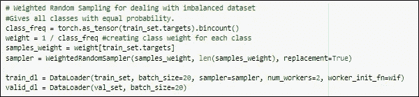
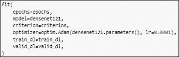
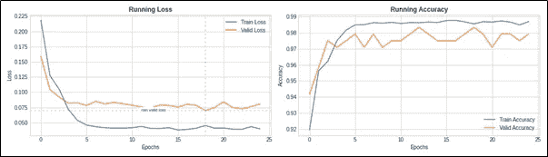

# 新冠肺炎 X 射线图像的分类

> 原文：<https://medium.com/analytics-vidhya/classifying-covid-19-x-ray-images-b8757fa48dc?source=collection_archive---------2----------------------->

胸部 x 光图像

你能猜出上面这张 x 光照片是属于有还是没有新冠肺炎的人吗？老实说，我不知道。但是今天，让我们创建一个 CNN 模型，它能够对这些 x 光图像进行分类！

我们开始吧！

这里是我得到数据集的地方。我已经向[推荐了这个项目的](https://github.com/priyavrat-misra/xrays-and-gradcam)。

数据集被分成训练集、测试集和验证集。对于测试和验证数据集，将使用来自每个类别的 60 幅图像。数据集中有 4 类:正常、病毒性肺炎、COVID 和肺部阴影。

对创建的数据集进一步进行图像增强。根据预训练模型的要求，所有图像的大小都调整为 224*224。另外，对随机图像进行水平翻转。最后，由于将使用在 Imagenet 上预先训练的模型，因此使用 Imagenet 的平均值和标准偏差对数据集进行标准化。

图像增强

使用 pytorch ImageFolder 函数，将数据扩充应用于数据集。这里还定义了一个数据加载器，批量大小为 20，2 个加载器工作线程和图像混洗等于真。

图像加载器

在我们继续之前，让我们进一步探索我们的数据集。

## 数据探索

数据集中的类的数量

每个数据集中的图像数量

在上一节中，我们描述了如何对数据集应用增强。在这里，我们创建一个情节来形象化他们。

绘制增强图像

增强图像

为了进一步研究数据集，我们创建了一个频率计数函数，该函数计算每个类的图像数量。

计算每个类别中每个图像的频率

如下面的结果所示，验证和测试数据集具有来自每个类的相同数量的图像。另一方面，对于训练数据集，可以观察到类别不平衡。

频率计数结果

胸部 x 光片数量与级别

让我们创建一些可以在下游过程中帮助我们的函数。

以下函数获取正确预测的标签总数。

以下函数检索所有样本的预测。该函数对来自数据加载器的批进行迭代，每个批的结果将连接到一个预测张量，该张量定义为 all_preds，将返回给调用者。

该函数基于标签和预测生成混淆矩阵。

以下函数使用混淆矩阵得出的结果计算真阳性、真阴性、假阳性和假阴性。从这里，可以导出诸如准确度、召回率、精确度和 F1 分数之类的评估指标。

创建以下函数来训练我们的预训练模型。model.train()在训练阶段将模型设置为训练模式。在评估阶段使用 model.eval()。由于批量归一化在训练和评估阶段表现不同，因此有必要设置模型的模式。在训练阶段，zero_grad()用于在反向传播之前将梯度归零。这样做是因为 Pytorch 在随后的反向传递中累积梯度，在下面表示为 loss . backward()(Anon，2021)。Torch.no_grad()减少了内存使用，从而提高了计算效率。

由于训练模型所需的时间可能很长，因此定义了一个检查点，每当验证损失降低时，该检查点都会保存模型。此外，训练期间的运行结果也将被保存，以备将来绘图。

np.random 倾向于为每个数据批次生成相同的随机数。为了确保每个数据批次的随机性，定义了一个 worker init 函数。

好吧！我们现在准备训练模型！

## 训练模型。

使用 WeightedRandomSampler()是因为存在类不平衡数据集。该函数为所有类别提供了相等的概率。首先定义类别权重，然后创建样本权重。

模型将被训练 25 个时期，并使用交叉熵作为我们的损失函数。交叉熵损失是多类分类的类别交叉熵损失。

由于这些预训练的模型将被微调，因此必须更新全连接层，即特征提取层。以前，在 ImageNet 上训练这些模型时，定义了 1，000 个类。对于这个项目，out_features 将被定义为 4 个类。

然后用 Adam 优化和 0.0001 的学习率来训练模型。所有 4 个型号都将重复类似的步骤。

我花了大约 30 分钟——每个模型 1 小时，在 Colab 的 GPU 上运行。Densenet121 在 4 款中耗时最长。

为了进一步提高我们的结果，让我们进一步调整我们的学习速度。

## 调整和验证

根据上述模型的结果，Densenet121 是性能最好的模型。这将在接下来的结果部分中显示。然而，为了进一步改进模型，创建了学习调度器，以每 3 个时期将每个参数的学习速率衰减 0.1 伽马(1029 次迭代* 3 = 3147 次迭代)。

densenet121 的学习率计划程序

resnet18 的学习率计划程序

Plot_summary 函数定义为绘制训练和验证数据集的准确度和损失。

Plot_confmat 函数定义为绘制训练和测试数据集中预测结果与实际结果的混淆矩阵。

## 结果评估

Densenet121

最低的验证损失 0.064216 是在第 6 时段。随着时代数量的增加，我们看到随着验证损失的增加，模型开始过度拟合。

Densenet121 混淆矩阵

Densenet121 可以分别对 60/60 COVID 和病毒性肺炎图像进行分类。

带学习率调度器的 Densenet121

具有学习率调度器的 Densenet121 模型的验证损失在时期 13 处最低。尽管最低的验证损失 0.065519 与没有学习率调度器的 Densenet121 模型相比略高，但是可以观察到，与没有学习率调度器的先前模型相比，该模型具有更好的推广性。

带 lr_scheduler 混淆矩阵的 Densenet121

带 lr_scheduler 的 Densenet121 可以对 60/60 的病毒性肺炎图像进行分类。

Resnet18 的运行损耗和精度

验证损失在时期 6 最低，为 0.064792。随着时期数的增加，可以观察到过度拟合。

Resnet18 混淆矩阵

Resnet18 在对病毒性肺炎图像进行分类时表现良好。

带 lr_scheduler 的 Resnet18 的运行损耗和精度

具有学习率调度器的 Resnet18 模型的验证损失在时期 19 处最低。尽管最低的验证损失 0.069836 与没有学习率调度器的 Resnet18 模型相比略高，但是可以观察到，与没有学习率调度器的先前模型相比，该模型具有更好的推广性。

带 lr_scheduler 的 Resnet18 的混淆矩阵

带有 lr_scheduler 的 Resnet18 在对 COVID 和病毒性肺炎进行分类时表现出良好的性能。

挤压网的运行损耗和精度

Squeeznet 的最低验证损失在第 24 时段为 0.117238。

Squeezenet 混淆矩阵

Resnet50 的运行损耗和精度

Resnet50 的最低确认损失在第 11 时段为 0.078578。

Resnet50 混淆矩阵

Resnet50 在对病毒性肺炎图像进行分类时表现良好。

## 可视化和批判性分析

为了更好地理解图像中的哪个部分在分类期间影响模型的决策，将实施 Grad-CAM。

apply_mask 是一个从遮罩创建热图并合成 GradCAM 图像的函数。

使用生成的 GradCAM 图像，plot_gradcam 用于绘制每个类的 gradcam 图像。

注册向前和向后挂钩，以存储该层的向前过程(激活)和向后过程(渐变)。

下图显示了每个模型如何做出分类决策。

使用 GradCAM 定位

评估新冠肺炎图像的结果

评估肺部阴影图像的结果

评估正常图像的结果

评估病毒性肺炎图像的结果

所有型号的性能总结

在本节中，将进一步评估每个模型的性能。根据准确度、召回率、精确度和 F1 分数等评估指标，Densenet121 和 Resnet18 以及 lr_scheduler 在新冠肺炎影像分类中表现出了出色的性能。对于肺部不透明和正常图像，带 lr_scheduler 的 Densenet121 优于其他模型。最后，多种模型在病毒性肺炎图像分类中表现出良好的性能。分别是，带 lr_scheduler 的 Densenet121、Resnet18、带 lr_scheduler 的 Resnet18 和 Resnet50。

完整的项目可以在这里找到[。](https://github.com/gyiernahfufie/Classifying-COVID-X-Rays)

# 参考

无名氏(2018)。 *np.random 为每个数据批次#5059* 生成相同的随机数。【在线】。2018.github。可从:[https://github . com/py torch/py torch/issues/5059 # issue comment-817392562 获取。](https://github.com/pytorch/pytorch/issues/5059#issuecomment-817392562.)【访问时间:2021 年 8 月 26 日】。

无名氏(2021)。*在 Pytorch* 中将渐变归零。【在线】。2021.Pytorch。可从以下网址获得:[https://py torch . org/tutorials/recipes/recipes/zeroing _ out _ gradients . html](https://pytorch.org/tutorials/recipes/recipes/zeroing_out_gradients.html.)【访问日期:2021 年 8 月 26 日】。

因卡威奇，n .(未标明)。*微调火炬视觉模型*。【在线】。可从以下网址获取:[https://py torch . org/tutorials/beginner/fine tuning _ torch vision _ models _ tutorial . html](https://pytorch.org/tutorials/beginner/finetuning_torchvision_models_tutorial.html.)

Minaee，s .，Kafieh，r .，Sonka，m .，Yazdani，s .和 Jamalipour Soufi，G. (2020 年)。Deep-COVID:使用深度迁移学习从胸部 X 射线图像预测新冠肺炎。*医学图像分析*。65.

普里亚弗拉特，M. (2021)。*胸片分类和基于梯度的定位*。【在线】。2021.Github。可从:[https://github.com/priyavrat-misra/xrays-and-gradcam](https://github.com/priyavrat-misra/xrays-and-gradcam.)

t .拉赫曼(2021 年)。*新冠肺炎射线照相数据库*。【在线】。2021.可从:[https://www . ka ggle . com/tawsifurrahman/covid 19-radiography-database 获取。](https://www.kaggle.com/tawsifurrahman/covid19-radiography-database.)