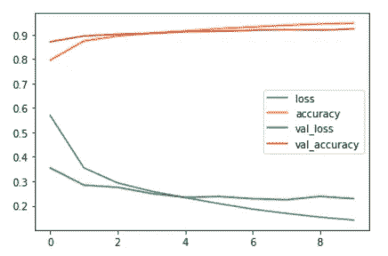

# 基于张量流的服装图像分类

> 原文：<https://medium.com/analytics-vidhya/classifying-images-of-clothing-using-tensorflow-39ec3c1cb8b7?source=collection_archive---------7----------------------->

如何在 TensorFlow 中使用卷积神经网络训练深度学习模型对服装图像进行分类。


Zalando 的时尚 MNIST 样品

深度学习是机器学习的一个子领域，它使用多层神经网络从数据中提取模式。我在这个项目中的目标是介绍如何将深度学习概念应用于图像分类问题。为此，我们将使用 Python 中的 TensorFlow 库训练一个卷积神经网络(CNN)来对服装数据集进行分类。

在过去的几年里，卷积神经网络已经在一些复杂的视觉任务上实现了超人的性能。它们为图像搜索服务、无人驾驶汽车、自动视频分类系统等提供动力*。*

如果你对这个项目的源代码感兴趣，请查看我的 [GitHub](https://github.com/hugoplm/computer-vision/blob/main/Classifying_Images_of_Clothing/Classifying_Clothing_TensorFlow.ipynb) 。

# **探索数据集**

我们将使用[时尚 MNIST](https://github.com/zalandoresearch/fashion-mnist) 数据集，该数据集包含 10 个类别的 70，000 张灰度图像。这些图像以 28 x 28 像素的分辨率表示个人服装。

每个图像在范围[0，9]中有一个单独的类。我们可以在下表中看到数据集中的类。


按作者分类的时尚 MNIST 数据集。

图像只是一个数字矩阵，在我们的问题中是一个 28×28 的矩阵。每个值都在范围[0，255]内，该范围定义了每个像素的颜色和强度。

在这里，我们可以看到训练数据集的第一个样本中的前 5 行。


作者提供的部分图像数组示例。

现在，让我们画出这张图片。


作者提供的踝靴类图片示例。

我们可以从我们的训练数据集中显示一些带有相应类的例子。绘制前 24 个样本，可以看到每个类别至少有一个示例


按作者分类的图片示例。

# 预处理数据

**正常化**

图像中每个像素的值是一个范围在[0，255]内的整数，需要对其进行归一化，模型才能正常工作。我们可以创建一个函数，将每个值除以 255.0。当将该函数应用于我们的数据集时，我们将获得范围[0，1]内的归一化值。

**重塑图像**

卷积神经网络期望 4 个维度作为输入:样本数(60，000)、像素(28 x 28)和颜色通道。因为我们处理的是灰度图像，所以只有一个通道。然而，正如我们之前看到的，我们的 X_train 数据集的形状是(6000，28，28)，我们需要(6000，28，28，1)作为输入。因此，我们需要重塑我们的数据集。

**一键编码**

我们的类数据有范围为[0，9]的标签，称为*整数编码*。但是，标签和相应的类之间没有顺序关系。

在这种情况下，使用整数编码允许模型假设类别之间的自然排序，这可能导致性能不佳或深度学习模型的意外结果。为了解决这个问题，我们可以使用一位热编码，它为每个唯一整数值创建一个新的二进制变量。

现在，让我们检查一下我们的标签数据。每个标签从单个值变为在相应位置具有值“1”的向量。


作者应用一键编码前后的类标签数组。

# 创建模型

**建造各层**

创建模型的第一步是定义网络的层次。CNN 至少有一个卷积层，还包括其他类型的层，如池层和全连接层(密集)。对于这个项目，我们将使用典型的 CNN 架构，如下图所示。


*典型 CNN 架构，作者* Géron，Aurélien (2019)。

如图所示，我们将包括一个卷积层和一个池层，然后是另一个卷积层和池层。然后，我们将添加一个扁平化层来转换我们的二维阵列图像为一维阵列，并添加一些密集层。我们可以添加一些下降层来减少过度拟合。对于最后一层，我们添加了一个密集层，其中包含问题中的类的数量(10)和一个 softmax 激活，它为每个类创建了概率分布。

```
model = keras.models.Sequential([ keras.layers.Conv2D(filters=64, kernel_size=3, activation='relu', padding='same', input_shape=[28, 28, 1]), keras.layers.MaxPool2D(pool_size=2), keras.layers.Conv2D(filters=128, kernel_size=3, activation='relu', padding='same'), keras.layers.MaxPool2D(pool_size=2), keras.layers.Flatten(), keras.layers.Dense(units=128, activation='relu'), keras.layers.Dropout(0.25), keras.layers.Dense(units=64, activation='relu'), keras.layers.Dropout(0.25), keras.layers.Dense(units=10, activation='softmax'),])
```

**编译模型**

下一步是编译模型。这里我们传递优化器，它调整权重以最小化损失，损失函数，它测量真实值和预测值之间的差异，以及度量，一个用于测量模型性能的函数。

```
model.compile(optimizer='adam', loss='categorical_crossentropy',         metrics=['accuracy'])
```

**训练模型**

最后一步是训练我们的模型。这里，我们需要传递输入数据、目标数据和历元数，这定义了训练数据集的完整迭代次数。我们还将传递一个参数来将我们的数据分为训练(70%)和验证(30%)两部分，传递一个参数来定义 batch_size，即每次传递的训练样本数。

我们将把我们的训练结果保存在变量 *model_history* 中。

```
model_history = model.fit(X_train, y_train, batch_size=50, epochs=10, validation_split=0.3)
```


作者的训练时代的历史。

**评估损失**

fit 方法返回一个历史对象，其中包含每个时期的结果。我们可以绘制一个图表，显示训练和验证数据集的损失和准确性。从该图中，可以看出损耗如何随着时间的推移而下降，精度如何随着时间的推移而上升。该图表还用于识别过度拟合和拟合不足的证据。对于我们的模型，似乎我们没有这些问题的有力证据。因此，让我们继续，用我们的测试数据集做一些预测。



按作者划分的训练和验证数据集的准确性和损失图。

# 进行预测并评估结果

**评估测试数据集中的准确性**

现在，让我们看看模型在测试数据集上的表现。


作者测试数据集的模型准确性和损失。

训练数据集的精度小于测试和验证数据集的精度。然而，这仍然是一个 91.55%准确率的好结果。

**做预测**

我们可以使用我们的模型为测试数据库中的每个例子预测一个类。

现在，让我们从测试数据集中绘制一些带有真实和预测标签的图像。当模型预测正确时，文本将显示为蓝色，如果预测错误，将显示为红色。此外，还会显示预测类别的计算概率。


作者的真实类别和预测类别的图像示例。

从这 20 个例子可以看出，我们的模型对一件外套和一件衬衫做出了错误的预测。但是，使用此图分析 10，000 个示例的预测是不可行的。因此，让我们绘制一个交叉表来分析我们的模型对每个类的正确和错误的预测。

**交叉表**

通过分析我们的交叉表，我们可以注意到凉鞋分类的准确率最高(99.1%)，而衬衫分类的准确率最低(76.9%)。交叉表提供了一种很好的方式来可视化我们的模型为每个类预测的数量。例如，我们可以很容易地看到，它在 74 个例子中预测衬衫为 t 恤/上衣，或者它没有预测任何包为踝靴。


按作者划分的模型预测交叉表。

**分类报告**

现在，让我们使用 scikit-learn 库中的分类报告，绘制每个类的精度、召回率和 f1 分数的摘要。这里可以看出，我们没有考虑到任何类的精确度和召回率之间的差异。正如我们在交叉表中注意到的，我们最差的结果是衬衫类。


按作者分类的模型预测报告。

# 结论

在这个项目中，介绍了如何使用 TensorFlow 和 Keras 训练一个卷积神经网络来对来自时尚 MNIST 数据集的服装图像进行分类。使用该模型，我们在测试数据集中获得了 91.55%的总体准确率，这是一个不错的结果。然而，具体到我们的*衬衫*类，我们得到的准确率只有 76.90%。我们可以尝试使用一些数据增强技术来提高这个类的准确性。此外，如果您想获得更高精度的模型，您可以尝试更改一些超参数或使用不同的网络架构。

如果您对这个项目有任何问题或反馈，请随时通过 [LinkedIn](https://www.linkedin.com/in/hugoplm/) 联系我。

# 参考

[1]: Géron，Aurélien (2019)。使用 Scikit-Learn、Keras 和 TensorFlow 进行机器学习(第二版。).塞瓦斯托波尔，加利福尼亚州:奥莱利媒体公司。

[2]:布朗利，杰森(2020，6 月 30 日)。机器学习中为什么要一次性编码数据？。检索自[https://machine learning mastery . com/why-one-hot-encode-data-in-machine-learning/](https://machinelearningmastery.com/why-one-hot-encode-data-in-machine-learning/)