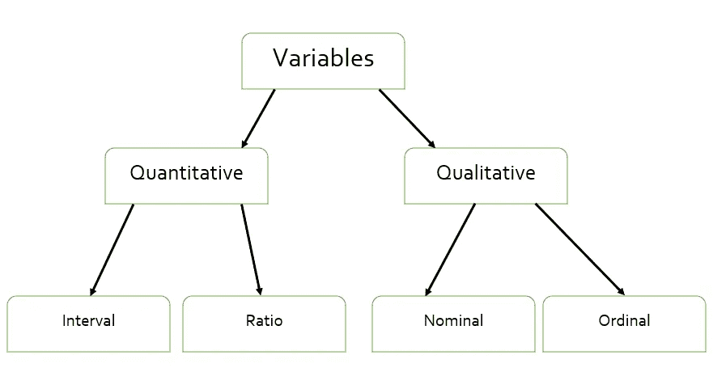
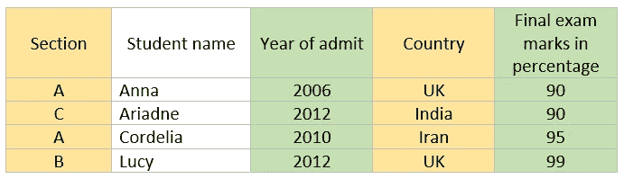

# 变量分类-数据科学统计学 101(第二部分)

> 原文：<https://medium.com/analytics-vidhya/classifying-variables-statistics-101-for-data-science-part-2-20-fd29d7dc4843?source=collection_archive---------8----------------------->

变量是被测量或观察的个人特征。它们因实体而异。

变量分类

# 数量变量

**定量变量是一种可以用数字测量的特性，数值之间的差异是有意义的。**

我们拿一组学生*来说，他们的入学年份、毕业年份、最后的分数百分比*都是数值，是可以测量的。因此，它们是定量的。

一个学生可能有一个电话号码，它是数字，但它不能归入定量变量，因为电话号码之间的差异没有意义。

有两种类型的数量变量，区间和比率。

> **区间变量是一种测量变量，用于定义按比例测量的值。这个变量没有真正的零。它只是两个事物之间的空间。**

在下面的学生数据表中，入学年份是一个区间变量，因为它是数字的，有意义的，也没有真正的零。一年永远没有起点和终点。同样，一个人的温度、时间、溶液的 pH 值都属于两个事物之间的空间。

> **比率变量是数值，数值之间有意义的差异。与区间变量不同，它有一个真正的零值。**

在学生数据表中，期末考试分数的百分比是一个比率变量，因为它是有意义的数字，并且有一个真零(即 0)。同样，一个人的身高和体重也有一个起始极限，它们被认为是比率变量。

学生数据

# 定性变量

**定性变量是一个个体的特征，它是明确的，代表质量。它可以是数字的，也可以是非数字的。但是它不能有意义。**

让我们再次考虑我们的学生数据，*学生所属的部分、原籍国、性别、血型、邮政编码*是属于其他类别的值。在某些国家，邮政编码是数字数据，但是不能对其执行数学运算，如均值、中值或标准差。因此，它是分类数据。

有两种类型的定性变量，他们是名义和序数。

> **名义标度描述的是没有自然顺序或排名的变量类别。它们可以是名称或标签。**

我们的学生数据中的原籍国是一个名义变量，因为已经有预定义的值(世界上现有的国家),这些国家不能以任何顺序排列。其他一些例子是人的眼睛颜色、种族、血型、成员类型(例如，对于一个方案)。

> **序数标度适用于可以按类别顺序排列的数据。但是数据值之间的差异没有意义或者无法确定。**

学生所属的部分是一个顺序变量，因为部分可以分类，它们可以按升序或降序排列。癌症的阶段、社会经济地位、年收入水平和评级是有序变量的几个例子。

*在下一个教程中，我们将讨论采样及其类型。敬请关注。*

*如果你错过了这个统计教程系列的第一部分，你可以在这里找到它***。**