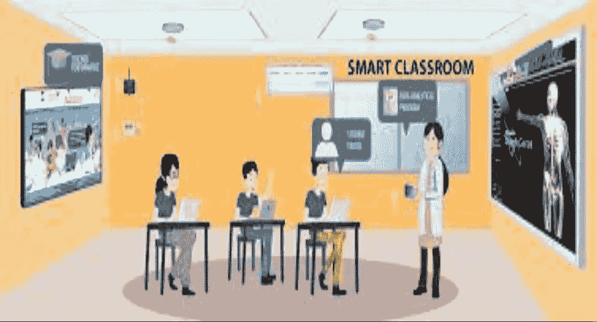

# 教室监控系统

> 原文：<https://medium.com/analytics-vidhya/classroom-monitoring-system-4b6f20813699?source=collection_archive---------7----------------------->

# 使用深度学习和物联网让课堂变得智能

智能教室

# 简介:

作为一名学生，我们想离开教室，因为无聊的讲座而感到沮丧，我们总是希望讲师了解我们的感受。在过去，这是不可能的，但在这个深度学习时代，我们让它成为可能。同样重要的是，要明白大学或学校授课的方式对学生职业生涯的塑造非常重要。因此我们(我和我的队友 [Shantosh](https://www.linkedin.com/in/shanthosh-kumar-921092174/) )想出了一个解决方案，这个方案不仅可以让讲师了解学生的情绪，还可以让他知道可以采取进一步行动的手势。因此，我们提出了一个解决方案，包括:

1.  使考勤系统灵活(生物计量)
2.  通过识别学生的情绪和坐姿，让教师和校长了解学生对讲座的兴趣。
3.  自动笔记记录。

# 所需组件:

## 对于生物测定出席率:

1.  Arduino UNO 板(Atmega 328p 微控制器)
2.  指纹传感器(R307 模块)
3.  液晶显示器(16x2 液晶模块)
4.  Firebase(存储学生点名号码的数据库)

## 对于情绪和姿势识别:

1.  树莓派
2.  相机模块
3.  深度学习模块和模型

## 对于自动笔记记录者:

1.  树莓 Pi4
2.  ReSpeaker USB MicArray

# 框图:

工作框图

# 描述:

## 生物测定出席率:

所以我们用 Arduino 做了一个基于指纹的生物识别考勤系统。(灵感来自[这个](https://circuitdigest.com/microcontroller-projects/fingerprint-attendance-system-using-arduino-uno)

## 情感识别:

面部表情。

首先，我们使用一个轻量级框架 [BlazeFace-Torch](https://www.kaggle.com/humananalog/blazeface-pytorch) 从相机中检测人脸。除了边界框，BlazeFace 还预测了面部标志的 6 个关键点(2x 眼睛，2x 耳朵，鼻子，嘴)。接下来，使用检测到的面部，我们在 7 种情绪(愤怒、厌恶、恐惧、快乐、悲伤、惊讶、中性)中识别面部的情绪，然后获得相应情绪的表情符号。这种识别是使用 VGG19 模型完成的，该模型在一百万张人脸上进行训练，并在 Kaggle 的 GPU 上训练了 4 个小时。

VGG-19-建筑。

## 姿势估计:

这里，我们采用多人姿势估计架构，以便在边缘设备上使用。我们遵循 OpenPose 的自下而上的方法，因为它的质量很好，对框架内的许多人来说也很稳健。网络模型有 4.1M 的参数和 90 亿次浮点运算(GFLOPs)的复杂性，在几乎相同的质量下，仅为基线 2 阶段 OpenPose 的 15%。它检测骨架(由关键点和它们之间的连接组成)来识别图像中每个人的姿势。该姿势可能包含多达 18 个关键点:耳朵、眼睛、鼻子、脖子、肩膀、肘部、手腕、臀部、膝盖和脚踝。

我们对代码进行了概要分析，删除了额外的内存分配，用 Open-CV 例程对关键点提取进行了并行处理。这大大提高了代码的速度，最后一个瓶颈是 resize 特性映射到输入图像的大小。我们决定跳过调整大小的步骤，直接在网络输出上进行分组，但是精度明显下降。因此，上采样特征图的步骤是不可避免的，但是没有必要为了输入图像尺寸而这样做。我们的实验表明，上采样因子为 8 时，精度是相同的，就好像根据输入图像大小调整大小一样。出于演示目的，我们使用了上采样因子 4。(灵感来源于这篇[论文](https://arxiv.org/pdf/1811.12004.pdf))。

## 笔记记录者:

在这方面，我们已经做了简单的音频到文本的转换器使用 py-audio 和 Halo。书面文本作为笔记邮寄给学生。

# 程序:

1.  首先，带着生物计量设备的教授用他的指纹登录他的账户，并得到他所负责的主题的出席者名单。
2.  然后，将该设备交给学生以保存他们的指纹，当天的出勤情况将根据指纹的时间进行更新。
3.  教授被善意地建议在他的时间结束之前保持设备开启，因为一旦教授登录，笔记记录设备将开始运行，并且如果生物计量设备停止，笔记记录设备将停止。
4.  笔记记录设备连接到云，将记录教授的话，并在教授从他的生物计量设备注销后(会话结束)，将记录发送到每个学生的网络邮件 ID 或邮件 ID。
5.  这减少了学生记笔记的努力，并使学生更多地听教授的话。
6.  教授可以通过第二次将他的指纹放在设备上来注销。
7.  生物测定设备上的 LCD 显示屏可以显示教授是否登录以及学生的指纹是否被识别。
8.  同时，在上课期间，使用学生的面部表情来检测他们的情绪，学生的整体情绪每 3 秒钟显示在智能板上(如果有),并在课程结束时作为消息发送给校长/各自的负责人和老师。
9.  在这个过程中还检测到学生的各种姿势，如站立、举手、靠在长椅上，这些姿势可以用来了解学生对该主题的兴趣。
10.  考虑到学生的隐私，我们不把学生的面孔带到服务器上..因此，我们使用 Open CV，blazeface-pytorch(用于检测面部)处理来自板内相机的面部，并获得情感作为输出，这些情感只发送到服务器，姿势也是如此。

# 最终触摸:

1.  我们能够创建一个类似下图的系统。(灵感来自这个[网站](https://edtechchina.medium.com/schools-using-facial-recognition-system-sparks-privacy-concerns-in-china-d4f706e5cfd0))

2.这也可以用于任何公共演讲平台，以评估观众的情绪，并使演讲者能够更好地发表演讲。

# 未来范围:

1.  这可以扩展到通过服务器自动分发已批改的答卷，或者事实上答卷的批改可以是自动的或自动监考。
2.  还有自动开关灯和风扇，可以用来减少电力浪费。清扫机的问题可以通过使用语音自动开关来解决。
3.  我们可以在系统中增加录音设备，这样学生可以随时观看讲座。

# 参考资料:

 [## 学校使用面部识别系统在中国引发隐私担忧

### 上周一些令人吃惊的行动引发了关于“隐私泄露”和“数据安全”的争论…

edtechchina.medium.com](https://edtechchina.medium.com/schools-using-facial-recognition-system-sparks-privacy-concerns-in-china-d4f706e5cfd0)  [## 用于分析学生课堂行为的面部识别

### 杭州的一所高中正在使用面部识别技术来分析学生在课堂上的行为…

en.people.cn](http://en.people.cn/n3/2018/0519/c90000-9461918.html) 

# Github 资源库:

https://github.com/vineeth-raj/Classroom-Monitoring-System