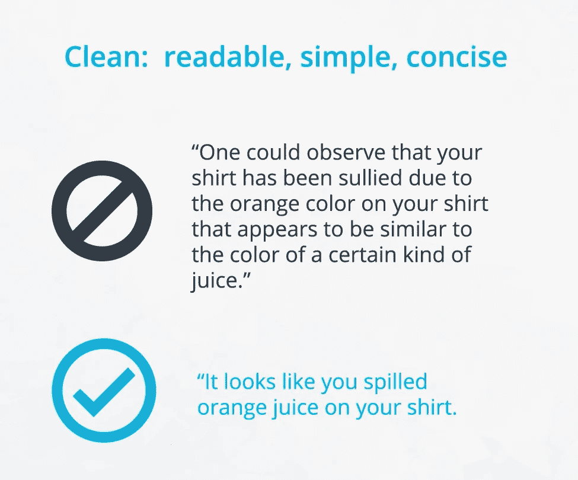

# 干净的代码:写好代码的艺术(数据科学)

> 原文：<https://medium.com/analytics-vidhya/clean-code-the-art-of-writing-good-code-for-data-science-3085af715177?source=collection_archive---------2----------------------->

来源[https://unsplash.com/photos/xb0lxn8hEEE](https://unsplash.com/photos/xb0lxn8hEEE)

和大多数学习数据科学的人一样，我没有主修计算机科学，也没有接受过软件工程方面的正规教育。因此，编写面条式代码是我天性的一部分。同样，在很大程度上，学习数据科学的人在软件工程实践方面没有很强的背景。

另一方面:我们真的需要写“干净的代码”吗？如果你想到这一点，大多数数据科学家做的编码工作都是一次性的。因此，有人可能会问，学习和遵循乏味的干净代码的原则是否值得。

为了指导回答，请思考以下想法:

> “编程是告诉另一个人他想让计算机做什么的艺术”(唐纳德·克努特)
> 
> “任何傻瓜都能写出计算机能理解的代码。优秀的程序员写人类能理解的代码”(马丁·福勒)

数据科学家不在孤岛中工作，相反，他们在团队中工作，并且必须与同事密切合作。这种协作要求程序员与其他团队成员共享他们的代码。在这种情况下，可读、简单、简洁的代码(也称为干净的代码)至关重要。为什么这很重要？要回答这个问题，请看下面的短语:

哪句话更容易理解？(来源:Udacity —软件工程简介)

类似地，编写干净的代码在工业中是至关重要的，因为你是一个不断迭代你的代码的团队的一员。因此，一个干净的代码会让你自己和他人更容易理解和重用你的代码，**即使这会让编写变得更加困难。**

编写高质量代码最重要的参考资料之一是由罗伯特·c·马丁(又名“鲍勃叔叔”)写的[“干净代码”书](https://www.amazon.com/-/es/Robert-C-Martin/dp/0132350882)。它有很多精彩的推荐，强烈推荐给任何想提高开发技能的人。

我将选择其中的一些想法，并使用 Python 来应用它们，但是如果您还没有阅读它，我强烈建议您这样做。让我们开始:

# 1.有意义的名字

为变量和函数编写描述性的名称有助于您不带注释地解释大部分代码。不看代码，让一个程序员同事根据名字猜测函数或变量的用途，试试看你的名字有多有效。想出有意义的名字通常需要努力才能正确。

以下是一些指导原则:

> ***具有描述性并隐含类型* :** 对于布尔型，可以加上前缀`is_`或`has_`来表明这是一个条件。你也可以用词性来暗示类型，比如用动词表示函数，用名词表示变量。
> 
> **B *e 一致但区分清晰* :** `age_list`和`age`比`ages`和`age`更容易区分。
> 
> ***避免使用缩写和单个字母* :** 你可以根据代码的受众来决定什么时候使用这些例外。如果你和其他数据科学家一起工作，某些变量可能是常识。而如果您与全栈工程师一起工作，在这些情况下也可能需要提供更具描述性的名称。(计数器和常见的数学变量除外。)
> 
> ***长名字和描述性名字不一样* :** 你应该是描述性的，但只能有相关信息。例如，好的函数名描述了它们做得好的地方，但没有包括实现的细节或非常具体的用途。

# 2.漂亮的空白

正确使用空格。间距差且不一致的代码是最差的。

> **用一致的缩进来组织你的代码:**标准是每个缩进用四个空格。您可以在文本编辑器中将其设为默认值。
> 
> 用空行分隔各个部分，以保持你的代码组织良好，可读性强。
> 
> 试着将你的行数限制在 79 个字符左右，这是 PEP 8 风格指南中给出的指导方针。在许多优秀的文本编辑器中，有一个设置显示一条微妙的线，表明 79 个字符的限制在哪里。

# 3.编写干净的函数

我们应该什么时候使用函数？我们应该写多少？他们应该多长时间？干净的代码按照以下原则回答这个问题:

> **干——不要重复自己**。如果您发现自己多次编写相同的代码，您可能应该将其重构为一个函数。
> 
> **两个或更少的自变量。限制函数参数的数量非常重要，因为这使得测试你的函数更加容易。拥有三个以上的参数会导致组合爆炸，您必须用每个单独的参数测试大量不同的情况。零参数是理想的情况。一两个论点可以，三个应该避免。**
> 
> 功能应该做一件事。这是目前为止软件工程中最重要的规则。当函数做多件事时，它们更难组合、测试和推理。当您可以将一个功能隔离为一个动作时，它们可以很容易地被重构，并且您的代码看起来会更清晰。

> “没有好的写作，只有好的改写”(罗伯特·格雷夫斯)

你也可以看看下面的参考资料，继续学习写干净的代码。感谢阅读！

 [## PEP 8 风格的 Python 代码指南

### Python 编程语言的官方主页

www.python.org](https://www.python.org/dev/peps/pep-0008/?#code-lay-out)  [## 5 个“干净的代码”技巧将极大地提高你的生产力

### 质量代码。很多人谈论它，但很少有人真正做对。大多数编码的人自然知道什么…

www.kdnuggets.com](https://www.kdnuggets.com/2018/10/5-clean-code-tips-dramatically-improve-productivity.html)  [## 数据科学家的编码习惯

### 如果你尝试过机器学习或数据科学，你就会知道代码会很快变得混乱。通常情况下…

www.thoughtworks.com](https://www.thoughtworks.com/insights/blog/coding-habits-data-scientists)  [## zedr/干净代码 python

### 介绍对象和数据结构类 S:单一责任原则(SRP) O:开放/封闭原则…

github.com](https://github.com/zedr/clean-code-python)