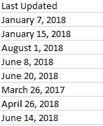

# 清理 Google Playstore 数据集

> 原文：<https://medium.com/analytics-vidhya/cleaning-the-google-playstore-dataset-235d9754b8d?source=collection_archive---------6----------------------->


数据清理和准备是任何人工智能项目中最关键的第一步。有证据表明，大多数数据科学家将高达 **70%** 的大部分时间花在清理数据上。在这篇博文中，我将指导您完成 Python 中数据清理和预处理的最初步骤。

> *数据集在底部链接*

## 导入库

我们需要做的第一步是导入所需的库。有很多可用的库，但是用于数据清理和分析的最流行和最重要的 Python 库是 Numpy 和 Pandas。

```
*import pandas as pd
import numpy as np*
```

## 加载数据

下载完数据集并将其命名为. csv 文件后，您需要将其加载到 pandas 数据框架中进行浏览，并执行一些基本的清理任务，删除不需要的会降低数据处理速度的信息。

```
data = pd.read_csv('../input/google-play-store-apps/googleplaystore.csv')
```

## 探索数据并制作清单

现在您已经建立了数据，但是您仍然应该花一些时间来研究它，并理解每一列代表什么特性。这种数据集的手动审查对于避免数据分析和建模过程中的错误非常重要。

这是我在分析谷歌 Playstore 数据后创建的清单

1.  处理缺失值和“随设备变化”的数据。
2.  从安装中删除字符并使其为数字。
3.  从大小中删除“M”(兆字节)，并使其为数字。
4.  从大小中删除“k”(千字节)，使其成为数字，然后除以 1000。
5.  将评论转换为数字。
6.  从价格中删除货币符号，将其改为数字
7.  将“上次更新”日期转换为日期格式
8.  将当前版本号四舍五入到 1 位小数

要清理数据集，您需要处理缺失值和分类特征，因为大多数机器学习模型的数学基础假设数据是数值型的，不包含缺失值。此外，如果您试图使用包含缺失值或非数值的数据来训练线性回归和逻辑回归等模型，scikit-learn 库将返回错误。

## 处理缺失值

缺失数据可能是不干净数据最常见的特征。这些值通常采用 NaN 或 None 的形式。缺少值的原因有几个:有时缺少值是因为它们不存在，或者是因为数据收集不当。

浏览所有列，我们发现有 3 列包含 NA 值[大小、评级和 Android 版本]。

大多数没有评级的应用程序只有很少的安装，这可能是有意义的。如果你的安装量很低，人们还没有审查它。在数据清理过程中，我看到“大小”下面有“因设备而异”。我们将总共 1695 个“因设备而异”的应用程序转换为 NA。这就解释了本专栏中的 NA。

## 从安装中删除字符并使其成为数字


清洗前安装

*   首先，我们使用 python split 方法从末尾移除“+”符号

```
data['installs_cleaned']=data['Installs'].apply(lambda 
x:x.split('+')[0])
```

*   然后，我们可以看到每个数字之间都有'，'。我们需要把它去掉，使它数字化。我们通过使用 lambda 函数的 replace 方法来实现。

```
data['installs_cleaned']=data['installs_cleaned'].apply(lambda x:x.replace(',','')
```

*   浏览完数据后，我看到一个数据为“免费”的单元格。移除它，

```
data = data.drop(data[data.installs_cleaned == 'Free'].index)
```

*   最后，使用内置的 to_numeric 方法将数据类型改为 integer

```
data["installs_cleaned"] = pd.to_numeric(data["installs_cleaned"])
```


安装干净的(数据类型= int64)

## 解析大小


尺寸未清理

*   首先，我们将使用 lambda 函数从末尾删除字符“M ”,将其替换为“”

```
data['size_cleaned']=data['Size'].apply(lambda x: x.replace('M',''))
```

*   那么移除具有 size =的行因设备而异

```
data= data.drop(data[data.size_cleaned =='Varies with device'].index)
```

*   对于以 kb 为单位的数据，首先我们需要删除“k ”,然后转换为 float，然后除以 1000，使其成为 mb 格式。

```
ending = ['k']
data['size_kb']=data['size_cleaned'].map(lambda x: x[-1:] in ending)
data['size_cleaned']=data['size_cleaned'].apply(lambda x: x.replace('k',''))#Removes k
data['size_cleaned']=pd.to_numeric(data['size_cleaned'])#Conversion to numeric
data['size_cleaned']=data.apply(lambda x:x['size_cleaned']/1000 if x['size_kb']==1 else x.size_cleaned,axis=1)#Dividing by 1000
```


清洗尺寸

## 将评论转换为数字

```
data.Reviews=pd.to_numeric(data.Reviews)
```

## 解析价格


解析前的价格

```
#Removing '$'
data['Price'] = data['Price'].apply(lambda x:x.replace('$',''))
#Converting to numeric                                                         data['Price'] = pd.to_numeric(data['Price'])
```


解析价格

## 日期格式化

数据不一致的一个具体类型是日期格式不一致，例如同一列中的 dd/mm/yy 和 mm/dd/yy。您的日期值可能不是正确的数据类型，这将不允许您有效地执行操作并从中获得洞察力。这一次，您可以使用 datetime 包来确定日期的类型。



```
data['Last Updated'] =  pd.to_datetime(data['Last Updated'])
```


## 删除空值

使用 isnull()删除 Rating 中的空值。

```
data = data.drop(data[data.Rating.isnull()].index)
```

## 解析当前版本

*   首先，我们删除当前版本中的空值

```
data = data.drop(data[data['Current Ver'].isnull()].index)
```

*   在下一步中，我们删除值为“随数据变化”的行

```
data = data.drop(data[data['Current Ver']=='Varies with device'].index)
```

*   在最后一步中，我们将当前版本四舍五入到 1 位小数。

```
data['Current Ver'] = data['Current Ver'].apply(lambda x:str(x).split('.',1)[0])
```

## 删除重复行

```
data.drop_duplicates(keep=False, inplace=True)
```

## 保存到 CSV

为了确保您仍然拥有原始数据，最好将工作流程中每个部分或阶段的最终输出存储在单独的 csv 文件中。这样，您将能够在数据处理流程中进行更改，而不必重新计算一切。

正如我们之前所做的，您可以使用 pandas `to_csv()`函数将数据帧存储为. csv 文件。

```
data.to_csv('Playstore_data.csv')
```

## 结论

这些是处理大型数据集、为任何数据科学项目清理和准备数据所需的非常基本的步骤。有其他形式的数据清理方法可能比我的方法更好、更有效。更好更干净的数据胜过最好的算法。最后，在大量的数据争论之后，我们可以开始从数据中得出一些见解。是时候进行一些探索性的数据分析了！:)

你可以在这里找到原始的不洁数据[(来源:Kaggle)](https://drive.google.com/file/d/1TXYxU_4afz2jg1AK2_G-s0lp_k3LlG9f/view?usp=sharing)

还有这里的干净数据