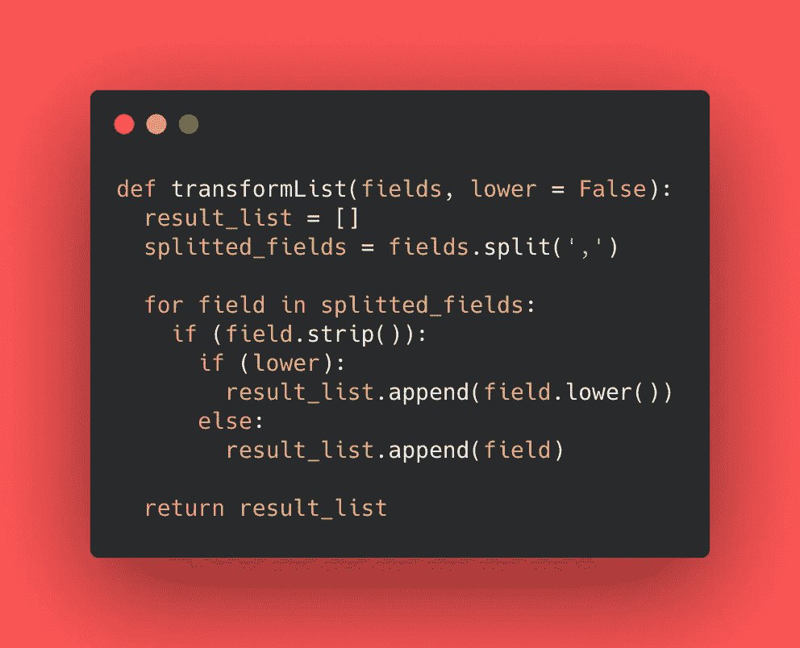

# 使用 Python 清理数据并将 CSV 文件转换成 JSON

> 原文：<https://medium.com/analytics-vidhya/cleaning-up-data-and-turning-a-csv-file-into-json-using-python-72e67c2ee76e?source=collection_archive---------9----------------------->

嘿，伙计们，去年我做了一个个人网络应用程序:你的酒吧里有什么？🍹。我的未婚妻安迪想出了一个主意:一个帮助人们发现他们可以在家里制作鸡尾酒的应用程序，只需在一个简单的输入上添加所有成分并点击一个按钮！

整个旅程真的很有趣！它始于在 Kaggle 上寻找完美的数据集，在检查了一堆数据后，我决定得到这个:[https://www.kaggle.com/ai-first/cocktail-ingredients](https://www.kaggle.com/ai-first/cocktail-ingredients)。在选择它之后，有一些工作要做和“清理”要做…这个数据集有 41 列，我真的不需要所有的列。我需要将两个字段的类型改为列表。因为我已经决定使用 *Mongo DB* 作为数据库——我需要插入一个 *CSV* 或 *JSON* 文件来导入所有数据。

照片由[卡里姆·曼吉拉](https://unsplash.com/@karim_manjra?utm_source=medium&utm_medium=referral)在 [Unsplash](https://unsplash.com?utm_source=medium&utm_medium=referral) 上拍摄

> 想法很简单:读取一个 CSV 文件，清理一堆信息，最后将所有这些保存在一个 JSON 文件中。*👩🏻‍💻*

# 手工编码

第一步很简单，导入两个 *Pyhton 的*模块: *json* 和 *csv* 来处理文件扩展名，并声明将被读写的文件输入和输出。

初始设置

在初始设置之后，我编写了一个函数，使用语法 ***从 *CSV* 文件中读取数据，其中 open(FILE_NAME，mode = " r)***后跟***FILE _ reader = CSV . reader(CSV _ read，delimiter= "，"*** )，这几行生成了一个行列表，这样我就可以通过迭代 ***file_reader*** 和每个单元格的索引来访问数据

我做的一个重要决定是使用一个辅助列表来保存我想要的每个饮料模式。在读取 *CSV* 文件的过程中，我可以尝试直接写入 *JSON* 文件，但是这会花费一些时间和内存机器🥴…，这就是我选择使用辅助列表的原因。

另一个要点是，我需要忽略第一个 *CSV* 行，因为它只引用列标题: *strDrink，strCategory，strDrinkThumb，ingredients，measurments _ ingredients，strInstructions，strGlass 和 stral holic*，所以我添加了一个验证来跳过它。

Python 上的函数 **readDataFromCSV**

正如我之前所说，我决定在这个项目上使用 *MongoDB* ，我需要将两个数据存储为一个列表: ***配料*** 和 ***测量 _ 配料。*** 原始数据大概是这样的:*“可可甜酒，伏特加”，*和*“1 盎司白可可甜酒，1 盎司伏特加”，*。然后我创建了函数***transform list(data _ to _ transform，flag_to_lower_case)*** ，在这里我用逗号分割字符串，删除空格，根据标志将字符串转换成小写，并将每个数据推送到一个列表中并返回。

Python 上的函数**转换列表**

在清理了所有数据、删除了空格/不必要的逗号并确保每个字段都有所需的格式后，我可以将它们写入一个 *JSON* 文件。使用语法 ***with open(FILE_NAME，“wt”)作为 json_write*** 允许我迭代数据列表中的每个元素，并将它们写入输出文件。

我在第一个和最后一个元素上添加了 notation*"["*和 *"]"* ，以将所有 JSON 数据保存在一个数组中，并在每个元素之间添加逗号来构建正确的文件。

Python 上的函数**写 JSONFile**

> 就是这样！你可以在我的 github:[https://github.com/jennifertakagi/helper-scripts](https://github.com/jennifertakagi/helper-scripts)上查看整个解决方案，也可以随意提出一些改进建议！🚀
> 
> 如果你对这个应用程序感兴趣，可以访问这个链接:[https://whats-in-your-bar.herokuapp.com/](https://whats-in-your-bar.herokuapp.com/)🧉

*希望这个脚本能帮到你们。如果你喜欢这篇文章，请鼓掌，再见！保持安全*🤟🍻